# C++

## 编译

### 编译流程

预处理 编译，汇编，连接

预处理就是宏展开，头文件完全拷贝进去

汇编完就已经是目标文件了，如果一个编译单元完全不依赖外部的函数或者全局变量，那么就这个目标文件就

### <span style="color:#FFB266;">动态和静态链接</span>

关键字：重定位，重定位，符号表

------

静态链接：

静态链接发生在编译时，动态链接发生在加载时

链接很重要的一点就是重定位

> **链接（Linking）是过程，符号表（Symbol Table）是数据依据，重定位（Relocation）是最终手段**

编译是基于一个编译单元进行的，一个编译单元一次编译行为产出一个目标文件.obj，这时候，如果一个函数是在另一个编译单元定义的，就只能暂时做个记号，这个记号就存在符号表里

| **符号名** | **类型** | **状态**         | **偏移量 (Offset)**         |
| ---------- | -------- | ---------------- | --------------------------- |
| `main`     | 函数     | **已定义**       | `0x0000` (在当前文件的开头) |
| `count`    | 变量     | **已定义**       | `0x0004`                    |
| `printf`   | 函数     | **未定义 (UND)** | `?` (等链接器处理)          |

重定位的过程：

1. **合并：** 链接器把所有输入文件的代码段 (`.text`) 和数据段 (`.data`) 合并。
2. **计算地址：** 链接器决定最终的内存布局。假设 `printf` 最终被安放在 `0x0804`。
3. **打补丁 (Patching)：** 链接器根据 **重定位表** 的指引，找到那个暂时填了 `0x0000` 的坑，把它修改为真实的地址 `0x0804`。

------

动态链接：

因为动态链接库被不同的程序加载的位置可能不同，因此动态链接库在编译时生成的指令不能包含相对地址，也就是地址无关代码 PIC

两个关键数据结构：GOT 和 PLT 的出现，是为了让代码段（Code Segment，只读、可共享）**保持不变，而将变化的地址放在** 数据段（Data Segment，可读写、每个进程私有）

(1) GOT (Global Offset Table) —— 全局偏移表

- **本质：** 一个数组，存放着绝对虚拟地址。
- **位置：** 数据段（`.data`）。
- **作用：** 代码想要访问外部变量或函数时，不直接访问，而是去查 GOT。GOT 里存的才是真正的地址。
- **关键点：**
  - 1.  因为 GOT 在数据段，每个进程都有自己的一份 GOT。加载器只需要修改 GOT 里的值，而不需要修改代码段的指令。
  - 2. **GOT 是相对于“使用库的程序”（调用方）来说的。** 更准确地说：**每一个编译单元（Executable 或 Shared Library），只要它引用了外部符号，它就必须维护一份属于自己的 GOT。**
    3. 

(2) PLT (Procedure Linkage Table) —— 过程链接表

- **本质：** 一小段跳板代码（Trampoline）。
- **位置：** 代码段（`.text`）。
- **作用：** 它是外部函数的“代理人”。当你的程序调用 `printf` 时，实际上是调用了 `printf@plt`。

现代动态链接器非常懒。程序启动时，它不会把成千上万个函数的地址都解析出来（那太慢了）。它采用了 **延迟绑定** 策略：**只有当你第一次调用某个函数时，链接器才去解析它的地址。**

> 让我们看看当你调用 `printf` 时，底层发生了什么：
>
> #### 阶段一：编译完成时
>
> - **代码中：** 调用指令指向 `printf@plt`。
> - **GOT 中：** `printf` 对应的条目填的不是真实地址，而是 **指回 PLT 的下一条指令**（这就像写着“我不知道，你问上面吧”）。
>
> #### 阶段二：第一次调用 `printf`
>
> 1. **代码跳转：** `call printf@plt`。
> 2. **PLT 跳转：** PLT 第一条指令是 `jmp *GOT[printf]`。
> 3. **回马枪：** 因为是第一次，GOT 里存的是 PLT 的下一行代码。所以指令并没有跳去真正的 printf，而是跳回了 PLT 的下一行。
> 4. **召唤链接器：** PLT 接着做两件事：
>    - 把 `printf` 的 ID 压栈。
>    - 调用动态链接器（Runtime Linker, `ld-linux.so`）的解析函数 `_dl_runtime_resolve`。
> 5. **解析地址：** 动态链接器去查找 `libc.so` 的符号表，找到了 `printf` 的真实内存地址（比如 `0xDEADBEEF`）。
> 6. **填表：** 链接器把这个真实地址 `0xDEADBEEF` 填入 **GOT** 中。
> 7. **执行：** 链接器跳转到 `0xDEADBEEF` 执行真正的 `printf`。
>
> #### 阶段三：第二次调用 `printf`
>
> 1. **代码跳转：** `call printf@plt`。
>
> 2. **PLT 跳转：** `jmp *GOT[printf]`。
>
> 3. **直达目标：** 这一次，GOT 里已经是真实的 `0xDEADBEEF` 了。程序直接飞到 `printf` 函数体执行。
>
>    **Code:** `call PLT[printf]` ↓ **PLT [printf]:** `jmp *GOT[printf]` │ ├─── **(第一次)** ──→ 查 GOT 发现是“自己下一行” → `push ID` → `Call Linker` → **修改 GOT** → `Run Function`│└─── **(第二次)** ──→ 查 GOT 发现是“真实地址” ────→ `Run Function`

------

注意：

1. **动态链接的 GOT 表项：** 存的是 **绝对地址**。

   **静态链接的指令码：** 存的大多是 **相对偏移**。

   为什么呢：因为静态链接的代码段是连续的，但是动态链接的代码段是不连续的

2. 动态链接的时候，是如何找到函数的绝对虚拟地址的呢？

   链接器维护了一个非常重要的数据结构，叫 **`link_map`**。这是一个 **双向链表**，记录了当前进程加载的所有模块（包括主程序自己和所有依赖库）。

   链表大概长这样： `[Game.exe] <-> [libstdc++.so] <-> [libc.so] <-> [kernel32.dll] ...`

   每个节点里都记录了关键信息：

   - **名字**：比如 `libc.so`
   - **基址 (Base Address)**：比如 `0x7ffff7a00000` (这是操作系统加载时随机分配的)
   - **符号表位置**：指向该库内部 `.dynsym` 的指针。

   > 1. 链接器计算 "printf" 的哈希值。
   > 2. 在 `libc.so` 的哈希表里快速定位。
   > 3. 定位到符号表中的具体条目。
   > 4. 读取该条目，发现：**`printf` 在本文件内部的偏移量 (Offset) 是 `0x500`。**
   >
   > 现在所有拼图都齐了：
   >
   > 1. **基址 (Base)：** 在第二步遍历 `link_map` 时，链接器知道 `libc.so` 被加载到了 `0x7ffff7a00000`。
   > 2. **偏移 (Offset)：** 在第三步查符号表时，知道 `printf` 在库内的位置是 `0x500`。

   也就是说，链接器知道每一个动态链接库的基址，也可以通过动态链接库的符号表知道一个具体函数的 Offset，用基址+Offset 就可以得到绝对虚拟地址

3. 主程序知道连接方式，也分知晓和不知晓：

   > 在构建程序的过程中，**编译器（Compiler）** 和 **链接器（Linker）** 确实会根据“目标函数是静态库里的还是动态库里的”，生成完全不同的指令代码。
   >
   > 为了讲清楚这个“区别对待”的过程，我们需要把视角分为 **Windows (MSVC)** 和 **Linux (GCC/Clang)** 两种流派，因为它们的处理策略完全不同。
   >
   > ------
   >
   > ### 1. Windows 的做法：显式告知 (Explicit)
   >
   > 在 Windows 开发中（C++/DX12），你应该经常见到 `__declspec(dllimport)` 这个宏。这玩意儿就是用来 **提前告诉编译器**：“嘿，这个函数是动态链接的！”
   >
   > #### 场景 A：编译器不知道是动态链接 (没有写 `dllimport`)
   >
   > 如果你只写了 void foo();，编译器默认以为它是静态链接（或者同一个模块里的函数）。
   >
   > 编译器生成的指令是普通的相对跳转：
   >
   > ```Code snippet
   > call foo  ; 编译器以为 foo 就在附近
   > ```
   >
   > 到了链接阶段，链接器发现 foo 其实在 DLL 里。怎么办？编译器生成的指令已经是 call 相对地址 了，改不了了。
   >
   > 补救措施： 链接器被迫在你的代码里偷偷插入一段小代码（Thunk/Stub），看起来像这样：
   >
   > ```Code snippet
   > ; 这一段是链接器自动生成的桩代码
   > foo_stub:
   >     jmp *__imp_foo  ; 跳去查导入表 (IAT)
   > ```
   >
   > 然后把原本的 call foo 修改为 call foo_stub。
   >
   > 代价： 多了一次跳转（Call -> Stub -> DLL）。
   >
   > #### 场景 B：编译器知道是动态链接 (写了 `dllimport`)
   >
   > 如果你写了 __declspec(dllimport) void foo();。
   >
   > 编译器一看：“哦，这是别人的函数。”
   >
   > 它会直接生成最高效的间接调用指令，跳过中间商：
   >
   > ```Code snippet
   > call *__imp_foo  ; 直接去读导入表里的地址并跳转
   > ```
   >
   > **结果：** 省略了中间那个 Stub，性能更高。
   >
   > ------
   >
   > ### 2. Linux 的做法：统一代理 (Implicit)
   >
   > Linux (ELF) 的哲学不一样。它默认假设 **你不知道** 这个函数在哪（可能是静态，可能是动态）。
   >
   > #### 编译器策略：全都推给 PLT
   >
   > GCC 在编译 main.c 时，看到 printf，它根本不管 printf 是静态还是动态。
   >
   > 它一律生成指向 PLT 的代码：
   >
   > ```Code snippet
   > call printf@plt
   > ```
   >
   > #### 链接器策略：最后裁决
   >
   > 到了链接阶段 (`ld`)，链接器看着你给它的库文件，决定怎么填这个坑：
   >
   > 1. **如果你给的是静态库 (`libc.a`)：**
   >    - 链接器把 `printf` 的二进制代码 **抄** 到你的可执行文件里。
   >    - 链接器会把那行 `call printf@plt` **修改**（重写）为直接调用 `call printf_body`（不再走 PLT/GOT 那一套，或者虽然保留符号，但指向本地代码）。
   >    - *注：现代链接器优化可能会直接消除 PLT 引用。*
   > 2. **如果你给的是动态库 (`libc.so`)：**
   >    - 链接器生成真正的 **PLT 表** 和 **GOT 表**。
   >    - 保留 `call printf@plt` 不变。
   >    - 建立对 `libc.so` 的动态依赖信息。
   >
   > ------
   >
   > ### 3. 核心差异总结：代码长什么样？
   >
   > 主程序（调用者）根据“知不知道是动态链接”，最终生成的汇编指令会有本质区别。
   >
   > 我们用伪代码对比一下 **调用 `foo()`** 的三种最终形态：
   >
   > | **情景**                               | **主程序生成的指令**   | **机制**         | **备注**                                                |
   > | -------------------------------------- | ---------------------- | ---------------- | ------------------------------------------------------- |
   > | **静态链接**                           | `call 0x1000`          | **直接相对跳转** | 最快。地址是写死的相对偏移。                            |
   > | **动态链接 (Windows `dllimport`)**     | `call *[0x5000]`       | **间接内存跳转** | 也是最快（针对动态）。直接去读 IAT 表里的绝对地址跳走。 |
   > | **动态链接 (Linux 默认 / Win 无声明)** | `call 0x2000` (去 PLT) | **跳板模式**     | 稍慢。先跳到 PLT (0x2000)，PLT 再查表跳走。             |
   >
   > ### 你的结论
   >
   > **是的，你的理解完全正确。**
   >
   > - **编译期知晓：** 如果通过关键字（如 `dllimport`）让编译器提前知道了，编译器就能生成 **直接查表** 的代码（`call *ADDR`），省去中间跳转。
   > - **链接期知晓：** 即使编译器不知道，链接器在最后时刻看到了库文件（`.a` vs `.so`），它会决定是 **拷贝代码**（静态）还是 **生成 PLT/GOT 条目**（动态）。
   >
   > 这就是为什么在 C/C++ 头文件中，经常看到这种宏定义：
   >
   > ```C++
   > #ifdef MY_LIB_EXPORT
   >   #define API __declspec(dllexport) // 编译 DLL 时：我是导出者
   > #else
   >   #define API __declspec(dllimport) // 编译主程序时：我是导入者（编译器：懂了，我给你生成优化的间接调用代码）
   > #endif
   > 
   > API void MyFunction();
   > ```
   >
   > 这个宏的存在，就是为了让主程序在编译时 **“知道”** 这是一个动态链接函数，从而选择最优的链接方式。


### 符号表的作用


## 基础语法

### 引用和指针的区别，引用是否占额外的空间

### 四种 cast 和 bit_cast

### 类型转换（CStyle 和 C++Style）


### explict 和 implict


### 基本类型大小


### 整数存储方式，Float 存储方式


### C++调用栈

[调用栈]: ..\面经\C++\C++栈调用.md


### Static 关键字，Extern 关键字

### <span style="color:#FFB266;">inline 的原理和作用</span>

inline带有一种告知编译器在使用的位置直接展开函数，这样就不需要call一个地址跳转了。

但是实际上这个行为编译器自己也会做，而且作为一个标识符也不是一定触发的。

在C++11开始，inline的作用是：<span style="color:#00FF00;">声明某个符号可能存在多个定义，但是保证多个定义相同，并且由链接器（会随机（或按顺序）挑一个定义保留）合并这几个定义</span>

>  `inline` 的核心作用是 ODR（单一定义规则）的豁免权。它告诉链接器：这个符号（函数或变量）在多个翻译单元中通过头文件重复定义是合法的，请将它们合并为同一个实体。

一个经典的例子就是在头文件直接在类内定义的类成员函数，如果仔细思考，类的定义本身就是外部链接的，也就是在所有的编译单元都可见，如果在多个编译单元都include了这一个头文件，那就会存在多个函数定义。但是实际上是不会出现函数重定义的，这是因为类内如果直接给出函数定义，它默认是inline的。

但是这仅限于直接类内给出实现，如果类似于B.h的实现，在头文件类外实现，那么是会出现重定义的

```c++
// A.h
class A{
public:
    void func(){
    }
}

//B.h
class B{
public:
    void func();

}

void B::func(){//也写在头文件
    
}
```


这里可能有疑问：那类内的成员变量呢，它是inline吗。请看C++链接性这一节里的蓝色开头：链接性讨论的是“这个**符号**在内存里有没有一个固定的地址，能不能被别的 `.cpp` 找到”

成员变量只是一个“模板”。但是对于类成员方法，它是类共享的

### <span style="color:#FFB266;">C++链接性</span>

> <span style="color:#3399FF;">链接性讨论的是“这个**符号**在内存里有没有一个固定的地址，能不能被别的 `.cpp` 找到”</span>

C++的链接性有三种：无连接，内部链接，外部链接

无连接指的就是局部变量，类内部定义的 `typedef`和函数参数，离开作用域就访问不到。重点是内部链接和外部链接

#### 内部链接

只有当前翻译单元能看见的符号

1. 被 `static` 修饰的**全局变量**或**函数**。

2. **Const 全局变量**（在 C++ 中，`const` 全局变量默认是内部链接，这一点和 C 语言不同）。

3. **匿名命名空间**（Anonymous Namespace）中的所有内容

内部链接想要转外部链接，就要用extern修饰

#### 外部链接

1. 没有被 `static` 修饰的**全局变量**。
2. 没有被 `static` 修饰的**普通函数**。
3. `extern` 修饰的变量。
4. 类（Class）的定义。

#### 关于extern

extern这里单独说，因为它的行为非常混乱：<span style="color:#00FF00;">extern修饰全局变量，其实类似于函数本身的行为，函数的声明默认就是extern的，它有且只允许所有的编译单元存在一次实现（定义）</span>

如果extern修饰变量<span style="color:#00FF00;">声明</span>（绝对不能赋初值，赋初值会变成定义，退化成普通的全局变量，这样就重定义了）。他相当于是在和链接器对话，说是extern修饰的全局变量，在别的地方有实现。链接的时候处理一下

```c++
// Global.h
#pragma once

// 告诉所有包含这个头文件的文件：有一个叫 PlayerScore 的变量存在
// 此时不分配内存
extern int PlayerScore;

// Global.cpp
#include "Global.h"

// 真正的定义，分配内存！
// 全局只允许出现这一次定义，否则报错 Multiple Definition
int PlayerScore = 0;

// Main.cpp
#include "Global.h"
#include <iostream>

void Play() {
    // 编译器知道 PlayerScore 是 int，链接器会找到 Global.cpp 里的那个真身
    PlayerScore += 100; 
    std::cout << PlayerScore << std::endl;
}
```


#### 注意

1. 头文件中定义的Const变量

头文件中的全局变量需要定义为const，否则外部链接性会导致链接时重定义，但是用const修饰也有问题，就是他们本质上还是不同的变量，因此取地址的时候是不同的地址。

C++17之后有了一个新的写法如下。这种写法利用了inline的外部链接，同时inline声明虽然在头文件当中定义，但是全局之后一份，因此链接器会做去重。并且constexpr会保证它是编译期常量（C++17后允许inline修饰变量）

```c++
inline constexpr int MAX_HP = 1000;
```


### extern "C"


### <span style="color:#FFB266;">内存四区</span>

```c++
高地址 (High Address)
 +----------------------+ 
 | 1. 栈区 (Stack)       |  <-- 向下增长
 |    - 局部变量        |
 |    - 函数参数        |
 |    - 返回地址        |
 |          ↓           |
 | (巨大的空闲空间 / 动态库映射区)  |
 |          ↑           |
 | 2. 堆区 (Heap)        |  <-- 向上增长
 |    - new/malloc 分配 |
 +----------------------+
 | 3. 全局/静态存储区    |
 |    - .bss (未初始化) |
 |    - .data (已初始化)|
 |    - .rodata (常量)  |  <-- 虚表 (vtable) 通常在这里
 +----------------------+
 | 4. 代码区 (Code)      |  <-- 虚函数/普通函数指令在这里
 |    - 二进制指令      |
 +----------------------+
 低地址 (Low Address)
```

注意注意：`.data` 存放的是**“编译期就能确定的且可修改的二进制值”**（带着这句话去看下面关于static，还有const的问题）

.code存储着指令码

### <span style="color:#FFB266;">字面量以及字符串字面量存储在哪里？</span>

首先，所有的字面量都不是变量，这很显然，它是作为一种数据本身存在的。

一般的字面量（非字符串的），并不是像变量一样存储在数据区的内存，而是作为<span style="font-weight:bold;">硬编码的立即数</span>存储在.code（.text）段当时中，他们就直接是指令的一部分了

```
int a = 10;
MOV EAX, 10
```

对于字符串字面量，因为他长度是变化的，而且可能很长，寄存器和指令可能放不下，因此统一放在**全局/静态区的常量段 (.rodata)** 中。

上面二者的区别造成了，对于非字符串字面量它是没有地址的，但是对于字符串字面量，它是有地址的。下面这个例子可以验证字符串字面量存储的位置以及它是不是真的在rodata

```c++
#include <iostream>
#include <utility>
class B
{
public:
    virtual void Func() {

    }

    void Out() {
        std::cout << this << std::endl;
    }
};
int a = 10;
int main() {
    const char* s = "hello";
    B b;
    std::cout << &a << std::endl; // 00007FF600C9E000 初始化过的全局变量存储在data段
    std::cout << &s<< std::endl; //000000AEACF6F968 字符串字面量存储在rodata段，并且可以取地址
    b.Out();					//000000AEACF6F988 还记得吗，虚函数表是存储在rodata的

}
```

<span style="color:#FF3333;">注意</span>

1. 左值右值

**普通字面量 (`10`) 是纯右值 (Prvalue)。**

- 它们是临时的值，用完即丢，没有身份（Identity）。

**字符串字面量 (`"abc"`) 是左值 (Lvalue)。**

- 是的，你没看错。在 C++ 标准中，字符串字面量是**唯一**属于“左值”的字面量。

2. 字符串字面量的特殊性

字符串字面量存储在rodata，是左值，有地址，这些造成了它的一些特殊性

```c++
const char* ptr = "Hello";
char arr[] = "Hello";
```

上面这俩是不一样的，ptr是一个指针，指向了Hello这个字面量的在rodata的地址

但是arr是一个数组，上面的本质是触发了数组拷贝，也就是说，arr是存在于栈上的，它里面存了一份Hello，但是在rodata上也还有一份Hello

基于这个就会清楚为什么`char* s = "World";`在语法上是非法的了，因为"world"作为字符串字面量，他存储在rodata，是不是可以让一个非const指针指向的

------


### <span style="color:#FFB266;">Const和Constexpr</span>

#### 语义的混淆

首先区分两种语义：只读（运行期常量）和（编译期）常量

只读代表一种约定，它可以是变量，但是只读只是说我们不能**直接的**去修改它。

而编译期常量更类似于一种字面量，或者说真正的常量

```c++
int get_num() { return 10; }

void test() {
    const int a = 10;          // 身份 B：编译期就知道是 10
    const int b = get_num();   // 身份 A：运行起来调用函数才知道是 10

    // 【核心问题来了】
    // C++ 规定：定义数组长度必须用“编译期常量”
    
    int arr1[a]; // ✅ 通过！编译器知道 a 是 10
    int arr2[b]; // ❌ 报错！编译器怒了：“b 是运行时才算出来的，我怎么知道分配多大内存？”
    //这里的问题是：同样是const修饰符，但是它拥有了两种语义
}
```

<span style="color:#00FF00;">在引入constexptr之前，上面这种语义是只由const负责的，C++引入constexpr就是为了解决，这两种语义的混淆。constexpr限定在编译期常量。</span>

#### constexpr修饰函数

constexpr的作用可以这样总结：如果一个constexpr修饰的函数，它传入的函数，以及它内部的函数体计算，在编译期就可以计算出来，那么它就会返回编译期的值。然而如果传入的参数或者其内部的函数体无法在编译期计算出来，他就和普通函数一样。（这种退化主要是为了代码复用，否则就要重复写两个版本）

```c++
#include <iostream>
#include <array>
using namespace std;

constexpr int foo(int i)
{
    return i + 5;
}

int main()
{
    int i = 10;
    std::array<int, foo(5)> arr; // OK
    foo(i); // Call is Ok
    // But...
    std::array<int, foo(i)> arr1; // Error
   
}
```

但是，如果一个constexper修饰的函数，内部有IO，有随机值之类的，那么它就会纯粹的作为一个普通的函数存在。下面这个例子讲的就是这件事情，如果func里存在io（或者是random），那么array的第二个参数需要的是一个编译期常量，就会报错，因为func没法返回一个编译期常量

```C++
#include <iostream>
#include<array>
constexpr int func(int x) {
	//std::cout << 11 << std::endl; //如果这一行存在，下面的array就会报错
	return x;
}

int main() {
	std::array<int, func(1)> arr;
}
```

#### constexpr修饰类成员变量

constexpr修饰类成员变量时候必须要和static一起用。这也很好理解，因为constexptr是真正的“编译期常量”，j既然编译期常量，那么他应该永远在任何实例中都是一样的，所以C++规定它作为类内成员变量，就必须是一个static（但是注意，**成员函数**可以是 `constexpr` 且**非 `static`**）

```c++
class A {
public:
	//constexpr int a; //大错特错
	constexpr  static int a = 10;
	const int b = 10;
};
```

#### 其他

对于Constexpr修饰的变量，如果没有获取地址的话，那么它一般会被直接优化为立即数。

但是如果获取地址了，这个操作很奇怪，他会直接让constexpr修饰的变量存入rodata中，退化成类似const那种


### <span style="color:#FFB266;">static变量，全局变量分别存储在哪里</span>

#### 非const修饰的全局和static变量

没有初始化，或者初始化为0/nullptr 的全局/局部static变量（函数内static，类内static），没有初始化的全局变量，在编译出的目标文件中存储在.bss段（文件中的.bss段只记录符号），在运行加载后也在.bss段

初始化过的全局/局部static变量，没有初始化的全局变量，在目标文件中存储在.data段，运行加载后也在.data 段

注意，非POD（基本类型，C风格的struct）类型比如class，有一个地方容易搞混

```c++
class A{
    A(){
        a =10;
    }
}

static A a; //.bss
static A b = A() //.data
```

类内的static在空间上和全局变量没有任何区别

#### const修饰的static和全局变量

>  如果是只读的，并且编译期可以确定值的，存在.rodata段，如果是只读并且编译期确定不了值，存储在.bss，但是限制读写权限(后半段和constexpr一样)

情况一：对于const修饰过的static和全局变量，他的位置会发生变化，一般是存储在.rodata段

情况二：但是如果一个const变量从来没有对它取地址过，并且只是一个简单的整数或者浮点数，编译器可能根本不给他分配内存，而是直接作为立即数硬编码

情况三：如果 `const` 变量存储的是一个**复杂的对象**，且需要在程序启动时运行构造函数来初始化，那它就**不能**放在纯粹的 `.rodata` 里，如果是编译期无法确认的，比如这里的g_obj存储在.bss段，而如果编译期可以确定的，那么存储在.rodata段

```c++
class MyClass {
public:
    MyClass() { /* 复杂的构造逻辑 */ }
};

// 虽然加了 const，但必须执行构造函数才能算出它的内容
static const MyClass g_obj;
```

请看这句话：

> `.data` 存放的是**“编译期就能确定的且可修改二进制值”**

```c++
class Color {
public:
    int r, g, b;
    // constexpr 构造函数：允许在编译期直接计算出对象内存
    constexpr Color(int _r, int _g, int _b) : r(_r), g(_g), b(_b) {}
};

// 1. 普通静态变量 (编译期确定值，可修改)
// 归宿：【.data 段】
// 这里的 hex: 0A 14 1E 是直接写在二进制文件里的，且加载后可改
static Color g_mutable_color(10, 20, 30); 

// 2. constexpr 变量 (编译期确定值，不可修改)
// 归宿：【.rodata 段】
// 这里的 hex: 0A 14 1E 也是写在二进制文件里的，但加载后只读
static constexpr Color g_const_color(10, 20, 30);

// 3. const 但非 constexpr (且假设构造函数无法在编译期运行)
// 归宿：【.bss 段】
// 编译期不知道值，运行时才填入。
static const Color g_runtime_color(rand(), rand(), rand());
```


## 类和对象

### 面对对象的三大特征

封装继承和多态

### <span style="color:#FFB266;">class和struct的区别</span>

对于C++来说，唯二的区别是：

1. struct默认的访问权限是public，class是private
2. struct继承别人的时候默认是public继承，class是private

### <span style="color:#FFB266;">异常处理</span>

https://zhuanlan.zhihu.com/p/65454580

```c++
void f1() throw(int){           //函数f1会抛出一个整型的异常代码
  cout<<"f1 starts"<<endl;
  int i;                       //这个变量会在栈展开的过程中被释放资源
  throw 100;                   //抛出异常，程序开始在栈中搜索对应的异常处理器，即开始栈展开
  cout<<"f1 ends"<<endl;       //这行代码不会被执行
}

void f2 throw(int){            //函数f2调用了f1，所以抛出异常的类型也是整型
  cout<<"f2 starts"<<endl;
  int j;                      //这个变量也会在栈展开的过程中被释放资源
  f1();                       //f1没有搜索到对应的异常处理，因此返回到f2搜索
  cout<<"f2 ends"<<endl;      //这行代码也不会被执行
}

void f3(){
  cout<<"f3 starts"<<endl;
  try{                        //函数f3在try里调用f2，并可能会catch一个整型的异常
    f2();
  }catch(int i){              //f2也没有找到异常处理，最后返回了f3并找到了异常处理
    cout<<"exception "<<i<<endl;
  }
  cout<<"f3 ends"<<endl;
}

int main(){
  f3();
  return 0;
}
```

在 C++里，当有异常被抛出，**调用栈**(call stack)，即栈中用来储存函数调用信息的部分，会被按次序搜索，直到找到对应类型的处理程序(exception handler)。而这里的搜索顺序就是 f1-> f2-> f3。f1 没有对应类型的 catch 块，因此跳到了 f2，但 f2 也没有对应类型的 catch 块，因此跳到 f3 才能处理掉这个异常。

以上这个寻找异常相应类型处理器的过程就叫做 **栈展开**。同时在这一过程中，当从 f1 返回到 f2 时，f1 里局部变量的资源会被清空，即调用了对象的析构函数。同样，在从 f2 返回到 f3 时，f2 里局部变量也会被调用析构函数并清空资源。

之前的时候是基于EBP实现的，现代主要基于静态表。

基于表的栈展开在**时间上是非常昂贵的**

### <span style="color:#FFB266;">构造函数和析构函数能否抛出异常/noexcept</span>

构造函数可以抛出异常

但是有个问题，如果一个构造函数构造到了一半，同时它申请内存成功了，这时候抛出异常，就会导致内存泄漏。

例如：

```c++
class Dangerous {
    int* ptr;
public:
    Dangerous() {
        ptr = new int[100]; // 1. 资源分配成功
        
        // ... 中间做了一些逻辑 ...
        
        if (true) { // 2. 突然发现参数不对，抛出异常
            throw std::runtime_error("初始化失败");
        }
    }

    ~Dangerous() {
        delete[] ptr; // 3. ！！！这句话永远不会执行！！！
        std::cout << "析构函数执行" << std::endl;
    }
};

int main() {
    try {
        Dangerous d; 
    } catch(...) {
        // 捕获了异常，但 new int[100]  leaking 了，永远找不回来了
    }
}
```

但是，C++保证的是，在抛出异常之前，所有已经成功构造成功的成员，会触发它的析构函数（如下，不允许抛出异常）。这就是 RAII 的好处了

```c++
#include <vector>
#include <memory>
class Safe {
    std::unique_ptr<int[]> ptr; // 使用智能指针
    std::vector<int> buffer;    // 使用容器
public:
    Safe() : ptr(new int[100]) { // 1. 智能指针接管内存
        
        buffer.resize(500); // 2. vector 分配内存
        
        // 3. 这里抛出异常
        throw std::runtime_error("安全报错");
    }
    // 根本不需要写析构函数，或者析构函数不执行也没关系
};

// 发生异常时的剧本：
// 1. 构造函数抛出异常。
// 2. 运行时发现 Safe 对象构造失败。
// 3. 运行时开始逆序清理成员：
//    - 调用 buffer 的析构函数 -> 释放 vector 内存。
//    - 调用 ptr 的析构函数 -> delete[] 那个 int 数组。
// 4. 内存完全回收，没有任何泄漏。
```

------

https://zhuanlan.zhihu.com/p/65454580

C++11 之后，**所有析构函数默认都是 `noexcept(true)` 的**，析构函数是绝对不能抛出异常的，如果再析构函数里抛出异常，程序会直接 crash。

析构函数不跑出异常，最核心的考量是：**防止“双重异常”（Double Exception）**（<span style="color:#00FF00;">应该这么说更具体：C++在发生异常的时候，会从当前栈帧向上找catch，执照找到为止，也就是所谓的栈展开。同时，C++在展开过程中会确保局部对象被正确析构，如果这时候析构函数抛出异常，就可能会导致抛出多次异常。</span>）

C++异常处理依靠的是栈展开

想象一下这个场景：你的程序出了问题，抛出了一个异常（Exception A）。

1. **异常 A 抛出**：程序中断当前逻辑。
2. **栈展开开始**：C++ 运行时（Runtime）开始寻找 `catch` 块。在跳到 `catch` 之前，它必须先清理案发现场。
3. **清理现场**：这意味着当前栈帧里的所有局部变量必须被销毁，也就是 **调用它们的析构函数**。
4. **二次爆炸**：就在这个清理过程中，万一某个对象的析构函数里又抛出了一个异常（Exception B）……（好好品味这里，这里的某个对象的析构函数，居然抛出了异常，这才是不允许抛出异常的核心原因）

**这时候 C++ 运行时就崩溃了。** 它手里正捏着“异常 A”还没处理完（还在找 catch 呢），突然你又塞给它一个“异常 B”。它不知道该先处理哪个，也不知道该往哪里跳。

```c++
#include <iostream>
#include <exception>

class BadDestructor {
public:
    ~BadDestructor() { // C++11 默认为 noexcept，这里为了演示，假设它能抛
        // 如果这里抛出异常...
        throw std::runtime_error("我是捣乱的析构异常"); 
    }
};

void func() {
    BadDestructor bad;
    // 1. 这里抛出了第一个异常
    throw std::runtime_error("我是原始异常"); 
    
    // 2. 遇到异常，开始栈展开，准备销毁 bad 对象
    // 3. 调用 bad.~BadDestructor()
    // 4. 析构函数里又抛出一个异常 -> BOOM! 程序直接 terminate
}

int main() {
    try {
        func();
    } catch (...) {
        std::cout << "你永远看不到这句话" << std::endl;
    }
}
```


### 普通函数指针，函数对象以及成员函数指针


### <span style="color:#FF9933;">内存对齐以及计算方式，为什么要有内存对齐</span>

如果不对齐：

> 假设你把 `int` 放在了地址 `0x01-0x04`。 CPU 为了读这个整数，需要做“极其痛苦”的操作：
>
> 1. 第一次读取：读 `0x00-0x03`，把后 3 个字节拿出来。
> 2. 第二次读取：读 `0x04-0x07`，把第 1 个字节拿出来。
> 3. **位运算拼接：** 在寄存器里把这两部分拼凑成一个完整的 `int`。

1. CPU 读取内存的粒度通常是 **字 (Word)** 或 **双字**。未对齐的访问可能会导致指令周期加倍。
2. 对齐的读写通常是原子的（Atomic）。未对齐的读写因为涉及两次内存访问，中间可能被其他线程打断。

对齐规则：成员对齐和整体对齐

1. 成员对齐是说：某个成员的偏移量必须是该成员大小的整数倍，比如一个 int，它的地址就必须是从 4 的整数倍开始，一个 short 必须从 2 的整数倍
2. 整体对齐：结构体的大小必须是 **最大成员** 大小的整数倍（这是为了让在数组存储的时候，下一个元素也能对齐）
3. 注意：结构体的对齐值 = **它内部最大成员的对齐值**

```c++
struct Inner {
    char x; // 1
    // pad 3 (为了 int 对齐)
    int y;  // 4
}; 
// sizeof(Inner) = 8
// alignof(Inner) = 4 (因为里面最大的成员是 int) <-- 关键点！
```


例 1：

```c++
struct Test {
    char a;   // 1字节
    // --- 编译器插入 3 字节 Padding ---
    int b;    // 4字节 (必须从 4 的倍数开始)
    short c;  // 2字节
    // --- 编译器插入 2 字节 Padding ---
};
```

> 64 位系统 (x64)
>
> `bool` / `char`: 1 字节
>
> `short`: 2 字节
>
> `int` / `float`: 4 字节
>
> `double` / `long long` / `指针(void*)`: 8 字节
>
> ### 第一题：基础热身
>
> 这是最经典的“乱序”结构体，考察基础的填充规则。
>
> ```C++
> struct Question1 {
>     char a;
>     double b;
>     int c;
>     char d;
> };
> ```
>
> **问题：** `sizeof(Question1)` 是多少？							24
>
> ------
>
> ### 第二题：数组陷阱
>
> 数组的对齐规则是按整体算，还是按元素类型算？
>
> ```C++
> struct Question2 {
>     int a;
>     char b[9];  // 注意是大小为9的数组
>     short c;
>     double d;
> };
> ```
>
> **问题：** `sizeof(Question2)` 是多少？						24
>
> ------
>
> ### 第三题：嵌套结构体
>
> 当结构体里套着另一个结构体时，对齐规则怎么算？
>
> ```C++
> struct Inner {
>     char x;
>     int y;
> };
> 
> struct Question3 {
>     char a;
>     Inner b; 
>     char c;
> };
> ```
>
> **问题：** `sizeof(Question3)` 是多少？					16，结构体的对齐值是根据它内部最大的成员的对齐值，而不是整个系统字长
>
> ------
>
> ### 第四题：空间优化 (Reordering)
>
> 作为一名追求性能的游戏开发者，你应该知道如何通过重排成员来节省内存。
>
> ```C++
> // 原始结构体
> struct Question4_Raw {
>     char a;
>     double b;
>     bool c;
>     int d;
>     short e;
> };
> ```
>
> **问题：**
>
> 1. `sizeof(Question4_Raw)` 是多少？			32
>    1. 如果你可以随意改变成员定义的顺序，**最小** 能把它优化到多大？		16
>
> ------
>
> ### 第五题：魔法指令 (Pack vs Alignas)
>
> 考察你对强制对齐指令的理解。
>
> ```C++
> // 情况 A: 强制压缩
> #pragma pack(push, 1) // 告诉编译器：别管什么对齐规则了，挨着放！
> struct Question5_A {
>     char a;   // 1
>     int b;    // 4 (直接放在 offset 1，不管对齐)
>     double c; // 8 (直接放在 offset 5)
> };
> #pragma pack(pop)
> 
> // 情况 B: 强制对齐 (比如为了 SIMD)
> struct alignas(16) Question5_B {
>     char a; // 1
>             // 编译器为了内部的 int b (4字节对齐)，这里还是会补 3
>     int b;  // 4
>             // 目前数据只用到了 offset 0~7，共 8 字节。
> };
> ```
>
> **问题：** `sizeof(Question5_A)` 和 `sizeof(Question5_B)` 分别是多少？      13/16

DX12 的常量缓冲区 CBV 必须是 256 字节对齐的

------


### <span style="color:#FF9933;">C++当中，一个空类也是有内存大小的，那么为什么要这样呢，以及这个大小中存储的是什么呢</span>

C++ 的设计哲学规定，**“身份” (Identity) 是通过“地址” (Address) 来区分的**。

假设一个空类：

```c++
class Empty {};
```

那么我声明两个 Empty 对象：

```c++
int main() {
    Empty e1;
    Empty e2;

    // 如果 sizeof(Empty) == 0，那么 e1 和 e2 的地址会是什么？
    // 它们很可能会是同一个地址！
    if (&e1 == &e2) {
        // 这就出问题了！e1 和 e2 是两个不同的对象，
        // 但我们无法在内存中区分它们。
    }
}
```

如果要区分 e1 和 e2，就他们的地址就必须不同，地址不同就导致这俩必须要占用空间

因此，C++ 标准规定，**任何对象（Object）的大小至少为 1 字节**（即使它没有任何成员）。

**这个 1 字节里存储的是什么**

这个 1 字节是 **纯粹的“占位符” (Padding)**。

**空基类优化**

你可能会想：“如果我继承一个空类，我的类会变大 1 字节吗？”

**答案：通常不会！** 这就是“空基类优化” (Empty Base Optimization, EBO)。

虽然一个 **独立** 的空类对象必须占用 1 字节，但当一个空类 **作为基类** 时，编译器足够聪明，可以“压缩”掉这个字节。

```c#
class Empty {}; // sizeof(Empty) == 1

class Derived : public Empty { // 继承 Empty
    int data; // sizeof(int) == 4
};
```

**按理说：** `sizeof(Derived)` 应该是 `sizeof(Empty) + sizeof(int) = 1 + 4 = 5` 字节？

**实际上：** 编译器会执行 EBO。它会让 `Empty` 基类部分 **“寄宿”** 在 `Derived` 对象的内存中，和 `data` 成员共享同一个起始地址（或者说，让 `Empty` 部分占用 0 字节）。

### 默认构造函数什么时候会默认生成，三五原则


## 移动语义

### <span style="color:#FFB266;">移动语义需要 noexcept</span>

这个问题来自我写的一个测试代码：
```c++
#include<iostream>
#include<vector>
using namespace std;
class A {
public:
	A() {
		cout << "Construct" << endl;
	}
	A(A&& other) {
		cout << "Move" << endl;
	}
	A(const A& other) {
		cout << "Copy" << endl;
	}
};

int main() {
	vector<A> vec;
	vec.reserve(4);
	vec.push_back(A());
	cout << endl;

	A a;
	vec.push_back(a);
	cout << endl;

	A b;
	vec.push_back(std::move(b));
	cout << endl;

	vec.emplace_back();

	//Construct
	//Move

	//Construct
	//Copy

	//Construct
	//Move

	//Construct

}
```

这里的输出其实有很多问题，为什么，我是用了移动语义，但是 b 和 emplaceback 还是这么多 copy，

问题在于，移动操作对于移动源头是破坏性的，因此，很多容器都要求，如果移动语义不是安全的，那么就不去移动，而是选择拷贝来替代

## 运行和优化

### <span style="color:#FF8000;">运行时 函数调用栈帧移动方式</span>

[](..\面经\C++\C++栈调用.md )

### <span style="color:#FF9933;">UnNamed返回值优化 URVO（C++17）</span>

RVO返回值优化从C++98就开始了，C++17开始是URVO强制实现

#### RVO

如果编译器发现，一个函数内的局部变量，最终是要给外面的，那么在函数运行时，这个会直接把外部接收的那个变量作为一个参数压栈，然后在内部赋值

```c++
std::string getStr() {
    std::string temp = "Hello World"; // 局部变量
    return temp;
}

std::string s = getStr();
```

优化后类似于：

```c++
std::string getStr(string* s) {
    *s= "Hello World"; // 局部变量
    return temp;
}

std::string s;
getStr(&s);
```

下面这些都会触发 ROV

```c++
std::vector<int> generateBigData() {
    std::vector<int> data;
    data.reserve(1000000);
    for(int i=0; i<1000000; i++) data.push_back(i);
    
    return data; // 触发 NRVO (Named RVO)
}

// 这里的 v 直接接管了 data 在函数内部申请的那块堆内存
// 栈上的 vector header 也是直接构造在 v 的位置
std::vector<int> v = generateBigData();

class Logger {
public:
    Logger() { printf("构造\n"); }
    ~Logger() { printf("析构\n"); }
    // 假设禁用了拷贝和移动（为了演示）
    Logger(const Logger&) = delete;
    Logger(Logger&&) = delete;
};

Logger createLogger() {
    return Logger(); // RVO 直接在外部变量地址构造
}

int main() {
    Logger log = createLogger();
    // 输出：
    // 构造
    // (没有拷贝，没有移动)
    // 析构
}
```

#### URVO

```c++
Object func() {
    return Object(); // C++17 强制：直接在调用者的内存空间构造 Object，
                     // 不会调用任何拷贝或移动构造函数。
}

Object obj = Object(); // C++17 强制：直接构造 obj，没有临时对象。
```


### <span style="color:#FFB266;">Implicit Move (隐式移动) </span>

如果 RVO 无法实施，如果返回值是函数内的局部对象，那么编译器必须将其自动视为 RValue

也因此，如果对象实现了移动语义，它会触发移动语义的操作符或者构造函数。


## 内存管理

### Malloc 原理，内存池管理


### Malloc/free，new/delete 的区别


### delete 和 delete [] 的区别，以及为什么会有这种区别


### <span style="color:#FFB266;">全局的:: new 和 operator new</span>

`new` 一个类（new Expression）

当你写 `MyClass* p = new MyClass();` 时，你使用的是 **new 表达式**。 这是一个 **不可重载** 的内置运算符，它是一套 **固定的流程**，编译器会把它翻译成以下三步动作：

1. **算大小：** 计算 `MyClass` 需要多少字节。
2. **申请内存 (Allocate)：** 调用 **`operator new`** 函数来申请那块原始内存。
   - *注意：这里就是两者发生关系的地方。*
3. **构造对象 (Construct)：** 在这块申请好的内存上，调用 `MyClass` 的构造函数（其实就是 Placement New）。

全局的 `::operator new`

当你写 `void* p = ::operator new(100);` 时，你调用的是一个 **普通的函数**。

- 它的地位：它和 `malloc` 几乎是一样的。
- 它的职责：**只管给内存，不管对象。** 它不知道什么是类，什么是构造函数，它只接收一个 `size_t` 参数，返回一个 `void*` 指针。

大部分的实现里，:: new 最后还是用的是 malloc

无论是全局的 new 还是 operator new，都要用 delete

但是区别在于，全局的 new 最后对应的是全局的:: operator delete（底层基本还是 free），operator new 最后释放的是 operator delete，但是无论如何都要对应上

下面这样是不对的

```cpp
// 1. 只申请了内存，没有调用构造函数！
void* raw_mem = ::operator new(sizeof(MyClass)); 

// 强转一下，为了能编译通过
MyClass* ptr = static_cast<MyClass*>(raw_mem);

// 2. 错误！试图用 delete 释放
delete ptr;
```

这样就对了

```cpp
// 1. 只申请了内存，没有调用构造函数！
void* raw_mem = ::operator new(sizeof(MyClass)); 

MyClass* ptr = static_cast<MyClass*>(raw_mem);
MyClass* ptr = new (raw_mem) MyClass();//构造

ptr->~MyClass();
::operator delete(ptr);
```

上面这个就是 C++ 标准库容器（如 `std::vector`）和 `std::make_shared` 底层真正的运作方式

**`::operator new` 就是 `malloc` 的一层“精装修”外壳。** **`::operator delete` 就是 `free` 的一层简单封装。**
$$
\text{:: operator new} = \text{malloc} + \text{错误处理机制 (Exception + Handler)}
$$


## 数据结构与算法以及 STL

### 红黑树底层，延伸到 STL 的 Map 和哈希表


### std:: sort 是如何优化的


### <span style="color:#FFB266;">vector 是如何扩容的</span>

- **分配新内存 (Allocate):** 根据扩容因子（通常是 1.5 倍或 2 倍），计算出新的容量（New Capacity），并在堆（Heap）上申请一块**更大**的连续内存空间。
- ***数据迁移 (Transfer):** 将原内存中的所有元素**复制**（Copy）或**移动**（Move，C++11 起）到新内存块中。
  - *注意：如果元素支持移动语义（Move Semantics），会优先使用移动构造，大幅提升性能。**
- ***加入新元素:** 将触发扩容的那个新元素添加到新内存块的末尾。

+ **释放旧内存 (Deallocate):** 调用原内存中所有元素的析构函数，然后释放旧的内存块归还给操作系统。

+ **更新指针:** 更新 vector 内部的 `begin`、`end` 和 `capacity` 指针，指向新的内存位置。


### <span style="color:#FFB266;">Vector的成员变量</span>

它里面有三根指针

**`M_start` (Begin Pointer):** 指向分配的连续内存块的**起始位置**。

- 对应 `v.begin()` 或 `v.data()`。

**`_M_finish` (End Pointer):** 指向**当前已存储元素的末尾**（即最后一个有效元素的后面一个位置）。

- 对应 `v.end()`。
- **计算 Size:** `size() = _M_finish - _M_start`。

**`_M_end_of_storage` (Capacity Pointer):** 指向**当前分配内存块的物理终点**。

- **计算 Capacity:** `capacity() = _M_end_of_storage - _M_start`。
- 这也是为什么 `vector` 能知道何时需要扩容（当 `_M_finish == _M_end_of_storage` 时）。


### <span style="color:#FFB266;">vector的Remove和Erase方法</span>

#### Remove

https://leetcode.cn/problems/remove-element/description/?envType=study-plan-v2&envId=top-interview-150

就这道力扣

本质上是双指针，**`std::remove` 结束时：**它返回**写指针**（即新的逻辑结尾 `new_end`）（也就是下一个可以写入的迭代器）

#### Erase

`erase` 是 `vector` 的成员函数，它负责修改容器的元数据（Size）并释放资源

当调用 `v.erase(first, last)` 时：(注意，last是开区间，其实只要想，begin(),end()传进去可以删除所有，就知道第二个last是开区间了)

1. 移动（Filling the Gap）

   这是最耗时的一步。`vector` 会把 `last` 迭代器**之后**的所有元素，向前**移动（Move/Copy）**，覆盖掉被删除的那段区域。

2. 析构：它调用 `new_end` 到 `v.end()` 之间所有对象的**析构函数**。

3. 更新大小：它修改 vector 的 `_M_finish` 指针（即 Size 减小）。

   1. 它**不会**释放 vector 的 `Capacity`（内存容量通常保持不变，除非调用 `shrink_to_fit`）。

```c++
//错误写法（经典 Crash）：
// ❌ 错误！erase 会导致 it 失效，下一次循环 it++ 就会崩溃或未定义行为
for (auto it = v.begin(); it != v.end(); it++) {
    if (*it % 2 == 0) {
        v.erase(it); 
    }
}
//正确写法： erase 会返回一个新的迭代器，指向“被删除范围之后”的第一个有效元素（也就是那个刚刚填坑填过来的元素）。
// ✅ 正确：利用 erase 的返回值更新 it
for (auto it = v.begin(); it != v.end(); /* 不在这里 ++ */) {
    if (*it % 2 == 0) {
        it = v.erase(it); // 删掉它，erase 返回下一个有效元素的迭代器
    } else {
        it++; // 没删才需要手动后移
    }
}
```


### HashTable如何扩容


### <span style="color:#FFB266;">`emplace_back` 和 `push_back`</span>

`push_back` 接受的是一个 **已经存在的对象**（或者它能隐式转换成的对象）

正常来说，push_back 需要先构造一个对象，然后再拷贝或者移动获取

而emplace_back使用万能引用接收构造参数，使用完美转发+placenment new进行原地构造

```c++
template<typename... Args>
void emplaceback(Args&&... args) { // 1. 使用右值引用（万能引用）
    new (nextDataPointer) T (std::forward<Args>(args)...); // 2. 使用 std::forward 保持参数属性
    // 还需要更新 nextDataPointer 的指向，否则下次会覆盖
    nextDataPointer++;
}
```


### <span style="color:#FFB266;">deque 是如何管理空间，如何实现 O1 的插入队首和队尾的，以及作为 Adapte 的 Stack 和 Queue</span>

deque是由两部分组成的，一部分是中控一部分是数据。

中控是一个连续的指针数组(Map)，数据部分则是一个个链表式的数据缓冲区(Buffer)

但是deque 的迭代器是随机迭代器，它的迭代器是个struct，含有四个指针

> **`cur` (Current):** 指向当前缓冲区中，当前访问的元素。
>
> **`first`:** 指向当前缓冲区的**头部**。
>
> **`last`:** 指向当前缓冲区的**尾部**。
>
> **`node`:** 指向 **Map** 中指向当前缓冲区的那个指针。

$$
\text{TargetBuffer} = \text{MapIndex} + (\text{Index} / \text{BufferSize}) \\
\text{Offset} = \text{Index} \% \text{BufferSize} \\
TargetValue = Map[TargetBuffer]->Buffer[Offset]
$$


Deque中的Map（中控）永远是居中的，为了就是保证它前后扩容都很方便。为了标识这个范围，Deque中有两个迭代器，一个指向最开头，一个指向尾部。deque.size()就是用这俩迭代器计算出来的

$$Size = (finish.node - start.node - 1) \times BufferSize + (start缓冲区剩余元素) + (finish缓冲区现有元素)$$

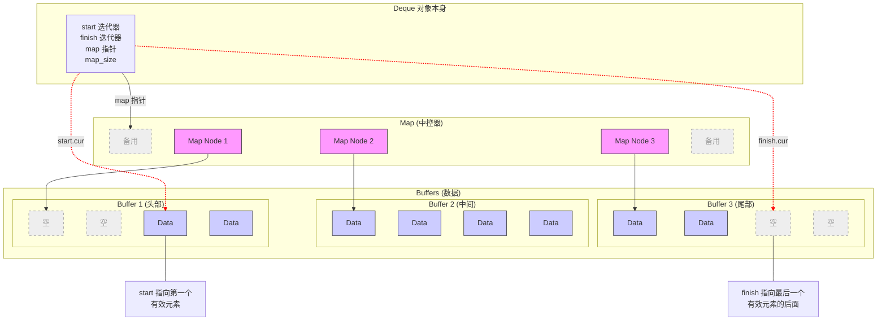
```mermaid
graph TD
    subgraph "Deque 对象本身"
        direction TB
        Members[start 迭代器<br>finish 迭代器<br>map 指针<br>map_size]
    end

    subgraph "Map (中控器)"
        M0[备用]:::empty
        M1[Map Node 1]:::fill
        M2[Map Node 2]:::fill
        M3[Map Node 3]:::fill
        M4[备用]:::empty
    end

    subgraph "Buffers (数据)"
        subgraph "Buffer 1 (头部)"
            B1_0[空]:::empty
            B1_1[空]:::empty
            B1_2[Data]:::data
            B1_3[Data]:::data
        end
        
        subgraph "Buffer 2 (中间)"
            B2_0[Data]:::data
            B2_1[Data]:::data
            B2_2[Data]:::data
            B2_3[Data]:::data
        end

        subgraph "Buffer 3 (尾部)"
            B3_0[Data]:::data
            B3_1[Data]:::data
            B3_2[空]:::empty
            B3_3[空]:::empty
        end
    end

    %% 样式定义
    classDef empty fill:#eee,stroke:#999,stroke-dasharray: 5 5,color:#999;
    classDef fill fill:#f9f,stroke:#333;
    classDef data fill:#ccf,stroke:#333;

    %% 关系连接
    Members --"map 指针"--> M0
    M1 --> B1_0
    M2 --> B2_0
    M3 --> B3_0

    %% 关键：start 和 finish 的指向
    Members -.->|"start.cur"| B1_2
    Members -.->|"finish.cur"| B3_2
    
    %% 注释
    note1[start 指向第一个<br>有效元素]
    note2[finish 指向最后一个<br>有效元素的后面]
    
    B1_2 --- note1
    B3_2 --- note2

    linkStyle 4,5 stroke:red,stroke-width:2px;
```


> **`map` (Map 指针):** 指向中控器数组的起始位置。
>
> **`map_size` (Map 大小):** 记录中控器总共有多少个槽位（包括已用和备用的）。
>
> **`start` (迭代器):** 指向第一个有效的元素。
>
> **`finish` (迭代器):** 指向最后一个有效元素的**下一个位置**。
>
> map+map_size可以用来检查是否中控需要扩容

#### Deque的扩容

1. 扩容一般都是申请新的Buffer

2. 但是有的时候会需要扩容Map，这时候扩容就像Vector差不多，一般是二倍扩容，但是它会把原来中控的指针，拷贝到新的Map的中央的位置

> **申请新 Map：** 分配一块更大的连续空间给 Map（通常是原 Map 大小的 2 倍或更多）。
>
> **拷贝指针 (关键！)：** 将旧 Map 里的**指针**（注意是拷贝指针，不是拷贝实际数据元素）拷贝到新 Map 的 **中央位置**。
>
> - *为什么要拷到中央？* 为了保证新 Map 在逻辑上的头部和尾部都有大量的空闲槽位，以便后续再次进行 `push_front` 或 `push_back`。
>
> **释放旧 Map：** 释放旧的中控数组空间。
>
> **更新迭代器：** 更新内部记录 Map 状态的指针。

3. 重平衡

有的时候Map需要扩容是因为他自己不平衡，比如头这边的Map已经用完了，但是尾巴那里还有好多空间，这时候重新平衡就是给他直接移动Map指针的位置

#### Deque的头插和尾插

没啥好说的，O(1)插入。主要要考虑扩容

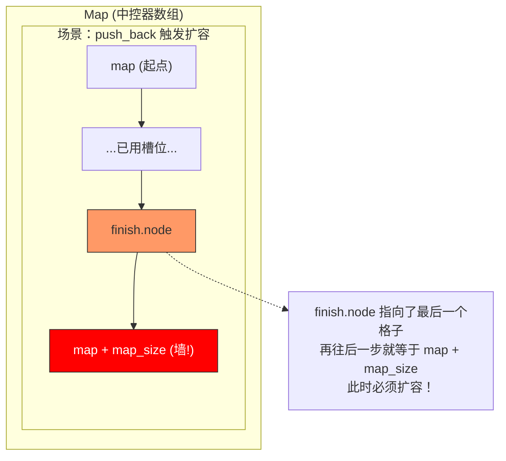
```mermaid
graph TD
    subgraph "Map (中控器数组)"
        direction LR
        
        %% 场景：右边满了
        subgraph "场景：push_back 触发扩容"
            M_Start["map (起点)"]
            Space1["...已用槽位..."]
            Node_Last["finish.node"]:::full
            Wall_Right["map + map_size (墙!)"]:::wall
            
            M_Start --> Space1 --> Node_Last --> Wall_Right
        end
    end

    classDef full fill:#f96,stroke:#333;
    classDef wall fill:#ff0000,stroke:#333,color:#fff;

    note["finish.node 指向了最后一个格子<br>再往后一步就等于 map + map_size<br>此时必须扩容！"]
    Node_Last -.-> note
```


#### Deque的随机插入

Deque头插尾插都很快，但是随机插入就依然要移动大量数据

但是比Vector好的是，它会计算插入元素的位置，距离头近还是尾近

**情况 A：离头部近** 它会将插入点**之前**的所有元素向前（向头部方向）推移。

**情况 B：离尾部近** 它会将插入点**之后**的所有元素向后（向尾部方向）推移。

移动元素的数量 = $\min(\text{Index}, \text{Size} - \text{Index})$

#### Deque的缺点

为啥不直接用Deque替代Vector呢

1. 因为Vector是真正的连续存储，缓存局部性让他对缓存友好

2. 虽然都是随机访问，但是Deque还是有额外的开销

3. 并且如果数据太少了，Deque是有比较多的内存碎片的

   > 如果你存储的数据量很大，`deque` 的分段存储确实能利用碎片内存。但如果你存的数据很少呢？
   >
   > - **场景：** 只需要存 **5 个整数**。
   >
   > - **Vector:** 分配 20 字节（`5 * 4`）。非常紧凑。
   >
   > - **Deque:**
   >
   >   1. 分配一个 Map（最小也要几个槽位）。
   >   2. 分配一个 Buffer（通常最小也是 512 字节，哪怕你只存 1 个 int）。
   >   3. 两个巨大的迭代器（`start` 和 `finish`），每个迭代器内部维护 4 个指针。
   >
   >   - **结果：** 存几十字节的数据，却占用了上千字节的内存。这对内存敏感的程序（如拥有百万个小对象的游戏物体）是不可接受的。


### <span style="color:#FFB266;">C++和 C 对于字符串的优化实现，以及 C++ stl：string 的实现</span>

<span style="color:#FF0000;">注意，首先要区分std::string和字符串</span>

#### 古老的已经被废弃的技术；COW，写时复制

当拷贝一个字符串 `s2 = s1` 时，不立即复制数据，而是让 `s2` 指向 `s1` 的数据，并将引用计数 +1。只有当有人试图 **修改** 其中一个字符串时，才真正进行内存复制。

**为什么被废弃？ (C++11)**

​	a. **多线程开销大：** 为了线程安全，引用计数必须是 **原子操作**（Atomic）。原子操作在多核 CPU 上的开销远大于直接复制短字符串的开销。

​	b. **标准限制：** C++11 标准规定 `operator[]` 和 `iterator` 不能失效（除非发生重新分配），这使得 COW 的实现变得极其复杂且难以维护。

------

#### 短字符串优化

程序中大量的字符串其实很短（比如文件名、单词、人名，通常小于 15 个字符）。如果每个短字符串都要去堆（Heap）上 `malloc` 一次内存，开销巨大且容易造成内存碎片。

`std::string` 对象本身在栈上占据一定大小（通常是 24 或 32 字节，取决于指针大小）。

- **当字符串很长时：** 对象内部存储的是：`[指针 ptr] + [大小 size] + [容量 capacity]`，数据存在 **堆** 上。
- **当字符串很短时：** 直接复用这块空间，利用 `union` 将指针和容量的内存当做 **字符数组** 使用，数据存在 **栈**（或对象所在的内存）上。

------

#### 移动语义

在 C++11 之前，函数返回 `std::string` 会导致深拷贝。

- **优化机制：** 引入右值引用（Rvalue Reference, `&&`）后，`std::string` 实现了移动构造函数和移动赋值操作符。

  - 它不复制字符数据。
  - 它直接“偷走”源对象的内部指针（ptr），并将源对象置为空。

  ```C++
  std::string createBigString() {
      std::string s(1000, 'a');
      return s; // C++11 之前：深拷贝；C++11 及之后：移动（几乎零成本）
  }
  
  std::string a = createBigString(); // 仅仅交换了几个指针
  ```

------

#### std:: string_view 零拷贝切片(C++17)

有点类似于 C#的那个数组切片，仅仅传递一个只读的视图

```c++
void process(std::string_view sv) { 
    // 既能接 std::string，也能接 "literals"，且无任何内存分配
}
//std::string_view 是一个极轻量级的对象，只有两个成员：
//	const char* ptr (指向数据的开始)
//	size_t size (长度)
//主要节省在字面量，比如一个"Hello"可以直接传给string_view的ptr
```

------

#### 手动优化技巧：`reserve()` 与 `shrink_to_fit()`

虽然标准库做了很多，但开发者手动的优化依然关键：

- **`reserve(n)`：预分配内存** 如果你知道字符串大概会多长，**务必** 先调用 `reserve`。

  - *原因：* 字符串增长时，通常会按倍数扩容（如 1.5 倍 或 2 倍）。如果不 `reserve`，在 append 过程中会发生多次 `malloc` -> `memcpy` -> `free`。

  ```C++
  std::string s;
  s.reserve(1024); // 一次分配搞定
  for(int i=0; i<100; ++i) s += "data"; // 此时没有额外的内存分配
  ```

- **`shrink_to_fit()` (C++11)：释放多余内存** 如果一个字符串曾经很大，现在变小了，`capacity` 依然很大。调用此函数请求释放多余的堆内存（虽然是非强制的，但通常有效）。

#### 对于字符串字面量的优化

现代编译器，对于字符串字面量是有池化的优化的，因为字符串字面量是存在rodata里的，如果两个字符串字面量完全一致，池化后会复用相同的字面量

```c++
#include <iostream>

int main() {
    const char* ptr1 = "Hello World";
    const char* ptr2 = "Hello World";

    // 打印地址
    std::cout << "ptr1 地址: " << (void*)ptr1 << std::endl;
    std::cout << "ptr2 地址: " << (void*)ptr2 << std::endl;

    if (ptr1 == ptr2) {
        std::cout << "结论：编译器进行了优化，它们指向同一块内存！" << std::endl; //输出的是这个
    }
    else {
        std::cout << "结论：没有优化，它们是两份副本。" << std::endl;
    }
    return 0;
}
```


### <span style="color:#FFB266;">迭代器分类</span>

[【C++ 迭代器的空类类型 】深入理解C++迭代器类别与空类标签的奥秘](https://zhuanlan.zhihu.com/p/661683100#:~:text=1.%20%E8%BF%AD%E4%BB%A3%E5%99%A8%E7%B1%BB%E5%88%AB%E7%9A%84%E4%BB%8B%E7%BB%8D(Introduction%20to%20Iterator%20Categories)%E5%9C%A8C++%20%E7%9A%84%E4%B8%96%E7%95%8C%E9%87%8C%EF%BC%8C%E8%BF%AD%E4%BB%A3%E5%99%A8%E6%89%AE%E6%BC%94%E7%9D%80%E6%A1%A5%E6%A2%81%E7%9A%84%E8%A7%92%E8%89%B2%EF%BC%8C%E8%BF%9E%E6%8E%A5%E7%AE%97%E6%B3%95%E5%92%8C%E5%AE%B9%E5%99%A8%EF%BC%8C%E4%BD%BF%E5%BE%97%E6%88%91%E4%BB%AC%E8%83%BD%E5%A4%9F%E4%BB%A5%E7%BB%9F%E4%B8%80%E7%9A%84%E6%96%B9%E5%BC%8F%E8%AE%BF%E9%97%AE%E5%AE%B9%E5%99%A8%E4%B8%AD%E7%9A%84%E5%85%83%E7%B4%A0%E3%80%82%E8%BF%AD%E4%BB%A3%E5%99%A8%E7%9A%84%E7%B1%BB%E5%88%AB%E5%AE%9A%E4%B9%89%E4%BA%86%E8%BF%AD%E4%BB%A3%E5%99%A8%E7%9A%84%E5%9F%BA%E6%9C%AC%E8%A1%8C%E4%B8%BA%E5%92%8C%E8%83%BD%E2%80%A6)

**`std::vector` / `std::array/ std:deque`：** 是 **随机访问迭代器 (Random Access Iterator)**。因为内存连续，计算偏移量只需要简单的数学运算。

**`std::list` / `std::map` / `std::set`：** 是 **双向迭代器 (Bidirectional Iterator)**。

- 内存是不连续的节点。
- 你要想跳 5 步，必须顺着指针爬 5 次（`node->next->next...`）。
- **它们不支持 `it + 5` 这种写法**，只支持 `++it` 或 `--it`。

**`std::forward_list`：** 是 **前向迭代器 (Forward Iterator)**。只能往前走，回头路都走不了。

输入输出迭代器：一般用于ostream_iterator，用于数据流

**[连续迭代器](https://www.google.com/search?q=连续迭代器&oq=C%2B%2B迭代器分类&gs_lcrp=EgZjaHJvbWUyBggAEEUYOdIBCDM1MzRqMGo3qAIAsAIA&sourceid=chrome&ie=UTF-8&mstk=AUtExfBozWG2nVqfmh_qIl0MJ6nbjAPzs1VOegGU0QO3783dQ68e1ACtT5lJP2P0faiS0JQjVveh50ty2LzsAf0qtUmrA8I3IlSUaEiC9tJ-ZpJDlSyCoSRclDNCOUh0iUdcp-PiZ_cPwc-tCE5GapJk4isWnBvjxzE0m7wXyJTHUwBQmOU&csui=3&ved=2ahUKEwihtZ2n6dqRAxVohu4BHafKJj0QgK4QegQIAxAV) (Contiguous Iterator)** (C++17)


#### 随机迭代器

std::vector` / `std::array 一般就是一根指针，类型萃取依靠偏特化

std::deque 也是随机迭代器，但是它的迭代器是一个struct，通常包含四个指针：

1. 指向当前元素的指针。
2. 指向当前缓冲区的头。
3. 指向当前缓冲区的尾。
4. 指向中控器（Map）的指针（用于跳到下一个缓冲区）。

#### 双向迭代器

`std::list`迭代器是一个类：

```c++
// 简化的 List 迭代器
struct ListIterator {
    Node* current_node; // 内部持有一根指向节点的指针

    // 重载 ++
    ListIterator& operator++() {
        // 关键：它的“加1”逻辑不是地址加1，而是顺藤摸瓜
        current_node = current_node->next; 
        return *this;
    }

    // 重载 * (解引用)
    int& operator*() {
        return current_node->data;
    }
    
    // 它是没有 operator+(int n) 的！
};
```


#### 空类标签

```c++
// 没有任何成员变量，大小通常为 1 字节（为了占位），但在参数传递时会被优化掉
struct input_iterator_tag {};
struct output_iterator_tag {};
struct forward_iterator_tag : public input_iterator_tag {};
struct bidirectional_iterator_tag : public forward_iterator_tag {};
struct random_access_iterator_tag : public bidirectional_iterator_tag {}; //注意这个继承顺序，权限是依次收紧的
struct contiguous_iterator_tag : public random_access_iterator_tag {}; // C++20
```

举个最经典的例子：std::advance(it, n)。

这个函数的作用是把迭代器 it 向前移动 n 步。

- **对于 `std::vector` (随机访问)**：我们希望直接调用 `it += n`，复杂度 $O(1)$。
- **对于 `std::list` (双向访问)**：不支持 `+=`，必须写个循环 `for(int i=0; i<n; ++i) ++it`，复杂度 $O(N)$。

**问题来了：** 作为一个通用的模板函数 `std::advance`，怎么在**编译期**就知道该用哪种实现？如果用 `if` 判断，运行时会有开销；而且 `list` 的迭代器根本没有 `+=` 运算符，写在 `if` 里编译都通不过。

答案是： 空类标签+类型萃取 + 模板函数重载：

```c++
// 版本 A: 针对随机访问迭代器 (Vector, Deque) 函数重载
template <typename Iter>
void advance_impl(Iter& it, int n, std::random_access_iterator_tag) {
    it += n; // 只有随机迭代器能编译这句
    std::cout << "Fast O(1) jump!" << std::endl;
}

// 版本 B: 针对双向/前向迭代器 (List, Map)
// 注意：InputIteratorTag 是基类，如果找不到匹配的子类，会回退到这里
template <typename Iter>
void advance_impl(Iter& it, int n, std::input_iterator_tag) {
    while (n--) ++it; // 笨办法逐个移动
    std::cout << "Slow O(N) walk..." << std::endl;
}

//外部接口
template <typename Iter>
void my_advance(Iter& it, int n) {
    // 萃取迭代器的类型标签，构造一个临时对象传入
    // 编译器会根据标签类型，自动匹配上面的 impl 版本
    advance_impl(it, n, typename std::iterator_traits<Iter>::iterator_category());
}

```


### hash 冲突如何解决

### 跳表

### 堆排序和优先队列


### 各种排序算法

### 堆排序

考虑优先队列和堆排序的行为的区别

堆排序是一种原地算法

复杂度： 建堆$O(n)$，排序$O(nlogn)$

空间复杂度 $O(1)$

如果要从小到大排序：第一步是构建一个大根堆，然后把头放在尾部，然后递归重新建堆，然后再重复

优先队列调整的复杂度是O(LogN)

```c++
// 辅助函数：下沉 (维持堆性质的核心)
void heapify(vector<int>& arr, int n, int i) {
    int largest = i;
    int left = 2 * i + 1;
    int right = 2 * i + 2;

    if (left < n && arr[left] > arr[largest])
        largest = left;
    if (right < n && arr[right] > arr[largest])
        largest = right;

    if (largest != i) {
        swap(arr[i], arr[largest]);
        heapify(arr, n, largest); // 递归或循环继续下沉
    }
}

void HeapSort(vector<int>& arr) {
    int n = arr.size();

    // 1. 原地建堆 (O(N) 时间)
    // 从最后一个非叶子节点开始，自底向上调整
    for (int i = n / 2 - 1; i >= 0; i--)
        heapify(arr, n, i); //构建一个大根堆，如果是从小到大排序

    // 2. 排序 (O(N log N) 时间)
    // 每次把堆顶扔到数组尾部，然后缩小堆范围
    for (int i = n - 1; i > 0; i--) {
        swap(arr[0], arr[i]); // 把最大值放到当前范围的末尾  
        heapify(arr, i, 0);   // 对剩下的部分重新堆化
    }
}
```


### 清空Vector

vector的`clear()` 并不释放内存

当执行 `vec.clear()` 时：

- **Size** 会变成 `0`。
- **析构函数**：容器内原本的每一个元素都会被调用析构函数。
- **Capacity** **保持不变**：底层占用的那一块内存依然被这个 `vector` 霸占着，不会还给操作系统。

所以清空有 三个方法：

Swap

```c++
std::vector<int> v;
// ... 填充了大量数据 ...

std::vector<int>().swap(v); 
// 创建一个临时空对象并交换，v 的 capacity 变为 0
```

shrink_to_fit()

```c++
v.clear();
v.shrink_to_fit();
```

赋空值:

```c++
vec = std::vector<T>();
//vec = {}; 这样做是错误的，这样类似于clear，也没有释放空间
```


## 智能指针

### <span style="color:#FFB266;">Unique_ptr</span>

独占资源，不允许所有的拷贝语义，只允许移动语义

------


### <span style="color:#FFB266;">Maked_Shared</span>

先说用法：

```cpp
var sp = make_shared<T>(args)
```

make_shared 是基于一次内存分配，然后用 placement new 构造对象。对象的参数用的完美转发，实现的就是一次内存申请就构造

makeshared 的意义有二：1. 内存紧凑，缓存友好。控制块和用户的指针位置在一起 2. 一次内存分配，更安全

------


### <span style="color:#FFB266;">Shared_ptr 线程安全吗</span>

1. 引用计数线程安全
2. 通过引用计数访问修改 T 资源本身的线程安全不保证，需要自己加锁
3. 多线程操作不同的 SharedPtr 是安全的
4. `shared_ptr` 对象本身是线程不安全的

> **场景**：有一个 **全局** 变量 `std::shared_ptr<T> global_sp`。
>
> - 线程 A 执行：`global_sp = std::make_shared<T>(new_obj);` （写操作）
> - 线程 B 执行：`auto local_sp = global_sp;` （读操作）
>
> **赋值操作不是原子的！** 当执行 `global_sp = new_sp` 时，底层其实发生了两步操作（简化版）：
>
> 1. `global_sp._ptr = new_sp._ptr;`
> 2. `global_sp._cb = new_sp._cb;`


### <span style="color:#FFB266;">实现 Shared_ptr</span>

placement_new 语法：

```cpp
new (address) Type(arguments...);
```


```c++
#include <iostream>
#include <atomic>
#include <new>
#include <utility> // for std::forward
#include <cstdlib> // for malloc/free

// ControlBlock 不需要模板 T，除非你需要自定义 Deleter
struct ControlBlock {
    std::atomic<int> _strong_refs;
    std::atomic<int> _weak_refs;

    ControlBlock() : _strong_refs(1), _weak_refs(1) {}
};

template<class T>
class MySharedPtr {
private:
    T* _data_ptr;
    ControlBlock* _cb;
    void* _cb_pos;      // 记录实际分配的那块内存首地址
    bool _is_continuous; // 【修正】：标记内存是否连续（make_shared 模式）

public:
    // 【修正】：Separate Allocation 通常接收 T*
    explicit MySharedPtr(T* data) : _data_ptr(data), _is_continuous(false) {
        if (data) {
            _cb = new ControlBlock();
            _cb_pos = _cb; // 在这种模式下，cb_pos 指向 ControlBlock
        }
        else {
            _cb = nullptr;
            _cb_pos = nullptr;
        }
    }

    // 给 Make_Shared 用的私有构造函数
    MySharedPtr(T* data, ControlBlock* cb, void* cb_pos, bool continuous)
        : _data_ptr(data), _cb(cb), _cb_pos(cb_pos), _is_continuous(continuous)
    {
    }

    // 移动构造
    MySharedPtr(MySharedPtr&& other) noexcept {
        _data_ptr = other._data_ptr;
        _cb = other._cb;
        _cb_pos = other._cb_pos;
        _is_continuous = other._is_continuous;

        other._data_ptr = nullptr;
        other._cb = nullptr;
        other._cb_pos = nullptr;
    }

    // 拷贝构造
    MySharedPtr(const MySharedPtr& other) {
        _data_ptr = other._data_ptr;
        _cb = other._cb;
        _cb_pos = other._cb_pos;
        _is_continuous = other._is_continuous;
        if (_cb) {
            _cb->_strong_refs.fetch_add(1, std::memory_order_relaxed);
        }
    }

    ~MySharedPtr() {
        if (!_cb) return;

        // 1. 强引用归零 -> 销毁对象
        if (_cb->_strong_refs.fetch_sub(1, std::memory_order_acq_rel) == 1) {

            if (_is_continuous) {
                //如果是 make_shared，只能手动析构，不能 delete 指针（因为内存不是它单独申请的）
                _data_ptr->~T();
            }
            else {
                // 如果是 new T 传进来的，delete 会同时调用析构 + 释放内存
                delete _data_ptr;
            }

            // 2. 弱引用归零 -> 释放控制块内存
            if (_cb->_weak_refs.fetch_sub(1, std::memory_order_acq_rel) == 1) {
                if (_is_continuous) {
                    // make_shared 模式：释放整个大块内存
                    // 注意：因为申请时用了 malloc (或 operator new)，这里要匹配
                    std::free(_cb_pos);
                }
                else {
                    // 普通模式：释放 ControlBlock
                    // 这里 cb_pos 就是 ControlBlock*，强转回去 delete
                    delete static_cast<ControlBlock*>(_cb_pos);
                }
            }
        }
    }

    T* operator->() { return _data_ptr; }
    int use_count() { return _cb ? _cb->_strong_refs.load() : 0; }
};

template<class T, typename... Args>
MySharedPtr<T> Make_MySharedPtr(Args&&... args) {
    // 内存布局结构体
    struct InConBlock {
        ControlBlock control;
        T data;
    };

    // 1. 分配原始内存 (使用 malloc)
    // 【修正】：var 是错的，用 void* 或 auto
    void* rawData = std::malloc(sizeof(InConBlock));
    if (!rawData) throw std::bad_alloc();

    // 2. 强转指针
    InConBlock* iCBPtr = static_cast<InConBlock*>(rawData);

    // 3. 构造 ControlBlock
    new(&iCBPtr->control) ControlBlock();

    // 4. 构造 Data
    // 【修正】：参数包展开必须加 ...
    new(&iCBPtr->data) T(std::forward<Args>(args)...);

    // 5. 返回对象，标记为 continuous = true
    return MySharedPtr<T>(&iCBPtr->data, &iCBPtr->control, rawData, true);
}

// 测试类
class Test {
public:
    int v;
    Test(int val) : v(val) { std::cout << "Test Ctor " << v << "\n"; }
    ~Test() { std::cout << "Test Dtor " << v << "\n"; }
};

int main() {
    std::cout << "--- 1. Make Shared ---\n";
    {
        auto sp = Make_MySharedPtr<Test>(100);
        std::cout << "Use count: " << sp.use_count() << "\n";
    } // 应该输出 Dtor 100

    std::cout << "\n--- 2. Separate New ---\n";
    {
        // 模拟 std::shared_ptr<T>(new T(...))
        MySharedPtr<Test> sp(new Test(200));
        std::cout << "Use count: " << sp.use_count() << "\n";
    } // 应该输出 Dtor 200
}
```

> **为什么用 `struct CombinedBlock`？**
>
> - 如果你直接计算 `sizeof(ControlBlock) + sizeof(T)` 然后 malloc，你必须自己手动计算内存对齐（Alignment）。如果 `T` 需要 16 字节对齐，而 `ControlBlock` 只有 8 字节大小，直接把 `T` 放在 `ControlBlock` 后面会导致 `T` 地址未对齐，引发 Crash 或性能问题。
> - 定义 `CombinedBlock` 结构体，编译器会自动在中间插入 Padding，保证 `data` 是对齐的。
>
> **`std::atomic` 的使用**
>
> - **`fetch_add` / `fetch_sub`**：这是核心。多线程同时修改引用计数时，普通 `int` 会出现数据竞争（Race Condition），导致计数错误（例如两个线程同时读到 1，都减 1，结果变成 0 析构了两次）。
> - **内存序 (`memory_order`)**：
>   - 代码中我用了 `acq_rel` (Acquire-Release)。
>   - 这是为了保证：线程 A 减少引用计数之前的 **所有内存写入操作**，对于线程 B 看到引用计数变为 0 进而去析构对象时，是 **可见的**。
>
> **弱引用的小技巧**
>
> - 构造时 `weak_refs = 1`。这代表“只要强引用计数还 > 0，控制块就不能释放”。
> - 当 `strong` 降为 0 时，我们做一个 `weak_refs--`。如果此时 `weak` 变成了 0，说明既没有强引用（对象已死），也没有弱引用（没人监视控制块了），这时候才能 `free`。
>
> **注意这里实现的 makeshared 用的是 malloc+placementnew，但是标准库用的是 allocator 分配，调用的是全局的:: operator new(size_t)，因此它最后释放的时候用的也是 delete**
>
> 具体看：全局的:: new 和 operator new 这一节


### 内存屏障

### <span style="color:#FFB266;">内存序</span>

https://weakyon.com/2023/07/23/understanding-of-the-cpp-memory-order.html#%E7%BC%93%E5%AD%98%E4%B8%80%E8%87%B4%E6%80%A7cache-conherence

这是一个非常硬核的并发编程概念，也是 C++ `std::atomic` 的核心。简单来说，它是 **给 CPU 和编译器立的“交通规则”**。

为了解释它，我们先必须接受一个反直觉的事实：**你的代码，不一定按你写的顺序执行。**

1. 为什么需要内存序？（乱序执行）

为了快，编译器和 CPU 会疯狂优化你的代码。只要结果看起来没变，它们会随意 **重排指令顺序**。

**经典“翻车”场景：** 假设你有两个全局变量 `Data` 和 `Flag`。

- **线程 A（生产者）**：先把数据准备好，然后举起旗子说“好了”。
- **线程 B（消费者）**：一直盯着旗子，看到旗子举起来，就去读数据。

```C++
// 初始状态
int Data = 0;
bool Flag = false;

// 线程 A
void ThreadA() {
    Data = 42;    // 动作 1：写数据
    Flag = true;  // 动作 2：举旗子
}

// 线程 B
void ThreadB() {
    if (Flag == true) {  // 动作 3：看旗子
        assert(Data == 42); // 动作 4：读数据 -> 【这里可能会断言失败！】
    }
}
```

**为什么会挂？** 因为 CPU 可能觉得“动作 1”和“动作 2”没啥关系，为了流水线效率，它可能 **先执行动作 2（Flag = true），后执行动作 1（Data = 42）**。 结果线程 B 看到旗子举起来了，兴冲冲去读数据，读到的却是旧值（或者是乱码）。

**内存序** 就是用来阻止这种乱序的。它告诉 CPU：“在这个操作完成之前，绝对不能把后面的指令提到前面去！”

------

C++ 的三种主要内存序

C++ 提供了 6 种模式，但你只需要懂最常用的这 **3 档**：

第一档：`memory_order_relaxed` (松散序)

- **口诀：** “我就只保原子性，其他的随便乱排。”
- **含义：** 只保证这个操作本身是原子的（不会读到半截数据），但不提供任何顺序保证。
- **适用场景：**
  - 单纯的计数器（如统计网站访问人数）。
  - `shared_ptr` 的引用计数 **增加** 操作（`fetch_add`）。因为增加计数时，如果不涉及对象销毁，谁先加谁后加无所谓，只要没算错就行。

第二档：`memory_order_acquire` / `release` (获取-释放序)

- **口诀：** “一传一接，以此为界。”
- **含义：** 这是一个 **握手协议**。
  - **Release (写)**：也就是线程 A 说：“在我修改这个变量（Flag）**之前** 的所有写操作，都要同步给别人看。”（禁止把前面的写指令移到 Release 后面）。
  - **Acquire (读)**：也就是线程 B 说：“在我读取这个变量（Flag）**之后** 的所有读操作，我都一定要读到最新的。”（禁止把后面的读指令移到 Acquire 前面）。
- **效果：** 线程 A 写了 Data，然后 Release 写 Flag。线程 B Acquire 读 Flag，如果读到了 true，就能 **100% 保证** 读到的 Data 是 42。
- **适用场景：** 互斥锁（Mutex）、信号量、以及 `shared_ptr` 的 **引用计数减为 0 的时候**。

第三档：`memory_order_seq_cst` (顺序一致性)

- **口诀：** “大家排好队，全局看齐。”
- **含义：** 这是 **默认** 的最强模式。它保证所有线程看到的指令执行顺序都是完全一样的，像在单线程里一样自然。
- **代价：** 极慢。它会禁止绝大多数 CPU 缓存优化，通常需要 CPU 插入很重的内存屏障指令（Memory Fence）。
- **适用场景：** 新手默认用这个，或者逻辑极其复杂、一定要全局有序的场景。

回到 `shared_ptr` 的实现

现在回头看我在上一个回答里写的 `make_shared` 引用计数代码，你就能看懂其中的深意了：

```C++
// 增加引用：用 Relaxed
// 为什么？因为增加引用只关心数字+1，此时并不读写 T 对象的数据，
// 也不需要和其他线程同步 T 的状态。乱序也不影响安全性。
_cb->strong_refs.fetch_add(1, std::memory_order_relaxed);

// 减少引用：用 Acq_Rel (Acquire + Release)
// 为什么？这是一个关键节点！
// Release: 保证"我"对对象 T 做的所有修改，在计数器减 1 之前都完成了。
// Acquire: 如果我是减到 0 的那个人，我必须"看到"其他所有人对 T 做的修改，
//          确保在 delete T 之前，大家的手都松开了，数据也是最新的。
if (_cb->strong_refs.fetch_sub(1, std::memory_order_acq_rel) == 1) {
    delete _ptr;
}
```

- **Relaxed**：为了性能，允许乱序，只管自己原子。
- **Acquire/Release**：为了协作，建立由于（A 写 -> B 读）构成的同步点，防止数据读写乱序。
- **Seq_Cst**：为了省脑子，全局绝对有序，但性能最差。

### <span style="color:#FFB266;">Weak_ptr 的原理和作用</span>

用法：

```cpp
std::weak_ptr<int> wp;

// ... 在某个地方 wp 被赋值指向了一个 shared_ptr ...

// 正确用法：
if (std::shared_ptr<int> sp = wp.lock()) { // 1. 尝试升级
    // 2. 升级成功：说明对象还活着
    // 此时 sp 持有强引用，对象绝对安全，不会在执行这块代码时突然析构
    std::cout << *sp << std::endl; 
} else {
    // 3. 升级失败：说明对象已经销毁了 (expired)
    std::cout << "对象已死" << std::endl;
}
```


weakPtr 是为了解决 sharedptr 的循环引用问题的

它本质上是持有 sharedptr 的控制块，这个控制块的意义在，可以通过查看控制块的状态（strongRef）来判断它是否还存活

```cpp
#include <iostream>
#include <atomic>
#include <new>
#include <utility> // for std::forward
#include <memory>  // for std::bad_alloc

// ==========================================
// 1. 控制块基类 (抽象层)
// ==========================================
// 负责定义接口：怎么销毁对象(dispose)，怎么释放内存(destroy)
struct ControlBlockBase {
    std::atomic<int> _strong_refs;
    std::atomic<int> _weak_refs;

    ControlBlockBase() : _strong_refs(1), _weak_refs(1) {}
    virtual ~ControlBlockBase() {}

    // 纯虚函数：不同子类实现不同的销毁逻辑
    virtual void dispose() = 0; // 销毁 T 对象
    virtual void destroy() = 0; // 释放 ControlBlock 内存

    // 供 WeakPtr 使用的原子检查并增加强引用 (核心难点)
    bool attempt_inc_strong() {
        int cur = _strong_refs.load(std::memory_order_relaxed);
        while (true) {
            if (cur == 0) return false; // 对象已死，升级失败
            // CAS 操作：只有当 cur 没变时，才将它 +1
            if (_strong_refs.compare_exchange_weak(cur, cur + 1,
                std::memory_order_acquire,
                std::memory_order_relaxed)) {
                return true;
            }
            // CAS 失败会自动更新 cur 为最新值，继续循环
        }
    }
};

// ==========================================
// 2. 两种具体的控制块实现
// ==========================================

// 情况 A: 对应 MySharedPtr(new T)
// 内存分离：CB 和 T 是分开 new 的
template<typename T>
struct ControlBlockPtr : public ControlBlockBase {
    T* _ptr;
    ControlBlockPtr(T* p) : _ptr(p) {}

    virtual void dispose() override {
        delete _ptr; // 直接 delete 指针
    }
    virtual void destroy() override {
        delete this; // 销毁控制块自己
    }
};

// 情况 B: 对应 Make_MySharedPtr
// 内存连续：CB 后面紧跟着 T
template<typename T>
struct ControlBlockInplace : public ControlBlockBase {
    // 这里的 storage 只是占位，不自动构造
    typename std::aligned_storage<sizeof(T), alignof(T)>::type _storage;

    template<typename... Args>
    ControlBlockInplace(Args&&... args) {
        // 在 _storage 上原地构造 T
        new (&_storage) T(std::forward<Args>(args)...);
    }

    T* get_ptr() { return reinterpret_cast<T*>(&_storage); }

    virtual void dispose() override {
        // 手动调用析构函数
        get_ptr()->~T();
    }
    virtual void destroy() override {
        // 释放整个 ControlBlockInplace 内存 (包含 T 的尸体)
        delete this;
    }
};

// 前置声明
template<typename T> class MyWeakPtr;

// ==========================================
// 3. MySharedPtr 实现
// ==========================================
template<typename T>
class MySharedPtr {
    // 允许 MyWeakPtr 访问私有成员 (为了 lock() 函数)
    friend class MyWeakPtr<T>;

private:
    T* _data_ptr = nullptr;
    ControlBlockBase* _cb = nullptr;


public:
    MySharedPtr() = default;
    // 私有构造：供 lock() 和 make_shared 使用
    MySharedPtr(T* data, ControlBlockBase* cb) : _data_ptr(data), _cb(cb) {}
    // 构造函数：接管裸指针
    explicit MySharedPtr(T* data) : _data_ptr(data) {
        if (data) {
            _cb = new ControlBlockPtr<T>(data);
        }
    }

    // 拷贝构造
    MySharedPtr(const MySharedPtr& other) {
        _data_ptr = other._data_ptr;
        _cb = other._cb;
        if (_cb) _cb->_strong_refs.fetch_add(1, std::memory_order_relaxed);
    }

    // 析构函数 (关键生命周期逻辑)
    ~MySharedPtr() {
        if (!_cb) return;

        // 1. 强引用减 1
        if (_cb->_strong_refs.fetch_sub(1, std::memory_order_acq_rel) == 1) {
            // 2. 如果强引用归零 -> 销毁对象 (调用 dispose)
            _cb->dispose();

            // 3. 强引用归零意味着我们要放弃对 CB 的一个弱锁定
            //    检查弱引用是否也归零 -> 释放内存 (调用 destroy)
            if (_cb->_weak_refs.fetch_sub(1, std::memory_order_acq_rel) == 1) {
                _cb->destroy();
            }
        }
    }
    explicit operator bool() const {
        return _data_ptr != nullptr; // 或者检查 _cb
    }
    T* operator->() { return _data_ptr; }
    T& operator*() { return *_data_ptr; }
    int use_count() { return _cb ? _cb->_strong_refs.load() : 0; }
};

// ==========================================
// 4. MyWeakPtr 实现
// ==========================================
template<typename T>
class MyWeakPtr {
private:
    T* _data_ptr = nullptr;
    ControlBlockBase* _cb = nullptr;

public:
    MyWeakPtr() = default;

    // 构造：从 SharedPtr 创建 WeakPtr
    MyWeakPtr(const MySharedPtr<T>& sp) {
        _data_ptr = sp._data_ptr;
        _cb = sp._cb;
        if (_cb) {
            // 只增加弱引用！
            _cb->_weak_refs.fetch_add(1, std::memory_order_relaxed);
        }
    }

    // 析构
    ~MyWeakPtr() {
        if (!_cb) return;
        // 弱引用减 1
        // 如果变成 0，说明没有任何 SharedPtr (对象早没了) 也没任何 WeakPtr
        // 这时才能释放 ControlBlock 的物理内存
        if (_cb->_weak_refs.fetch_sub(1, std::memory_order_acq_rel) == 1) {
            _cb->destroy();
        }
    }

    // 【核心方法】：升级为 SharedPtr
    MySharedPtr<T> lock() const {
        if (!_cb) return MySharedPtr<T>();

        // 尝试原子地增加强引用
        // 必须使用 CAS 循环，防止多线程竞争时对象刚好被析构
        if (_cb->attempt_inc_strong()) {
            return MySharedPtr<T>(_data_ptr, _cb);
        }

        return MySharedPtr<T>(); // 升级失败，返回空
    }

    bool expired() const {
        return !_cb || _cb->_strong_refs.load() == 0;
    }
};

// ==========================================
// 5. Make_MySharedPtr 实现
// ==========================================
template<typename T, typename... Args>
MySharedPtr<T> Make_MySharedPtr(Args&&... args) {
    // 1. 分配并构造 ControlBlockInplace (包含 T)
    // 这里直接 new 子类，不仅分配了 CB，也分配了 T 的内存
    auto* cb = new ControlBlockInplace<T>(std::forward<Args>(args)...);

    // 2. 返回 SharedPtr
    return MySharedPtr<T>(cb->get_ptr(), cb);
}

// ==========================================
// 测试代码
// ==========================================
class Test {
public:
    int id;
    Test(int i) : id(i) { std::cout << "  Ctor " << id << "\n"; }
    ~Test() { std::cout << "  Dtor " << id << "\n"; }
};

int main() {
    // 1. 测试 MakeShared 和 WeakPtr
    std::cout << "--- Test WeakPtr ---\n";
    MyWeakPtr<Test> wp;
    {
        auto sp = Make_MySharedPtr<Test>(1);
        wp = sp; // 产生弱引用
        std::cout << "  Use count: " << sp.use_count() << "\n";

        // 尝试 lock
        if (auto sp2 = wp.lock()) {
            std::cout << "  Lock success! Value: " << sp2->id << "\n";
        }
    } // sp 析构 -> Strong=0 -> Dispose(~Test) -> Weak=1 (因为 wp 还在) -> Memory NOT freed

    std::cout << "--- Sp out of scope ---\n";

    // 此时 wp 还在，ControlBlock 内存未释放，但 Test 对象已析构
    if (auto sp3 = wp.lock()) {
        std::cout << "  Lock success?\n";
    }
    else {
        std::cout << "  Lock failed (Object expired)\n";
    }

    return 0; // wp 析构 -> Weak=0 -> Destroy(free memory)
}
```


### <span style="color:#FFB266;">makeShared 缺点</span>

1. 内存延迟释放

如果你使用 `weak_ptr` 配合 `make_shared`： 即使 `shared_ptr` 也就是强引用都死光了，对象析构了，**只要还有一个 `weak_ptr` 活着，那块 `ControlBlock` 连同 `Object` 占用的整块内存（如果是 make_shared 连在一起的）都不会释放**。

`weak_ptr` 会锁住物理内存，直到它自己也析构。所以如果对象特别大（比如 100MB 的纹理），且 `weak_ptr` 生命周期很长，要慎用 `make_shared`，最好改用 `new` 分离式内存。

2. 极端的大内存分配失败 (Memory Fragmentation)

虽然少见，但在内存碎片严重的机器上（比如旧的主机平台）可能发生。

- **问题：** `make_shared` 需要分配一块 **连续的、巨大的** 内存（对象大小 + 控制块大小）。
- **对比：** 传统 `new` 是分开两次分配较小的内存。
- **场景：** 有时候内存总量够，但就是找不到这么大一块连续的区域，导致分配失败。而分开分配两次小内存可能就能成功。

3. 它不支持自定义删除器

标准库的默认构造方法支持传入一个删除 lambda，但是 make_shared 不支持，因为 make_shared 的内部控制块是用 malloc 统一分配的，回收的时候也要用 free，就限制死了


### 不使用 weakptr 的情况下解决 shared_ptr 的循环引用


## 多态

### 动态多态的原理

### <span style="color:#FFB266;">虚函数表和虚函数的存储位置</span>

虚函数存储在.text段，虚函数表存储在.rdata只读数据段，虚函数表指针是对象实例的一部分，存储在stack或者heap

### 多继承下类的内存结构

### 菱形继承下的 类的内存结构

### 虚基类的实现原理和内存结构

### 虚基类+虚函数的内存结构

### dynamic_cast 的实现原理


## 虚函数的原理

### 虚函数调用是在编译时确定还是运行时确定的？如何确定调用哪个函数？

只有通过指针或者引用的方式调用虚函数是运行时确定，通过值调用的虚函数是编译期就可以确定的

## 元编程（泛型）

### 泛型的实现原理

### <span style="color:#FFB266;">template 为什么定义和实现都要在头文件</span>

这是一个链接错误

<span style="color:#FF9933;">问题在于两件事情综合在一起导致的：C++是分离编译的，同时模板是惰性实例化的</span>

板不是真正的代码，而是生成代码的“图纸/模具”。只有在需要使用时（知道具体类型时），编译器才能根据图纸生成真正的机器码。如果定义在 `.cpp` 里，编译器在编译 `main` 时看不到图纸，也就造不出东西。

这件事情要和分离编译模型一起看，因为C++是分离编译模型，所以显然，比如main函数存在的cpp是一个独立的编译单元，并且模板是惰性实例化的，也就是假设我们的模板声明在.h，定义在它对应的.cpp里，那么对于模板的编译单元来说，实际上啥也不存在，

因为模板是惰性实例化的，模板的编译单元编译出的目标文件里面，完全没有任何关于模板实例化后的代码（因为模板的编译单元并不知道main的编译单元是如何使用它的）。

这时候对于main的编译单元来说，编译的时候没问题，只是对应的模板函数或者模板类是一个外部的链接，需要链接的时候根据符号表来查找。结果在链接的时候，由于模板的编译单元里面也啥都没有，所以就链接报错。 

这也是为什么，如果我们真的非要把模板的定义放在cpp文件，让模板自己构成一个独立的编译单元，就需要在模板的编译单元里面显式的手动实例化所有可能用到的实例，例如
```c++
// template.h
template<class T>
    void func();
//template.cpp
template<class T>
    void func(){
    cout<<11<<endl;
}

template void func<int>();
```


### 什么是类型擦除 

### <span style="color:#FFB266;">类型萃取 + 迭代器实现 + SFINAE（Substitution Failure Is Not An Error，**替换失败并非错误**）</span>

#### SFINAE（Substitution Failure Is Not An Error，**替换失败并非错误**）

在模板匹配的<span style="color:#66FF66;">类型替换</span>过程中，推导出的非法代码会被**静默丢弃**，而不是直接抛出编译错误。一般是搭配类型萃取和偏特化一起使用的

> <span style="font-weight:bold; color:#FF6666;">注意：</span>SFINAE机制是在**模板参数替换 (Template Argument Substitution)**的过程中起作用，如果是过了类型替换再出错，就是Error了，比如：
>
> ```c++
> template<class T>
>     void func(T t){
>     	t:hello();
> }
> ```
>
> 如果T类型中没有hello这个成员方法，这就是一个错误，因为它通过了类型替换，实例化时编译报错


下面的例子中：std::is_floating_point<T>::value就是类型萃取，std::enable_if就是触发SFINAE

```c++
// 只有当 T 是浮点数时，这个函数才存在
template <typename T>
typename std::enable_if<std::is_floating_point<T>::value, void>::type
print_number(T val) {
    std::cout << "Floating point: " << val << std::endl;
}

// 只有当 T 是整数时，这个函数才存在
template <typename T>
typename std::enable_if<std::is_integral<T>::value, void>::type
print_number(T val) {
    std::cout << "Integer: " << val << std::endl;
}
```

std::enable_if也很有意思，他自己也是基于偏特化实现的

```c++
// 如果条件为真，这个结构体里就有个 type 叫 T
template<bool Cond, typename T = void>
struct enable_if { using type = T; };

// 如果条件为假（偏特化），这个结构体里 啥也没有（空空如也）
template<typename T>
struct enable_if<false, T> { };
```

<span style="color:#66FF66;">如果类型萃取的结果为false，那么偏特化版本的enable_if就没有type这个定义，那么对std::enbale做类型萃取type就会失败，从而触发SFINAE。</span>

#### 类型萃取

类型萃取其实就是一套，获取编译期确定的变量类型信息的方法。实现分两种，一种是偏特化，一种是用编译器支持的

比如：查询一个变量是否是整数：

```c++
// 默认情况：我认为所有东西都不是整数
template <typename T>
struct my_is_integral {
    static const bool value = false;
};

// 特化版本：如果传入的是 int，我就说它是整数
template <>
struct my_is_integral<int> {
    static const bool value = true;
};
```

还有一些是编译器支持的，比如看一个类对象是不是final的：
```c++
template<typename T>
struct is_final : public bool_constant<__is_final(T)> {};
//这里的 __is_final(T) 并不是标准的 C++ 函数，而是编译器自带的钩子。编译器在编译到这一行时，会直接从它内部的符号表里查出这个类有没有 final 关键字。
```

#### decltype类型推测

`decltype` (declared type) 的作用是：**推导表达式或变量的类型，但并不真正执行/计算这个表达式**

```c++
int x = 0;
decltype(x) y = 10; // y 的类型就是 int，因为 x 是 int

template <typename T, typename U>
auto add(T t, U u) -> decltype(t + u) { // 结果类型就是 t+u 之后的类型
    return t + u;
}
```

#### 自定义一个查询类是否存在某个函数的类型萃取

假设我们的想要或者传入的类型是否存在一个函数func：

```c++
template<class T,class = void>
 struct has_func{
    value = false; //基础模板：默认没有
}

//偏特化：尝试去执行 T.func()
// 如果 T.func() 不存在，这一条路径就会“替换失败(SFINAE)”，自动退回到第一条
template<class T,class = void>
struct has_func<T, std::void_t<decltype(std::declval<T>().func())> >{
    value = true
}
```

`std::declval<T>()` 是一个虚构出来的函数，它能让你在不创建任何对象的情况下，假装拥有一个 $T$ 类型的对象

> declval没有运行时定义，他一般只能配合decltype使用，探测函数运行返回值类型。它的返回值是T&&，可以完美处理那些不能拷贝、只能移动，或者带有 `const` 修饰的复杂类型，确保探测结果的精确

std::void_t则是会把所有合法的表达式都转化为void。

**`decltype(...)`**：把上面这套动作产生的**返回值类型**提取出来

因此，如果T真的有func()函数，那么std::void_t就会成功触发，并且成功实例化一个void特化版本的has_func，如果触发失败，会退回到基础模板


### <span style="color:#FFB266;">什么是偏特化</span>

首先偏特化只有类有，函数是没有偏特化的，函数类似的功能是重载，其实规则类似，编译器也会尽量去匹配最特殊最匹配的那个版本的函数

C++有一种规定，他会去尽量的匹配**最特化的**模板，最特化的意思是，最窄，最细碎，最具体的那个版本

例子，比如下面的是C++用于去掉引用的偏特化模板

```c++
template <class _Ty>
struct remove_reference {
    using type  = _Ty;
    using _Const_thru_ref_type = const _Ty;
};

template <class _Ty>
struct remove_reference<_Ty&> {
    using type                 = _Ty;
    using _Const_thru_ref_type = const _Ty&;
};

template <class _Ty>
struct remove_reference<_Ty&&> {
    using type                 = _Ty;
    using _Const_thru_ref_type = const _Ty&&;
};
```

假设我们现在传入的是remove_reference<int&>，看它会匹配哪个模板

它可以匹配两个，一个是主模板：这个模板对与_Ty的类型没有要求，可以匹配一切类型，如果选择了这个，\_Ty就是int&

```c++
template <class _Ty>
struct remove_reference {
```

一个是左值引用的偏特化版本: 这个模板只能接收类型为左值引用的类型，如果选择了这个_Ty就是int

```c++
template <class _Ty>
struct remove_reference<_Ty&>
```

根据最特化原则，就会匹配左值引用的版本

### <span style="color:#FFCC99;">右值引用，万能引用，引用折叠和类型推导</span>

首先要明白，类型推导是C++的语法规定。

假设场景：

```c++
template<typename T> void func(T&& t)
int x = 10;
func(x); // x 是左值
func(42);
```

<span style="color:#99FF99;">当 `T&&` 是一个万能引用（Universal Reference）时，如果传入的是 **左值**，C++ 标准规定 **`T` 必须被推导为左值引用类型**。</span>

传入一个具名的int x，那么**T 被推导为：** `int&`
$$
\text{func}(\underbrace{\text{int\&}}_{T} \text{ \&\& } t)
$$
这里会发生引用折叠，最后折叠为
$$
\text{func}({\text{int}} \text{ \& } t)
$$
当 `T&&` 是一个万能引用，如果传入的是 **右值**，`T` 被推导为该类型的 **非引用类型**（也就是基础类型）。

传入一个右值42，那么**T 被推导为：** `int`
$$
\text{func}(\underbrace{\text{int}}_{T} \text{ \&\& } t)
$$
注意注意，发生了折叠，但是T依然是不变的，在第一个例子里，T依然是int \&，在第二个例子里，T依然是int

#### 类型推导——Const

当你在模板中使用 `T&&` 时，会发生**引用折叠（Reference Collapsing）**。

如果你传入一个 `const` 对象，编译器会把 `T` 推导为 `const 原始类型&`。

| **传入实参类型**   | **T 的推导结果** | **T&& 折叠后的最终类型** |
| ------------------ | ---------------- | ------------------------ |
| `int` (左值)       | `int&`           | `int&`                   |
| `const int` (左值) | **`const int&`** | **`const int&`**         |
| `int` (右值)       | `int`            | `int&&`                  |
| `const int` (右值) | **`const int`**  | **`const int&&`**        |

更具体的说，C++的类型推导和传值传引用有关

如果要求的是传值，那么会丢掉const。如果传引用，则会保留const(这很合理：如果你把 `const int` 传给一个 `int&`（非 const 引用），就违反了 C++ 的类型安全，因为这会允许你在函数内部修改一个本不该被修改的常量)

```c++
template<typename T>
void func(T param) {
    param = 10; // 编译成功！即使你传入的是 const int
}

const int x = 5;
func(x);


```

再回去看T&&的推导逻辑：<span style="color:#99FF99;">当 `T&&` 是一个万能引用（Universal Reference）时，如果传入的是 **左值**，C++ 标准规定 **`T` 必须被推导为左值引用类型**。</span>就很合理了，这是因为万能引用也是引用，因此对于传入左值，推导为左值引用，并且如果是const左值，也会保留const，推到为const int&

| **模板形式** | **传入 const int** | **T 的推导结果** | **是否保留 const？**    |
| ------------ | ------------------ | ---------------- | ----------------------- |
| `func(T)`    | 传值               | `int`            | **不保留** (发生 Decay) |
| `func(T&)`   | 传左值引用         | `const int`      | **保留**                |
| `func(T&&)`  | 传左值 (万能引用)  | `const int&`     | **保留** (并带引用)     |


### <span style="color:#FFCC99;">std: move 和 std:: forward 的实现以及原理</span>

写在最前面，c++的一些概念真是混淆的一塌糊涂，这里要区分具体场景描述一些概念

在模板推导中：int就是右值，int&就是左值

而在定义中，一个int类型的变量，int x，这个x是一个具名值，他是左值。同时，具名的右值，int&& y，这个y也是左值，因为他具名了

#### std::move

本质上就是static_cast

先看用法：

```c++
int xxx = 10;
std::move(xxx)
```

为啥std::move需要呢，因为对于一个值来说，上面这个xxx就已经具名了，所以需要一个方法来标识

> `std::move` 执行了一个 **static_cast**，将一个 **lvalue**（左值）转换为一个 **xvalue**（将亡值），从而允许编译器通过 **Overload Resolution**（重载决议）选中移动构造函数或移动赋值操作符

```c++
template <typename T>
    constexpr typename std::remove_reference<T>::type&& move(T&& t) noexcept {
        // 核心就这一句：强制转换
        return static_cast<typename std::remove_reference<T>::type&&>(t);
    }
//这个过程完全的等价于static_cast<int&&> 
```

结合上面俩关于万能引用和引用折叠，再来看

remove_reference是通过 偏特化 + 类型萃取 来对于左值右值匹配不同的remove，偏特化之后去掉了引用，暴露了最原本的那个类型。

```c++
template <class _Ty>
struct remove_reference {
    using type  = _Ty;
    using _Const_thru_ref_type = const _Ty;
};

template <class _Ty>
struct remove_reference<_Ty&> {
    using type                 = _Ty;
    using _Const_thru_ref_type = const _Ty&;
};

template <class _Ty>
struct remove_reference<_Ty&&> {
    using type                 = _Ty;
    using _Const_thru_ref_type = const _Ty&&;
};
```

T推导出来之后，最后的意义是在static_cast的时候发挥作用，然后static_cast就拿着这个T做了强制类型转换为右值

<span style="font-weight:bold; color:#FF6666;">注意：</span>

std::move可以转化一个const左值，但是毫无用处，还是会触发拷贝语义（如果有的话）。因为右值语义本质上是窃取，一个只读的将亡值（Const Rvalue）是没法被转化所有权的

```cpp
#include <iostream>
#include <utility>

class Widget {
public:
    Widget() {}

    // 拷贝构造
    Widget(const Widget&) {
        std::cout << "Copy Constructor (慢)" << std::endl;
    }

    // 移动构造
    Widget(Widget&&) {
        std::cout << "Move Constructor (快)" << std::endl;
    }
};

int main() {
    const Widget cw;

    // 这里的 std::move(cw) 返回的是 const Widget&&
    // 移动构造函数无法接受 const 类型
    // 于是退化为拷贝构造
    Widget w = std::move(cw); //Copy Constructor (慢)
}
```


------


#### std::forward

std::forward总是和万能引用一起使用，本质上是引用折叠的static_cast

用法

```c++
template<typename T>
void func(T&& param) {
    // 这里的 T 携带了参数原始是左值还是右值的信息
    process(std::forward<T>(param)); 
}
```

实现：

```c++
namespace std {
    // 这里的 T 就是你在调用 std::forward<T> 时手动传进去的那个 T
    // 也就是万能引用推导出来的那个“记忆”
    template <typename T>
    constexpr T&& forward(typename std::remove_reference<T>::type& t) noexcept {
        return static_cast<T&&>(t);
    }
}
```

注意这句核心代码：
$$
\text{return static\_cast}<T\&\&>(t);
$$
看起来和 `std::move` 几乎一模一样？区别在于 `std::move` 内部是强行把 `T` 剥离引用后再加 `&&`，而 `std::forward` 是**直接使用 `T&&`**。

正是因为直接使用了 `T`，**引用折叠** 就在这里发挥了作用

另外，`forward(typename std::remove_reference<T>::type& ` 这里type后有个引用符号，这是因为，

1. 传入的那个t，一定是具名的（考虑上面的param是一个左值，无论推导出来实际上是右值还是左值），
2. 这样的话传入一个左值用引用还可以减少一次拷贝。只有接受 **左值引用 (`&`)** 的函数，才能无缝地、无拷贝地接住这个具名的变量


另外在这一章开头的那部分，这里也有例子，也就是对于类型推导来说，int就是右值，int&就是左值
```c++
#include<iostream>
#include<vector>
using namespace std;
void func(int& a) {
	cout << "A" << endl;
}

void func(int&& a) {
	cout << "B" << endl;
}

int main() {
	int i = 0;
	func(std::forward<int>(i)); //B
	func(std::forward<int&>(i)); //A
}
```


### 类内的模板函数可以是虚函数吗

1. 正常类里的模板成员函数是虚寒是是不可以的

```c++
class Base {
public:
    // ❌ 错误：Member function templates cannot be virtual
    template <typename T>
    virtual void func(T t) {
        // ...
    }
};
```

根本原因：虚表的大小必须固定

C++在编译期会为所有有虚函数的类，生成虚表，这个虚表的大小是编译期确定的，在这个例子里就是，C++在编译期需要确定Base这个类的虚函数表里到底有多少个虚函数

但是，模板函数是，调用时才会生成代码（惰性生成），也因此，在编译期的时候，假设在另一个编译单元当中的一个地方调用了这个模板函数，这时候编译器是没法知道Base到底有多少个版本多少个类型的。

> C++ 编译是**以 `.cpp` 为单位**（Translation Unit）独立进行的。
>
> 假设你把 `Base` 类定义在 `header.h` 里：

- 编译 `A.cpp` 时：**
  - 编译器看到：`Base::func<int>` 被调用了。
  - 编译器想：“好吧，如果我要造 vtable，它是第 1 个槽位。”
  - 生成的 `A.o` 认为：`Base` 的 vtable 大小是 **1**。
- **编译 `B.cpp` 时：**
  - 编译器看到：`Base::func<double>` 被调用了。
  - 注意！编译 `B.cpp` 时，编译器**完全不知道** `A.cpp` 的存在。
  - 编译器想：“好吧，如果我要造 vtable，它是第 1 个槽位。”
  - 生成的 `B.o` 认为：`Base` 的 vtable 大小也是 **1**。
- **链接阶段（Linker）：**
  - 链接器把 `A.o` 和 `B.o` 拼在一起。
  - 现在问题来了：`Base` 到底只有一个 vtable，还是有两个？
  - 如果合并成一个，那 `func<int>` 占哪个槽？`func<double>` 占哪个槽？
  - 这时候已经太晚了！机器码里的 `call *(vptr + offset)` 里的 **offset（偏移量）** 已经在编译 `.o` 时写死了。

2. 类模板里有普通的虚函数是是可以的

```c++
template <typename T>
class B {
    virtual void foo(T t); // 合法！
};
```

这是合法的是因为，B\<int\>和B\<string\>是两份代码，这样就可以确定每个具体类型的B<T>的虚函数表里的虚函数数量

### 重载和特化

首先，C++函数是不支持偏特化的

进一步，特化和重载的行为是不一样的。函数重载支持继承，而特化是不支持继承关系的

其实针对类的偏特化，也不支持继承,因为**模板特化**（Template Specialization）的本质是**模式匹配（Pattern Matching）**，而不是面向对象的逻辑判断。

```c++
#include <iostream>
#include <type_traits>

// 1. 定义标签体系
struct BaseTag {};
struct DerivedTag : BaseTag {}; // 继承关系

// 2. 主模板 (通用版本)
template <typename T, typename Tag>
struct Algorithm {
    static void run() { std::cout << "通用版本 (Slow)" << std::endl; }
};

// 3. 针对 BaseTag 的偏特化
// 你的期望：只要是 BaseTag 体系的，都走这里
template <typename T>
struct Algorithm<T, BaseTag> {
    static void run() { std::cout << "特化版本 (Fast)" << std::endl; }
};

int main() {
    // Case A: 传入 BaseTag
    // 完美匹配偏特化 <T, BaseTag>
    Algorithm<int, BaseTag>::run();      // 输出：特化版本 (Fast) ✅
    
    // Case B: 传入 DerivedTag
    // 它是 BaseTag 的子类，应该也很快吧？
    // 现实：它不等于 BaseTag，匹配失败，回退到主模板
    Algorithm<int, DerivedTag>::run();   // 输出：通用版本 (Slow) ❌ (你的期望落空了)
    
    return 0;
}
```

函数重载是支持继承的，下面的例子是C++迭代器算法，针对不同的迭代器类型进行重载的效果：要注意，迭代器之间的空类标签是有继承关系的

```c++
#include <iostream>
#include <vector>
#include <list>
#include <iterator>

// ---------------------------------------------------------
// 1. 实现层 (Implementation Layer) - 利用函数重载
// ---------------------------------------------------------

// 版本 A: 笨办法 (O(N))
// 接收 InputIteratorTag，它是所有迭代器标签的基类
template <typename Iter>
void my_advance_impl(Iter& it, int n, std::input_iterator_tag) {
    std::cout << "[Slow] 正在逐个移动迭代器..." << std::endl;
    while (n--) {
        ++it;
    }
}

// 版本 B: 优化办法 (O(1))
// 接收 RandomAccessIteratorTag
template <typename Iter>
void my_advance_impl(Iter& it, int n, std::random_access_iterator_tag) {
    std::cout << "[Fast] 正在进行指针加法跳跃!" << std::endl;
    it += n;
}

// ---------------------------------------------------------
// 2. 接口层 (Interface Layer) - 负责提取标签并分发
// ---------------------------------------------------------

template <typename Iter>
void my_advance(Iter& it, int n) {
    // 关键步骤：
    // 1. 萃取迭代器的 category (标签类型)
    // 2. 构造一个该标签的临时对象 ()
    // 3. 传给 impl 函数，利用重载决议自动匹配最合适的版本
    using Tag = typename std::iterator_traits<Iter>::iterator_category;
    
    my_advance_impl(it, n, Tag()); 
}

// ---------------------------------------------------------
// 3. 测试
// ---------------------------------------------------------

int main() {
    // --- 场景 1: std::list (双向迭代器) ---
    std::list<int> myList = {1, 2, 3, 4, 5};
    auto listIt = myList.begin();
    
    // std::list 的标签是 bidirectional_iterator_tag
    // 我们没有写 bidirectional 的重载，但它继承自 input_iterator_tag
    // 所以编译器会自动匹配到 版本 A (基类兜底)
    std::cout << "Testing List:" << std::endl;
    my_advance(listIt, 2); 
    std::cout << "当前值: " << *listIt << "\n" << std::endl;


    // --- 场景 2: std::vector (随机访问迭代器) ---
    std::vector<int> myVec = {10, 20, 30, 40, 50};
    auto vecIt = myVec.begin();
    
    // std::vector 的标签是 random_access_iterator_tag
    // 完美精确匹配 版本 B
    std::cout << "Testing Vector:" << std::endl;
    my_advance(vecIt, 2);
    std::cout << "当前值: " << *vecIt << "\n" << std::endl;

    return 0;
}
```


## 其他

### volatile 和 atomic

一句话总结：

- **`volatile`** 是给**编译器**看的，为了**防止编译器优化**。
- **`atomic`** 是给**CPU/缓存**看的，为了**保证多线程安全**。

#### `volatile` (易变的)

**它的核心作用：** 告诉编译器，“这个变量随时可能被外部（比如硬件、中断、其他程序）修改，你别自作聪明把它缓存到寄存器里，**每次都要老老实实去内存里读**。”

- **它解决什么问题？** 假设你有一个指针指向显卡的某个状态寄存器。

  ```C++
  volatile int* status_reg = 0x12345678;
  while (*status_reg == 0) {
      // 等待硬件就绪
  }
  ```

  如果没有 `volatile`，编译器看这段代码觉得奇怪：“`*status_reg` 在循环里根本没被修改啊？”于是编译器可能把它优化成：

  ```C++
  // 编译器的错误优化
  int temp = *status_reg; // 只读一次
  while (temp == 0) {     // 死循环
  }
  ```

  加上 `volatile`，编译器就被迫每次循环都去读那个内存地址。

- **它不解决什么问题？（重点）**

  - **它不是线程安全的**。
  - **它不保证原子性**。
  - **它不保证指令顺序（Memory Ordering）**。CPU 仍然可以乱序执行指令。

#### `atomic` (原子的)

**它的核心作用：** 保证操作是**不可分割**的，且在多线程环境下保证**可见性**和**顺序性**。

- **它解决什么问题？** 最经典的 `i++` 问题。 `i++` 在机器指令层面其实是三步：

  1. **Read**: 把 `i` 从内存读到寄存器。
  2. **Modify**: 寄存器里的值加 1。
  3. **Write**: 把寄存器里的值写回内存。

  如果有两个线程同时做 `i++`：

  - 线程 A 读了 0。
  - 线程 B 读了 0（此时 A 还没写回去）。
  - 线程 A 写回 1。
  - 线程 B 写回 1。
  - **结果：i 变成了 1，但本应该是 2。**

  使用 `std::atomic<int> i`，硬件会锁住总线或者利用缓存一致性协议（MESI），强制这三步合并成一个动作。谁抢到谁执行，另一个等着。

------

#### 直观的代码对比

假设我们需要一个多线程计数器。

❌ 错误做法：使用 volatile

```C++
volatile int count = 0;

void ThreadFunc() {
    for(int i=0; i<10000; i++) {
        count++; 
        // 灾难发生：volatile 保证了每次都去内存读写，
        // 但它不能阻止两个线程“同时读到旧值，然后覆盖写”。
    }
}
// 结果：count 往往小于 20000，且每次运行结果都不一样。
```

✅ 正确做法：使用 atomic

```C++
#include <atomic>
std::atomic<int> count = 0;

void ThreadFunc() {
    for(int i=0; i<10000; i++) {
        count++; 
        // 编译成 x86 指令会类似：LOCK INC [addr]
        // 绝对安全，虽然比普通加法慢一点，但比 Mutex 锁快得多。
    }
}
// 结果：count 稳定等于 20000。
```

### constexpr 和 Const

### 顶层底层 Const

### lambda 表达式的原理

### 函数对象是什么，如何实现的函数对象的效果以及 std: functional

### Name Mangling


## 现代 C++

### 有什么 C++17/20 的新特性吗

#### C++17可以让inline修饰const

头文件中定义的Const变量

头文件中的全局变量需要定义为const，否则外部链接性会导致链接时重定义，但是用const修饰也有问题，就是他们本质上还是不同的变量，因此取地址的时候是不同的地址。

C++17之后有了一个新的写法如下。这种写法利用了inline的外部链接，同时inline声明虽然在头文件当中定义，但是全局之后一份，因此链接器会做去重。并且constexpr会保证它是编译期常量（C++17后允许inline修饰变量）

```c++
inline constexpr int MAX_HP = 1000;
```

#### C++20引入了concepts


# Unity

## Unity 基础

### <span style="color:#FFB266;">协程的原理</span>

Unity本身值不支持多线程的，因此Unity的协程的本质上是状态机，他就是一个状态机迭代器，然后每一次Update固定几个时候检测一下是否到了执行的条件，到了就再拿出来执行一下，关注一下几个恢复的时间节点

`yield return` 的本质就是“暂时退出函数并保留当前所有局部变量的状态”

### <span style="color:#FFB266;">协程的 GC</span>

#### 开启时GC

当调用 `StartCoroutine(MyCoroutine())` 时，会发生两次分配：

- **迭代器对象的创建：** `MyCoroutine()` 被调用时，编译器生成的那个“状态机类”会被实例化到堆（Heap）上。
- **Coroutine 对象的创建：** Unity 引擎内部会创建一个 `Coroutine` 对象来追踪这个迭代器的状态，并将其加入调度列表。

#### 运行中的 GC：`yield return` 的陷阱

这是最容易被忽视的 GC 来源

```C#
IEnumerator MyCoroutine() {
    while(true) {
        // ❌ 错误：每一轮循环都会在堆上 new 一个新对象，产生 GC 垃圾
        yield return new WaitForSeconds(1.0f); 
    }
}
```

- **装箱 (Boxing)：** 如果写 `yield return 0;`，由于 `yield return` 需要的是一个对象（`object`），整数 `0` 会被装箱成引用类型，产生极小但高频的 GC。
- **重复创建指令：** 像 `new WaitForSeconds` 这种类，每次 `new` 都会分配内存。

**【优化方案：缓存 Yield 对象】** 通过预先创建好这些指令并复用，可以实现“零 GC 运行”：

```C#
private WaitForSeconds _waitOneSecond = new WaitForSeconds(1.0f);

IEnumerator MyCoroutine() {
    while(true) {
        // ✅ 正确：复用同一个实例，不会产生新内存分配
        yield return _waitOneSecond; 
    }
}
```

#### 3. 局部变量的“提升” (Variable Hoisting)

因为协程需要跨帧保存状态，你在协程函数内部定义的**局部变量**，实际上并不会存在于栈（Stack）上。

- **原理：** 为了在 `yield` 之后恢复现场，编译器会将这些局部变量“提升”为状态机类的**成员字段**。
- **结果：** 只要协程还在运行，这些变量就会一直占据堆空间。如果变量引用了大型数组或资源，直到协程彻底结束前，这些内存都不会被释放。

------

#### 4. 停止协程时的隐患

使用 **字符串** 停止协程是性能的大忌：

```C#
StopCoroutine("MyCoroutine"); // ❌ 极差：涉及反射查找和字符串开销
```

应当保存 `StartCoroutine` 返回的引用：

```C#
Coroutine myRunningCoroutine = StartCoroutine(MyCoroutine());
StopCoroutine(myRunningCoroutine); // ✅ 推荐
```


### <span style="color:#FFB266;">Unity 生命周期函数</span>


### Unity 的相机渲染以及多相机渲染（如何排序，如何筛选）

### <span style="color:#FFB266;">Unity 相机的剔除</span>

视锥体剔除 (Frustum Culling)

这是最基础的剔除。相机的视野是一个由近裁剪面和远裁剪面组成的**平截头体（Frustum）**。

- **原理：** Unity 会检查场景中所有物体的 `MeshRenderer.bounds`（包围盒）。如果一个物体的包围盒完全不在相机的视锥体内，它就不会被提交给渲染流水线。
- **注意点：** 这是一个 CPU 操作。如果场景中有数万个小物体，即便它们被剔除了，CPU 检查这些边界框的过程也会产生一定的开销。

 遮挡剔除 (Occlusion Culling) 

https://www.bilibili.com/video/BV1RKv4ejEYU/?spm_id_from=333.337.search-card.all.click&vd_source=5d4070cc138983fa1babce80b5a31622

https://www.bilibili.com/video/BV1ZF411c796/?spm_id_from=333.337.search-card.all.click&vd_source=5d4070cc138983fa1babce80b5a31622

视锥体剔除只能解决“身后”的物体，无法解决“被挡住”的物体。例如，你站在一堵墙前，墙后有一座复杂的城市，视锥体剔除依然会尝试渲染整座城市。

- **原理：** Unity 将场景划分为若干个格子（Cells），并提前计算哪些格子里可以看到哪些物体。
- **实现步骤：**
  1. 将遮挡物（如墙壁）设为 **Static**。
  2. 在 **Occlusion Culling** 窗口进行 **Bake**（烘焙）。
- **优点：** 极大降低显卡的绘制压力（Draw Calls 和面数）。
- **缺点：** 增加包体大小（存储数据）和运行时运行时 CPU 的查询开销。

背面剔除 (Backface Culling) —— GPU 阶段

这是在硬件流水线阶段发生的。

- **原理：** 根据三角面的顶点环绕顺序（顺时针或逆时针）判断哪一面朝向相机。
- **效果：** 默认情况下，物体的“内表面”是不渲染的。如果你走进一个没有厚度的正方体内部，你会发现它是透明的。


### <span style="color:#FFB266;">如何判断一个对象是否在屏幕内</span>

做MVP变换，也不用做透视除法，将物体的世界坐标转换到裁剪空间 (Clip Space)。如果点的坐标 $(x, y, z, w)$ 满足以下条件，则在屏幕内：
$$
-w \le x \le w, \quad -w \le y \le w, \quad 0 \le z \le w
$$


也可以用视锥体过滤，如果物体在视锥体范围内，那么就在屏幕内

### <span style="color:#FFB266;">如何判断一个点是否在三角形内部</span>

假设点为 $P$，三角形顶点为 $A, B, C$

**叉积法 (Cross Product)：** 依次计算向量 $\vec{AB} \times \vec{AP}$、$\vec{BC} \times \vec{BP}$ 和 $\vec{CA} \times \vec{CP}$。 如果三个结果的符号一致（全为正或全为负），说明点 $P$ 始终在三条边的同一侧，即在三角形内

**重心坐标法 (Barycentric Coordinates) - 最常用：** 任何在三角形平面上的点 $P$ 都可以表示为：$P = uA + vB + wC$。 如果满足 $u \ge 0, v \ge 0, w \ge 0$ 且 $u + v + w = 1$，则点在三角形内。

> 重心坐标本质上就是“面积比例”
>
> 假设三角形的三个顶点是 $A, B, C$，内部有一个点 $P$。如果你把 $P$ 与三个顶点相连，就会把大三角形切割成三个小三角形：$\triangle PBC$、$\triangle PCA$ 和 $\triangle PAB$。
>
> 点 $P$ 的三个重心坐标 $(u, v, w)$ 刚好对应这三个小三角形占总面积的比例：
>
> - $u = \frac{\text{Area}(\triangle PBC)}{\text{Area}(\triangle ABC)}$ （$P$ 对应顶点 $A$ 的权重，看的是 $P$ 与对面边 $BC$ 组成的面积）
> - $v = \frac{\text{Area}(\triangle PCA)}{\text{Area}(\triangle ABC)}$ （$P$ 对应顶点 $B$ 的权重）
> - $w = \frac{\text{Area}(\triangle PAB)}{\text{Area}(\triangle ABC)}$ （$P$ 对应顶点 $C$ 的权重）
>
> 因为这三个小三角形正好拼成了一个大三角形，所以它们的面积之和等于总面积，即：
> $$
> u + v + w = 1
> $$
> 实际写代码其实也是算面积：
> $$u = \frac{\|\vec{PB} \times \vec{PC}\|}{\|\vec{AB} \times \vec{AC}\|}$$


### <span style="color:#FFB266;">如何判断射线和包围盒相交</span>

AABB的情况下：无论是是几维的（这里假设是三维），一条射线和三维的三组面都有各自有交点，分别计算射线与每一对平面的相交区间 $[t_{enter}, t_{out}]$，也就是光进入一对面的时间，和离开这一对面的时间。

然后三组面都求出进入和离开。求所有进入时间的最大值和离开时间的最小值，如果$t_{max\_enter} \le t_{min\_out}$，并且$t_{min\_out} > 0$（因为光是有方向的，这个限制限制了包围盒不在光的起点的反方向） 那么就有交点


### <span style="color:#FFB266;">如何判断两个包围盒相交</span>

#### AABB

```c++
struct AABB {
    Vector3 min; // 最小点 (x_min, y_min, z_min)
    Vector3 max; // 最大点 (x_max, y_max, z_max)
    
    // 或者另一种写法
    // Vector3 center;   // 中心点
    // Vector3 halfSize; // 半长宽高 (extents)
};
```


两个 AABB 相交，当且仅当它们在**所有坐标轴**上的投影区间都重叠

假设盒 A 范围是 $[A_{min}, A_{max}]$，盒 B 范围是 $[B_{min}, B_{max}]$。

如果在 $X, Y, Z$ 轴上都满足：
$$
(A_{min}.x \le B_{max}.x \text{ 且 } A_{max}.x \ge B_{min}.x)
$$
则两个 AABB 相交。

#### OBB

```c++
struct OBB {
    Vector3 center;      // 中心点
    Vector3 axes[3];     // 三个正交的局部坐标轴 (单位向量，表示方向)
    Vector3 halfSizes;   // 在三个轴方向上的半长度 (半径)
    
    // 也可以用旋转矩阵或四元数代替 axes[3]
    // Quaternion rotation;
};
```

一般就是用凸多边形的计算方法，SAT或者GJK


### <span style="color:#FFB266;">如何判断两个三角形相交</span>

这就是碰撞检测了：先粗筛然后细筛，粗筛不说了，就AABB检测就行了

1. SAT：

   两个凸多边形如果不相交，则一定存在一根轴，使得它们在该轴上的投影不重叠。对于两个三角形，需要测试以下 11 条可能的轴：

   - 两个三角形的**法线方向**（2 条轴）。
   - 第一个三角形的 3 条边与第二个三角形 3 条边的**叉积方向**（$3 \times 3 = 9$ 条轴）

2. GJK


### FixedUpdate 的原理

### Unity 的 OverDrall 问题

### Unity 如何引入 C++代码

### <span style="color:#FFB266;">欧拉角和万向锁</span>

https://www.youtube.com/watch?v=0kCX7fDDh6Q

#### 欧拉角

首先说明，欧拉角必须要搭配轴上的旋转的应用方向才有意义

欧拉角通过三个相互垂直的轴（通常是 X, Y, Z）的旋转角度来定义物体的姿态。在航空领域，它们被称为：

- **俯仰（Pitch）**：绕 X 轴，像点头。
- **偏航（Yaw）**：绕 Y 轴，像摇头。
- **翻滚（Roll）**：绕 Z 轴，像侧歪头。

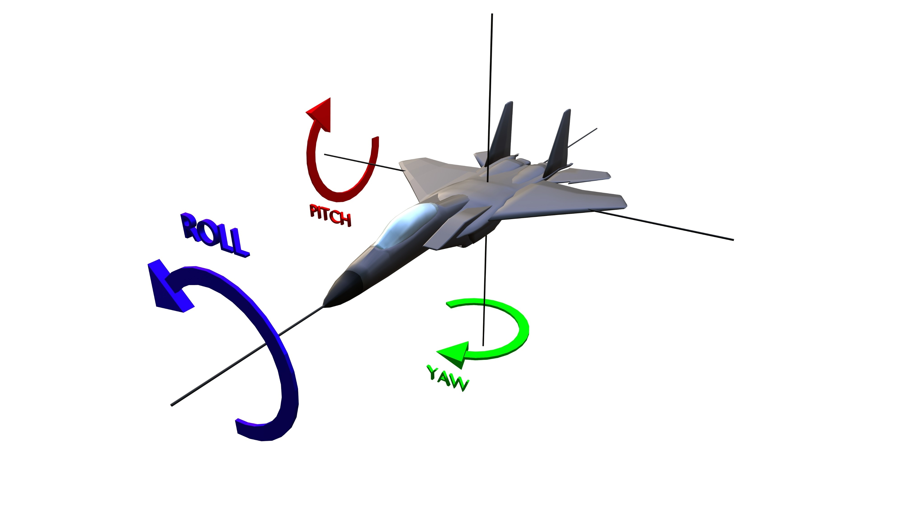

#### 欧拉角的特性：

1. **顺序相关**：旋转的顺序非常重要（例如先 X 后 Y 再 Z，与先 Z 后 Y 后 X 的结果完全不同）。

   这个顺序相关的本质实际上是因为矩阵乘法是有顺序的，

   > 假设 $R_x, R_y, R_z$ 分别是绕 X、Y、Z 轴的旋转矩阵。
   >
   > - 在**世界坐标系**下旋转，矩阵通常是从左往右乘。
   > - 在**本地坐标系**下旋转，矩阵是从右往左乘（或者说每一轴的变换都基于前一个变换的结果）。
   >
   > 数学上的真理是：矩阵乘法不满足交换律。即：
   >
   > $$R_x \times R_y \neq R_y \times R_x$$
   >
   > 所以，只要你用三个轴的角度来描述旋转，你就必须规定一个顺序（比如 Unity 默认是 $Z \rightarrow X \rightarrow Y$，而某些航空标准是 $Z \rightarrow Y \rightarrow X$）。
   >
   > Unity中transform.eulerAngles是基于世界坐标系的，transform.localEulerAngles是局部坐标系的。
   >
   > 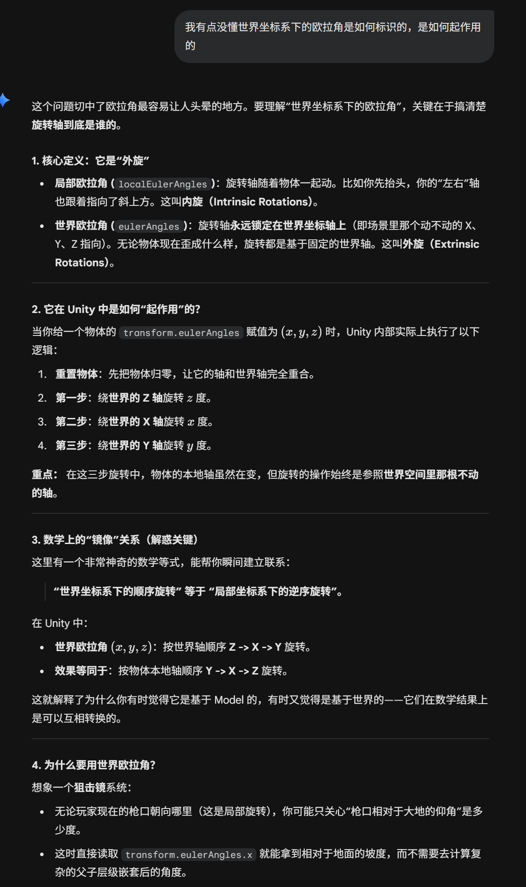
   >
   > ###  数学逻辑：为什么顺序是反的？
   >
   > 假设我们要实现一个复杂的旋转：**先绕 X 轴转 $\alpha$ 度，再绕 Y 轴转 $\beta$ 度。**
   >
   > - 内旋（Local）逻辑：$R_{local} = R_x(\alpha) \cdot R_y(\beta)$
   >
   >   在局部坐标系下，每一个新动作都是“追随”前一个动作的。就像你开车：先左转，再抬头。抬头这个动作是基于左转后的方向进行的。
   >
   > - 外旋（World）逻辑：$R_{world} = R_y(\beta) \cdot R_x(\alpha)$
   >
   >   在世界坐标系下，你要达到同样的效果，逻辑就变了。为了抵消掉“轴跟着动”的影响，你必须把顺序倒过来：先转那些“更底层”的轴。
   >
   > **核心结论：** > 任何一个**内旋**序列（局部轴），只要把它的顺序**完全颠倒**，就等同于一个对应的**外旋**序列（世界轴）。
   >
   > 其实就是说，内旋（局部坐标系，是轴跟着一起转），而外旋（世界坐标是，是轴不变），外旋的时候为了抵消轴的变化，就要先应用最后的（因为内旋最后转的它不转坐标轴），然后再一层一层往外拨
   >
   > https://www.youtube.com/watch?v=FNKF1XFUW3U

2. **分层嵌套**：在三维空间中，欧拉角的旋转就像是三个互相嵌套的金属环（万向节）。外层的旋转会带动内层的所有环一起运动。

3. 万向锁：

看这个视频讲的特别好，本质上是，我们规定一个欧拉角的旋转顺序比如X-Y-Z。当中间的轴的旋转顺序被设置为90°的时候，前一个轴和后一个轴在旋转表现上会重合

<iframe src="//player.bilibili.com/player.html?isOutside=true&aid=771397545&bvid=BV1Nr4y1j7kn&cid=788925183&p=1" scrolling="no" border="0" frameborder="no" framespacing="0" allowfullscreen="true"></iframe>

实际上，可以用这样的例子来理解欧拉角的死锁问题：首先明确一件事情，我们设置欧拉角的顺序，并不是欧拉角真正变换的顺序。假设我们先设置Y轴旋转90°（此时已经发生万向锁）然后设置X轴旋转10°。但是在欧拉角的变换当中依然是先X旋转10°再Y轴旋转90°

因此本质上，万向锁发生的原因在于，<span style="color:#99FF99;">欧拉角是分步执行的，并且欧拉角的执行过程中本地坐标系会跟着转动， 假设对于一个旋转顺序为X-Y-Z的欧拉角。初始的X轴，在Y轴这个中间轴旋转90°后，和旋转后的Z轴重合了</span>


#### 四元数

<span style="color:#99FF99;">三维空间中从姿态 A 旋转到姿态 B 的过程，可以描述为：在四维单位超球面上，从点 $q_A$ 沿大圆路径平滑滑动到点 $q_B$；这个过程在数学上等价于绕着一根特定的空间轴进行了一次连续的角度变换。</span>

<span style="color:#99FF99;">这个虚数球体在四维空间，用(w,x,y,z)表示，它有三个两两正交的虚部和一个实部w</span>

<span style="color:#FF9999;">两个四元数相乘的时候是顺序相关的</span>

https://www.zhihu.com/question/23005815

https://www.3dgep.com/understanding-quaternions/

欧拉角是有顺序的，而因为它执行顺序它是分步执行的，所以会导致万向锁的问题

而四元数是一步完成的

<iframe src="//player.bilibili.com/player.html?isOutside=true&aid=1800895305&bvid=BV14t421h7M4&cid=1444416796&p=1" scrolling="yes" border="100" frameborder="no" framespacing="0" allowfullscreen="true"></iframe>

#### API

<span style="color:#FF6666;">Quaternion.AngleAxis</span>

它的作用就是：**给定一个空间中的“任意方向”作为旋转轴，再给一个“角度”，它帮你生成对应的四元数**

```c#
// axis: 旋转轴的方向向量（比如 Vector3.up, Vector3.right，或者是你自定义的任何方向）
// angle: 绕这个轴旋转的角度（单位是度）
Quaternion rotation = Quaternion.AngleAxis(angle, axis);
```

这个API不关心传入的轴是哪个坐标系下的，他只关心传入的轴的向量

情况 A：传入世界轴向量（全局旋转）

如果你传入的是 `Vector3.up` (0, 1, 0) 或 `Vector3.right` (1, 0, 0)，这些是 Unity 预设的**世界空间坐标轴**。

```C#
// 无论物体怎么歪，它永远绕着“世界的天顶”转
Quaternion worldRot = Quaternion.AngleAxis(30, Vector3.up);
transform.rotation = worldRot * transform.rotation; 
```

 情况 B：传入物体自身的轴向量（局部旋转）

如果你传入的是 `transform.up` 或 `transform.right`，这些向量是**随着物体旋转而旋转的**。

```C#
// 绕着物体自己的“头顶”轴转
Quaternion localRot = Quaternion.AngleAxis(30, transform.up);
transform.rotation *= localRot; 
```

决定“全局”还是“局部”的真正关键：乘法顺序

在 Unity 中，四元数乘法的**顺序**决定了旋转的参考系。这比 `AngleAxis` 里的轴定义更重要：

**左乘 = 全局 (Global)**

```C#
// 逻辑：在现有旋转的基础上，外面再套一个世界轴的旋转
transform.rotation = Quaternion.AngleAxis(30, Vector3.up) * transform.rotation;
```

想象你在拨动一个地球仪：你站在外面（世界空间），拨动它绕着实验室的垂直线转。

**右乘 = 局部 (Local)**

```C#
// 逻辑：在现有旋转的基础上，在其内部（自身轴）再旋转一点
transform.rotation = transform.rotation * Quaternion.AngleAxis(30, Vector3.up);
```

想象你缩到地球仪表面：你拿着一个助推器，让地球仪绕着它现在的“北极”转。

一个例子：实现一个自由飞行模拟器”那样的相机

```c#
using UnityEngine;

public class FreeFlyCamera : MonoBehaviour
{
    public float rotateSpeed = 100f;
    public float moveSpeed = 10f;

    void Update()
    {
        // 1. 获取鼠标输入
        float mouseX = Input.GetAxis("Mouse X");
        float mouseY = Input.GetAxis("Mouse Y");

        // 2. 创建“增量旋转”的四元数
        // 绕世界 Y 轴左右转 (Quaternion.Euler 的顺序在这里不产生万向锁，因为我们是每一帧的小量叠加)
        Quaternion yRotation = Quaternion.AngleAxis(mouseX * rotateSpeed * Time.deltaTime, Vector3.up); //[注意] 这里的轴式世界坐标系下的Up，所以水平的摆动是完全相对于地面不动的
        
        // 绕物体自身的 X 轴上下转
        Quaternion xRotation = Quaternion.AngleAxis(-mouseY * rotateSpeed * Time.deltaTime, Vector3.right); //[注意] xRotation最后做右乘，这里的right是相对于局部的

        // 3. 重点：通过四元数乘法叠加旋转
        // 顺序很重要：世界旋转 * 当前旋转 * 局部旋转
        transform.rotation = yRotation * transform.rotation * xRotation; 
		//                   [左乘-全局]   [当前状态]       [右乘-局部]
        // 4. 移动部分（可选）
        float h = Input.GetAxis("Horizontal");
        float v = Input.GetAxis("Vertical");
        transform.Translate(new Vector3(h, 0, v) * moveSpeed * Time.deltaTime);
    }
}
```

> ### . 几何直观理解
>
> 想象你把头摆正（初始状态）：
>
> 1. **情况 A：** 先向**左**转头 90 度，再向**上**抬头 90 度。 -> 你的脸现在朝向天空，脖子是歪的。
> 2. **情况 B：** 先向**上**抬头 90 度，再向**左**转头 90 度。 -> 你的脸现在向左歪，视线是水平的。
>
> 这两个操作虽然都是“左转”和“抬头”，但因为执行顺序不同，最终的姿态完全不同。四元数相乘就是数学上表达这种“连续旋转”的方式。
>
> ### 2. 左乘 vs 右乘：决定了是“自身坐标系”还是“世界坐标系”
>
> 这是四元数运算中最实用的一点。在标准数学定义（以及 Unity 等使用列向量的引擎）中，四元数相乘的顺序决定了旋转是基于**当前物体的局部坐标轴**，还是基于**外部的世界坐标轴**。
>
> 假设：
>
> - $Q_{old}$ 是物体当前的旋转。
> - $Q_{rot}$ 是你想施加的新旋转（比如向右转 90 度）。
>
> #### **情况一：左乘 (Left Multiplication)**
>
> $$Q_{final} = Q_{rot} \times Q_{old}$$
>
> - **含义：** 这里的 $Q_{rot}$ 在左边。这意味着新旋转是在 $Q_{old}$ **之前**发生的（如果从右向左读），或者更直观地理解为：**基于父级/世界坐标系（Global/World Space）进行旋转**。
> - **例子：** 如果你的人脸朝向右边，左乘一个“向前低头”的旋转，你会绕着**世界坐标系的 X 轴**旋转，而不是你头部的 X 轴。
>
> #### **情况二：右乘 (Right Multiplication)**
>
> $$Q_{final} = Q_{old} \times Q_{rot}$$
>
> - **含义：** 这里的 $Q_{rot}$ 在右边。这意味着新旋转是在 $Q_{old}$ **之后**发生的。这代表：**基于物体自身的局部坐标系（Local/Self Space）进行旋转**。
> - **例子：** 第一人称射击游戏中，无论玩家身体怎么歪，你要让他“抬头”，通常是基于他当前的视线（局部 X 轴）向上抬。这就是右乘。
>
> ------
>
> ### 3. 代码中的实际表现 (以 Unity/C# 为例)
>
> Unity 的 `Quaternion` 运算符重载遵循标准数学规则。
>
> ```C#
> Quaternion currentRotation = transform.rotation;
> Quaternion rotationDelta = Quaternion.Euler(0, 90, 0); // 旋转 90 度
> 
> // 【右乘】：绕着物体【自身】的 Y 轴旋转 90 度
> // 想象坦克炮塔转动，无论车身怎么斜，炮塔都是相对于车身转
> transform.rotation = currentRotation * rotationDelta;
> 
> // 【左乘】：绕着【世界】的 Y 轴旋转 90 度
> // 想象一个龙卷风把你整个人连同当前姿态一起卷着绕世界中心转
> transform.rotation = rotationDelta * currentRotation;
> ```

<span style="color:#FF6666;">Quaternion.Euler(x, y, z)</span>，传入一个欧拉角，得到一个四元数

它内部依然会按照欧拉角的计算顺序计算出最后的角度，所以也会触发万向锁

<span style="color:#FF6666;">Quaternion.LookRotation</span> 计算一个旋转，使物体的 Z 轴（前方）指向目标方向

```c#
Vector3 direction = target.position - transform.position;
// 让物体转过头去盯着目标看
transform.rotation = Quaternion.LookRotation(direction);
```

<span style="color:#FF6666;">Quaternion.Slerp</span>球面线性插值

```c#
// 在当前旋转和目标旋转之间，按 0.1 的比例平滑靠近
transform.rotation = Quaternion.Slerp(transform.rotation, targetRotation, 0.1f);
```

<span style="color:#FF6666;">Quaternion.FromToRotation</span> 计算一个从 `fromDirection`  旋转到 `toDirection` 的四元数

```c#
// 比如让车从平的地面（Vector3.up）上坡的时候，贴合上坡地面的法线
transform.rotation = Quaternion.FromToRotation(Vector3.up, groundNormal) * transform.rotation; //计算出让物体从‘站直’变到‘贴合地面’的那次旋转，然后把这次旋转叠加到物体现有的姿态上
```


### <span style="color:#FFB266;">GPUInstacing</span>

一个例子。用GPUInstance绘制所有大量的血条：

```c#
using UnityEngine;

public class GPUInstancingHPBar : MonoBehaviour
{
    public Mesh quadMesh;       // 一个简单的 Quad 网格
    public Material hpMaterial; // 上面那个 Shader 的材质

    // 两个数组缓存
    private Matrix4x4[] matrices = new Matrix4x4[1023]; // 一次最多画 1023 个
    private float[] fills = new float[1023];
    
    private MaterialPropertyBlock block;
    private int fillId;

    void Start()
    {
        block = new MaterialPropertyBlock();
        fillId = Shader.PropertyToID("_FillAmount");
    }

    void Update()
    {
        int count = 0;
        
        // 假设有个 MonsterManager 存了所有怪
        foreach (var monster in MonsterManager.allMonsters)
        {
            // 1. 构建矩阵 (位置，旋转，缩放)
            // 只有这里用到了 CPU 计算：算出它在世界哪里，甚至可以让它永远朝向摄像机
            Vector3 pos = monster.transform.position + Vector3.up * 2.0f;
            Quaternion rot = Camera.main.transform.rotation; // 公告板效果
            Vector3 scale = new Vector3(1, 0.2f, 1); 

            matrices[count] = Matrix4x4.TRS(pos, rot, scale);
            
            // 2. 收集血量
            fills[count] = monster.hp / monster.maxHp;
            
            count++;
            if (count >= 1023) break; // 演示用，实际要分批 Loop
        }

        // 3. 填充属性并提交绘制
        if (count > 0)
        {
            block.SetFloatArray(fillId, fills);
            // 核心 API：一次 DrawCall 画 count 个
            Graphics.DrawMeshInstanced(
                quadMesh,  //网格
                0, 
                hpMaterial,  //材质
                matrices,  //矩阵变换，位置旋转
                count,  //数量
                block //变化的值，在这里是_FillAmount这个属性
            );
        }
    }
}
```


```c++
// 极简版 Shader 伪代码
Shader "Custom/InstancedHPBar"
{
    Properties { _MainTex ("Texture", 2D) = "white" {} }
    SubShader
    {
        Tags { "Queue"="Transparent" "RenderType"="Transparent" }
        // 关键点：关闭深度写入，根据需要调整 ZTest (Always = 永远在最上层，类似 Overlay)
        ZWrite Off 
        ZTest Always 
        Blend SrcAlpha OneMinusSrcAlpha

        Pass
        {
            CGPROGRAM
            #pragma vertex vert
            #pragma fragment frag
            // 开启 Instancing 变体
            #pragma multi_compile_instancing 
            #include "UnityCG.cginc"

            struct appdata
            {
                float4 vertex : POSITION;
                float2 uv : TEXCOORD0;
                UNITY_VERTEX_INPUT_INSTANCE_ID // 1. 输入 ID //这个宏在开启Instancing的情况下，就是uint instanceID : SV_InstanceID;
            };

            struct v2f
            {
                float2 uv : TEXCOORD0;
                float4 vertex : SV_POSITION;
                UNITY_VERTEX_INPUT_INSTANCE_ID // 2. 传递 ID
            };

            sampler2D _MainTex;

            // 定义每个 Instance 独有的属性数组 (比如血量比例)
            UNITY_INSTANCING_BUFFER_START(Props)
                UNITY_DEFINE_INSTANCED_PROP(float, _FillAmount)
            UNITY_INSTANCING_BUFFER_END(Props)

            v2f vert (appdata v)
            {
                v2f o;
                UNITY_SETUP_INSTANCE_ID(v);
                UNITY_TRANSFER_INSTANCE_ID(v, o);

                // 这里的 v.vertex 还是模型空间的坐标 (Quad 的四个角)
                // UnityObjectToClipPos 会自动利用 Instancing 传入的矩阵进行计算
                o.vertex = UnityObjectToClipPos(v.vertex);
                o.uv = v.uv;
                return o;
            }

            fixed4 frag (v2f i) : SV_Target
            {
                UNITY_SETUP_INSTANCE_ID(i);
                // 获取当前这个血条的血量
                float fill = UNITY_ACCESS_INSTANCED_PROP(Props, _FillAmount);
                
                // 简单的横向血条逻辑
                if (i.uv.x > fill) discard; // 或者显示背景色
                
                return tex2D(_MainTex, i.uv) * float4(1,0,0,1); // 红色
            }
            ENDCG
        }
    }
}
```

对于GPUInstance的时候，Shader是通过InstanceID采样的，这个InstanceID是严格按照索引顺序的，所以只要<span style="color:#99FFCC;">Matrix和Fills里的顺序对齐</span>，那么结果就是对的。

### <span style="color:#FFB266;">合批</span>

我们要先明白，Batch为什么耗时？

从CPU的角度来看，

1. 一次Batch的提交，CPu需要准备顶点数据，Indice数据，这些数据的准备本身就是耗时的。
2. 把Draw call及渲染状态切换的API调用转换成设备无关命令耗费的时间（其中还包括命令检查等操作）。
3. 刷新Command Buffer导致CPU由用户模式切换到内核模式带来的时间消耗
4. 第三，就算不切换渲染状态，也就是Mesh不同，设置新的顶点也会有开销。
5. 并且，如果不合批，最大的问题是pipelien执行的时候可能会插入别的渲染状态的渲染。

> 对于状态pingpong问题，Unity有优化，但是对于一些情况下依然会出问题：Unity 是怎么防止这件事的？—— **渲染队列排序 (Sorting)**
>
> 为了避免你说的这种“乱插”现象，Unity 的渲染管线在提交 Command Buffer 之前，会先在 CPU 端进行极其严格的**排序**。
>
> **对于不透明物体 (Opaque)，Unity 的默认排序逻辑是：**
>
> 1. **Sorting Layer / Order in Layer** (图层优先级)
> 2. **Render Queue** (渲染队列值，如 2000)
> 3. **Material / Shader ID** (材质 ID) —— **关键在这里！**
> 4. **Distance** (距离，由近到远)
>
> **核心点：** Unity 会**优先把相同材质的物体排在一起**。 所以，即使你不手动合批，Unity 也会尽力生成这样的队列：
>
> - Draw 材质 A (箱子 1)
> - Draw 材质 A (箱子 2) ... (虽有很多 DrawCall，但没有 SetPass 切换)
> - Draw 材质 B (桶 1) ...
>
> **但是！你说的“插入”在以下情况依然会发生（灾难现场）：**
>
> 1. **透明物体 (Transparent)**： 透明物体**必须**按“从远到近”排序才能保证混合正确。
>    - 如果你有一排树（材质 A）和一排玻璃（材质 B）交错摆放。
>    - 为了画对前后遮挡关系，Unity **不得不**按距离排序，这就导致了：树 -> 玻璃 -> 树 -> 玻璃...
>    - **结果：** 即使材质一样，也会因为距离排序被迫打断合批，导致大量的 SetPass Call。
> 2. **多 Pass Shader**： 如果你的 Shader 有多个 Pass，渲染管线通常会先画完所有物体的 Pass 1，再画所有物体的 Pass 2。这中间也会打断状态。
> 3. **UI 元素 (Canvas)**： UI 的渲染顺序严格依赖于 Hierarchy 的层级。如果你在 Hierarchy 里把“图片(材质A)”和“文字(材质B)”交替排列：
>    - Image
>    - Text
>    - Image
>    - Text
>    - **结果：** Draw Call 爆炸。这也是为什么 UI 优化里强调要将相同图集的元素放在一起。

从GPU的角度来看，虽然不切换状态，但是可能会有等待，合批主要还是CPU瓶颈


#### 静态合批：

静态合批的原理是Mesh合并，在Build或者游戏开始的时候，把材质相同的标记为static 的物体的Mesh合并为一个巨大的新Mesh。

#### 动态合批：

动态合批的原理和静态不一样，动态合批没有发生Mesh的合并，而是在每一帧运行时，Unity 会在 **CPU 端**将符合条件的多个小物体的顶点变换到世界空间，然后将它们的顶点数据打包写入一个动态的顶点缓冲区（Vertex Buffer），最后发给 GPU 渲染。

### <span style="color:#FFCC99;">合批的缺点</span>

视锥体剔除失效，导致多余的顶点被提交给GPU，结果在GPU的裁剪阶段才切掉了大量的无用顶点。

静态合批会导致内存占用变大（但是静态合批计算是在Build或者游戏运行开始前，因此不会有更多的CPU耗时）。动态合批是每一帧都要在CPU算

动态合批会导致CPU耗时变高，因为本来顶点坐标的这种变换应该是GPU在做的，但是现在却变成了CPU来做。

> 注意，这里要区分一件事情，MVP矩阵都是CPU准备的，但是MVP变换的引用是GPU做的，但是动态合批下，Model矩阵要CPU来应用了


## 资源管理

### AB 包和资源管理，Unity 是如何找到资源的

### <span style="color:#FFB266;">加载和实例化AB包里成员的时候发生了什么？</span>

1. AB包下载完之后，会存储在一个镜像区（一般是PersistentPath指向的位置）

> 通常热更流程是：先检查 `Application.persistentDataPath`（沙盒/热更目录）有没有文件，如果没有，再去 `Application.streamingAssetsPath`（包内目录）读取

2. 然后AssetBundle.LoadFromFile(path)，AB包只会把**AssetBundle Header（头文件）** 到内存中。里面包含了AssetName到持久化指针（PP）的映射

3. 当调用 `LoadAsset("MyPrefab")` 时，底层通过以下逻辑确定“哪个文件”：

> 第一步：查全局对象表（Object Directory）
>
> AB 包的 Header 里有一个总表，记录了所有**公开暴露**的对象。
>
> - 输入：`"MyPrefab"`
> - 输出：`{ FileIndex: 0, PathID: 105 }` 这告诉引擎：这个资源在包内的**第 0 号二进制序列化文件**里。
>
> 第二步：定位二进制文件
>
> Unity 内部维护了一个文件句柄列表。`FileIndex: 0` 对应着包内第一个 SerializedFile 块。
>
> 第三步：在指定文件中跳转
>
> 1. 引擎跳转到 **SerializedFile 0**。
> 2. 读取该文件的 **Metadata Table**（元数据表）。
> 3. 根据 **PathID 105** 查到：`Offset: 0x1234, Size: 512 bytes`。
> 4. 最终从磁盘/内存读取这 512 字节。

4. 读到资源之后，C++层会对Object做反序列化，变成真正的C++对象。这时候，内存中存储的就是反序列化后的C++对象了
5. 最后Instantiate的时候，会根据Object的不同有不同的表现。

比如加载一个预制体，对于GameObject，Transform这种每个预制体应该不同的，会Clone一份。

对于像Texture，Material这些，则是会保持一个对于创建副本的引用

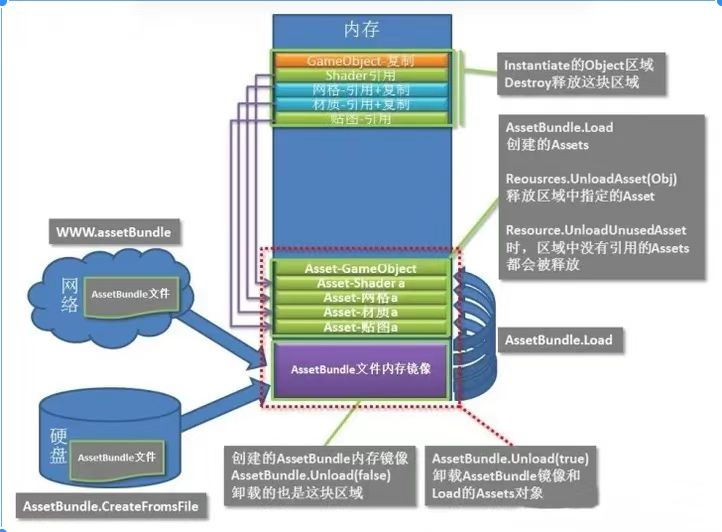

### <span style="color:#FFB266;">PersistentDataPath 和StreamingAssetsPath </span>

为什么不能把下载的资源放到StreamingAssets。

因为在打包的包体实际运行的时候，StreamingAssets是只读权限的，如果热更，只能往PersistentDataPath 里下载。

> 成熟的资源管理框架（如 Addressables 或自研框架）通常都会采用 **“先查沙盒，再查包内”** 的逻辑：
>
> **LoadAsset 请求**：我要加载 `Weapon.ab`。
>
> **Step 1 检查沙盒 (PersistentDataPath)**：
>
> - 看看 `PersistentDataPath` 下有没有 `Weapon.ab`？
> - **如果有**：说明这是**热更新下来**的新资源，直接加载它（覆盖了包内的旧版）。
>
> **Step 2 检查包内 (StreamingAssetsPath)**：
>
> - 如果沙盒里没有，说明这个资源从未更新过。
> - 去 `StreamingAssetsPath` 加载随包发布的原始版本。


### 自动化打包


### shadervariants


## UGUI

### <span style="color:#FFB266;">UGUI类图</span>

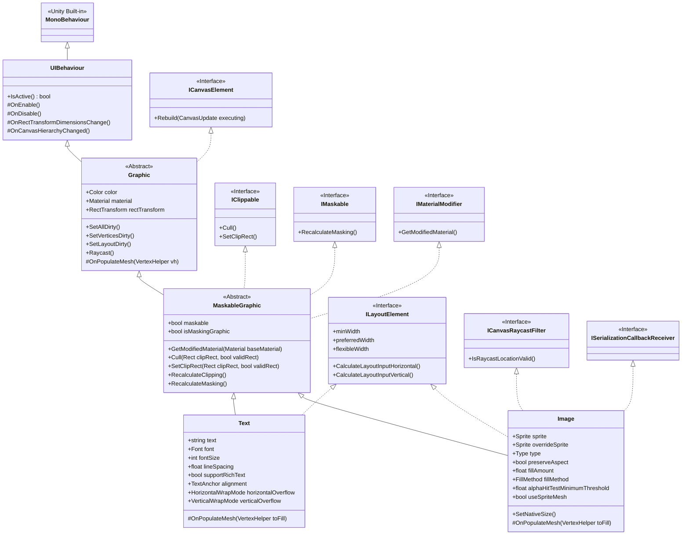
```mermaid
classDiagram
    %% 基础类
    class MonoBehaviour {
        <<Unity Built-in>>
    }

    class UIBehaviour {
        +IsActive() bool
        #OnEnable()
        #OnDisable()
        #OnRectTransformDimensionsChange()
        #OnCanvasHierarchyChanged()
    }

    class Graphic {
        <<Abstract>>
        +Color color
        +Material material
        +RectTransform rectTransform
        +SetAllDirty()
        +SetVerticesDirty()
        +SetLayoutDirty()
        +Raycast()
        #OnPopulateMesh(VertexHelper vh)
    }

    class MaskableGraphic {
        <<Abstract>>
        +bool maskable
        +bool isMaskingGraphic
        +GetModifiedMaterial(Material baseMaterial)
        +Cull(Rect clipRect, bool validRect)
        +SetClipRect(Rect clipRect, bool validRect)
        +RecalculateClipping()
        +RecalculateMasking()
    }

    %% 具体实现类
    class Image {
        +Sprite sprite
        +Sprite overrideSprite
        +Type type
        +bool preserveAspect
        +float fillAmount
        +FillMethod fillMethod
        +float alphaHitTestMinimumThreshold
        +bool useSpriteMesh
        +SetNativeSize()
        #OnPopulateMesh(VertexHelper toFill)
    }

    class Text {
        +string text
        +Font font
        +int fontSize
        +float lineSpacing
        +bool supportRichText
        +TextAnchor alignment
        +HorizontalWrapMode horizontalOverflow
        +VerticalWrapMode verticalOverflow
        #OnPopulateMesh(VertexHelper toFill)
    }

    %% 接口定义
    class ICanvasElement {
        <<Interface>>
        +Rebuild(CanvasUpdate executing)
    }

    class IClippable {
        <<Interface>>
        +Cull()
        +SetClipRect()
    }

    class IMaskable {
        <<Interface>>
        +RecalculateMasking()
    }

    class IMaterialModifier {
        <<Interface>>
        +GetModifiedMaterial()
    }
    
    class ILayoutElement {
        <<Interface>>
        +CalculateLayoutInputHorizontal()
        +CalculateLayoutInputVertical()
        +minWidth
        +preferredWidth
        +flexibleWidth
    }

    class ICanvasRaycastFilter {
        <<Interface>>
        +IsRaycastLocationValid()
    }
    
    class ISerializationCallbackReceiver {
        <<Interface>>
    }

    %% 继承关系
    MonoBehaviour <|-- UIBehaviour
    UIBehaviour <|-- Graphic
    Graphic <|-- MaskableGraphic
    MaskableGraphic <|-- Image
    MaskableGraphic <|-- Text

    %% 接口实现关系
    ICanvasElement <|.. Graphic
    
    IClippable <|.. MaskableGraphic
    IMaskable <|.. MaskableGraphic
    IMaterialModifier <|.. MaskableGraphic

    ISerializationCallbackReceiver <|.. Image
    ILayoutElement <|.. Image
    ICanvasRaycastFilter <|.. Image

    ILayoutElement <|.. Text
```


### <span style="color:#FFB266;">UGUI 绘制流程，包括如何材质和布局</span>

<span style="color:#FF6666;">Rebuild的流程是基于脏标记+延迟批量处理</span>

在运行中，逻辑执行阶段对于UI的材质，布局的修改都会被注册到两个队列里。等待逻辑后渲染阶段执行。

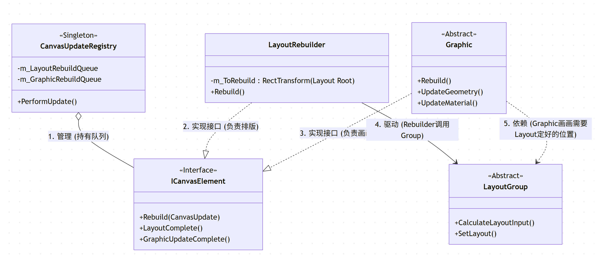

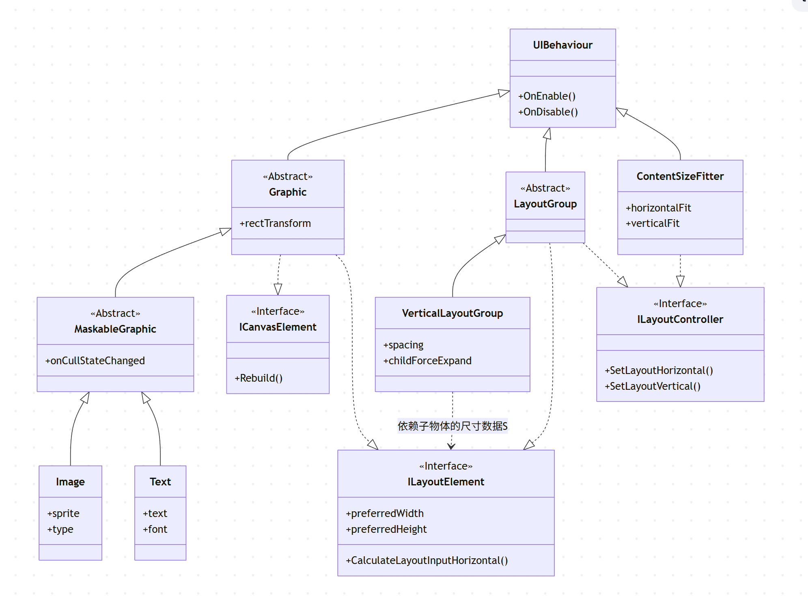


CanvasUpdateRegistry注册在Canvas.willRenderCanvases这个委托上，这个委托的触发是在所有的业务层的Update和LateUpdate之后，在渲染之前（因为实际上这里说的都是Rebuild，并没有真的渲染）

> ### 为什么在 Update 之后？
>
> 结合 `CanvasUpdateRegistry` 的设计，这种**“延迟更新（Deferred Update）”**机制有两个核心目的：
>
> - **去重（Batching / Deduplication）**： 如果在 `Update` 里改一次属性就 Rebuild 一次，如果你在一帧里改了 10 次颜色，就要重新生成 10 次 Mesh。 放在最后做，无论你改了多少次，Registry 只记录“这人脏了”，最后只在 `willRenderCanvases` 时 `Rebuild` 一次。
> - **数据一致性（Data Consistency）**： UI 经常需要跟随 3D 物体（比如血条）。3D 物体的移动通常在 `Update` 甚至 `LateUpdate`（动画后）才最终确定。 如果 UI 的 Rebuild 发生在 `Update` 之前，那么 UI 拿到的坐标就是“上一帧”的旧坐标，会导致血条和头顶位置对不上，产生视觉抖动。 放在 `LateUpdate` 之后，确保了 UI 拿到的是**本帧最终确认**的数据。
>
>  
>
> ### Unity 的一帧大致是这样跑的：
>
> 1. **Physics**: `FixedUpdate` 等物理计算。
> 2. **Input**: 处理输入事件（`EventSystem.Update` 就在这里驱动）。
> 3. **Game Logic (Update)**: 你的脚本逻辑执行，修改 `text.text = "新内容"`。
>    - 此时，Text 组件只是调用了 `SetVerticesDirty()`，把自己加到了 `CanvasUpdateRegistry` 的脏队列里，**并没有立即更新网格**。
> 4. **Game Logic (LateUpdate)**: 相机跟随、动画后处理等。
>    - 这里依然可能修改 UI（比如 3D 角色头顶的血条跟随逻辑通常写在 LateUpdate 里，以防止抖动）。
> 5. **Scene Rendering 开始**: 引擎准备开始渲染场景。
>    - **★★★ 这里触发 `Canvas.willRenderCanvases` ★★★**
>    - `CanvasUpdateRegistry.PerformUpdate()` 被调用。
>    - 执行 `LayoutRebuilder`（排版）和 `GraphicRebuild`（生成网格）。
> 6. **Gizmos / GUI**: 绘制调试线框等。
> 7. **End of Frame**: 帧结束。

CanvasUpdateRegistry是核心，它维护了两个队列：这两个队列都是<span style="color:#FFB266;">ICanvasElement</span>的Queue

> `m_LayoutRebuildQueue`：专门处理布局变化（比如 RectTransform 变大变小、LayoutGroup 排版）。
>
> `m_GraphicRebuildQueue`：专门处理画面变化（比如 Color 变色、Sprite 换图、Mesh 更新）

ICanvasElement提供了统一的Rebuild接口给Grahpic的重建和Layout的重建。

CanvasUpdate枚举类似一个状态机，定义了每次Rebuild的流程：从布局开始到Graphic，依次执行。之所以先布局，是因为布局的修改会影响到网格。

```c#
public enum CanvasUpdate
{
    Prelayout = 0,      // 布局更新之前
    Layout,             // 布局更新
    PostLayout,         // 布局更新之后
    PreRender,          // 渲染更新之前
    LatePreRender,     // 渲染更新的后期
    MaxUpdateValue      // 最大更新值，用于标记循环结束
}
```

#### LayoutRebuild

Layout的SetDirty比较复杂，当修改了一个布局元素（比如 `text.text = "..."`）并调用 `SetLayoutDirty` 时，它不会只把自己加入脏队列，而是会一直顺着父节点网上找，一直到把最顶层的负责控制排版的最顶层的节点（ 如果最顶层存在LayoutGroup，那就SetDirty最顶层的LayoutGroup，如果不存在，那就把自己加入。,注意这里，只有LayoutGroup这一脉才会传递控制 ）的物体打包成一个LayoutRebuilder设置为脏 ( LayoutRebuilder是一个包装类，使用最顶层的挂载控制的，继承自ICavansElement ) ，

```c#
// UGUI/UI/Core/Layout/LayoutRebuilder.cs
public static void MarkLayoutForRebuild(RectTransform rect)
{
    // ...
    // 寻找真正的布局根节点 (Layout Root)
    var layoutRoot = GetLayoutRoot(rect); 
    
    // 把这个根节点产生的 LayoutRebuilder 加入到 CanvasUpdateRegistry
    s_Rebuilders.Add(layoutRoot); 
}
```


当计算布局的时候，是先向下递归，然后计算，也就是从子节点开始计算一直计算到最顶层

当应用布局的时候是从最顶层开始，先应用布局，然后递归应用

计算布局的时候，是先计算宽度，然后再计算布局的高度，这是为了解决自动换行的问题：**文本的高度取决于宽度（宽度越窄，行数越多，高度越高）。所以必须先定宽，后算高**

```c#
// UGUI/UI/Core/Layout/LayoutRebuilder.cs
public void Rebuild(CanvasUpdate executing)
{
    if (executing == CanvasUpdate.Layout)
    {
        // 1. 算宽 (向上)
        PerformLayoutCalculation(m_ToRebuild, e => (e as ILayoutElement).CalculateLayoutInputHorizontal());
        
        // 2. 定宽 (向下)
        PerformLayoutControl(m_ToRebuild, e => (e as ILayoutController).SetLayoutHorizontal());
        
        // 3. 算高 (向上) - 此时宽度已定，Text 可以根据宽度算换行后的高度
        PerformLayoutCalculation(m_ToRebuild, e => (e as ILayoutElement).CalculateLayoutInputVertical());
        
        // 4. 定高 (向下)
        PerformLayoutControl(m_ToRebuild, e => (e as ILayoutController).SetLayoutVertical());
    }
}
```


要以两种视角看待Layout视角下的所有组件，<span style="color:#66FF66;">`ILayoutElement`（数据提供者）和`ILayoutController`（布局控制者）</span>

> #### 1. 基础图形派 (Graphic)
>
> - **基类**：`UIBehaviour` -> `Graphic`
> - **代表**：`Text`, `Image`, `RawImage`
> - **身份**：**只实现了 `ILayoutElement`**。
> - **逻辑**：它们是布局系统的**底层叶子节点**。
>   - `Text` 会根据字号和内容长度，计算出自己的 `PreferredWidth`。
>   - `Image` 会根据 Sprite 的原始分辨率，计算出自己的 `PreferredWidth`。
>
> #### 2. 布局容器派 (LayoutGroup)
>
> - **基类**：`UIBehaviour` -> `LayoutGroup` (抽象类)
> - **代表**：`HorizontalLayoutGroup`, `VerticalLayoutGroup`, `GridLayoutGroup`
> - **身份**：**既是 `ILayoutElement`，又是 `ILayoutController`**（双重身份）。
> - **逻辑**：这是最复杂的点。
>   - **对内（作为 Controller）**：它控制**子物体**的大小和位置。
>   - **对外（作为 Element）**：它根据子物体的大小总和，算出**自己**想要多大，汇报给更上层的父节点。
>
> #### 3. 自身适配派 (ContentSizeFitter)
>
> - **基类**：`UIBehaviour` -> `ContentSizeFitter`
> - **身份**：**只实现了 `ILayoutController`**。
> - **逻辑**：它是一个特殊的控制者。
>   - 普通的 Controller（如 LayoutGroup）是控制**子物体**的。
>   - `ContentSizeFitter` 是控制**自己**（宿主物体）的。它去问同一个物体上的 `ILayoutElement`（比如 Text）：“你想要多大？”，然后把自己的 `RectTransform` 设为那么大。

<span style="color:#FF3333;">注意：</span>Graphic和LayoutGroup作为ILayoutElement的区别在于，LayoutGroup会统计子物体的大小并且会计算自己的大小。而Graphic只会计算自己的大小，不统计子物体

LayoutGroup和ContentSizeFitter作为ILayoutController的区别在于，LayoutGroup只会控制子物体的大小，而不会控制自己的大小。ContentSizeFitter只会控制自己的大小而不会控制子物体的大小


##### 为什么ContentSizeFitter一般都要配合LayoutGroup 

就是因为ILayoutElement和ILayoutController需要配合。

> #### 场景模拟：Text 内容变多了
>
> 假设你在代码里执行了 `text.text = "一大段新文字..."`。
>
> #### 步骤 1：向上汇报 (Calculate Layout Input)
>
> **LayoutRebuilder** 开始从下往上收集数据（`ILayoutElement` 发挥作用）：
>
> 1. **子物体 (Text)**：
>    - 计算出自己的 `PreferredHeight` 变成了 200。
>    - 它告诉父物体：“我想要 200 高”。
> 2. **父物体 (VerticalLayoutGroup)**：
>    - 它是 `ILayoutElement`。它遍历所有子物体，发现子物体 Text 想要 200 高。
>    - 加上 Padding（假设 10），它算出自己至少需要 210 高。
>    - 它准备好数据：“我想要 210 高”。
>
> #### 步骤 2：向下控制 (Set Layout)
>
> **LayoutRebuilder** 开始从上往下下达命令（`ILayoutController` 发挥作用）：
>
> 1. **父物体 (ContentSizeFitter)**：
>    - 它是 `ILayoutController`。它问自己身上的 `ILayoutElement`（也就是 VerticalLayoutGroup）：“你想要多高？”
>    - Group 回答：“210”。
>    - Fitter **强行修改** 父物体的 `RectTransform.height = 210`。
> 2. **父物体 (VerticalLayoutGroup)**：
>    - 它是 `ILayoutController`。现在它自己已经变大了（被 Fitter 撑大了）。
>    - 它开始安排子物体：“Text，你给我站在 y=-10 的位置，高度设为 200”。
>    - 它 **强行修改** 子物体的 `RectTransform`。

如果只使用了ContentSizeFitter

> 我们可以把 `ContentSizeFitter` 比作一个**裁缝**，但他自己没有尺子，必须问别人尺寸。
>
> #### 情况 A：只有 ContentSizeFitter (你现在的假设)
>
> - **场景**：空物体，只挂了 Fitter。或者下面有子物体，但当前物体上没有 LayoutGroup。
> - **对话**：
>   - 裁缝（Fitter）：谁能告诉我该做多大的衣服？
>   - 物体上其他组件：(一片死寂，没人实现 `ILayoutElement`)
>   - 裁缝：没人说话？那就是 0 咯。
> - **结果**：宽高变成 0。**（注意：它不会去递归看子物体，它只看自己身上的组件）**
>
> #### 情况 B：ContentSizeFitter + Text
>
> - **场景**：挂在文字上。
> - **对话**：
>   - 裁缝（Fitter）：谁能告诉我该做多大的衣服？
>   - **Text (ILayoutElement)**：我有 5 个字，字号 20，我想要 100 宽。
>   - 裁缝：好，衣服做 100 宽。
> - **结果**：RectTransform 自动适应文字长度。
>
> #### 情况 C：ContentSizeFitter + LayoutGroup (最常见)
>
> - **场景**：挂在父容器上，下面有一堆子按钮。
> - **对话**：
>   - 裁缝（Fitter）：谁能告诉我该做多大的衣服？
>   - **LayoutGroup (ILayoutElement)**：稍等，我算一下我那帮孩子们占多大...（统计所有子物体）...算好了，我这帮孩子总共需要 500 宽。
>   - 裁缝：好，衣服做 500 宽。
> - **结果**：父容器自动适应所有子物体的总大小。


#### GraphicRebuild

<span style="color:#99FF99;">材质和网格的更新都类似，都是先获取基础的网格/材质（这部分一般都是可以重载的，比如Image的网格），然后交给各种修饰器，比如Shadow，OutLine就是一种修饰器，它会修改网格/材质的。然后提交给底层</span>

`Graphic.UpdateGeometry()` -> `DoMeshGeneration()`

下面以Mesh的绘制为例子，这里就讲一下，Mesh是如何作用的，s_VertexHelper是一个辅助类，用于填装顶点。

顶点填入之后，会通过 s_VertexHelper.FillMesh(workerMesh);构造一个Mesh，然后通过canvasRenderer.SetMesh(workerMesh);提交给Canvas，再往下就是C++的事情了

```c#
private void DoMeshGeneration()
{
    if (rectTransform != null && rectTransform.rect.width >= 0 && rectTransform.rect.height >= 0)
        OnPopulateMesh(s_VertexHelper); //生成基础网格,这是子类（Image, Text）重写逻辑的地方。
    								//例如 Image 会在这里往 helper 里塞入 4 个顶点（组成一个 Quad），并设置好坐标、颜色和 UV
    else
        s_VertexHelper.Clear(); // clear the vertex helper so invalid graphics dont draw.

    var components = ListPool<Component>.Get();
    GetComponents(typeof(IMeshModifier), components);

    for (var i = 0; i < components.Count; i++)
        ((IMeshModifier)components[i]).ModifyMesh(s_VertexHelper); //应用网格效果 (IMeshModifier)： 它会获取物体上挂载的所有 IMeshModifier 接口组件（如 Shadow, Outline）

    ListPool<Component>.Release(components);

    s_VertexHelper.FillMesh(workerMesh); //填入网格
    canvasRenderer.SetMesh(workerMesh); //提交底层
}
```

`Graphic.UpdateMaterial()`

材质的更新和上面类似，都是先准备基础材质，然后走修饰器（比如Mask这些）修饰完了之后把材质提交给底层


### <span style="color:#FFB266;">UGUI事件系统</span>

先思考一个问题，如何做一个事件系统

```c++
//这是一种模式
while(true){
    if(按下按钮。发生事件){
        发射射线
        if(射线命中){
            callback
        }
    }
}
//这是UGUI的模式
while(true){
    分别搜集Cusor的位置，操作（是否按下，是否拖拽）。发射射线
    处理事件回调
    if(按下 && 射线命中){
        callback()
    }
}
```


事件系统的入口是EventSystem

EventSystem的主循环如下：

```c#
class EventSystem{
	public void Update(){
    	//先更新所有模块的状态（无论是否激活）
    	TickModules();
        // 如果没有输入模块，EventSystem 基本什么都不做
    	if (m_CurrentInputModule != null)
        	m_CurrentInputModule.Process(); // <--- 整个输入逻辑的入口，驱动当前的输入模块
	}
}

// 文件: UGUI/EventSystem/EventSystem.cs
private void TickModules()
{
    var systemInputModulesCount = m_SystemInputModules.Count;
    for (var i = 0; i < systemInputModulesCount; i++)
    {
        if (m_SystemInputModules[i] != null)
            m_SystemInputModules[i].UpdateModule(); // <--- 关键调用
    }
}

// 文件: UGUI/EventSystem/InputModules/StandaloneInputModule.cs
public override void UpdateModule()
{
    // [任务一] 焦点丢失处理
    // 如果程序失去焦点（比如切到了后台），并且配置了“忽略后台事件”
    if (!eventSystem.isFocused && ShouldIgnoreEventsOnNoFocus())
    {
        // 强制释放所有正在拖拽的物体 (ReleasePointerDrags)
        // 這是为了防止你按着鼠标切出游戏，松开鼠标后再切回来，游戏还以为你按着鼠标（粘滞键问题）。
        ReleasePointerDrags();
        return;
    }

    // [任务二] 更新鼠标位置缓存
    // 这里记录了“上一帧”和“这一帧”的鼠标位置。
    // 这对于后续计算 delta（移动距离）至关重要。
    m_LastMousePosition = m_MousePosition;
    m_MousePosition = input.mousePosition;
}

```

EventSystem捕捉用户输入的一些事件是基于InputModule的，一般默认的都是StandaloneInputModule

TickModules是先更新所有模块的状态，对于StandaloneInputModule来说，它主要做了两件事：**焦点管理** 和 **鼠标位置缓存**

#### Process

`Process` 方法定义了处理输入的**优先级和顺序**。在 `StandaloneInputModule` 中，它的逻辑非常清晰

```c#
// 文件: UGUI/EventSystem/InputModules/StandaloneInputModule.cs
public override void Process()
{
    // 1. 检查是否拥有焦点。如果没有焦点且设置了忽略，则直接返回，不处理任何事件。
    if (!eventSystem.isFocused && ShouldIgnoreEventsOnNoFocus())
        return;

    // 2. 发送 UpdateSelected 事件。
    // 这允许当前选中的物体（比如一个高亮的按钮）每一帧都收到通知，执行自己的逻辑。
    bool usedEvent = SendUpdateEventToSelectedObject();

    // 3. 处理触摸和鼠标事件。
    // 注意：这里有一个重要的优先级判断。
    // 如果 ProcessTouchEvents() 返回 true（意味着有触摸输入），就不再处理鼠标。
    // 这是为了避免在触摸设备上，触摸模拟鼠标导致事件被处理两次。
    if (!ProcessTouchEvents() && input.mousePresent)
        ProcessMouseEvent();

    // 4. 处理导航事件（键盘/手柄的方向键、确认键）。
    // 只有在 EventSystem 允许发送导航事件时才执行。
    if (eventSystem.sendNavigationEvents)
    {
        // 如果前面的 UpdateSelected 没有消耗掉事件，尝试移动焦点（上下左右）
        if (!usedEvent)
            usedEvent |= SendMoveEventToSelectedObject();

        // 处理 Submit（回车/确认）和 Cancel（ESC/取消）按钮
        if (!usedEvent)
            SendSubmitEventToSelectedObject();
    }
}
```

它定义了Touch的优先级高于Mouse，ProcessMouseEvent可以说是最核心的调用了，进去看：
```c#
// 文件: UGUI/EventSystem/InputModules/StandaloneInputModule.cs
protected void ProcessMouseEvent(int id)
{
    // 1. 获取鼠标数据（位置、射线检测结果等）
    // GetMousePointerEventData 内部会调用 eventSystem.RaycastAll()
    var mouseData = GetMousePointerEventData(id);
    var leftButtonData = mouseData.GetButtonState(PointerEventData.InputButton.Left).eventData;

    // ...

    // 2. 处理左键 (Left Button)
    // 这是最完整的处理：按下/抬起(ProcessMousePress)、移动(ProcessMove)、拖拽(ProcessDrag)
    ProcessMousePress(leftButtonData);
    ProcessMove(leftButtonData.buttonData);
    ProcessDrag(leftButtonData.buttonData);

    // 3. 处理右键和中键
    // 注意：右键和中键也支持拖拽！
    ProcessMousePress(mouseData.GetButtonState(PointerEventData.InputButton.Right).eventData);
    ProcessDrag(mouseData.GetButtonState(PointerEventData.InputButton.Right).eventData.buttonData);
    ProcessMousePress(mouseData.GetButtonState(PointerEventData.InputButton.Middle).eventData);
    ProcessDrag(mouseData.GetButtonState(PointerEventData.InputButton.Middle).eventData.buttonData);

    // 4. 处理滚轮 (Scroll)
    if (!Mathf.Approximately(leftButtonData.buttonData.scrollDelta.sqrMagnitude, 0.0f))
    {
        var scrollHandler = ExecuteEvents.GetEventHandler<IScrollHandler>(leftButtonData.buttonData.pointerCurrentRaycast.gameObject);
        ExecuteEvents.ExecuteHierarchy(scrollHandler, leftButtonData.buttonData, ExecuteEvents.scrollHandler);
    }
}
```

<span style="color:#99FF99;">这里其实就可以看出一个事件系统的处理逻辑了：物理上操作的记录和最后的处理触发是分离的，前面先记录这一帧的行为，然后操作的时候是遍历所有操作，看是否这一帧有这个操作，如果有就继续处理</span>

#### UGUI射线检测

总结来说，射线检测是这样的过程：
EventManager驱动，使用当前的Cusor的位置，和所有的Canvas进行碰撞检测。

每个Canvas挂载GrahicRaycaster，GrahicRaycaster搜集当前Canvas下的所有Graphic组件。

第一步<span style="color:#FF8000;">粗筛</span>，使用rectransform的四个点组成的包围盒进行粗筛。

第二步<span style="color:#FFB266;">细筛</span>，使用各个组件实现的ICanvasRaycastFilter.IsRaycastLocationValid方法进行细筛

然后背面剔除 (Reversed Graphics)和遮挡剔除

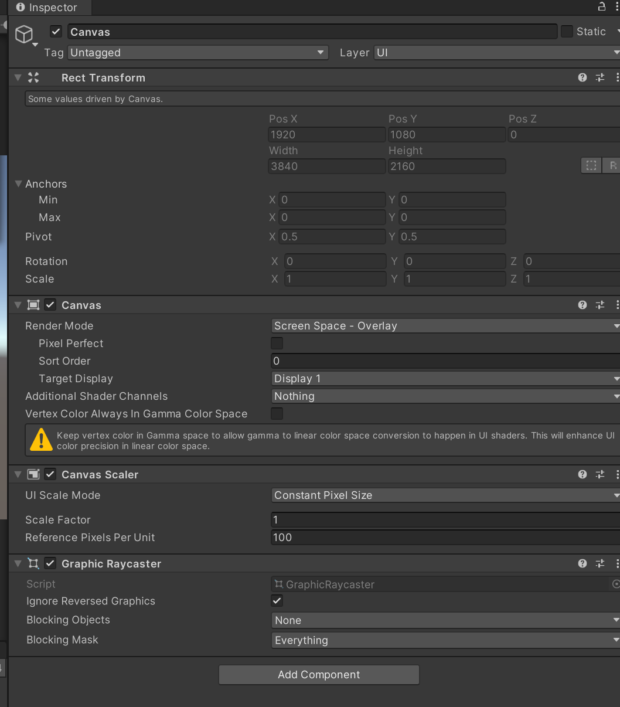

<span style="color:#FF99FF;">[驱动]</span>先看这张图，Canvas创建的时候，会有一个GraphicRaycaster。<span style="color:#99FF99;">结合EventManager的RacstAll方法不难想到，挂载了GraphicRaycaster的组件，会把自身注册到RaycasterManager当中，而驱动则是由调用处也就是EventManager驱动的</span>

```c#
        public void RaycastAll(PointerEventData eventData, List<RaycastResult> raycastResults)
        {
            raycastResults.Clear();
            var modules = RaycasterManager.GetRaycasters();
            var modulesCount = modules.Count;
            for (int i = 0; i < modulesCount; ++i)
            {
                var module = modules[i];
                if (module == null || !module.IsActive())
                    continue;

                module.Raycast(eventData, raycastResults);
            }

            raycastResults.Sort(s_RaycastComparer); 
        }

//注：注册Raycaster的地方在它的基类：BaseRayCaster
        protected override void OnEnable()
        {
            base.OnEnable();
            RaycasterManager.AddRaycaster(this);
        }

```

<span style="color:#FF99FF;"> [计算]</span>计算是在GraphicRaycaster里进行的，注意这个过程：EventManager从RaycasterManager中获取所有的GraphicRaycaster对象（这个GraphicRaycaster对象是和Canvas一起出现的），然后EventManager用当前的Cusor的状态（点击，位置，是否长按是否拖拽等），去检测每个Canvas下的GraphicRaycaster是否碰撞到了。

这一节主要说的是GraphicRaycaster的Raycast方法：<span style="color:#FF6666;">GraphicRegistry</span>是一个单例类，它管理了整个游戏中，所有的Canvs和canvs下存在的所有的UI。（Graphic是所有UI组件的父类，它负责把自己注册到GraphicRegistry里，当一个 UI 组件被启用时 (`OnEnable`)，它会自动调用 `GraphicRegistry.RegisterGraphicForCanvas`，把自己注册进去）

```c#
public override void Raycast(PointerEventData eventData, List<RaycastResult> resultAppendList)
        {
            if (canvas == null)
                return;

            List<Graphic> canvasGraphics = GraphicRegistry.GetRaycastableGraphicsForCanvas(canvas); //获取当前canvs下的所有的Graphic，用来做射线检测
            if (canvasGraphics == null || canvasGraphics.Count == 0)
                return;
```

获取所有候选的UI组件之后，会先对传入的Cusor的位置做一个视口变换，如果超过了0-1的范围，说明直接就在屏幕之外了，那就直接丢弃，反之进入下面：
```c#
            // Convert to view space
            Vector2 pos;
            if (currentEventCamera == null)
            {
                // Multiple display support only when not the main display. For display 0 the reported
                // resolution is always the desktops resolution since its part of the display API,
                // so we use the standard none multiple display method. (case 741751)
                float w = Screen.width;
                float h = Screen.height;
                if (displayIndex > 0 && displayIndex < Display.displays.Length)
                {
#if UNITY_ANDROID
                    // Changed for UITK to be coherent for Android which passes display relative rendering coordinates
                    w = Display.displays[displayIndex].renderingWidth;
                    h = Display.displays[displayIndex].renderingHeight;
#else
                    w = Display.displays[displayIndex].systemWidth;
                    h = Display.displays[displayIndex].systemHeight;
#endif
                }
                pos = new Vector2(eventPosition.x / w, eventPosition.y / h);
            }
            else
                pos = currentEventCamera.ScreenToViewportPoint(eventPosition);

            // If it's outside the camera's viewport, do nothing
            if (pos.x < 0f || pos.x > 1f || pos.y < 0f || pos.y > 1f)
                return;
```

<span style="color:#FFCCFF;">[遮挡剔除] </span>接下来，先做遮挡的剔除，在GraphicRacaster中可以设置是否遮挡，比如有2D的遮挡3D的遮挡。这些设置只会在不是设置UI一直保持在最顶端的时候才会起作用。这部分就是针对这部分做了一个提前处理。hitDistance记录了最近的遮挡物，距离Camera的距离，之后对UI做检测的时候，如果距离大于这个距离那么就相当于是被遮挡住了

```c#
            float hitDistance = float.MaxValue;

            Ray ray = new Ray();

            if (currentEventCamera != null)
                ray = currentEventCamera.ScreenPointToRay(eventPosition);

            if (canvas.renderMode != RenderMode.ScreenSpaceOverlay && blockingObjects != BlockingObjects.None) //只有UI可能被遮挡的模式，以及设置了遮挡选项之后，这部分才起作用
            {
                float distanceToClipPlane = 100.0f;

                if (currentEventCamera != null)
                {
                    float projectionDirection = ray.direction.z;
                    distanceToClipPlane = Mathf.Approximately(0.0f, projectionDirection)
                        ? Mathf.Infinity
                        : Mathf.Abs((currentEventCamera.farClipPlane - currentEventCamera.nearClipPlane) / projectionDirection);
                }
#if PACKAGE_PHYSICS
                if (blockingObjects == BlockingObjects.ThreeD || blockingObjects == BlockingObjects.All)
                {
                    if (ReflectionMethodsCache.Singleton.raycast3D != null)
                    {
                        RaycastHit hit;
                        if (ReflectionMethodsCache.Singleton.raycast3D(ray, out hit, distanceToClipPlane, (int)m_BlockingMask))
                        {
                            hitDistance = hit.distance;
                        }
                    }
                }
#endif
#if PACKAGE_PHYSICS2D
                if (blockingObjects == BlockingObjects.TwoD || blockingObjects == BlockingObjects.All)
                {
                    if (ReflectionMethodsCache.Singleton.raycast2D != null)
                    {
                        var hits = ReflectionMethodsCache.Singleton.getRayIntersectionAll(ray, distanceToClipPlane, (int)m_BlockingMask);
                        if (hits.Length > 0)
                            hitDistance = hits[0].distance;
                    }
                }
#endif
            }
```

[UI的Racast]终于到了UI组件的racast了
代码调用了一个静态的辅助方法 `Raycast(...)` 来遍历所有 Graphic 并筛选。

**初步筛选**：遍历所有 Graphic，跳过以下情况：raycastTarget` 为 false。`canvasRenderer.cull` 为 true（被裁剪剔除）。`depth` 为 -1（无效深度）

> Grahpic的Depth，反映的是UGUI 内部计算出来的一个**绝对层级索引**。它反映了该 UI 元素在当前 Canvas 下的渲染先后顺序。它主要基于 **Hierarchy 顺序**。（Hierarchy 树状结构顺序）
>
> - 在面板上排在上面的元素，`depth` 较小（先画）。
> - 在面板上排在下面的元素，`depth` 较大（后画，盖在上面）

```c#
 private static void Raycast(Canvas canvas, Camera eventCamera, Vector2 pointerPosition, IList<Graphic> foundGraphics, List<Graphic> results)
        {
            // Necessary for the event system
            int totalCount = foundGraphics.Count;
            for (int i = 0; i < totalCount; ++i)
            {
                Graphic graphic = foundGraphics[i];

                // -1 means it hasn't been processed by the canvas, which means it isn't actually drawn
                if (!graphic.raycastTarget || graphic.canvasRenderer.cull || graphic.depth == -1) //初步筛选
                    continue;

                if (!RectTransformUtility.RectangleContainsScreenPoint(graphic.rectTransform, pointerPosition, eventCamera, graphic.raycastPadding)) //矩形检测
                    continue;

                if (eventCamera != null && eventCamera.WorldToScreenPoint(graphic.rectTransform.position).z > eventCamera.farClipPlane)
                    continue;

                if (graphic.Raycast(pointerPosition, eventCamera)) //精准检测
                {
                    s_SortedGraphics.Add(graphic);
                }
            }

            s_SortedGraphics.Sort((g1, g2) => g2.depth.CompareTo(g1.depth));
            totalCount = s_SortedGraphics.Count;
            for (int i = 0; i < totalCount; ++i)
                results.Add(s_SortedGraphics[i]);

            s_SortedGraphics.Clear();
        }
```

初筛过了之后，会调用矩形检测，检测是否在UI元素的矩形范围内（图中蓝色点的组成的矩形，实际上就是**`RectTransform`** ）（当前也有RaycastPadding的问题，范围会小一点）（本质上相当于是包围盒）

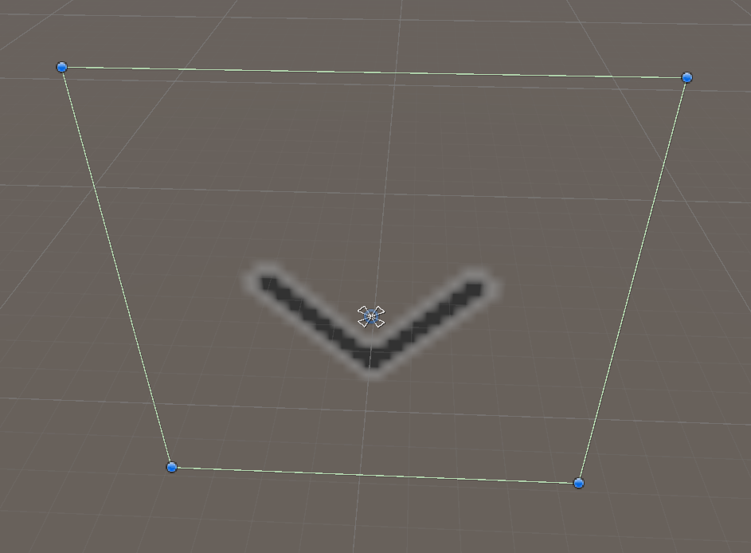

**精准检测 (Graphic.Raycast)**：如果通过矩形检测，还会调用 `graphic.Raycast(pointerPosition, eventCamera)` 进行最终确认。精准检测是不同组件各自实现的ICanvasRaycastFilter的IsRaycastLocationValid方法，用来解决一些精确问题。

比如上面这个例子里面，Image的Rctransform的范围明显大于了对勾的范围。为了实现只有点击对勾的像素的位置才触发点击事件，Image组件实现了IsRaycastLocationValid：它会根据Alpha 做过滤。（<span style="color:#66FF66;">其实就是细筛，结合上面recttransform作为包围盒再理解下</span>）

```c#
// UGUI/UI/Core/Image.cs
public virtual bool IsRaycastLocationValid(Vector2 screenPoint, Camera eventCamera)
{
    if (alphaHitTestMinimumThreshold <= 0)
        return true; // 如果没开启精准检测，默认矩形内都有效

    // ... 省略坐标转换代码 ...

    // 读取纹理上对应像素的透明度
    // return activeSprite.texture.GetPixelBilinear(x, y).a >= alphaHitTestMinimumThreshold;
}
```

完事之后，现在粗筛细筛得到了候选的UI列表了，然后就过一下背面剔除和遮挡剔除

> **背面剔除 (Reversed Graphics)**：如果开启了 `ignoreReversedGraphics`，会计算 UI 的朝向。 UI 背对着相机（Vector3.Dot 结果显示方向相反），则该 UI 被忽略。
>
> **遮挡剔除**：计算 UI 元素到相机的距离。
>
> - 如果 `distance >= hitDistance`（即 UI 比刚才检测到的物理物体更远），说明该 UI 被 3D 物体挡住了，跳过该 UI。

#### <span style="color:#FFB266;">UGUI事件传递</span>

<span style="color:#FF6666;">UI 事件的核心是冒泡机制 + 泛型委托回调（策略模式）</span>

> 比如在一个UI当中，Button的子UI是Text，我们点击了Text，但是最后是父节点Button处理的Click回调。
>
> 这就是所谓的冒泡机制

总结一下就是：UI事件首先有一个Handler类型，把这个Handler包装成一个functor（为了解耦），然后向自己和父节点往上冒泡执行，知道找到最近的实现了Handler的一层。在这一层当中，获取所有实现了这个Handler类型的Component，然后依次使用functor调用handler（而不是直接调用）

下面带着这个问题往下看。我们以按键点击为例子：
```c#
protected void ProcessMousePress(MouseButtonEventData data)
        {
            var pointerEvent = data.buttonData;
            var currentOverGo = pointerEvent.pointerCurrentRaycast.gameObject; //这个是射线检测的结果中，最上层的物体

            // PointerDown notification
            if (data.PressedThisFrame())//如果按下
            {
                //..
                var newPressed = ExecuteEvents.ExecuteHierarchy(currentOverGo, pointerEvent, ExecuteEvents.pointerDownHandler); //核心在这里
                var newClick = ExecuteEvents.GetEventHandler<IPointerClickHandler>(currentOverGo);
```

可以看到，如果按下了按钮，会调用ExecuteEvents.ExecuteHierarchy方法，并且把射线检测的结果中最靠上的物体的GameObject传入

```c#
public static GameObject ExecuteHierarchy<T>(GameObject root, BaseEventData eventData, EventFunction<T> callbackFunction) where T : IEventSystemHandler
{
    		// 拉名单 (GetEventChain)
   		 	// 这一步会从 root 开始，一直往上找父节点 (transform.parent)，
    		// 把沿途所有的物体都装进 s_InternalTransformList 这个静态列表里。
            GetEventChain(root, s_InternalTransformList); 

            var internalTransformListCount = s_InternalTransformList.Count;
    		
    		// 挨个问 (For Loop)
    		// 列表里的顺序通常是：[你自己, 爸爸, 爷爷, ... 根节点]
            for (var i = 0; i < internalTransformListCount; i++)
            {
                var transform = s_InternalTransformList[i];
                 // 尝试执行 (Execute)
        		// 这就是我之前说的 Execute<T> 方法。
        		// 它会检查 transform.gameObject 上有没有挂载实现了接口 T (比如 IPointerClickHandler) 的组件。
        		// ★ 如果有：它会调用 callbackFunction (你的 OnPointerClick)，并返回 true。
        		// ★ 如果没有：它什么都不做，返回 false。
                if (Execute(transform.gameObject, eventData, callbackFunction))
                     // 拦截 (Return)
            		// 一旦有任何一个层级处理了这个事件，循环立刻终止，返回当前物体。
            		// 这就是为什么点击子物体，只有子物体响应，而不会穿透给爸爸（除非子物体没处理）
                    return transform.gameObject;
            }
            return null;
}
```

> 它依然是**冒泡 (Bubble Up)**。
>
> **实现上**：它采用了 **“构建路径链 (GetEventChain) -> 顺序遍历 (Iterate) -> 首次命中即停止 (Early Exit)”** 的策略。

重点是`Execute(transform.gameObject, eventData, callbackFunction)`，看看这部分的代码：
```c#
public static bool Execute<T>(GameObject target, BaseEventData eventData, EventFunction<T> functor) where T : IEventSystemHandler
        {
            var internalHandlers = ListPool<IEventSystemHandler>.Get();
            GetEventList<T>(target, internalHandlers); //在下面有代码
            //  if (s_InternalHandlers.Count > 0)
            //      Debug.Log("Executinng " + typeof (T) + " on " + target);

            var internalHandlersCount = internalHandlers.Count;
            for (var i = 0; i < internalHandlersCount; i++)
            {
                T arg;
                try
                {
                    arg = (T)internalHandlers[i];
                }
                catch (Exception e)
                {
                    var temp = internalHandlers[i];
                    Debug.LogException(new Exception(string.Format("Type {0} expected {1} received.", typeof(T).Name, temp.GetType().Name), e));
                    continue;
                }

                try
                {
                    functor(arg, eventData);
                }
                catch (Exception e)
                {
                    Debug.LogException(e);
                }
            }

            var handlerCount = internalHandlers.Count;
            ListPool<IEventSystemHandler>.Release(internalHandlers);
            return handlerCount > 0;
        }

        /// <summary>
        /// Get the specified object's event event.
        /// </summary>
private static void GetEventList<T>(GameObject go, IList<IEventSystemHandler> results) where T : IEventSystemHandler
        {
            // Debug.LogWarning("GetEventList<" + typeof(T).Name + ">");
            if (results == null)
                throw new ArgumentException("Results array is null", "results");

            if (go == null || !go.activeInHierarchy)
                return;

            var components = ListPool<Component>.Get();
            go.GetComponents(components);

            var componentsCount = components.Count;
            for (var i = 0; i < componentsCount; i++)
            {
                if (!ShouldSendToComponent<T>(components[i]))
                    continue;

                // Debug.Log(string.Format("{2} found! On {0}.{1}", go, s_GetComponentsScratch[i].GetType(), typeof(T)));
                results.Add(components[i] as IEventSystemHandler);
            }
            ListPool<Component>.Release(components);
            // Debug.LogWarning("end GetEventList<" + typeof(T).Name + ">");
        }
```

`Execute` 的内部逻辑非常干净，主要分为四个步骤：**准备容器 -> 获取组件 -> 挨个执行 -> 清理现场**

<span style="color:#FF99FF;">[获取组件] </span>获取组件依靠的是GetEventList方法，这是一个泛型方法，目的是获取target上所有实现了类型T的组件

```c#
// UGUI/EventSystem/ExecuteEvents.cs
private static void GetEventList<T>(GameObject target, IList<IEventSystemHandler> results) where T : IEventSystemHandler
{
    // 1. 健壮性检查
    // 如果目标物体为空，或者列表容器为空，什么都不做直接返回
    if (results == null)
        return;
    // 2. 核心调用：GetComponents<T>
    // 这是 Unity 的原生 API。它会去 target 这个物体上，
    // 找到所有继承或实现了 T 类型的组件，并把它们填充到 results 列表里。
    target.GetComponents<T>(results);
}
```

<span style="color:#FF99CC;">[挨个执行] </span>如果要弄懂挨个执行部分到底是如何从IPointerDownHandler到具体的回调，就要看ExecuteEvents里对于这部分委托的定义了

```c#
for (var i = 0; i < internalHandlersCount; i++)
{
    T arg = (T)internalHandlers[i];
    functor(arg, eventData); //EventFunction<T>
}
```

```c#
// UGUI/EventSystem/ExecuteEvents.cs
public delegate void EventFunction<T1>(T1 handler, BaseEventData eventData);
// 1. 写好具体逻辑：如果拿到一个 handler，怎么让它响应点击？
// 答：调用它的 OnPointerClick 方法
private static void Execute(IPointerClickHandler handler, BaseEventData eventData)
{
    // 这里的 ValidateEventData 只是为了把 BaseEventData 强转成 PointerEventData
    handler.OnPointerClick(ValidateEventData<PointerEventData>(eventData));
}

// 2. 把上面这个逻辑封装成一张“静态指令卡” (functor)
// 以后谁拿着这张卡，就等于拥有了“调用 OnPointerClick”的能力
public static readonly EventFunction<IPointerClickHandler> pointerClickHandler = Execute;
```

ExecuteEvents定义了一个基础的委托模板EventFunction<T1>，要求传入一个handler，以及handler处理需要的参数eventData

对于各种的回调行为，比如PressDown，Click，Up等等，都有具体的实现，区分他们是基于不同的T的类型。这个T的类型是从上面`ExecuteHierarchy<T>(GameObject root, BaseEventData eventData, EventFunction<T> callbackFunction)`的时候，推导来的，比如传入的callbackFunction: ExecuteEvents.pointerDownHandler，其实就是一个委托：EventFunction<IPointerClickHandler>

这种泛型委托的设计提供了一种解耦，对于UI来说，有很多的事件类型，Click，Drag等等，这些事件回调会对应不同的接口和他们的handler。如果不用EventFunction<IPointerClickHandler>，就会有大量的重复代码：
```c#
// 这里的逻辑高度重复！
public void SendClick(GameObject target, PointerEventData data) {
    // 1. 冒泡逻辑 (重复代码)
    while (target != null) {
        // 2. 获取组件 (重复代码)
        var handlers = target.GetComponents<IPointerClickHandler>();
        if (handlers.Length > 0) {
            foreach (var h in handlers) {
                try {
                    // 3. 具体调用 (只有这一行是独特的)
                    h.OnPointerClick(data);  //分离点
                } catch (Exception e) { Debug.LogException(e); }
            }
            return; // 找到了就返回
        }
        target = target.parent;
    }
}

public void SendDrag(GameObject target, PointerEventData data) {
    // 1. 冒泡逻辑 (重复代码 Again!)
    while (target != null) {
        // 2. 获取组件 (重复代码 Again!)
        var handlers = target.GetComponents<IDragHandler>(); // 类型变了
        if (handlers.Length > 0) {
            foreach (var h in handlers) {
                try {
                    // 3. 具体调用 (只有这一行是独特的)
                    h.OnDrag(data); //分离点
                } catch (Exception e) { Debug.LogException(e); }
            }
            return;
        }
        target = target.parent;
    }
}
```

其实除了调用的时候调用的handler不同，其他都一样。因此ExecuteEvents相当于是使用泛型的方法把这部分复杂的逻辑抽象在ExecuteEvents里。业务层只需要传入使用哪个EventFunction即可， 这样的EventFunction<T>解耦了事件回调的处理和业务层的逻辑，业务层不是直接调用handler，而是借助委托调用handler

> <span style="color:#99FF99;">**InputModule** 不直接调用组件方法，而是将 **“方法调用行为”** 封装为一个 **泛型委托 (Functor)**，并将其作为参数传递给 **通用遍历器 (ExecuteHierarchy)**。遍历器负责在对象图（Object Graph）中查找符合 **泛型约束 (T)** 的组件，并使用该委托对组件实例进行操作</span>


### 例子：ScrollView的原理


### <span style="color:#FFB266;">Mask和RectMask的原理</span>

Mask 的定义就是：“只有重叠在 Mask 有效区域内的子物体像素才会被渲染，超出范围的统统切掉”

Mask是一种Material的修饰器。它实现了IMaterialModifier的GetModifiedMaterial方法。回顾前面的GraphicRebuild流程，先收集原本的网格数据，然后应用修饰器

Mask就是用在这里的一种修饰器。作为修饰器，他修改了原本材质的设置，让GPU把自己写入模板缓冲区

同时，Mask自己其实只是做了写入模板缓冲区这一个操作，实现Mask效果还需要子物体Graphic（被遮罩的内容）的配合，子物体渲染的时候，回去查询模板缓冲区内的模板id是否符合Mask设置的id，否则会丢弃。这就是Image上的Maskable这个标志位的作用，用于开关是否服从（Check）模板缓冲区的规则

```c#
// UGUI/UI/Core/Mask.cs (简化版逻辑)

public class Mask : UIBehaviour, ICanvasRaycastFilter, IMaterialModifier
{
    public Material GetModifiedMaterial(Material baseMaterial)
    {
        // 如果 Mask 没启用，直接把原材质退回去，啥也不干
        if (!IsActive())
            return baseMaterial;

        // 核心逻辑：拿到原材质，克隆一份，把它的 Stencil 属性改掉
        var rootSortCanvas = MaskUtilities.FindRootSortOverrideCanvas(transform);
        var stencilDepth = MaskUtilities.GetStencilDepth(transform, rootSortCanvas);
        
        // StencilMaterial.Add 是 UGUI 内部的一个工厂方法
        // 它负责生成一个新的材质变体，设置好 Stencil 相关的 Shader 关键字
        Material newMaterial = StencilMaterial.Add(
            baseMaterial, 
            1,                        // Stencil ID (通常是 1)
            StencilOp.Replace,        // Operation: 替换 (写入)
            CompareFunction.Always,   // Compare: 总是通过 (因为要把 Mask 自己画出来)
            ColorWriteMask.All,       // 颜色写入: 全部允许
            255,                      // ReadMask
            255                       // WriteMask
        );

        return newMaterial;
    }
}

// 伪代码模拟 MaskableGraphic.cs 的逻辑
public virtual Material GetModifiedMaterial(Material baseMaterial)
{
    // 第一步：检查开关
    // 如果 Maskable 是 false，直接拿着原始材质走人，无视头顶上有没有 Mask
    if (!this.maskable)
    {
        return baseMaterial; 
    }

    // 第二步：如果开关打开了，才去向上找 Mask
    var rootMask = MaskUtilities.FindRootSortOverrideCanvas(transform);
    
    // 第三步：如果找到了 Mask，就修改材质，加入 Stencil Compare = Equal
    // 如果没找到，还是返回原材质
    // ...
}
```

看Image的Maskable按钮，注意看下面渲染

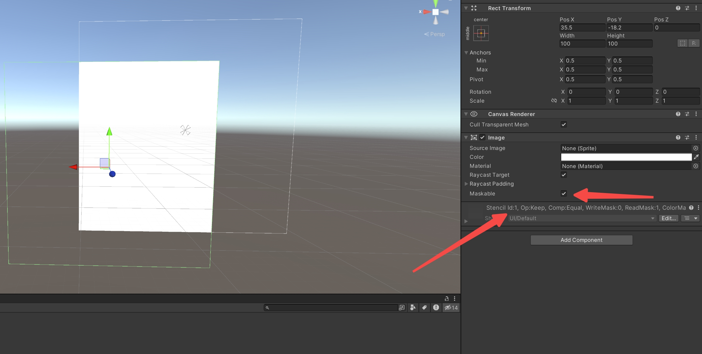

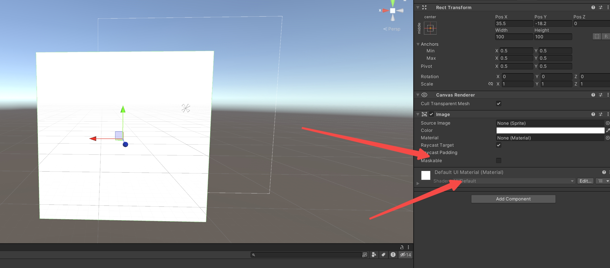

看FD也能看出来多了一次DC：（红色的是Mask）

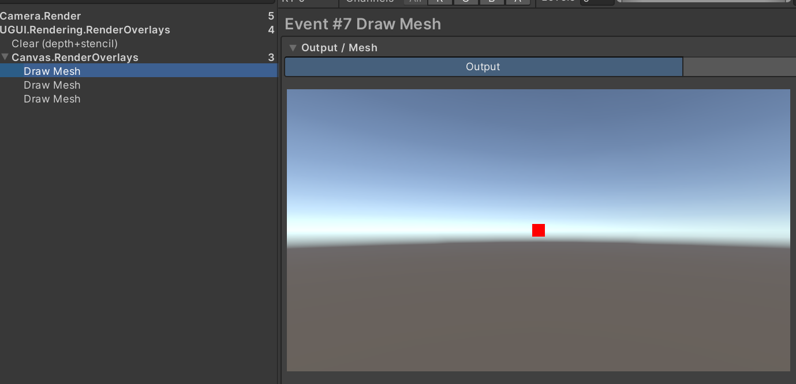

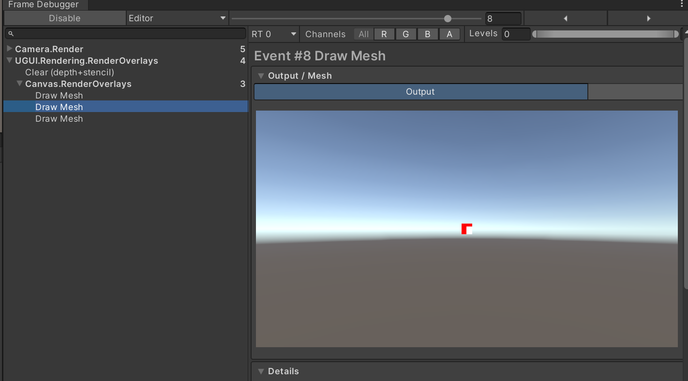


RectMask2D是使用RectTransform的坐标范围做裁剪（GPU做的）的

它通过脚本计算出这个矩形在屏幕上的坐标范围 `(min, max)`，然后把这个坐标传给子物体的 Shader。子物体在渲染时，Shader 会多跑一句代码：`if (像素坐标 < min || 像素坐标 > max) discard;`

`RectMask2D` 的裁剪本质上就是在 Pixel Shader（片元着色器）中完成的纯数学计算

`RectMask2D` 的工作流非常直接：

1. **传参**：C# 层（CPU）将裁剪区域的矩形范围（一个 `Vector4`，包含 x_min, y_min, x_max, y_max）传递给材质的 Uniform 变量。
2. **Shader 计算**：在 UI 的默认 Shader (`UI/Default`) 的片元着色器中，会执行一个判断。
3. **丢弃 (Clip)**：如果当前像素的坐标在矩形范围之外，Shader 执行 `clip()` 或 `discard` 指令，这个像素就直接不渲染了。

```c++
// Pixel Shader 伪代码
fixed4 frag(v2f IN) : SV_Target
{
    half4 color = (TextureSample(IN.texcoord) + _TextureSampleAdd) * IN.color;

    // --- RectMask2D 的核心魔法 ---
    // _ClipRect 是由 CPU 传入的裁剪范围
    // UnityGet2DClipping 检查当前像素是否在范围内
    color.a *= UnityGet2DClipping(IN.worldPosition.xy, _ClipRect); 
    
    // 如果 alpha 变为 0 (或者使用 clip 指令)，这个像素就被切掉了
    clip (color.a - 0.001); 
    // ---------------------------

    return color;
}
```


### UGUI 布局更新逻辑，如何递归的获取子节点以及如何反递归的设置各层的大小


### Pivot，Anchor 和 RectTransform

pivot是UI的“模型局部坐标系原点”（类比Model）。`RectTransform` 有一个属性叫 `anchoredPosition`，它的数学定义永远是：**Pivot 点 距离 锚点中心点（Anchors center） 的向量**

> 假设 UI 全屏拉伸（锚点 min=0, max=1）。
>
> - **情况 1**：Pivot 在 `(0.5, 0.5)`。此时 `anchoredPosition` 是 `(0, 0)`。
> - **情况 2**：Pivot 在 `(0, 0)`（左下角）。此时 `anchoredPosition` 变成了 `(-屏幕宽/2, -屏幕高/2)`。

Anchor描述的始终是， 相对于父节点的RectTransform长和宽构成的四边形这个坐标系下，的绝对位置比例（归一化为0-1）(这个位置比例是不会随着父节点的拉伸而改变的，因为是归一化之后的)

Anchor有两种模式，点模式和区间模式。

在点模式下，Anchor描述的就是一个绝对位置，什么是不变的呢，anchoredPosition是不变的，也就是pivot距离anchor的位置这个向量的数值是绝对不变的。

而在区间模式下，Anchor会经由它的Min和Max定义为一个四边形。Left/Right/Top/Bottom的数值描述的就是，UI的四个边，相对于Anchor四个边的”绝对位置“”。注意，这个子UI跟随父UI的拉伸时如何实现的呢，是边缘相对于Anchor的四个边的距离绝对不变，在这种基础下去拉伸子UI的内部

下面两张图显示的就是这个结果，黑色双向箭头标识什么不变：第一张图是点模式，第二张是区间模式

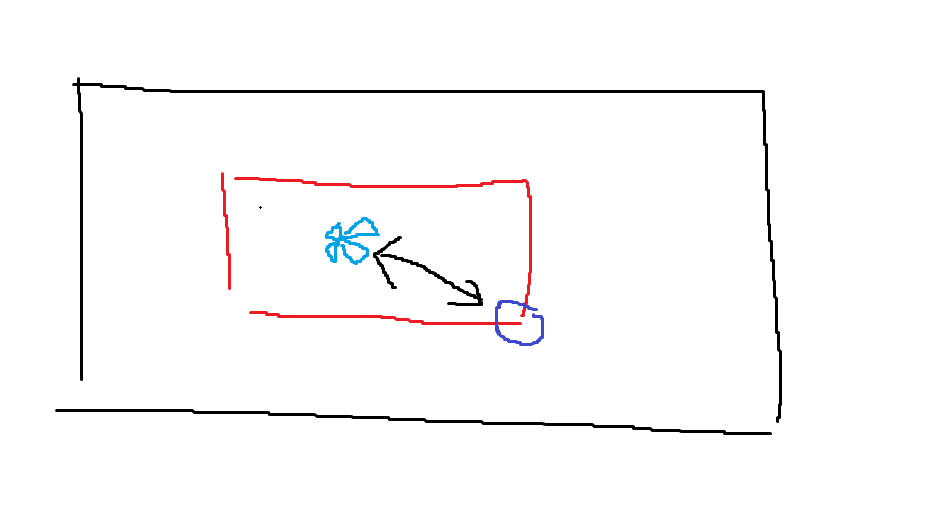


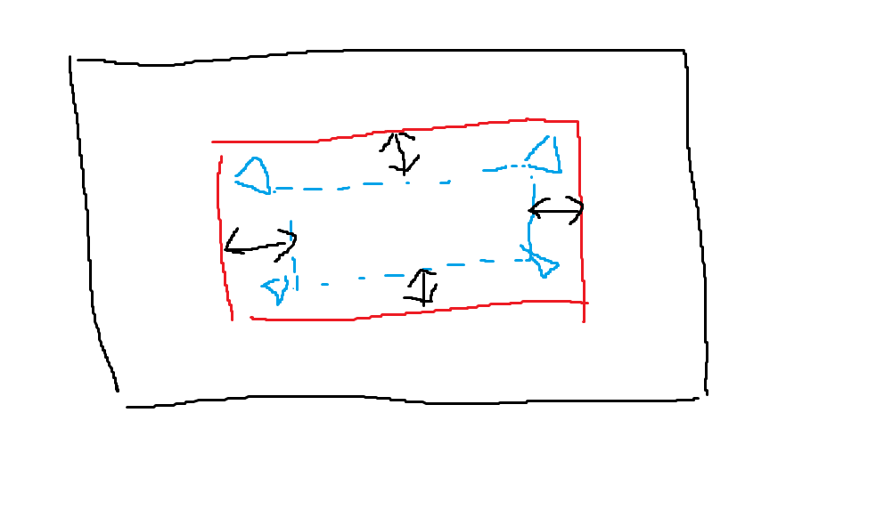


然后其实还有一种折中的状态，就是Anchor的横（或者纵）是点模式，另一个方向是区间模式。这其实就完全一样，点模式的那一个方向（假设是横），RectTransform的Vector4里存储的是pivot在横向上和Anchor构成的线的绝对距离。

纵向上存储的是左右两个边距离Anchor左右两边的绝对距离

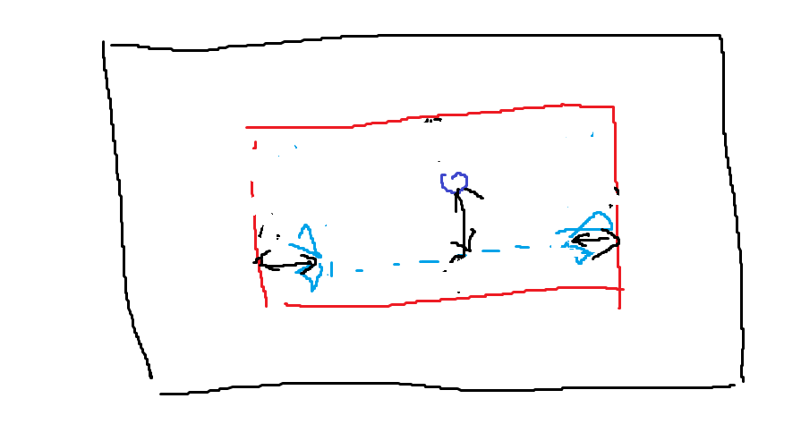

#### 数据结构：

RectTransform是这一切的汇总，他提供了几个数据结构来描述

1. anchoredPosition始终描述Pivot指向Anchored中心的向量，是一个Vector2

2. sizeDelta 存储的是：$$\text{sizeDelta} = \text{当前物体的大小} - \text{锚点构成的矩形大小}$$ 

   1. 点模式下，sizeDelta存储的就是物体的Width和Height

   2. 区间模式下
      $$
      \text{sizeDelta} = \text{物体大小} - Anchor相对于父节点的比值*\text{父级大小}
      $$

   其实结合起来想一下，区间模式下，物体边缘和Anchor边缘之间的距离这个绝对数值，就存储在sizeDelta里

3. offsetMin和offsetMax是两个属性，它根据Heigth，Width，当前的Anchor的边缘计算

   1. **offsetMin** (API)计算结果：物体**左下角** $\rightarrow$ Anchor区域**左下角** 的位移。

   2. **offsetMax** (API)计算结果：物体**右上角** $\rightarrow$ Anchor区域**右上角** 的位移。

   3. ```c#
       public Vector2 offsetMin
          {
            get => this.anchoredPosition - Vector2.Scale(this.sizeDelta, this.pivot);
            set
            {
              Vector2 a = value - (this.anchoredPosition - Vector2.Scale(this.sizeDelta, this.pivot));
              this.sizeDelta -= a;
              this.anchoredPosition += Vector2.Scale(a, Vector2.one - this.pivot);
            }
          }
         
          /// <summary>
          ///   <para>The offset of the upper right corner of the rectangle relative to the upper right anchor.</para>
          /// </summary>
          public Vector2 offsetMax
          {
            get => this.anchoredPosition + Vector2.Scale(this.sizeDelta, Vector2.one - this.pivot);
            set
            {
              Vector2 a = value - (this.anchoredPosition + Vector2.Scale(this.sizeDelta, Vector2.one - this.pivot));
              this.sizeDelta += a;
              this.anchoredPosition += Vector2.Scale(a, this.pivot);
            }
          }
      ```

   


### <span style="color:#FFB266;">屏幕坐标系和 UI 局部坐标系的异同</span>

屏幕坐标是MVP变换之后，到NDC，然后视口变换得到的屏幕坐标

局部坐标是以UI的pivot为原点计算的本地坐标系

```c#
// 参数1: 要转换的 UI 元素 (RectTransform)
// 参数2: 屏幕坐标 (Input.mousePosition)
// 参数3: 渲染这个 UI 的相机 (Overlay模式填 null, Camera模式填 uiCamera)
// 参数4: 输出结果 (localPoint)

Vector2 localPoint;
RectTransformUtility.ScreenPointToLocalPointInRectangle(
    rectTransform, 
    Input.mousePosition,  //屏幕坐标
    uiCamera, 
    out localPoint //UI局部坐标
);
```


### Canvas 的分类，每一类都是如何对应的


### UGUI 的合批，断批的条件


### UGUI 和 Rebuild 和 ReBatch 的异同

Rebuild和Rebatch的分隔都是以Canvas为基本单位的


### <span style="color:#FFB266;">两个Canvas嵌套，CanvasB是CanvasA的子物体，CanvasB里的物体变化，会影响CanvasA吗</span>

分类讨论，GraphRebuild：**CanvasB 里的物体变化：** **完全不会** 影响 CanvasA。这是 Sub-Canvas 优化的核心目的

LayoutRebuild：只要 B 内部元素的变化没有撑大 B 的 RectTransform 导致 B 的尺寸改变，A 的布局也不会受影响。

**Rebatch (合批):** 只要 B 的层级顺序（Sorting Order）和在 A 中的位置没有发生根本性变化（比如 Z 轴跳变），A 的合批列表是不需要更新的。Unity 只是在渲染 A 的命令列表中，到了 B 的位置，调用 B 的渲染指令而已。


### <span style="color:#FFB266;">这时候canvasB消失了，CanvsA会Rebuild和Rebatch吗。</span>

这个操作的影响比较大，因为它改变了 Canvas A 的**拓扑结构**

Layout Rebuild（布局重建）：**极大概率触发**

- **场景：** 如果 Canvas A（或者 B 的直接父节点）上挂了 `VerticalLayoutGroup`、`GridLayoutGroup` 等布局组件。
- **结果：** B 消失了，父级必须重新计算剩余所有兄弟节点的位置。
- **连锁反应：** 这种 Layout Rebuild 会导致 A 下面其他的兄弟元素位置发生改变，进而导致这些兄弟元素被标记为 Dirty，最终导致 **Canvas A 发生 Graphic Rebuild（网格重建）**。
  - *注意：如果 A 没有布局组件，只是绝对定位，那么这一步开销很小。*

Graphic Rebuild（网格重建）：**视情况而定**

- **如果 A 没有 Layout Group：** B 消失了，A 自身的网格（Mesh）通常**不需要**重建。因为在 UGUI 的渲染逻辑里，子 Canvas (B) 并不包含在父 Canvas (A) 的 Mesh 里。B 只是“骑”在 A 上面或中间。把 B 拿走，A 原本画好的背景、边框的 Mesh 并不需要修改定点数据。
- **如果 A 有 Layout Group：** 见上条，兄弟节点动了，A 就要重建网格。

Rebatch（重新合批）：**必然触发**

- **原理：** 渲染队列变了。
  - 之前：画 A 的前半部分 -> **画 Canvas B** -> 画 A 的后半部分。
  - 现在：画 A 的前半部分 -> 画 A 的后半部分。
- **结果：** Unity 必须重新扫描 A 的渲染层级，看看 B 走了之后，原本被 B 隔开的“前半部分”和“后半部分”能不能合并成一个 DrawCall。


### <span style="color:#FFB266;">UGUI的UI的渲染顺序如何确定</span>

全局看 Canvas 设置，内部看 Hierarchy 顺序

#### 全局：

1. 如果 UI 元素属于不同的根 Canvas（或者开启了 `Override Sorting` 的子 Canvas），渲染顺序由 `Canvas` 组件的属性决定：

- **Render Mode (渲染模式)**:
  - **Screen Space - Overlay**: 永远覆盖在所有 Camera 渲染的物体（3D 物体、粒子等）之上。
  - **Screen Space - Camera** & **World Space**: 会与场景中的 3D 物体根据深度混合，或者通过 Sorting Layer 排序。
- **Sorting Layer (排序层级)**:
  - 在 Tags & Layers 设置中定义的顺序。列表**越靠下**的 Layer，渲染优先级越高（显示在越前面）。
- **Order in Layer (层级内顺序)**:
  - 如果 Sorting Layer 相同，则比较此数值。**数值越大**，显示在越前面。

#### 同一个 Canvas 内部：看 Hierarchy (层级视图) 顺序

在同一个 Canvas 下（且没有嵌套 Canvas 干扰），渲染顺序严格遵循 **Hierarchy 面板中的节点顺序**，这被称为“画家算法”（Painter's Algorithm）：

- **从上到下绘制**：Unity 会从 Hierarchy 的第一个子节点开始绘制，然后绘制第二个，依此类推。
- **后者遮挡前者**：
  - **上面的节点**（索引小）先画，作为**背景**。
  - **下面的节点**（索引大）后画，作为**前景**（遮挡上面的）。
- **API 控制**:
  - `transform.SetAsLastSibling()`：移到最下方，显示在最前面。
  - `transform.SetAsFirstSibling()`：移到最上方，显示在最后面（被遮挡）。

#### 特殊情况：

Z 轴 (深度)

这个因素**仅**在 Canvas 的 Render Mode 为 **World Space** 或 **Screen Space - Camera** 时生效：

- **Screen Space - Overlay**: 完全**忽略** Z 轴距离，只看 Hierarchy。
- **Camera / World Space**:
  - 如果 UI 元素也是平面的，主要还是看 Hierarchy。
  - 如果开启了深度排序或有 3D 物体穿插，**离摄像机越近**的物体会显示在前面（取决于 Shader 的 ZTest 设置，但在标准 UI Shader 中通常由 Hierarchy 主导，物理距离主要影响 3D 物体与 UI 的穿插）。

嵌套 Canvas (Nested Canvas)

如果你在一个 UI 元素下又挂了一个 `Canvas` 组件（例如为了给某个按钮单独做特效）：

- **如果不勾选 Override Sorting**: 该子 Canvas 及其子物体，严格遵循父 Canvas 的 Hierarchy 顺序。
- **如果勾选 Override Sorting**: 该子 Canvas 会脱离父 Canvas 的内部排序逻辑，直接使用自己的 `Sorting Layer` 和 `Order in Layer` 与全局其他 Canvas 进行比较。


## Built-in 和 URP

### Built-in 的动态静态合批

### SRP 的优化重点和 Built-in 的区别

Built-in的


### **SRP Batcher**

https://zhuanlan.zhihu.com/p/165574008

SRP Batch解决的根本就不是批处理，而是减少状态切换的开销，只需要相同的Shader就行。

> Shader和材质的区别和关系
>
> Shader 是“类 (Class)”，材质 (Material) 是“对象实例 (Instance)”
>
> **Shader = `class` / `struct` 定义 + 函数逻辑** 它定义了规则、逻辑和需要的参数。
>
> ```C++
> // Shader (Lit.shader)
> class StandardShader {
> public:
>     // 定义了需要什么数据 (Properties)
>     float4 _Color;
>     Texture2D _MainTex;
>     float _Glossiness;
> 
>     // 定义了怎么画 (Vertex & Fragment Shader)
>     void Draw() {
>         // ... 复杂的 PBR 算法 ...
>         return _Color * texture(_MainTex) * ...;
>     }
> };
> ```
>
> **材质 (Material) = `new` 出来的对象** 它负责给 Shader 里的参数赋具体的**值**。
>
> ```C++
> // Material A (Red_Plastic.mat)
> StandardShader* matA = new StandardShader();
> matA->_Color = float4(1, 0, 0, 1); // 红色
> matA->_Glossiness = 0.9f;          // 很亮
> 
> // Material B (Blue_Wood.mat)
> StandardShader* matB = new StandardShader();
> matB->_Color = float4(0, 0, 1, 1); // 蓝色
> matB->_Glossiness = 0.1f;          // 很粗糙
> ```

> #### **Shader 对应 DX12 的：**
>
> 1. **PSO (Pipeline State Object)**：
>    - 包含编译好的 **Bytecode** (VS, PS, CS 等)。
>    - 定义了渲染状态 (Blend Mode, Z-Test, Cull Mode)。
>    - *注意：Unity 的 Shader 文件里的 Tags/Blend 命令决定了 PSO 的状态。*
> 2. **Root Signature (根签名)**：
>    - 定义了插槽布局。比如：Shader 说“我要一个颜色和一个贴图”，RootSignature 就定义“Slot 0 是 CBuffer，Slot 1 是 SRV”。
>
> #### **材质 (Material) 对应 DX12 的：**
>
> 1. **Constant Buffer (CBuffer) 的数据**：
>    - 显存里的一小块区域，存着 `(1, 0, 0, 1)` 这种具体数值。
>    - 这就是 SRP Batcher 里的 `UnityPerMaterial`。
> 2. **Descriptor Heap / Table (SRV Handle)**：
>    - 指向具体的纹理资源（Texture Resource）的指针。
> 3. **Keywords (变体开关)**：
>    - **关键点**：材质还负责**开启/关闭宏**（比如 `_NORMALMAP_ON`）。
>    - 这会导致材质选择 Shader 的不同**变体 (Variant)**。


SRP Batcher 的核心不是“合并网格”，而是“数据的持久化与快速绑定”

Built-in的合批靠的是相同材质贴图的Mesh，合并。（虽然动态合批不合并Mesh而是把顶点转换到世界坐标，但是其实本质类似）

SRP它并不合并Mesh，因为现代管线一次DrawCall的开销已经很低了。批处理本身又不切换渲染状态

它解决的是：减少； **相同 Shader 变体**的物体（也就是Shader一样，RS一样，但是材质参数啥的不一样）的渲染状态切换的开销

在 SRP 中，每个材质的数据都**独立**存在于显存中（`CBuffer_Mat_A`, `CBuffer_Mat_B`）。

**准备阶段 (Setup)**：

- CPU: “这是 Shader X 的 PSO。”
- CPU: “这是 `UnityPerDraw` 大缓冲（存所有矩阵）。”
- *(PSO 和 RootSignature 在这一连串绘制中**完全不变**！)*

**画红色物体 A**：

- CPU: “不用改数据！只要把 `UnityPerMaterial` 的绑定指针指向 `0x1000` (材质 A 的显存地址)。”
- CPU: “把 `UnityPerDraw` 的 Offset 指向 `0` (物体 A 的矩阵)。”
- CPU: “Draw!”

**画蓝色物体 B**：

- CPU: “不用改数据！只要把 `UnityPerMaterial` 的绑定指针指向 `0x2000` (材质 B 的显存地址)。”
- CPU: “把 `UnityPerDraw` 的 Offset 指向 `1` (物体 B 的矩阵)。”
- CPU: “Draw!”


| **维度**          | **传统 Batch (Static/Dynamic)**   | **SRP Batcher**                        |
| ----------------- | --------------------------------- | -------------------------------------- |
| **手段**          | **合并网格** (Merge Geometry)     | **持久化数据** (Persist Data)          |
| **DrawCall 数量** | 变成 1 个                         | 依然是 N 个                            |
| **优化目标**      | 减少 API 调用次数                 | 减少每次 API 调用的 CPU 开销           |
| **材质限制**      | 材质必须完全相同 (连参数都要一样) | **只要 Shader 变体一样，参数随便改！** |
| **DX12 对应**     | 一个巨大的 Vertex Buffer          | 频繁调用 `SetRootCBV` 但不切 PSO       |

URP 的 SRP Batcher 不合并 Mesh（保持 DrawCall 数量），而是通过将材质参数持久化到 CBuffer (`UnityPerMaterial`) 以及将矩阵数据集中到大 CBuffer (`UnityPerDraw`)，使得在渲染使用**相同 Shader 变体**的物体时，**不需要重新上传数据，也不需要重新绑定复杂的描述符表，甚至不需要切换 PSO**，仅仅需要快速更新 CBuffer 的绑定地址（Offset）。

> **从 DX12 底层指令看，这两种“Batch”到底长什么样。**
>
> ------
>
> ### 1. 视角的终极转换：从“合并”到“复用”
>
> - **Built-in 的 Dynamic Batching** 是 **“为了节省 DrawCall 而牺牲 CPU”**。
>   - 它在 CPU 端把顶点算好（变换到世界空间），塞进一个临时的 Vertex Buffer。
>   - **DX12 视角**：`Map` (写顶点) -> `Draw` (一次画完)。
>   - **代价**：CPU 每一帧都在做数学题（顶点变换）和搬运工（内存拷贝）。
> - **URP 的 SRP Batcher** 是 **“为了复用渲染状态而牺牲显存（一点点）”**。
>   - 它不再怕 DrawCall 了，它怕的是 `SetPipelineState` 和 `ResourceBarrier`。
>   - **DX12 视角**：`SetPSO` (只做一次) -> `SetRootCBV` (改指针) -> `Draw` -> `SetRootCBV` (改指针) -> `Draw`。
>   - **代价**：显存里要一直存着所有材质的 CBuffer（但这对现代显卡来说九牛一毛）。
>
> ------
>
> ### 2. 深入 DX12 指令流：为什么 SRP 这么快？
>
> 让我们看看在 Command List 里，这两种方式的具体指令流对比。
>
> #### **场景：渲染 100 个物体，使用相同的 Shader 变体，但材质参数不同（红、蓝、绿...）**
>
> **Built-in (断批的情况):**
>
> ```C++
> // 1. 画物体 A (红色)
> d3dCmdList->SetPipelineState(PSO_Variant_1);
> // 慢！因为参数变了，CPU 需要把 (1,0,0) copy 到上传堆，然后 GPU 还需要同步
> UpdateGlobalConstantBuffer(Color_Red); 
> d3dCmdList->SetGraphicsRootDescriptorTable(Global_CBV); 
> d3dCmdList->DrawIndexedInstanced(...);
> 
> // 2. 画物体 B (蓝色)
> // 慢！又要上传新数据
> UpdateGlobalConstantBuffer(Color_Blue); 
> // 慢！因为数据变了，Driver 可能需要做 Versioning 或者 Validation
> d3dCmdList->SetGraphicsRootDescriptorTable(Global_CBV); 
> d3dCmdList->DrawIndexedInstanced(...);
> ```
>
> **SRP Batcher (合批的情况):**
>
> ```C++
> // 1. 初始设置 (只做一次！)
> d3dCmdList->SetPipelineState(PSO_Variant_1);
> d3dCmdList->SetGraphicsRootSignature(Global_RootSig);
> 
> // 2. 画物体 A (红色)
> // 极快！只是设置了一个 GPU 虚拟地址 (64位整数)
> // 显存里早就有了 Red_Material_Buffer，直接指过去
> d3dCmdList->SetGraphicsRootConstantBufferView(RootIndex_Material, GPUAddress_Mat_A);
> d3dCmdList->SetGraphicsRootConstantBufferView(RootIndex_Draw, GPUAddress_Draw_A);
> d3dCmdList->DrawIndexedInstanced(...);
> 
> // 3. 画物体 B (蓝色)
> // 极快！只改指针
> d3dCmdList->SetGraphicsRootConstantBufferView(RootIndex_Material, GPUAddress_Mat_B);
> d3dCmdList->SetGraphicsRootConstantBufferView(RootIndex_Draw, GPUAddress_Draw_B);
> d3dCmdList->DrawIndexedInstanced(...);
> ```
>
> ### 3. 唯一的限制：Shader 变体必须一致
>
> 你提到：*“它解决的是...相同 Shader 变体的物体的渲染状态切换的开销”*。
>
> 这点非常重要。如果物体 A 开了雾效（Keyword: `FOG_ON`），物体 B 没开（Keyword: `FOG_OFF`）：
>
> - 它们的 **VS/PS 代码** 就不一样了。
> - 它们的 **PSO** 就不一样了。
> - **结果**：SRP Batcher 必须打断。因为 DX12 必须调用 `SetPipelineState(New_PSO)`。
>
> ### 4. 总结
>
> 1. **Built-in 合批** = **物理合并**。把小网格拼成大网格，让 DrawCall 数量变少。
> 2. **SRP Batcher** = **逻辑快速通道**。网格不合并，DrawCall 数量不少，但是把每个 DrawCall 的“准备工作”（Setup）降到了最低（改指针）。

### Unity管线流程

#### <span style="color:#FFCC99;">引擎管线</span>

管线，实际上是一种引擎层封装的概念。它并不直接是最底层的管线。而是一种调度机制

对于Built-in的管线来说，它的RenderLoop是顶定死的，它通过tag管理所有shader里定义的各种pass,Pass只是一堆shader的容器，比如[vertex shader](https://zhida.zhihu.com/search?content_id=675712769&content_type=Answer&match_order=1&q=vertex+shader&zhida_source=entity)，fragment shader等等，一个Pass就是一组shader

```c++
// Built-in Render Loop (简化版)
void RenderLoop() 
{
    // --- 阶段 1: Base Pass (环境光 + 主平行光) ---
    // 类似于 URP，只画一次
    SetPassTag("ForwardBase"); 
    for (auto obj : allObjects) 
    {
        // 如果物体有 "ForwardBase" 的 Pass，就画它
        // 这会计算纹理、环境光和最亮的那盏平行光
        DrawObject(obj); 
    }

    // --- 阶段 2: Add Pass (额外的像素光) ---
    // *** 噩梦就在这里 ***
    SetPassTag("ForwardAdd");
    
    for (auto obj : allObjects) 
    {
        // 获取影响这个物体的所有额外强光 (比如身边的点光源)
        auto extraLights = GetPixelLights(obj); 
        
        // 【关键点】：CPU 这里的循环！
        for (auto light : extraLights) 
        {
            // 设置这盏灯的参数到 Constant Buffer
            UpdateLightConstants(light);
            
            // 开启混合模式 (Blend One One)
            // 再次发起 DrawCall！
            DrawObject(obj); 
        }
    }
}
```

或者可以这样理解：<span style="color:#CCFF99;">内置的管线的RenderPass是固定的。每个RenderPass执行的时候，都会执行渲染，这时候去遍历所有的物体看他们对应的材质挂载的shader中，是否定义了当前RenderPass下（tag）的shader。如果定义了，那么就用这个执行。这里就牵扯到PSO的问题了，PSO只是一种渲染状态的描述，一个RenderPass代表的是一次全局的渲染流程，但是它可以对应好多PSO和好多次Drawcall。</span>

<span style="color:#CCFF99;">其实可以回忆一下DX12的PSO，一个PSO只是描述了一种RS，还有一些Vertex啊，Fragement，shader的定义。而至于它用在什么Model上，是不是真的要用，是RenderPass的时候要设置的。</span>

这样其实DrawCall的定义也明确了，DrawCall 是一次**“执行指令”的提交，一般有很多条（他可能修改PSO，可能不修改PSO）	意思大概类似于：“嘿 GPU，去读取显存地址 `0x1000` 处的顶点缓冲（VB）和 `0x2000` 处的索引缓冲（IB），用刚才设置好的 PSO，把第 0 到第 500 个索引对应的三角形画出来。”。因此Drawcall的成本在于CPU要频繁的写命令，并且这些命令写入和准备是要开销的

> 在 Built-in 管线里，C++ 引擎层写死了一个类似 `RenderLoop()`,它严格按照顺序执行：`RenderShadows()` -> `RenderDepth()` -> `RenderForwardBase()（基础光照）` -> `RenderForwardAdd()（额外光照）` -> `RenderTransparent()`。你没法插手，也没法改变顺序（除非用 CommandBuffer 强行 hack）

```c++
while(true){
    RenderPass_Shadow();
    RenderPass_TransPort();
    RenderPass_Oqueue();
}

void RenderPass(){
    for(auto object : allObject){
        if(object 有当前RenderPass的Shader){
            if(pso changed){
                SetPSO(object.shader);
            }
            
            Draw(object.vertex, object.indice); //这就是一次DrawCall
        }
    }
}
```

那么切换成本是如何出现的也就很明确了，在一个RenderPass中，如果前后的PSO不同，那么就要切换渲染状态了，这时候成本就高了

> 所以Built-in的管线是会对物体进行排序的，会让PSO一样的物体尽可能在前后渲染。

#### URP管线

为什么说URP的渲染管线是可编程的，可编程这里指的其实是RenderPass的可编程，是可以添加RenderPass。

对于Builtin，它的RenderLoop的执行哪些RenderPass是完全的写死在底层的。但是URP的renderLoop里执行哪些RenderPass，其实就是一个多态的列表，是可以扩充的，可以添加的, 类似于:

```c#
List<ScriptableRenderPass> activePasses
```

管线每帧只是遍历这个 List，调用它们的 `Execute` 方法。这意味着可以随意删减、调换顺序

```c#
// 这就是定义管线的 "导演" 类
public class ScriptableRenderer
{
    // 关键点：这里不再是写死的函数调用，而是一个多态的列表
    // 类似于 std::vector<RenderPass*>
    List<ScriptableRenderPass> activePasses = new List<ScriptableRenderPass>();

    // 1. Setup 阶段：每一帧开始时，决定这一帧要执行哪些 Pass
    // 这就是 "可编程" 的体现：你可以用 if/else 动态决定加不加某个 Pass
    public void Setup(ScriptableRenderContext context, ref RenderingData data)
    {
        activePasses.Clear();

        // --- 添加基础 Pass ---
        EnqueuePass(m_MainLightShadowCasterPass); // 画主光源阴影
        EnqueuePass(m_AdditionalLightsShadowCasterPass); // 画额外光源阴影
        EnqueuePass(m_DepthPrepass); // 深度预渲染

        // --- 添加不透明物体 Pass ---
        EnqueuePass(m_DrawObjectsPass); // 画 Opaque

        // *** 关键点：这里就是 RenderFeature 的插入点 ***
        // 遍历你配置的所有 RenderFeature，问它们要不要插一脚
        foreach(var feature in m_RendererFeatures)
        {
            if(feature.isActive)
            {
                // 比如你写了个 "后处理描边" Feature，它会在这里把它的 Pass 加进列表
                // 并且可以通过 event 参数指定插在 Opaque 之后，Transparent 之前
                feature.AddRenderPasses(this, ref data);
            }
        }

        // --- 添加透明物体 Pass ---
        EnqueuePass(m_DrawSkyboxPass);
        EnqueuePass(m_DrawTransparentObjectsPass); // 画 Transparent
        
        // --- 添加后处理 Pass ---
        EnqueuePass(m_PostProcessPass);
    }

    // 2. Execute 阶段：傻瓜式遍历列表
    public void Execute(ScriptableRenderContext context, ref RenderingData data)
    {
        // 这里的 activePasses 列表已经是根据 Event 排序好了的
        foreach (var pass in activePasses)
        {
            // 这是一个虚函数调用
            // 每个 Pass 内部自己决定怎么调用 context.DrawRenderers
            // 或者怎么发送 CommandBuffer
            pass.Execute(context, ref data);
        }
    }
}
```

#### URP和Built-in的区别

URP相对于Buit-in还有一个重要的改变，就是对于光照这个RenderPass。回顾下面这句话：

> 在 Built-in 管线里，C++ 引擎层写死了一个类似 `RenderLoop()`,它严格按照顺序执行：`RenderShadows()` -> `RenderDepth()` -> `RenderForwardBase()（基础光照）` -> `RenderForwardAdd()（额外光照）` -> `RenderTransparent()`。你没法插手，也没法改变顺序

`RenderForwardBase()（基础光照）` -> `RenderForwardAdd()（额外光照）`Built-in的光照分两个RenderPass。它采用的是前向光照。它的伪代码如下：

```c++
void RenderForwardBase(){
    for(auto obj : allObject){
        VS(mainLight, obj);
        PS(mainLight, obj);
    }
}

void RenderForwardAdd(){
    for(Light light : allLight){
        for(auto obj : allObject){
        	VS(light, obj);
        	PS(light, obj);
    	}
    }
}

// 真正的伪代码：
// Built-in (Multi-Pass Forward)
void RenderLoop_BuiltIn()
{
    // 遍历每一个物体 (N)
    for(auto obj : allObjects) 
    {
        // --- Pass 1: Base Pass ---
        // 包含: 环境光 + 主平行光 + 贴图
        // 代价: 1 次 VS + 1 次 PS
        SetPass("ForwardBase");
        Draw(obj); 

        // 找出所有影响这个物体的额外像素光 (假设有 M 个)
        List<Light> pixelLights = GetLightsAffecting(obj);

        // --- Pass 2...M: Add Pass ---
        SetPass("ForwardAdd"); // 切换到叠加模式 Blend One One
        
        // 遍历影响这个物体的每一盏灯 (M)
        for(auto light : pixelLights) 
        {
            // 设置这盏灯的参数 (位置、颜色)
            SetGlobalShaderParams(light);
            
            // *** 罪大恶极的地方 ***
            // 为了叠这盏光，必须把这个物体的顶点再跑一遍！
            // 代价: 1 次 VS + 1 次 PS
            Draw(obj); 
        }
    }
}
```

说真的这非常符合默认的想法，遍历每一个物体，遍历每一个光源，（其实正常的想法是遍历每个光源然后渲染每个物体，但是Unity反过来了，这是为了让遍历次数少一点），然后渲染，这是一个O(M N)的复杂度，对于每一帧来说开销确实不小。但是很符合思维逻辑

URP做出的改变是，它做了延迟渲染，它会提前计算一遍所有灯光的数据，然后用一次renderPass就解决所有灯光

```c++
void RenderLoop_URP()
{
    // 1. 预计算阶段 (Cull Lights)
    // 这一步在 CPU 做，把所有灯光数据填进一个大数组 CBuffer
    // _AdditionalLightsPosition[MAX_LIGHTS]
    // _AdditionalLightsColor[MAX_LIGHTS]
    PrepareLightsData(); 

    // 2. 渲染阶段
    SetPass("UniversalForward"); // 这是一个包含循环逻辑的重型 Shader

    // 遍历每一个物体 (N)
    for(auto obj : allObjects) 
    {
        // 告诉 Shader: "你是物体 i，去读灯光数组里的第 j 到 k 个数据"
        SetCBufferOffset(obj); 
        
        // *** 只有一次 DrawCall ***
        // 代价: 1 次 VS + 1 次 PS (虽然 PS 内部比较重)
        Draw(obj);
    }
}

//对应的 Shader 变成了这样
// Pixel Shader
float4 frag (v2f i) : SV_Target
{
    float3 color = CalculateMainLight(); // 算主光
    
    // *** 循环在这里！在 GPU 内部消化了 ***
    for (int lightIndex = 0; lightIndex < GetAdditionalLightsCount(); ++lightIndex)
    {
        Light light = GetAdditionalLight(lightIndex, i.worldPos);
        color += CalculateLight(light, i.normal);
    }
    
    return float4(color, 1.0);
}
```

注意这里依然是逐像素的渲染，所以也还是前向渲染，只是它提前处理了光照信息


#### 渲染顺序

现在看看渲染顺序都会收到什么影响：

1. 深度，从近到远，减少OverDraw
2. 渲染状态，Unity会尽可能的让渲染状态一样的在前后绘制，减少状态切换
3. 透明物体，如果是透明物体存在，那就会有很大的影响，透明物体必须按照顺序从远到近渲染。所以可能导致频繁切换渲染状态


### <span style="color:#FFCC99;">延迟渲染</span>

<span style="color:#99FFCC;">前向渲染是以物体为核心，画物体的时候，看着光。URP的前向渲染的优化点在于它提前计算了所有光的信息。但是本质上依然是画物体的时候考虑光照信息。一边画物体，一边把光算好，画完就是最终照片</span>

<span style="color:#99FFCC;">延迟渲染改变了渲染流程，它分离了画物体和光的计算。而在最后的时候统一计算光照。画物体时**只记笔记（存属性）**，完全不算光。等全屏幕的笔记记满了，最后统一算一次光。</span>

延迟渲染分两个阶段：

1. 几何阶段：计算GBuffer

在这一步，GPU 也在遍历所有物体，也会执行 Vertex Shader 和 Pixel Shader。 **但是！Pixel Shader 里一行光照代码都没有！**

它不输出最终颜色，而是输出**“这个像素的物理属性”**到几张巨大的纹理中（这些纹理合称 **G-Buffer**）。

URP 的 G-Buffer 布局通常是这样的（为了省带宽，它压得很紧）：

- **Render Target 0 (RT0)**: 存储 **Albedo (固有色)** (RGB) + **Material Flags** (A).
  - *笔记内容*：“这个像素是红色的，它是普通材质。”
- **Render Target 1 (RT1)**: 存储 **Specular/Metallic** (RGB) + **Smoothness (光滑度)** (A).
  - *笔记内容*：“这个像素是金属，非常光滑。”
- **Render Target 2 (RT2)**: 存储 **Normal (法线)** (RGB) + **Smoothness (低位)**.
  - *笔记内容*：“这个像素朝向左上方。”
- **Depth Buffer**: 存储 **深度**。
  - *笔记内容*：“这个像素离摄像机 10 米远。”

**此时屏幕全是黑的（或者是一些奇怪的红绿蓝颜色），因为光还没算。**

2. Lighting Pass (光照阶段) 

现在，物体已经画完了，G-Buffer 里填满了屏幕上每一个像素的属性。 URP 会发起一个全屏的 DrawCall（画一个覆盖全屏幕的四边形）在这个 Pass 里，Pixel Shader 做的事情是：

```c++
// Deferred Lighting Shader 伪代码
float4 frag(v2f i) : SV_Target
{
    // 1. 查笔记：根据当前 UV，去 G-Buffer 里读出属性
    float4 albedo = tex2D(_GBuffer0, i.uv);
    float3 normal = UnpackNormal(tex2D(_GBuffer2, i.uv));
    float depth = tex2D(_CameraDepthTexture, i.uv);
    float3 worldPos = ReconstructWorldPos(depth, i.uv); // 根据深度反推世界坐标
    
    // 2. 拿光照列表 (和 Forward+ 那个列表一样)
    // 这里的优势是：我不需要管这个像素属于哪个物体，我只关心这个像素的世界坐标
    
    float3 finalColor = 0;
    
    // 3. 循环算光
    // 关键点：这个循环只对屏幕上的“有效像素”执行 1 次！
    // 哪怕这里有 100 层物体重叠 (Overdraw)，因为 G-Buffer 只存了最前面那层，
    // 所以光照计算量完全不浪费！
    for (int j = 0; j < lightCount; j++) {
        finalColor += CalculateLight(lights[j], albedo, normal, worldPos);
    }
    
    return finalColor;
}
```

#### 缺点：

1. 延迟渲染不支持透明物体，这很显然，因为GBuffer中，一个像素只能记录一组属性，但是透明物体的混合是需要考虑Dst和Src的
2. 显存压力大，G-Buffer有开销，带宽开销很大

#### 优点

1. G-Buffer没有光照的OverDraw的问题，被遮挡的像素根本不会参与光照计算。但是对于前向渲染，无论怎么说总是会有OverDraw的光照多次计算的

### <span style="color:#FFCC99;">如何减少GBuffer的占用</span>

1. 只存深度，不存坐标。因为光照计算的时候是需要坐标的，但是减少存储可以只存深度，然后用MVP的逆变换反推世界坐标。通过数学公式，存的时候存的是屏幕坐标 (UV)和深度，然后可以把 `(UV, Depth)` **逆推**回 `(WorldX, WorldY, WorldZ)`

渲染管线把 3D 世界变成 2D 屏幕的过程是：`WorldPos * View * Projection = ClipPos`。 那么反过来就是：`ClipPos * InverseProjection * InverseView = WorldPos`

```c++
// 1. 拿到屏幕 UV 和 采样到的硬件深度
float2 uv = input.uv;
float depth = SAMPLE_DEPTH_TEXTURE(_CameraDepthTexture, uv);

// 2. 构建裁剪空间坐标 (NDC)
// x, y 映射到 -1~1, z 是深度
float4 clipPos = float4(uv * 2.0 - 1.0, depth, 1.0); 

// 3. 乘以 VP 的逆矩阵
float4 worldPos = mul(unity_InverseViewProjection, clipPos);

// 4. 透视除法 (归一化)
worldPos.xyz /= worldPos.w; 

// 搞定！worldPos.xyz 就是这个像素在世界里的真实坐标
```


2. ，贴图压缩，给低一点的精度，不要盲目使用 `R16G16B16A16_FLOAT`

   **Albedo (固有色)**:

   - **现状**: 通常不需要浮点数。
   - **优化**: 使用 `R8G8B8A8_UNORM` (32 bits)。如果你能把 Alpha 通道省掉（比如材质 ID 另外存），甚至可以用 `R8G8B8_UNORM`（如果硬件支持这种奇葩格式，通常不支持，所以还是看能不能利用 A 通道存别的）。

   **Normal (法线)**:

   - **现状**: 存 `float3` (x, y, z) 既浪费又没必要，因为法线是归一化的 ($x^2+y^2+z^2=1$)。
   - **优化**: 使用 `R10G10B10A2_UNORM`。给 X, Y, Z 各 10 位精度，比 8 位好，比 16 位省。


## 设计模式

### MVC，MVVM 结合项目

### ECS 结合实习

### 单例模式


## 寻路

### Unity 的 NavMesh 的原理

### AStar 的实现

https://www.bilibili.com/video/BV1dKdmYzE99/?spm_id_from=333.337.search-card.all.click&vd_source=5d4070cc138983fa1babce80b5a31622

三个Const：Gcost，FCost和HCOst

G代表了一个节点从起点到这个节点经过的最短的路径

HCost代表了从一个节点到终点的启发式估计

<span style="color:#FFB266;">FCost = H + G</span>

<span style="color:#FFB266;">如果AStar完全不考虑启发的问题，那他就会退化为迪杰斯特拉</span>

```c++
struct Node{
    int id,
    int FCost,
	Node fromNode //记录从哪里来的
}
List<Node> openList // openList根据FCost排序
    HashSet<int> closedSet = new HashSet<int>(); //已经找到最短路的节点
Dic<Node,int> FCostDict;

while(openList is not empty){
    int cur = openList.GetMinFCostNode(); //获取FCost最小的节点
    
    if (closedSet.Contains(cur.id)) continue;  //如果已经处理过，直接跳过（防止重复处理堆中残留的旧节点）
    closedSet.Add(cur.id); //已找到最短路
    
    if cur.id == endNodeID then
        return cur; //根据fromNode构建路径
    
    for(auto nnode : cur.neighours){ //遍历所有的非CloseList邻居
        if (closedSet.Contains(nnode.id)) continue; //过滤ColseList
        int tryGCost = cur.GCost + Distance(nnode, cur) ;
        if(tryGCost < nnode.GCost){
            //松弛邻居
            nnode.FCost = tryGCost + Distance(nnode, endNode);
            nnode.GCost = tryGCost;
            nnnode/fromNode = cur; //更新前驱
            if (openList.Contains(neighbor)) {
                // 如果已经在表里，因为 F 变小了，需要更新它在堆中的位置
                openList.Update(neighbor); 
            } else {
                // 如果不在表里，加进去
                openList.Add(neighbor);
            }
        }
    }
}
```

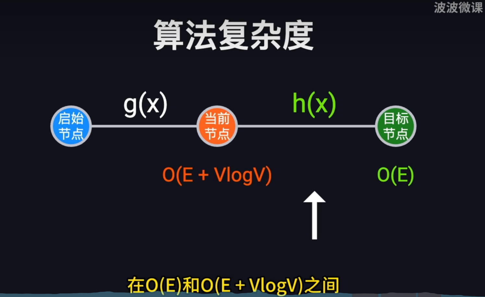

### DFS，BFS，迪杰斯特拉


## AI

### 状态机和分层状态机

### 行为树


## 动画

### 混合树

### Avatar 和遮罩

### Animator 和 Animation 的区别


### <span style="color:#FFB266;">动画的原理</span>

游戏动画不是存几张图片轮播（那是 Sprite 动画），现代 3D 动画的核心是 **Keyframes（关键帧）** 和 **Interpolation（插值）**。

**关键帧数据：** 动画师不会每一帧都做，他们只做第 0 帧、第 10 帧、第 20 帧。记录的数据通常是 **SQT**：

- **S (Scale)**: 缩放（Vector3）
- **Q (Quaternion)**: 旋转（四元数，为了避免万向节死锁和方便插值）
- **T (Translation)**: 位移（Vector3）

**运行时插值：** 游戏运行时，根据当前时间 $t$，计算出当前物体应该在什么状态。

- 如果是位置，使用线性插值 (`Lerp`)。
- 如果是旋转，必须使用 **球面线性插值 (`Slerp`)**，保证旋转路径是最短圆弧且速度均匀


### <span style="color:#FFB266;">骨骼动画的原理</span>

定点动画需要记录所有顶点每个关键帧的变化然后插值

但是这样的话每一帧记录的太多了，因此骨骼动画+蒙皮动画本质上是<span style="color:#66FF66;">变换和数据</span>的分离


https://zhuanlan.zhihu.com/p/349274838

每一根骨骼，本质上定义了一个局部的坐标系。

```c++
struct Bone {
    std::string name;       // 名字，比如 "Left_Hand"
    int parentIndex;        // 父骨骼的索引（关键！构成了树状结构）
    
    // 核心数据就下面这三个，描述了它相对于父骨骼的位置、旋转、缩放
    Vector3 localPosition;
    Quaternion localRotation;
    Vector3 localScale;
    
    // 缓存计算出的矩阵
    Matrix4x4 globalTransform; // 最终的世界变换矩阵
    Matrix4x4 inverseBindPose; // 绑定姿势的逆矩阵（后面蒙皮要用）
};
```

骨骼是有一个层级关系的，这种层级传递过程中，一个骨骼值只关心自己相对于父节点的位置。

因此，每一层骨骼的变换，等于它父节点变换和自身变换的乘积
$$
Mat(手部) = Mat(手部局部变换)  \times  Mat(前臂局部变换) \times Mat(上臂局部变换
$$


骨骼动画本质上只是描述了一种：框架的变换。在骨骼动画的文件中存储的也是关键帧中的每根骨骼的SQT变换

> 骨骼动画文件里记录的本质是一堆 **随着时间变化的局部变换数据**。 对于每一根骨骼，每一帧只需要记录三个属性，我们简称为 **SQT**：
>
> 1. **S (Scale)**: 缩放（通常是 `Vector3`，即 x, y, z）。
>    - *注：很多游戏为了省性能，约定骨骼不许缩放，这样可以省掉这部分数据。*
> 2. **Q (Rotation / Quaternion)**: 旋转（必须是 **四元数 `Quaternion`**，即 x, y, z, w）。
>    - *为什么不用欧拉角？* 因为欧拉角插值会产生万向节死锁（Gimbal Lock），且插值路径不平滑。四元数插值（Slerp）是最完美的。
> 3. **T (Translation)**: 位移（通常是 `Vector3`）。
>    - *注意：* 这个位移是**相对于父骨骼**的位移，而不是世界坐标。

类似下面这种：

```json
// 伪代码：一个跑步动画的数据结构
"Animation_Run": {
    "Duration": 1.0, // 持续1秒
    
    // 轨道（Track）：针对 "Left_Thigh" (左大腿) 这根骨头的数据
    "Track_Left_Thigh": {
        // 旋转关键帧 (Rotation Keyframes)
        "Rotation_Keys": [
            { "time": 0.0, "value": [0, 0, 0, 1] },       // 第0秒：初始姿态
            { "time": 0.5, "value": [0.7, 0, 0, 0.7] },   // 第0.5秒：腿抬起来 (四元数)
            { "time": 1.0, "value": [0, 0, 0, 1] }        // 第1秒：放下去
        ],
        // 位移关键帧 (Translation Keyframes)
        "Position_Keys": [
            // 大腿根部相对于骨盆通常不移动，所以这里可能只有一帧，或者为空
            { "time": 0.0, "value": [0.2, -0.1, 0] } 
        ]
    },

    // 轨道：针对 "Left_Knee" (左膝盖) 的数据
    "Track_Left_Knee": {
        ...
    }
}
```

#### 骨骼绑定在模型上

美术制作阶段（Static / Offline）**——在这里，“骨骼必须绑定在模型上”。**

在 Maya / Blender / 3DMax 里，美术师做的事情叫 **Rigging (绑定/蒙皮)**。 这时候确实发生了你所说的“骨骼绑定在模型上”。

1. **摆位置：** 美术把一套骨骼塞进一个 T-Pose 的模型身体里。
2. **刷权重 (Painting Weights)：** 这是最关键的一步。美术师通过涂抹，告诉计算机：“左手食指的这个顶点，受 `Hand_L` 骨骼影响 100%；手肘的这个顶点，受 `UpperArm` 影响 50%，受 `LowerArm` 影响 50%。”
3. **导出 (Export)：**
   - 当模型导出成 `.fbx` 文件时，这种 **“绑定关系”** 就被永久记录下来了。
   - **记录了什么？** 记录在 Mesh 的顶点数据里。每个顶点都额外多了两个属性：`BoneIndices`（我跟哪根骨头混）和 `Weights`（我跟它的关系有多铁）。

但是骨骼只是描述了框架，图像最后显示出来是需要顶点的，这就需要蒙皮

**骨骼逻辑上不需要模型。** 骨骼是一套独立的坐标系统。但在游戏中，为了让玩家看到画面，我们需要通过蒙皮技术，把一套模型“映射”到这套骨骼上

其实可以这样想，模型就是一个玩偶，骨骼就是里面的支架。骨骼是独立的


### <span style="color:#FFB266;">蒙皮的原理</span>

简单的讲，蒙皮即是角色的网格。骨骼与蒙皮的关系即是骨骼与角色网格(模型顶点)的关系。

用一个简单的例子来描述他们间的关系：假设建模人员建立了一个手臂骨骼，并在**Bone Space**中建立手臂模型的网格顶点，这个过程可近似看成骨骼绑定的过程("近似"是因为确实有个绑定空间，这里只是为了便于理解)，

这里不需要纠结是先有骨骼还是先有网格，而要说明的是，要想让骨骼的运动影响蒙皮，那就需要把蒙皮与骨骼放置在同一参考坐标系中，而影响的过程就是把网格顶点与对应骨骼的Bone Sapce坐标系对应，使得骨骼的变换能直接影响对应的蒙皮(即网格顶点)。这种技术也叫做**Rigid Body Animation**

RigidBodyAnimation的思路非常的自然：我们把一个模型直接分成好几个部分，然后每个部分的Mesh，都和它的骨骼放置在同一个参考系当中。这时候骨骼转动的时候就直接应用骨骼的变换到这一个部分的定点上即可。

但是这样存在的问题是：它把模型的皮肤分开了。因此在一些转接的地方会出现明显的偏差
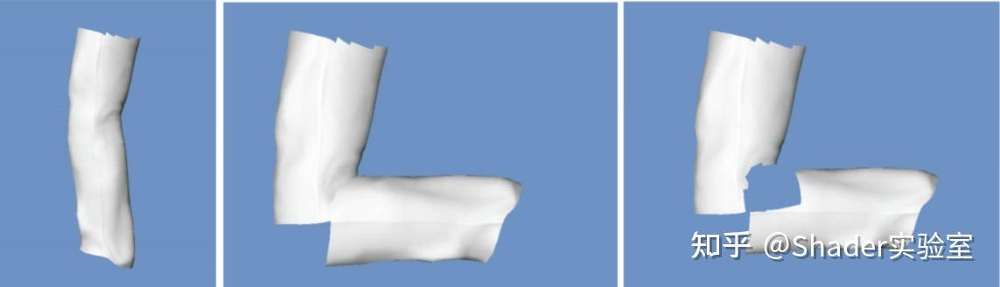

为了解决这个问题，我们需要把角色的皮肤当作一个连续的网格来处理。但是这样就会出现一个问题，一个顶点到底应该被哪些地方影响？这个过程是如何定义的？

> 为了解决上述问题，需要引入新的变换矩阵: **Offset Transform**, 骨架中的每根骨骼都有一个对应的**[Offset Matrix](https://zhida.zhihu.com/search?content_id=165746680&content_type=Article&match_order=1&q=Offset+Matrix&zhida_source=entity)**，Offset Matrix指的是蒙皮网格顶点绑定到骨骼时，从绑定空间到相应的骨骼空间(**Bone Space**)的变换矩阵。绑定空间指的是角色网格在应用任何骨骼变换之前的默认姿势(坐标空间)(也就是此时Bone Matrix为identify)，比如**T-Pose。**

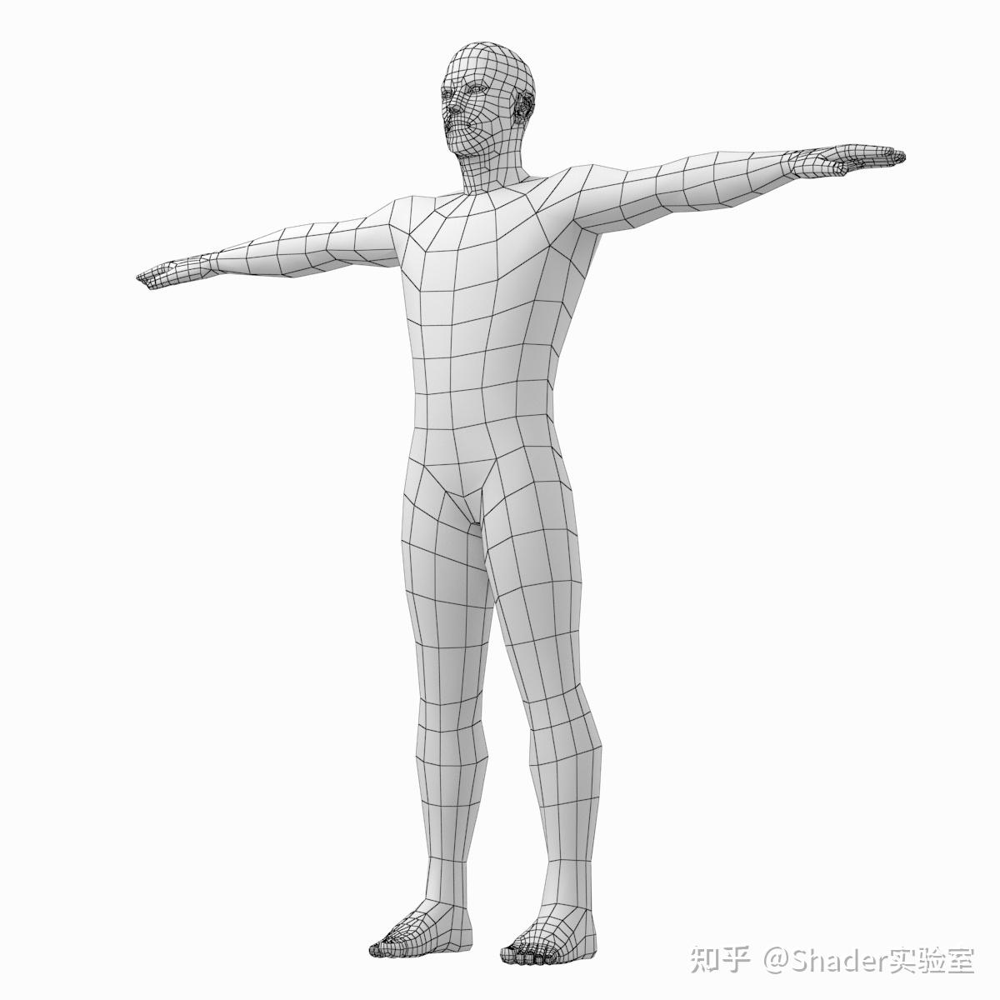

最常用的蒙皮算法叫 **Linear Blend Skinning (LBS)**。 它的核心思想是：**一个顶点可以被多根骨头拉扯，最终位置是这些拉扯结果的加权平均。**


同一个顶点最多限制为受4根骨骼的影响。一般会如下定义顶点结构：

```cpp
struct Vertex
{
	vec3 pos;
	vec3 normal;
	vec2 uv;
	vec4 jointIndices; //jointIndices代表四根骨骼的索引(也就是对应骨骼矩阵的索引，之所以不直接存储矩阵,是为了减少内存消耗)
	vec4 jointWeights; //jointWeights代表对应骨骼影响顶点的权重。不一定4根骨骼都会对相应顶点产生影响，比如只有两根骨骼产生了影响，那么另外两根骨骼的权重值就为0，且骨骼的索引可能为-1
}
```

假设一个顶点 $V$ 受两根骨头（骨头 A 和 骨头 B）影响，公式如下：
$$
V_{final} = (w_A \times M_A \times V) + (w_B \times M_B \times V) \\
其中 w_A + w_B = 1 \\
V: 顶点在模型空间（Model Space）的初始位置（美术做模型时的位置） \\
w_A, w_B: 权重。比如肘部的皮肤，可能上臂占 0.5，前臂占 0.5。 \\
$M_A, M_B$: 这是一个复合矩阵，这是蒙皮最难理解的地方
$$
上面的M并不直接是骨骼的变换矩阵，因为骨骼的变换矩阵是定义在<span style="color:#66FF66;">骨骼的局部坐标系</span>下的，而Vertex是定义在<span style="color:#66FF66;">模型的局部坐标系</span>下的，因此上面的M矩阵是一个复合矩阵，需要把骨骼的变换矩阵退回到模型坐标系下。

所以，蒙皮矩阵 $M$ 实际上包含了两步操作：
$$
M_{final} = M_{anim} \times M_{bind}^{-1} \\
M_{bind}^{-1}：代表骨骼的初始状态（的逆）。\\
M_{anim}：代表骨骼的当前状态。
$$
**$M_{bind}^{-1}$**：代表骨骼的 **“初始状态”**（的逆）：当我们定义一个TPose的时候，每个骨骼也都会有一个初始的状态，这时候到这个状态是需要一个变换的，也就是**$M_{bind}^{-1}$**

**$M_{anim}$**：代表的则是在骨骼的局部坐标系下，这个骨骼发生的变换

这俩乘在一起标识的就是：这根骨头，相对于它原本在 T-Pose 时的那个位置，发生了什么样的**偏移和旋转**？。

> 补充一下$M_{bind}$ 这个骨骼初始状态代表了什么，他其实代表了，某个骨骼的局部坐标系相对于TPose下的变换。因此这个矩阵可以把顶点拉到它对应的骨骼坐标系下

所以，蒙皮的过程就变成了：

1. 算出这根骨头相对于初始位置的 **“变化量”**。
2. 直接把这个 **“变化量”** 施加给顶点。


### <span style="color:#FFB266;">IK的原理</span>

还是先理解为啥需要IK，FK叫做正向动力学，IK是反向动力学。FK（正向动力学）是“我告诉关节转多少度，算出手动到哪里”。 IK（反向动力学）是“我告诉手要摸哪里，算法帮我算出关节该怎么转”。

#### 两骨骼 IK (Two-Bone IK / Analytical IK)

https://zhuanlan.zhihu.com/p/457339033

人形角色的手臂、腿。这是游戏里用得最多的（占 90%）。 **原理：** 几何解析解

想象你的大腿、小腿和脚踝。

- **Root:** 大腿根部（a）
- **Joint:** 膝盖(b)
- **End:** 脚踝(c)
- **Target:** 脚踩的地面位置(t)

abc构成了一个三角形，接下来的目标就是调整b和c，使得c尽可能的和t靠近

这里abt构成了一个三角形，因此可以直接算出

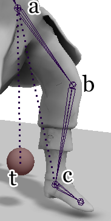

推导如下：

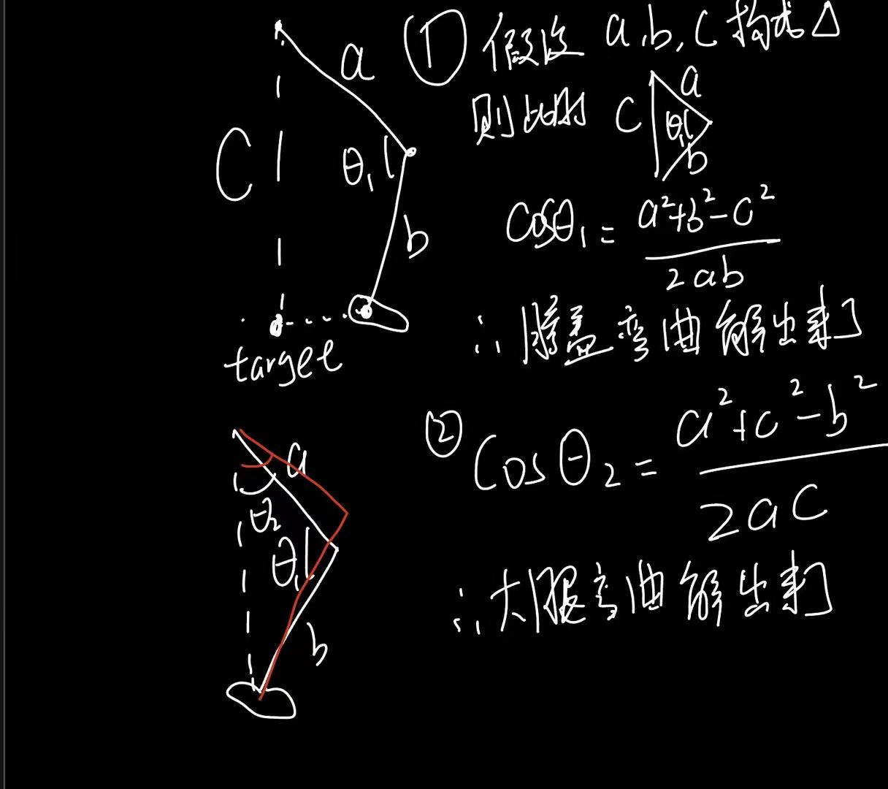

应用的时候遵循这个顺序：首先计算整条腿的长度够不i够长，如果太短了那就直接拉直了

如果可以，计算出$\theta_1$和 $\theta_2$，也就是膝关节的和胯关节的旋转角度，然后先把大腿拉直直接指向Target点，然后旋转大腿，然后再根据大腿旋转小腿

然后这里还有个问题，就是如果只是确定了角度，那么其实这个腿可以向四面八方旋转。他这个膝盖可以顶到身后去。

因此引入了一个极向量，这个极向量通常就是膝盖前方或者侧方的一个参考点。这样Root，Target和极向量点就确定了唯一一个平面

在这个平面上，我们可以算出**法线 (Normal Vector)**。

- 使用 **叉积 (Cross Product)**。
- `Axis = Cross(Root_to_Target, Root_to_Pole)`

所有的旋转都是在这个平面上进行的

#### CCD——Cyclic Coordinate Descent, 循环坐标下降

从末端的骨骼开始，尝试旋转，然后递归的改变父节点骨骼的方向


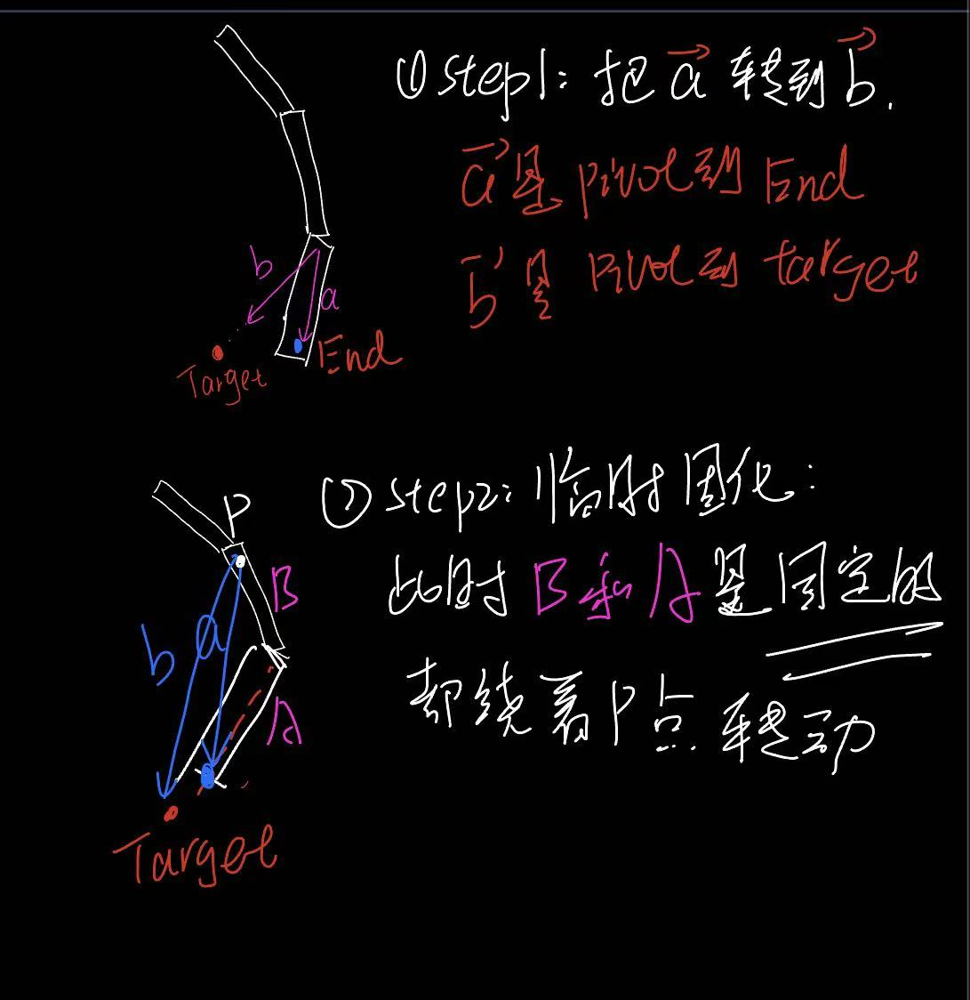

问题：当我们往回算到中间的骨骼（比如 B）时，它的子节点（C）刚刚已经转过了。那 B 在转的时候，怎么处理 C？是把 C 掰直了转？还是不管 C？

答案是：**它完全无视 C 的“意愿”，把 C 当成一根焊死的棍子带着甩。**我们需要引入一个核心概念：**“临时固化（Temporary Solidification）”**。<span style="color:#66FF66;">这实际上就是骨骼动画的层级变换的体现(CCD 算法本质上就是利用“骨骼动画的层级传递机制”来反向欺骗系统。)</span>

> 在 CCD 的计算过程中，**当你处理某一个关节时，这个关节以下的所有骨骼，在逻辑上瞬间变成了一个不可弯曲的整体。**
>
> 让我们用 **肩膀 -> 手肘 -> 手腕 -> 指尖** 来举例。目标是让 **指尖** 碰到 **苹果**。
>
> #### 步骤 1：处理手腕（末端）
>
> - **动作：** 手腕旋转，把指尖对准苹果。
> - **状态：** 手腕弯了。
>
> #### 步骤 2：处理手肘（中间节点 —— 你的困惑点）
>
> 这时候轮到手肘计算了。
>
> - **关键点：** 此时此刻，算法假装 **“手腕坏了，被石膏固定住了”**。
> - **视作整体：** 手肘不再关心“前臂”和“手掌”是两截骨头。在手肘眼里，**从手肘开始，一直到指尖，这就是一根形状弯弯曲曲的长棍子**。
> - **计算逻辑：**
>   - **圆心：** 手肘。
>   - **棍子尖端：** 依然是 **指尖**（注意！目标永远是指尖，而不是手腕）。
>   - **动作：** 手肘旋转，试图让这根“弯曲长棍”的尖端（指尖）去接近苹果。
> - **结果：** 手肘转动时，手腕和手掌保持着刚才弯曲的角度，整个被甩了过去。
>
> #### 步骤 3：处理肩膀（更上层的节点）
>
> 这时候轮到肩膀计算了。
>
> - **关键点：** 此时算法假装 **“手肘和手腕都打石膏了”**。
> - **视作整体：** 在肩膀眼里，整条手臂（大臂+小臂+手掌）就是一个刚体。
> - **动作：** 肩膀旋转，试图让这个大刚体的尖端（指尖）去接近苹果。


## 其他

### 贝母 GC


### Unity和C++

https://www.youtube.com/watch?v=NKIdxJAbr0Q

# 图形学

## 渲染

### <span style="color:#FFB266;">渲染流程 **什么是图形渲染管线，分为哪些阶段？**</span>

在概念上可以将图形渲染管线分为四个阶段：应用程序阶段、几何阶段、光栅化阶段和像素处理阶段。

#### 第一阶段：应用阶段 (Application Stage) - CPU

这是在 Unity/C++ 代码里控制的部分。

1. **数据准备**：加载 Mesh、Texture、Shader 参数。
2. **粗粒度剔除 (Culling)**：视锥体剔除 (Frustum Culling)、遮挡剔除 (Occlusion Culling)。把根本看不见的东西扔掉，不喂给 GPU。
3. **渲染状态设置 (SetPass)**：告诉 GPU 接下来怎么画（用哪个 Shader？开启深度测试吗？混合模式是什么？）。
4. **发送 Draw Call**：调用图形 API（如 `DrawIndexedInstanced`），命令 GPU：“给我画这 1000 个三角形！”。

- **瓶颈点**：Draw Call 太多（CPU 也就是主线程压力大）。
- **DX12 的优化**：DX12 允许你录制 **Command List** 并在多线程上提交，大幅降低了这一步的 CPU 开销。

#### 第二阶段：几何阶段 (Geometry Stage) - GPU 前端

这一阶段主要处理**顶点 (Vertex)**。

输入装配 (Input Assembler, IA)

GPU 从显存（Vertex Buffer / Index Buffer）里读取原始数据，把它们组装成点、线或三角形。

顶点着色器 (Vertex Shader, VS) —— **核心**

- **任务**：处理每一个顶点。这里是并行的，每个顶点互不干扰。

- 最主要工作：坐标变换。

  

  $$\text{ClipSpacePos} = \text{Projection} \times \text{View} \times \text{Model} \times \text{LocalPos}$$

  

  把顶点从模型空间变换到裁剪空间。

- **其他工作**：计算顶点动画（如蒙皮）、传递数据给下一阶段（如 UV、法线）。

曲面细分 (Tessellation) & 几何着色器 (Geometry Shader) —— **(可选)**

- **Tessellation**：把一个三角形拆成更多小三角形（增加细节，如做地形、水面）。
- **Geometry Shader**：也就是 DX12 里的 GS。它可以凭空生成新的顶点（比如把一个点变成一个粒子板）。*注意：GS 性能通常较差，现代管线倾向于用 Compute Shader 或 Mesh Shader 替代。*

裁剪 (Clipping)（注意，必须先裁剪再透视除法）

​	硬件固定操作。把视锥体外面的三角形切掉。

透视除法

屏幕映射 (Screen Mapping)

​	把裁剪空间的坐标（-1 到 1）映射到你的屏幕分辨率坐标（比如 1920x1080）。

背面剔除

#### 第三阶段：光栅化与像素阶段 (Rasterization & Pixel Stage) - GPU 后端

这一阶段处理**片元 (Fragment)**，也就是“潜在的像素”。

光栅化 (Rasterization) / 三角形遍历

- **任务**：找出屏幕上哪些像素被这个三角形覆盖了。
- **插值 (Interpolation)**：这是关键一步。根据**重心坐标**，把顶点属性（颜色、UV、法线）插值给每一个像素。
  - *例子*：顶点 A 是红色，顶点 B 是蓝色，中间的像素就是渐变色。

像素着色器 (Pixel Shader, PS) / 片元着色器 (Fragment Shader) —— **核心**

- **任务**：决定这个像素到底是什么颜色。
- **最重的工作**：
  - **纹理采样**：根据插值后的 UV 去读贴图。
  - **光照计算**：PBR、Blinn-Phong 等都在这里算。
- **性能**：这是 GPU 负载最大的地方。如果你的游戏分辨率高、特效多，这里就是瓶颈（Fillrate Bound）。

输出合并 (Output Merger) / ROP (Raster Operations)

这一步决定了算出来的颜色能不能写到屏幕上。包含一些列**测试**：

- **Alpha Test**：透明度测试（如果 alpha < 0.1 就丢弃）。
- **Depth Test (Z-Test)**：深度测试。
  - *重要优化*：**Early-Z**。现代 GPU 会尽量在 Pixel Shader **之前**就进行深度测试。如果这块像素被前面的墙挡住了，就根本不需要运行 PS（省下巨大的计算量）。
- **Stencil Test**：模板测试（比如做描边、遮罩）。
- **Blending**：混合。如果是半透明物体，需要把当前颜色和 Framebuffer 里已有的颜色按公式混合（$Src \times \alpha + Dst \times (1-\alpha)$）。


### <span style="color:#FFB266;">MVP变换</span>

MVP变换都是CPU计算的，但是MVP变换是GPU应用的

在现代渲染管线（如 URP）中，流程是这样的：

1. **Frame Start (CPU):**
   - CPU 算出摄像机的 **V 矩阵** 和 **P 矩阵**。
   - CPU 往往会将它们相乘得到 **VP 矩阵**。
   - CPU 将这些“全局变量”上传到 GPU 的一个公共区域（叫做 `UnityPerFrame` 或 `CameraConstantBuffer`）。
   - *注：这一步很快，因为全场景共享一套 VP。*
2. **Draw Object (CPU):**
   - CPU 算出当前物体的 **M 矩阵**。
   - CPU 发送 DrawCall，并将 **M 矩阵** 上传给 GPU（在 `UnityPerDraw` 中）。
3. **Vertex Shader (GPU):**
   - GPU 拿到全局的 **VP**。
   - GPU 拿到当前的 **M**。
   - GPU 对每个顶点执行：`Position = VP * M * vertex`。


**Model 矩阵（物体怎么动）：**

- 我要把一个放在原点的摄像机模型，摆放到世界坐标 $(P)$，并让它转头 $(R)$。

- 操作顺序：**先旋转 (自转)，再平移 (到位)**。

- 公式：$M_{cam} = R \times T$

- 公式2：现代的引擎一般是$$M_{Model} = M_{Scale} \times M_{Rotation} \times M_{Translation}$$

  > 第一步应该把模型放在世界坐标系的原点，然后Scale，然后Rotation，然后Trans
  >
  > **“第一步把模型放在世界坐标系的原点”**
  >
  > - 此时，模型的“脚底心”（Local Origin）和世界的原点 $(0,0,0)$ 是**重合**的。
  > - 在这种重合状态下，**局部坐标系 = 世界坐标系**。（当位移为 0 时，局部空间和世界空间在数学上是不可区分的）
  >
  > **“然后 Scale”**
  >
  > - 你在世界原点把模型吹大。
  > - 因为模型在原点，所以它向四周膨胀，但中心点不动。
  > - **矩阵操作：** $v' = v \times S$
  >
  > **“然后 Rotation”**
  >
  > - 你在世界原点把模型转了个向。
  > - 因为模型还在原点，所以它是原地自转（绕着世界原点转，同时也等于绕着它自己的中心转）。
  > - **矩阵操作：** $v'' = v' \times R = v \times S \times R$
  >
  > **“然后 Trans”**
  >
  > - 最后，你把这个已经缩放好、旋转好的模型，从世界原点“搬”到了 $(100, 0, 0)$。
  > - **矩阵操作：** $v_{final} = v'' \times T = v \times S \times R \times T$

**View 矩阵（世界怎么动）：**

- View 矩阵是 Camera Model 矩阵的**逆矩阵 (Inverse)**。
- 数学性质：$(A \times B)^{-1} = B^{-1} \times A^{-1}$。
- 所以：$View = (R \times T)^{-1} = T^{-1} \times R^{-1}$。
- $T^{-1}$ 就是反向平移，$R^{-1}$ 就是反向旋转。
- **操作顺序变成了：先平移，再旋转！**
- 现代的方法是：用Camera的LookTo，Right，和Pos就可以计算出View矩阵。


### EarlyZ

### 为什么 AlphaTest 或者说是 Discard 会打断 EarlyZ

### 前向渲染和延迟渲染


### 不透明物体的渲染顺序应该是怎样的

### 透明渲染

### 顺序无关的透明效果


## 贴图

### 法线贴图和切线坐标系


## 阴影

### 硬阴影

### ShadowMap，以及 ShadowMap 的 Bias 如何解决毛刺，以及 MipMap，边缘处理

### 为什么需要 MipMap？

https://zhuanlan.zhihu.com/p/633122224

https://www.wolai.com/vnqjTdQ83k19nJ1wCkCEdm

想象你有一张 $1024 \times 1024$ 像素的精细地砖纹理。

- **近处**：摄像机就在地砖旁边，一个屏幕像素对应纹理上的一个像素，看起来很清晰。
- **远处**：地砖在视野尽头缩成了一个点。此时，屏幕上可能只有 $1 \times 1$ 个像素，但它却要对应原始纹理中 $100 \times 100$ 个像素区域。

如果不处理，显卡只能从这 10000 个像素里随机挑一个（点采样），导致画面闪烁（走样/Aliasing）。

MipMap 的核心思想是**空间换时间**。它在渲染前预先生成一系列缩小版的纹理序列，每一级长宽各缩小一半。

- **Level 0**: $1024 \times 1024$
- **Level 1**: $512 \times 512$
- **Level 2**: $256 \times 256$
- ……直到 $1 \times 1$。
- **内存占用**：虽然层级变多了，但根据几何级数求和，总内存占用仅增加约 **33.3%**。

采样：想先下，对于MipMap的采样，它是三个参数($u_{mip}$, $v_{mip}$, L )，uv好说，L是纹理细节级别，texture level of detail

当一个三角形被渲染时，GPU 会计算纹理坐标 $(u, v)$ 相对于屏幕坐标 $(x, y)$ 的变化率（即偏导数）：

- $\frac{\partial u}{\partial x}, \frac{\partial v}{\partial x}$：屏幕水平移动 1 像素时，$u,v$ 变化了多少。
- $\frac{\partial u}{\partial y}, \frac{\partial v}{\partial y}$：屏幕垂直移动 1 像素时，$u,v$ 变化了多少。

这些偏导数定义了像素在纹理空间中的**足迹大小**。

#### 2. 计算 LOD 层级

GPU 取这些变化率中最大的一个来代表像素的覆盖范围：也就是反应了像素移动一个单位的时候，纹素的横纵移动的最大变化率

$$L = \max\left( \sqrt{(\frac{\partial u}{\partial x})^2 + (\frac{\partial v}{\partial x})^2}, \sqrt{(\frac{\partial u}{\partial y})^2 + (\frac{\partial v}{\partial y})^2} \right)$$

最终的 MipMap 层级 $D$（浮点数）计算公式为：

$$D = \log_2(L)$$

#### 3. 三线性采样（Trilinear Sampling）的过程

如果计算出的 $D = 1.5$，GPU 会执行以下操作：

1. 在 **Level 1** 进行一次双线性插值（取 4 个纹素）。

2. 在 **Level 2** 进行一次双线性插值（取 4 个纹素）。

3. 将这两个结果按 0.5 的权重进行线性混合。

   这样就保证了视角移动时，清晰度是丝滑变化的，不会出现跳变。


### 各向异性过滤

####  MipMap 的局限性

MipMap 有一个致命弱点：它假设纹理在所有方向上都是**等比例缩小**的（即“各向同性”）。 但在实际游戏中，我们经常**斜着**看地面。这时，地面的纹理在水平方向（X）缩减较慢，但在垂直方向（Y，即纵深方向）缩减极快。

- **MipMap 的处理方式**：<span style="color:#66FF66;">它会选择一个最模糊的层级来覆盖，导致远处的地面看起来像涂了胶水一样模糊。</span>

#### 识别各向异性

GPU 会对比刚才提到的两个向量的长短：

- **大边 $P_{max}$**：足迹最长的方向。
- **小边 $P_{min}$**：足迹最短的方向。
- **各向异性比例（Anisotropy Ratio）**：$R = P_{max} / P_{min}$。

####  采样过程：多点探针（Probing）

传统的 MipMap 会取最大的边 $P_{max}$ 来选层级，导致在短边方向上过度模糊。**AF 的改进在于：它改用短边 $P_{min}$ 来选择 MipMap 层级（即选择较清晰的那一层）**。

为了弥补在长边方向上采样不足的问题，AF 会沿着长边的方向布置 **多个采样探针**：

1. **确定层级**：根据 $P_{min}$ 选择一个较高的分辨率层级。
2. **布置点位**：根据 AF 倍数（如 16x），沿着足迹的长轴方向布置 $N$ 个采样点。
3. **求平均值**：对这 $N$ 个点的采样结果求平均，得到最终颜色。

> **举例**：如果你开启了 16x AF，当比例 $R=16$ 时，GPU 可能会在这一像素内进行 16 次三线性采样（或者更高效的近似算法），把这一长条区域内的细节全部抓回来。


### <span style="color:#FFB266;">如何确定ShadowMap的相机范围：FitScene和FitView</span>

FitView的方法是：根据主相机的大小来确定Shadowmap的相机大小：

方法是：先把主相机的视锥体变换到光源坐标系下，然后计算光源坐标系下的视锥体的AABB，

这样光源相机的最近最远平面就是根据AABB的Z轴来算的。

**Left/Right:** $min\_x / max\_x$

**Bottom/Top:** $min\_y / max\_y$


### <span style="color:#FFB266;">CSM</span>

<span style="color:#66FF66;">主要是要理解过程，说白了，就是把主视锥体按照深度分段，然后每段视锥体都对应一个FItView方法确定的光源Camera。生成一个ShadowMap。然后采样的时候，根据主视锥体的深度确定当前vertex要在哪张shadowMap采样，根据光源坐标系下变换后的UV坐标采样。</span>


没问题，CSM（Cascaded Shadow Maps，级联阴影图）听起来很高大上，但它的核心思想其实非常简单，就是四个字：**分而治之**。

我们可以通过**“痛点”、“原理”和“实现步骤”**这三个维度彻底搞懂它。

------

#### 痛点：为什么单张 Shadow Map 不够用？

想象一下你站在一片巨大的草原上：

- **脚下的草丛**：离你只有 1 米，你希望能看清每一片叶子的阴影（需要极高的精度）。
- **远处的山**：离你 1000 米，阴影稍微糊一点完全没关系。

如果你只有一张 `2048x2048` 的 Shadow Map 覆盖这整个 1000 米的范围：

- 平均每 1 米只能分到 2 个像素。
- 结果：你脚下的草丛阴影会变成巨大的马赛克（锯齿），而远处的山分配了过多的精度却看不出来。这叫 **透视走样 (Perspective Aliasing)**。

**CSM 的解决方案：** 既然远近需求不同，那我就**多搞几张 Shadow Map**，分别覆盖不同的距离范围。

------

####  CSM 的核心原理：切分视锥体 (Frustum Splitting)

CSM 的做法是把你（玩家摄像机）的视锥体，按照距离（Z轴深度）切成几段（通常是 3 到 4 段，也就是 Cascades）。

- **第 0 级 (Cascade 0):** 只覆盖你眼前 0~10 米的范围。
  - 因为范围小，同样的 2048x2048 贴图，精度极高。
- **第 1 级 (Cascade 1):** 覆盖 10~50 米的范围。
- **第 2 级 (Cascade 2):** 覆盖 50~200 米的范围。
- **第 3 级 (Cascade 3):** 覆盖 200~1000 米的范围。
  - 范围巨大，精度低，但因为离得远，玩家看不出锯齿。

------

#### 3具体做法与流程 (Implementation)

这通常涉及到 CPU 的计算和 Shader 的配合。

##### 步骤一：CPU 计算（最难的一步）

每一帧，在 C++ 端，你需要为每一级 Cascade 算出一个独立的**光源投影矩阵 (Light Projection Matrix)**。

1. **切分:** 根据设定的比例（如对数分割），把主摄像机的视锥体切成 4 段小视锥体。
2. **计算包围盒:** 对于每一段小视锥体，算出它在世界坐标下的 8 个顶点。
3. **包住它:** 计算出一个能包住这 8 个顶点的**AABB（轴对齐包围盒）**，这个包围盒是基于光源方向的（Light Space）。
4. **生成矩阵:** 根据这个 AABB，生成该级 Shadow Map 的正交投影矩阵 (Orthographic Projection)。
   - *Cascade 0 的矩阵覆盖范围很小。*
   - *Cascade 3 的矩阵覆盖范围很大。*

*(这里有个坑：为了防止摄像机移动时阴影边缘闪烁，这个 AABB 通常需要对齐到 ShadowMap 的像素大小，这叫 Texel Snapping)*

##### 步骤二：Shadow Pass（生成阴影图）

现在你有 4 个矩阵，你需要画 4 次阴影（或者用 Geometry Shader / Instancing 一次性画完）。

- 渲染目标通常是一个 **Texture2DArray** (纹理数组)，比如 4 层。
- 把场景里的物体渲染到这 4 张图中。
- **结果：** 显存里有了 4 张 Shadow Map，分别记录了不同距离范围内的遮挡情况。

##### 步骤三：Main Pass（采样阴影）

这是你最关心的部分：**在 Shader 里怎么知道该采哪张图？**

在 Pixel Shader 中，你知道当前像素在主摄像机下的线性深度 `viewDepth` (或者是 `z` 值)。

```High-level shader language
// 伪代码逻辑
float4 finalShadow = 1.0;

// 1. 判断像素离摄像机多远
int cascadeIndex = 0;
if (viewDepth < 10.0) {       // 0~10米
    cascadeIndex = 0;
} 
else if (viewDepth < 50.0) {  // 10~50米
    cascadeIndex = 1;
} 
else if (viewDepth < 200.0) { // 50~200米
    cascadeIndex = 2;
} 
else {                        // 远方
    cascadeIndex = 3;
}

// 2. 获取对应层级的变换矩阵 (从 Constant Buffer 或 Structured Buffer 读取)
float4x4 lightMatrix = ShadowMatrices[cascadeIndex];

// 3. 计算该层级下的 Shadow Coord
float4 shadowCoord = mul(float4(worldPos, 1.0), lightMatrix);

// 4. 在对应的那一层 TextureArray 上采样
// ShadowMapArray 是一个 Texture2DArray
float shadow = ShadowMapArray.SampleCmp(sampler, float3(shadowCoord.xy, cascadeIndex), shadowCoord.z);
```

------

### <span style="color:#FFB266;">总结</span>

**CSM 的本质就是“套娃”：**

1. **近处**用显微镜看（范围小，ShadowMap 像素密度极高）。
2. **远处**用望远镜看（范围大，ShadowMap 像素密度稀疏）。
3. **Shader** 里做一个简单的 `if-else` 判断（或者比较操作），根据像素距离决定用哪一套数据。

## 反走样和摩尔纹

### MipMap

### MSAA，TSAA，SSAA

### 各向异性


## 高级图形学

### AO 和 SSAO

### <span style="color:#FFB266;">辐射度量学</span>

最基本的光照强度是这样的：一定时间内，在一定面积上的光照能量的累计

如果我们给定单位时间，在一定面积上累计的光照的能量就叫做Radiant Flux（通量）

给定单位立体角，在一定面积上累计的光照的通量叫做Radiant Indensity

给定单位立体角，在单位 **投影面积**上累计的光通量叫做Radiance

给定单位面积，考虑所有立体角在单位面积上的光通量的积分叫做Irradiance

### <span style="color:#FFB266;">PBR 的 BRDF 公式</span>

在5.2的基础上推导，实际上BRDF描述的就是：入射光Irradiance和出射光各个方向上的Raidance的关系

PBR的成立条件包括了三个：

1. 微表面理论 2. 能量守恒 3. 基于物理的BRDF

计算BRDP基本上是计算高光部分，然后漫反射部分就是直接能量守恒了

镜面反射：

假定我从一个方向观察一个平面，那么这时候，之后符合我观察方向反方向的反射光，才能被我看到。

这时候，要回答的就是，从各个方向的入射光中，有多少能够经过反射之后成为这个方向的反射光。

这时候要求的就是，给定一个入射方向，一个反射方向，可以确定一个微平面的法线方向。那么有多少的微平面是符合这个法线方向的，就是D项回答的。

而微平面之间是有遮挡关系的，所以要过滤掉一部分。

接下来，可以反射的这些入射光，还会被微表面散射一部分，这部分就是菲涅尔描述的。根据非菲涅尔效应，入射角度的反方向和法线方向越一致，反射的就越少。算完之后就是成功镜面反射的部分光的Radiance了

漫反射：

> 接下来，可以反射的这些入射光，还会被微表面散射一部分，这部分就是菲涅尔描述的。根据非菲涅尔效应，入射角度的反方向和法线方向越一致，反射的就越少。算完之后就是成功镜面反射的部分光的Radiance了

这句话中，有一部分入射光在菲涅尔的计算下，他被散射了一部分，而被散射的着一些，并不一定全部都被散射了。 

如果是**金属**：这部分光被直接吃掉（吸收）了。

如果是**非金属**：这部分光钻进肚子里，乱撞一通后跑出来，变成了**漫反射**。

因此有多少被散射了，还要考虑金属度，如果是纯金属，那么就会被完全吸收，如果是非金属，就会有一部分被漫反射

```c++
vec3 kS = Fresnel(...); // 算出高光反射的比例 (F项)
vec3 kD = 1.0 - kS;     // 剩下的就是折射进去的 (能量守恒！)

kD *= (1.0 - metallic); // 如果是金属，强行把漫反射置为0
```


### PBR 的基本原理

### IBL 的实现是如何的

### 如何实现 SkyBox


## 其他

### 各种剔除的方法（区分 CPU 时候的剔除和 GPU 时候的剔除），视锥剔除和裁剪

### AABB 和 OBB

### 八叉树，KDTree，BVH

### Gamma 矫正，线性空间

### <span style="color:#FFB266;">射线和AABB求交集</span>

**Slab Method**（平板法）:把 3D 的 AABB 盒子看作是三组平行的“无限大平板”（Slabs）的交集

AABB的情况下：无论是是几维的（这里假设是三维），一条射线和三维的三组面都有各自有交点，分别计算射线与每一对平面的相交区间 $[t_{enter}, t_{out}]$，也就是光进入一对面的时间，和离开这一对面的时间。

然后三组面都求出进入和离开。求所有进入时间的最大值和离开时间的最小值，如果$t_{max\_enter} \le t_{min\_out}$，并且$t_{min\_out} > 0$（因为光是有方向的，这个限制限制了包围盒不在光的起点的反方向） 那么就有交点

$$
P(t) = Origin + t \times Direction \\
AABB 的 X 轴范围是 [x_{min}, x_{max}] \\
\\
求射线与 x=x_{min} 平面的交点 t：\\
Origin_x + t \times Dir_x = x_{min} \\
t = \frac{x_{min} - Origin_x}{Dir_x}
$$
我们需要找的是：

1. **最晚的进入时间** ($t_{enter} = \max(t_{x\_enter}, t_{y\_enter}, t_{z\_enter})$)
2. **最早的离开时间** ($t_{exit} = \min(t_{x\_exit}, t_{y\_exit}, t_{z\_exit})$)

判定条件：

如果 $t_{enter} \le t_{exit}$ 且 $t_{exit} \ge 0$，说明相交。

为了性能，通常会预先计算 `1 / RayDirection`，把除法变乘法。

```c++
#include <algorithm> // for std::max, std::min
#include <cmath>     // for std::swap

struct AABB {
    glm::vec3 min; // 盒子的最小角
    glm::vec3 max; // 盒子的最大角
};

struct Ray {
    glm::vec3 origin;
    glm::vec3 dir;       // 必须是归一化的
    glm::vec3 invDir;    // 预计算：1.0f / dir
    
    Ray(glm::vec3 o, glm::vec3 d) : origin(o), dir(d) {
        // 预计算倒数，避免后续大量的除法运算
        // 注意：IEEE 754 标准下，1.0 / 0.0 会得到 Inf，这在 Slab 算法中是可以正常工作的！
        invDir = glm::vec3(1.0f/d.x, 1.0f/d.y, 1.0f/d.z);
    }
};

bool SlabMethodIntersection(const Ray& ray, const AABB& box, float& tHit) {
    float tMin = 0.0f;          // 射线的有效起始距离（近裁剪面或0）
    float tMax = 100000.0f;     // 射线的最大射程

    // --- X 轴 Slab 检测 ---
    // 计算进入面和离开面的 t
    float tx1 = (box.min.x - ray.origin.x) * ray.invDir.x;
    float tx2 = (box.max.x - ray.origin.x) * ray.invDir.x;

    // 确保 tx1 是进入时间，tx2 是离开时间（如果射线反向，swap一下）
    float tNear = std::min(tx1, tx2);
    float tFar  = std::max(tx1, tx2);

    // 更新整体的进入和离开时间
    tMin = std::max(tMin, tNear);
    tMax = std::min(tMax, tFar);

    // 如果“最晚进入”比“最早离开”还晚，说明没有重叠，没打中
    if (tMin > tMax) return false;

    // --- Y 轴 Slab 检测 ---
    float ty1 = (box.min.y - ray.origin.y) * ray.invDir.y;
    float ty2 = (box.max.y - ray.origin.y) * ray.invDir.y;
    tNear = std::min(ty1, ty2);
    tFar  = std::max(ty1, ty2);

    tMin = std::max(tMin, tNear);
    tMax = std::min(tMax, tFar);

    if (tMin > tMax) return false;

    // --- Z 轴 Slab 检测 ---
    float tz1 = (box.min.z - ray.origin.z) * ray.invDir.z;
    float tz2 = (box.max.z - ray.origin.z) * ray.invDir.z;
    tNear = std::min(tz1, tz2);
    tFar  = std::max(tz1, tz2);

    tMin = std::max(tMin, tNear);
    tMax = std::min(tMax, tFar);

    if (tMin > tMax) return false;

    // 此时相交
    tHit = tMin; // 记录击中点的距离
    return true;
}
```


### LOD

### 欧拉角和欧拉角

### 凹凸贴图，法线贴图等


## DX12

### DX12 的创建渲染流程


### <span style="color:#FFB266;">DX12和DX11的区别</span>

1. 状态管理 ： 都是状态机，但是DX12相当于是保存了整个的状态机状态，一下全部设置上去，而DX11是一个细节一个细节的切换。DX11的问题在于，很多状态的设置并不是设置完了就完了，又很多设置是会导致GPU重新编译微指令的，而DX11只能在设置完了Draw的时候才开始编译。但是DX12相当于在提前设置PSO的时候就直接编译好了


2. 资源绑定：非常重要的一点是，DX12把一开始DX11的GPU干的活让开发者做了，一个经典的例子是：当我们绑定一个纹理到流水线的时候，对于DX11，GPU会做检查，检查它是否在其他地方作为一个RenderTarget（资源冒险检查），纹理是否在显存里（隐式分页）等等

但是DX12的ResourceBarrier就是把这个任务完全交给开发者，当我们对于一个资源，要把它作为一个SRV使用读取的时候，我们要首先保证它确实在DefualtHeap上，并且我们要自己保证调用ResourceBarrier，让他作为一个Read的资源权限。

### <span style="color:#FFB266;">三种CommandQueue</span>

####  Direct Command Queue (直接队列 / 通用队列)

- **对应 D3D12 枚举：** `D3D12_COMMAND_LIST_TYPE_DIRECT`
- **对应 Vulkan：** Graphics Queue
- **能力：** **全能**。
  - ✅ **Graphics (图形渲染):** Draw Call, 光栅化管线。
  - ✅ **Compute (计算):** Dispatch, 计算着色器。
  - ✅ **Copy (复制):** 资源拷贝。
- **特点：**
  - 这是最“昂贵”的队列，通常对应 GPU 的主 3D 引擎。
  - 它是唯一能执行光栅化（画三角形）的队列。
  - **注意：** 虽然它什么都能干，但如果你用它来做简单的内存拷贝，就会占用宝贵的 3D 渲染资源。

####  Compute Command Queue (计算队列)

- **对应 D3D12 枚举：** `D3D12_COMMAND_LIST_TYPE_COMPUTE`
- **对应 Vulkan：** Compute Queue (Async Compute)
- **能力：**
  - ❌ **Graphics:** 不能进行光栅化渲染。
  - ✅ **Compute:** 可以执行计算着色器。
  - ✅ **Copy:** 可以执行资源拷贝。
- **特点：**
  - 对应 GPU 的 **ACE (Asynchronous Compute Engine)** 单元。
  - **异步计算 (Async Compute):** 它的最大用途是与 Direct Queue **并行**运行。例如，当 Direct Queue 在渲染 Shadow Map 时，Compute Queue 可以同时在后台计算环境光遮蔽 (SSAO) 或物理模拟，互不阻塞。

#### Copy Command Queue (复制队列 / 传输队列)

- **对应 D3D12 枚举：** `D3D12_COMMAND_LIST_TYPE_COPY`
- **对应 Vulkan：** Transfer Queue
- **能力：**
  - ❌ **Graphics:** 不行。
  - ❌ **Compute:** 不行。
  - ✅ **Copy:** **只能**进行数据传输（Buffer/Texture 的上传或回读）。
- **特点：**
  - 对应 GPU 的 **DMA (Direct Memory Access)** 引擎（Blit Engine）。
  - **独立运行：** 它在移动数据时完全不占用 Shader Core（着色器核心）的算力。
  - **用途：** 它是实现“无缝加载”的关键。比如在玩游戏时，后台静默加载下一个场景的纹理，使用 Copy Queue 就不会导致前台画面的帧率掉坑（Hitch）。

### <span style="color:#FFB266;">DX12多线程</span>

CommanList彻底解耦了命令的“录制”与“提交”

DX12的设计在于，它把大量检查的工作交给了开发者，CommandQueue的压力很小，所以DX12的多线程是多线程录制

| **对象**                      | **线程安全?** | **说明**                                                     |
| ----------------------------- | ------------- | ------------------------------------------------------------ |
| **ID3D12Device**              | ✅ 是          | 创建资源、PSO、RootSignature 等可以在任意线程并行调用。      |
| **ID3D12CommandQueue**        | ✅ 是          | `ExecuteCommandLists` 是线程安全的，多线程可以同时提交（但通常为了控制顺序，会在主线程批量提交）。 |
| **ID3D12CommandAllocator**    | ❌ **否**      | **这是关键。** 一个分配器在同一时刻只能被一个线程访问。      |
| **ID3D12GraphicsCommandList** | ❌ **否**      | 一个命令列表在录制时（Open 到 Close 之间）只能由一个线程操作。 |

最常用的模式是 **“并行录制，批量提交”**。

#### 第一步：资源准备 (Per-Frame & Per-Thread Data)

你需要为每个线程（或每个并行任务）分配独立的上下文数据。

- **Command Allocator 池：** 如果你有 N 个工作线程，你需要至少 N 个 `CommandAllocator`。通常是 `N * BufferCount`（为了双重缓冲，防止 CPU 覆写 GPU 正在读取的分配器）。
- **Command List 池：** 每个任务从池中抓取一个 Command List 和一个对应的 Command Allocator。

#### 第二步：并行录制 (Worker Threads)

在每一帧的渲染开始时，Job System（任务系统）分发渲染任务。 每个线程执行以下逻辑：

```C++
// 伪代码：在工作线程中运行
void RenderThreadFunc(int threadIndex) {
    // 1. 获取该线程专属的 Allocator
    auto allocator = threadAllocators[threadIndex];
    
    // 2. 重置 Allocator (前提是 GPU 已经执行完上一帧用到它的命令)
    allocator->Reset();
    
    // 3. 获取并重置 Command List，绑定到该 Allocator
    auto cmdList = threadCommandLists[threadIndex];
    cmdList->Reset(allocator, pInitialPSO);
    
    // 4. 录制绘制命令 (这是最耗时的部分，现在由多核分担)
    cmdList->SetGraphicsRootSignature(...);
    cmdList->RSSetViewports(...);
    for (auto& obj : objectsToDraw) {
        cmdList->DrawIndexedInstanced(...);
    }
    
    // 5. 结束录制
    cmdList->Close();
}
```

#### 第三步：提交 (Main Thread)

当所有工作线程完成录制后，主线程将生成的 Command Lists 数组收集起来，一次性提交给 Command Queue。

```C++
// 伪代码：主线程
void MainRenderLoop() {
    // 等待所有 Worker 完成录制
    WaitForWorkerThreads(); 
    
    // 收集所有列表
    ID3D12CommandList* ppCommandLists[] = { 
        cmdList_Thread0, 
        cmdList_Thread1, 
        cmdList_Thread2, 
        ... 
    };
    
    // 提交给 GPU (ExecuteCommandLists 是线程安全的，但在主线程调更易于管理顺序)
    commandQueue->ExecuteCommandLists(numThreads, ppCommandLists);
    
    // 呈现
    swapChain->Present(1, 0);
}
```

DX12 多线程的核心不在于“多线程提交”，而在于**多线程录制 (Parallel Recording)**


### <span style="color:#FFB266;">Resouce，View和Heap</span>

Heap是最底层的Memory存储方法，存储在哪里，什么硬件读写权限。

> Heap 本质上就是显存（VRAM）或系统内存（System RAM）中的一大块连续的二进制数据。它只关心两件事：**大小** 和 **位置（对谁可见）**。
>
> 在 DX12 中，通过 `D3D12_HEAP_PROPERTIES` 来定义硬件权限，主要分为三种类型：
>
> 1. **Default Heap (`D3D12_HEAP_TYPE_DEFAULT`)**
>    - **存储位置：** 显卡独占显存 (VRAM)。
>    - **硬件权限：** **GPU 读写 (极快) / CPU 无法访问**。
>    - **用途：** 绝大多数不需要 CPU 频繁修改的资源（纹理、模型顶点、RenderTarget、**ShadowMap**）。
> 2. **Upload Heap (`D3D12_HEAP_TYPE_UPLOAD`)**
>    - **存储位置：** 系统内存 (System RAM) 或 特殊的显存区域 (GART)。
>    - **硬件权限：** **CPU 只能写 / GPU 只能读**。
>    - **用途：** CPU 向 GPU 传输数据（例如每帧更新的 Constant Buffer）。
> 3. **Readback Heap (`D3D12_HEAP_TYPE_READBACK`)**
>    - **存储位置：** 系统内存。
>    - **硬件权限：** **GPU 写入 / CPU 读取**。
>    - **用途：** 截图、从 GPU 获取计算结果。

Resouce是Heap的上一层，代表了第一层的抽象，创建之后他就可以作为一个资源被使用了。

> ### 第二层：Resource (资源) —— “数据的形状”
>
> Resource 给 Heap 里的生肉赋予了**维度**和**格式**。
>
> - **定义内容：** 宽度、高度、深度（3D）、Mipmap 层级、像素格式（如 `DXGI_FORMAT_R8G8B8A8_UNORM`）。
> - **内存布局 (Layout)：**
>   - Resource 决定了数据在 Heap 里怎么摆放。
>   - 例如，纹理通常不是线性存储的，而是采用 **Swizzle (平铺/Z型排列)** 方式存储，以提高纹理采样时的缓存命中率。
>   - Buffer 通常是 **Row-Major (线性)** 存储的。
>
> **关键点：** 虽然 Resource 定义了它是“一张图”，但它还没定义“这张图怎么用”。

VIew是最上层的抽象，它描述了这段内存到底是个啥。

> ### 第三层：View (视图) —— “使用的身份/描述符”
>
> View（在 DX12 中称为 **Descriptor**）是告诉 GPU 管线如何“看待”这个 Resource 的说明书。
>
> **为什么有了 Resource 还需要 View？** 因为同一个 Resource 的二进制数据，可以被解释成完全不同的东西（Typeless Format）。
>
> - **SRV (Shader Resource View):** 告诉 Shader：“把它当成纹理采样，格式是 Float，只读。”
> - **RTV (Render Target View):** 告诉光栅化单元：“把它当成画布，往里面画颜色。”
> - **DSV (Depth Stencil View):** 告诉光栅化单元：“把它当成深度缓冲，用来做遮挡测试。”
> - **UAV (Unordered Access View):** 告诉 Compute Shader：“这是一块可读写的内存数组。”

一个例子就是ShadowMap。

它的深度缓冲图，在ShadowPass的时候，是作为一个Resouce被绑定作为DSV，绑在PipeLine上的。

在MainPass的时候，被作为一个SRV传给RootSignature，并且被采样


## 定点数

### <span style="color:#FFB266;">定点数三角函数</span>

打表法 + 线性插值

比如我的项目用的定点数库，就是先离线把一个圆分割成4096分，然后三角函数值乘10000倍（正常的sin是-1 到 1之间的大小）（注意这里的查找表是分割单位圆，是无关单位的，但是Index的转化要考虑下单位）

```c#
        static LUTSinCos()
        {
            BITS = 12;
            MASK = ~(-1 << BITS);
            COUNT = MASK + 1;
            FACTOR = 10000;
            NOM_MUL = FACTOR * COUNT;
            sin_table = new int[]
            {
                0,
                15,
                31,
                46,
                //..
            }
            cos_table = new int[] {}
        }
        public static int getIndex(long nom, long den)
        {
            nom *= (long) LUTSinCos.NOM_MUL;
            den *= 62832L; //2PI
            int num = (int) (nom / den);
            return num & LUTSinCos.MASK;
        }
		//辅助查表 公式在下面
        public static int getIndex(LFloat val)
        {
            return getIndex(val._val, LFloat.Precision);
        }
		//使用
        public static LFloat Sin(LFloat radians) // 传入弧度 ，弧度 * PI / 360 = 角度
        {
            int index = LUTSinCos.getIndex(radians);
            return new LFloat(true,(long) LUTSinCos.sin_table[index] / 10); //因为三角函数表精度是10000，所以要除10
        }
```

解释下GetIndex的逻辑：

计算index 的逻辑是：我们把2PI，分割为了4096分，因此，每一份的长度应该是 2PI / 4096

因此，任意一个index所代表的弧度应该是：$$\text{弧度} = \text{Index} \times \left( \frac{2\pi}{4096} \right)$$

因此如果我们有一个目标的弧度，要求对应的index，就是：
$$
\text{Index} = \frac{\text{Angle}}{2\pi} \times 4096
$$


然后现在这种写法是没有考虑插值的，如果要考虑插值，

`val1` = 当前格子的值。

`val2` = 下个格子的值。

`t` = `(传入的Angle的数值 % LUT里两个连续下标之间的间隔代表多少Angle) / LUT里两个连续下标之间的间隔代表多少Angle`。

$$\text{间隔度数} = \frac{360}{\text{数组长度 (Table Size)}}$$

插值： val1 + (val2 - val1) * t / 1000

```c#
public static LFloat Sin(LFloat radians)
{
    // --- 第一步：复刻 getIndex 的计算逻辑，获取原始分子分母 ---
    
    // 1. 准备分子 (nom) 和 分母 (den)
    // nom 是输入弧度放大后的值
    long nom = radians._val * (long)LUTSinCos.NOM_MUL; 
    // den 是 2PI * 10000 (完整一圈的精度单位)
    long den = LFloat.Precision * 62832L; 

    // --- 第二步：算出“整数格子”和“格内偏移” ---

    // 2. 算出当前落在了第几个格子上 (Total Steps)
    long totalSteps = nom / den; 

    // 3. 算出在这个格子里多走了多少 (Remainder)
    // 这就是我们要的 "t" 的分子部分
    long remainder = nom % den; 

    // --- 第三步：获取相邻的两个查表值 ---

    // 4. 计算当前下标 (利用位运算处理循环)
    int index1 = (int)(totalSteps & LUTSinCos.MASK);
    
    // 5. 计算下一个下标 (处理循环，如果是最后一个格子，下一个就是0)
    int index2 = (int)((totalSteps + 1) & LUTSinCos.MASK);

    // 6. 查表 (注意：表里的值是放大 10000 倍的)
    long val1 = LUTSinCos.sin_table[index1];
    long val2 = LUTSinCos.sin_table[index2];

    // --- 第四步：线性插值 (Lerp) ---

    // 公式：result = val1 + (val2 - val1) * t
    // 其中 t = remainder / den
    
    long diff = val2 - val1;
    
    // 重要：为了保证精度，必须先乘后除！
    // offset = (差异值 * 余数) / 分母
    long offset = (diff * remainder) / den; 

    long result = val1 + offset;

    // --- 第五步：返回结果 ---
    
    // 表精度是 10000，LFloat 假设精度是 1000，所以除以 10
    return new LFloat(true, (int)(result / 10));
}
```

### <span style="color:#FFB266;">定点数除法</span>

先扩后除,用long做中间量防止越界，

 被除数先扩容精度倍数，然后再除，而不是先除再扩

因为如果不这样，整数除法的舍入容易直接舍入为0，比如314 / 1000 就直接是0了

```c#
        public static LFloat operator /(LFloat a, LFloat b){
            long val = (long) (a._val * 1000) / b._val; //注意long
            return new LFloat(true,(int) (val));
        }
```

$$
Result = \frac{A_{raw} \times Scale}{B_{raw}}
$$

### <span style="color:#FFB266;">定点数余数</span>

```c#
public static LFloat operator %(LFloat a, LFloat b) {
    // 1. 检查除数是否为0 (根据需求决定是否抛出异常或返回0)
    if (b._val == 0) {
        throw new DivideByZeroException(); 
    }

    // 2. 直接对底层整数取余
    // 注意：这里不需要像除法那样乘以 1000
    long remainder = a._val % b._val;

    // 3. 返回结果
    // 假设构造函数 LFloat(bool, int) 是直接赋值的意思
    return new LFloat(true, (int)remainder);
}
```


# C#

## 委托

### <span style="color:#FFB266;">协变和逆变和不变 (Invariance) —— 模板类之间的转化</span>

首先明白一件事情，模板类之间的转化，它讨论的不是T之间的转化，而是Class A<T>和Class B<K>之间的转化（不是T和K）

如果参数或返回值存在继承关系，那么Delegate对象能不能赋值？

我们先设定一对简单的父子类

> **父类**：`Animal` (动物) —— 范围大，功能通用。
>
> **子类**：`Cat` (猫) —— 范围小，功能具体。

协变 (Covariance) —— "只出不进"，协变类似于Out关键字，是往外输出内容的，作为返回值，因此子类能替代父类

逆变 (Contravariance) —— "只进不出"，逆变类似In关键字，它是向对象里写入数据的，作为输入的参数，因此父类能代替子类

**T 在括号左边（返回值）** $\to$ 输出 $\to$ 协变 (`out`) $\to$ 子类替父类。

**T 在括号里边（参数）** $\to$ 输入 $\to$ 逆变 (`in`) $\to$ 父类替子类。

不变 (Invariance) —— "又有进又有出" ，为什么 `List<Cat>` 不能赋值给 `List<Animal>`？

```c#
List<Cat> cats = new List<Cat>();

// ❌ 报错！不能转换
List<Animal> animals = cats;
```

**为什么？** 因为 `List<T>` 既支持 `.Add(T)` (**in**)，又支持 `T get()` (**out**)。

```c#
// 假设这是允许的...
List<Animal> animals = cats; // cats 实际上指向堆内存里的 List<Cat>

// 因为 animals 是 List<Animal>，所以我可以往里面塞一只狗（Dog也是Animal）
animals.Add(new Dog()); 

// 💥 崩了！
// 原来的 cats 列表明明宣称自己只装猫，结果你通过 animals 这个引用混进去了一只狗！
// 当你下次遍历 cats 时，会把这只狗当成猫来处理，程序直接炸裂。
```


Action 的<span style="color:#B2FF66;">参数</span>是“逆变”的 (Contravariance),IComparable<T>也是逆变的

**口诀：小（子类）容器 可以装 大（父类）逻辑。**

```C#
// 定义一个处理 Object 的通用逻辑（父类逻辑）
Action<object> logObject = o => Console.WriteLine(o.ToString());

// 定义一个只能处理 String 的委托（子类容器）
Action<string> logString;

// ✅ 可以赋值！
// 逻辑：logString 承诺只传入 string。
// logObject 说：“我连 object 都能处理，处理 string 肯定没问题。”
logString = logObject; 
```

Func 的<span style="color:#B2FF66;">返回值</span>是“协变”的 (Covariance)，IEnumerable<T>也是协变的

**口诀：大（父类）容器 可以接 小（子类）结果。**

```C#
// 产出 String 的逻辑（子类结果）
Func<string> getString = () => "Hello";

// 接受 Object 的委托（父类容器）
Func<object> getObject;

// ✅ 可以赋值！
// 逻辑：getString 返回的是 string。
// getObject 要求返回 object。String 也是 object，所以没问题。
getObject = getString;
```


说白了，逆变协变和不变主要是为了解决在动态多态中，多态的类型安全安全问题。

**“元素的关系”** 不等于！**“容器的关系”**

如果 A 是 B 的子类，那么 `T<A>` 是不是 `T<B>` 的子类？（考虑的其实是，权限的收缩，如果可以替代，那一定是只能做那个受限制的功能）

如果 `T<A>` 能当 `T<B>` 用 —— 叫 **协变** (Covariance)。（读，返回值，因为这时候A能访问的比B多。如果允许通过T<A>写入，那么会导致多余的东西出现）

> **场景**：把 `List<Cat>` 当作 `IEnumerable<Animal>` 用。
>
> **权限收缩**：原本 `List<Cat>` 能读能写。变成了 `IEnumerable` 后，**“写”权限被收缩（砍掉）了**。
>
> **为什么必须砍掉写？**
>
> - 因为如果你保留了“写权限”，你手里的引用是 `Animal` 类型的。你可能会往里塞一只 `Dog`。
> - 但底层真实的容器是 `Cat` 列表。
> - **结果**：一只狗混进了猫群。这不仅仅是“多余”，这是**破坏了底层数据的纯洁性**。
>
> **为什么读没问题？**
>
> - 底层全是 `Cat`。你把它当 `Animal` 读出来。`Cat` 包含 `Animal` 的所有特征（甚至更多），所以你读到的数据是**“足够丰富”**的，绝对满足 `Animal` 的要求。

如果 `T<B>` 能当 `T<A>` 用 —— 叫 **逆变** (Contravariance)。（只写，输入的参数，因为B访问的比A少，如果允许通过T<B>读，会读到少的东西）

> **场景**：把 `Action<Animal>` 当作 `Action<Cat>` 用。
>
> **权限收缩**：原本的对象（如果它有返回值的话）能读能写。但在逆变中，我们只关注**“输入”**，相当于**“读（返回）”权限被收缩了**。
>
> **为什么必须砍掉读？**（假设是 `Func` 强行逆变）
>
> - 如果你把 `Func<Animal>` 当 `Func<Cat>` 用。
> - 你调用它，期望得到一只 `Cat`（因为你以为它是 `T<Cat>`）。
> - 但它真实返回的是一个 `Animal`（可能是狗，也可能是猪）。
> - **结果**：你拿到的东西**“信息量太少”**（少了猫特有的胡须、喵喵叫），无法满足你对 `Cat` 的期待。这就是你说的“读到了少的东西”。
>
> **为什么写没问题？**
>
> - 你以为你在喂猫（传入 `Cat`），实际上处理逻辑是喂动物（接收 `Animal`）。
> - **权限**：处理逻辑既然能处理所有动物，自然能处理你传进来的猫。

如果谁也不能当谁用 —— 叫 **不变** (Invariance)。（同时需要写入和输出）


#### ：为什么 `List<Cat>` 不能赋值给 `List<Animal>`？

```c#
List<Cat> cats = new List<Cat>();

// ❌ 报错！不能转换
List<Animal> animals = cats;
```

因为 `List<T>` 既支持 `.Add(T)` (**in**)，又支持 `T get()` (**out**)。这就是不变性，不变的意思是，不应该允许animals的列表里存在其他类型的实例，如果允许了List<Animal> animals = cats;, 那么

```c#
List<Cat> cats = new List<Cat>();
        
// ❌ 这一行必红！编译错误 CS0029
// 错误消息：无法将类型 List<Cat> 隐式转换为 List<Animal>
List<Animal> animals = cats; 
        
 animals.Add(new Dog()); //我们就可以给一个cats的列表里塞一个Dog
```


### 委托和事件的区别


## C#基础

### 托管堆，栈，非托管堆


### <span style="color:#FFB266;">C#的string</span>

C#的字符串默认是不可变的，C# (以及 .NET CLR) 有一个机制叫 **String Interning (字符串驻留)**。

- **字面量 (Literals) —— 自动池化** 如果在代码里写死了 `string a = "Hello";` 和 `string b = "Hello";`，CLR 在加载程序集（Assembly）时，会将字面量放入驻留池。`a` 和 `b` 会指向堆上的同一个对象。
  - **结果**：`ReferenceEquals(a, b)` 为 `true`。
- **运行时生成的字符串 —— 默认不池化** 如果你是动态拼接的，比如：

```c#
string s1 = "He";
string s2 = s1 + "llo"; // 运行时计算出来的 "Hello"
string s3 = "Hello";    // 字面量
```


### <span style="color:#FFB266;">Interface是什么类型，Struct实现Interface后Struct是啥类型</span>

**Interface（接口）本身是引用类型。**

**`struct` 实现接口后，`struct` 本身依然是值类型 (Value Type)。**

但是！当把这个 `struct` 赋值给 `interface` 变量时，就会发生装箱 (Boxing)。

场景 A：直接使用（无装箱，高性能）✅

如果你直接声明 `Solider` 类型的变量，它就在栈（Stack）上（或者内嵌在其他对象里）。

```C#
Solider s = new Solider(); 
s.Attack(); // 直接调用，没有任何多态开销，没有垃圾回收（GC）
```

场景 B：赋值给接口（发生装箱，性能杀手）❌

这是最容易踩的坑。因为接口变量是一个**引用**（指针），它必须指向堆（Heap）上的一个对象。

```C#
Solider s = new Solider(); 
s.HP = 100;

// 【关键时刻】
// 为了让引用类型的 i 指向值类型的 s，
// CLR 必须在堆上创建一个“盒子”（Wrapper Object），
// 把 s 的数据拷贝进去。
IAttack i = s; 

i.Attack(); // 这里调用的是堆上那个“盒子”的方法
```

#### 如何既要接口的“多态”，又不要装箱？

既然 `IAttack i = s;` 会装箱，那怎么在高性能场景（如百万次循环）中使用接口呢？

**答案是：泛型约束 (Constrained Generics)**

这是 C# 编译器的一个魔法优化。

```C#
// 错误做法：参数是接口类型 -> 强制装箱
void BadProcess(IAttack target) { 
    target.Attack(); 
}

// 正确做法：参数是泛型，且约束为接口 -> 零装箱
void GoodProcess<T>(T target) where T : IAttack {
    target.Attack();
}
```

**底层原理（IL 指令）：** 当编译器看到 `GoodProcess<Solider>(s)` 时：

1. 因为它知道 `T` 具体是 `Solider`（一个 struct）。
2. 它会生成特殊的 IL 指令 `constrained.`。
3. 这告诉 JIT 编译器：“不要把 `T` 当作接口指针，请直接调用 `Solider::Attack` 方法的地址。”
4. **结果：** 就像你直接调用 `s.Attack()` 一样，没有堆分配，没有虚函数查表，速度极快。


### Boxing和UnBoxing

### <span style="color:#FFB266;">C#的Event和Delegate的异同</span>

Delegate是个类（定义了一个函数对象），Event是个修饰符，Event 是对 Delegate 的一种封装，为了增加安全性

1. Delegate 的对象允许被 = 赋值，这样不久直接全部覆盖了吗，很不安全，所以加上Event之后，这个Delegate对象，在类的外部就只允许+=和-=了，在类内部还可以==
2. 如果只是Delegate修饰，那么在类的外部内部都可以调用Invoke，这不就容易导致混乱吗，而Event修饰之后只允许在类内部Invoke


Delegate本质上是一个函数对象的类：

```c#
int factor = 10; // 外部变量（状态）

// C# 写法：创建一个 Delegate
Func<int, int> multiplier = x => x * factor; 

// --- 编译器后台实际做的事情 (伪代码) ---
class GeneratedFunctor 
{
    public int factor; // 捕获的状态
    public int Invoke(int x) // 类似 C++ 的 operator()
    {
        return x * factor;
    }
}
```

### <span style="color:#FFB266;">Action和Func<T></span>

Action的返回值是void，可以没有输入

> `Action` = 无参，无返回值。
>
> `Action<T>` = 1个参数 `T`，无返回值。
>
> `Action<T1, T2>` = 2个参数，无返回值。

Func必须有返回值，可以没有输入，它默认<span style="color:#FFB266;">最后一个泛型参数</span>是返回值

> `Func<int>` = 无输入，返回 `int`。
>
> `Func<string, int>` = 输入 `string`，返回 `int`。
>
> `Func<int, int, string>` = 输入两个 `int`，返回 `string`。

除了 `Action` 和 `Func`，你可能还会见到 `Predicate<T>`。 其实 `Predicate<T>` 完全等价于 `Func<T, bool>`。

- **定义**：接受一个参数，返回 `bool`。
- **用途**：专门用于“判断条件是否成立”。
- `List.Find(Predicate<T>)` 就是典型的例子。

#### 类型转化

**在 C# 中，Delegates 是“类”（Types），而不仅仅是函数签名**

```c#
// 1. 自定义一个委托
public delegate void MyCustomHandler(string msg);

// 2. 使用系统自带的 Action
public Action<string> SystemAction;

MyCustomHandler myDel = (s) => Console.WriteLine(s);
Action<string> myAction = (s) => Console.WriteLine(s);

// ❌ 错误！编译不通过
// 报错：无法将类型 'MyCustomHandler' 隐式转换为 'System.Action<string>'
myAction = myDel;
```

这就好比 `class Dog` 和 `class Cat`。虽然它们都有 `Wait()` 方法，都有 4 条腿，但它们是不同的物种。**委托的名字（类型名）是其身份的一部分**。编译器认为 `MyCustomHandler` 和 `Action<string>` 是两个完全不同的类

转化需要包一层：
```c#
// 方法 1：构造函数包装（最正规）
myAction = new Action<string>(myDel);

// 方法 2：Lambda 包装（最常用，偷懒写法）
// 逻辑是：创建一个新的 Action，在这个 Action 内部去调用 myDel
myAction = (s) => myDel(s); 

// 方法 3：使用 Invoke（本质同上）
myAction = myDel.Invoke;
```

虽然不同的委托变量之间不能直接互转，但它们可以接受**同一个源头**（方法或 Lambda）。

```C#
public void PrintMethod(string s) 
{
    Console.WriteLine(s);
}

void Main()
{
    MyCustomHandler myDel;
    Action<string> myAction;

    // ✅ 这样是可以的！
    // 编译器会自动进行 "Method Group Conversion" (方法组转换)
    myDel = PrintMethod;
    myAction = PrintMethod;

    // ✅ Lambda 也是同理
    myDel = s => Console.WriteLine(s);
    myAction = s => Console.WriteLine(s);
}
```


#### 闭包陷阱：

```c#
using System;
using System.Collections.Generic;

public class Program
{
    public static void Main()
    {
        List<Action> actions = new List<Action>();

        // 我们想打印 0, 1, 2, 3, 4
        for (int i = 0; i < 5; i++)
        {
            // 将 Lambda 表达式存入列表，暂不执行
            actions.Add(() => Console.WriteLine(i));
        }

        // --- 循环结束，开始执行 ---
        
        foreach (var action in actions)
        {
            action();
        }
        //直觉可能是： 0 1 2 3 4 实际运行结果是： 5 5 5 5 5
    }
}
```

这个现象的核心在于：**Lambda 表达式捕获的是变量的“引用”（地址），而不是捕获时的“值”。**

> **编译器发现**：你在 Lambda 里用了局部变量 `i`。
>
> **生成类**：编译器生成了一个隐藏的类（闭包类）。
>
> **提升变量**：它把局部变量 `i` 变成了这个类的一个**公有字段**。
>
> **共享实例**：**关键点来了**，在 `for` 循环的定义中，变量 `i` 在内存中只有**一份**。
>
> ```c#
> // 编译器生成的闭包类
> class DisplayClass
> {
>     public int i; // i 被提升为字段
> }
> 
> void Main()
> {
>     // 1. 实例化闭包类（注意：只在循环外实例化了一次！）
>     var closure = new DisplayClass(); 
>     
>     // 2. 循环修改同一个 closure.i
>     for (closure.i = 0; closure.i < 5; closure.i++)
>     {
>         // 3. 所有的 Action 都指向同一个 closure 实例
>         actions.Add(delegate { Console.WriteLine(closure.i); });
>     }
> 
>     // 4. 循环结束时，closure.i 已经是 5 了
> 
>     // 5. 执行委托
>     foreach (var action in actions)
>     {
>         // 大家都去读同一个 closure.i，自然都是 5
>         action(); 
>     }
> }
> ```
>
> 

 这样就对了：

```c#
for (int i = 0; i < 5; i++)
{
    int temp = i; // 【关键一步】在这里复印一份
    // 每次循环，temp 都是一个新的局部变量
    
    actions.Add(() => Console.WriteLine(temp)); 
}
```


### Await和Sysnc


### <span style="color:#FFB266;">C#String是什么类型，它的底层是什么</span>

是一个不变的引用类型

这个string字面量是有驻留池内化的

```c#
string a = "Hello";
string b = "Hello";
Console.WriteLine(ReferenceEquals(a, b)); // 输出 True

//程序启动时，CLR 发现字面量 "Hello"。
//它在堆上创建 "Hello" 对象，并将其引用存入驻留池。
//当创建变量 b 时，CLR 发现池里已经有 "Hello" 了，直接返回同一个内存地址，而不是创建新对象。 注意：这通常只针对编译期确定的“字面量”。动态计算出来的字符串（如 i.ToString()）默认不进池。
```

StringBuilder的底层是一个Char数组 + 链表：

```c#
public sealed class StringBuilder
{
    // 当前这一块（Chunk）存储字符的数组
    internal char[] m_ChunkChars; 
    
    // 指向“前一块” StringBuilder 的引用（这就构成了链表！）
    internal StringBuilder m_ChunkPrevious; 
    
    // 当前这一块数组里已经用了多少长度
    internal int m_ChunkLength;
    
    // ... 其他字段如 MaxCapacity 等
}
```

`StringBuilder` 在内存中并不是连续的一大长条，而是一节一节的（术语叫 **Rope String** 结构）。

- 当你创建一个 `new StringBuilder()` 时，它分配一个小数组（比如 16 个字符）。
- 当你 `Append` 时，它往这个数组里填数据。
- **关键点来了：** 当这个数组**填满**了，它**不会**像 `List<T>` 那样去申请一个双倍大的新数组然后把旧数据拷贝过去。
- **相反**，它会创建一个**新的 StringBuilder 节点**（带有一个新的 char 数组），然后让新节点的 `m_ChunkPrevious` 指向旧的节点。

假设你不断 Append，内存里实际上是这样增长的：

**阶段 1：** `[ SB1: "Hello" ]`

**阶段 2：** (Append " World", 假设 SB1 满了) `[ SB2: " World" ]` --> 指向 --> `[ SB1: "Hello" ]`

**阶段 3：** (Append " From C#", 假设 SB2 满了) `[ SB3: " From C#" ]` --> 指向 --> `[ SB2: " World" ]` --> 指向 --> `[ SB1: "Hello" ]`

这就是它高效的核心原因：**扩容时，它不需要拷贝旧数据！** 它只需要挂载一个新的“车厢”在后面即可。


## 多态

### <span style="color:#FFB266;">为什么要用List<T>而不是object[] ，以及为啥不用ArrayList</span>

object[] 类型不安全，主要是因为数组是协变的，类型不安全

```c#
object[] _array;
string[] _temp  = new string[100];
_array = _temp; //数组协变
_array[0] = 1;
```

ArrayList类似于List<object>（注意他不是泛型，因此也不存在协变的问题）

它会造成频繁的装箱问题。并且ArrayList类型也不安全

```c#
ArrayList list = new ArrayList();

list.Add(1);       // 放个整数
list.Add("Hello"); // 放个字符串
list.Add(new Cat()); // 放只猫

// 编译器：我觉得没问题，反正都是 object。

// 下面这段代码，是为了求和：
int sum = 0;
foreach (object obj in list)
{
    // 💥 运行时崩溃！
    // 当循环到 "Hello" 时，无法转换成 int，抛出 InvalidCastException
    sum += (int)obj; 
}
```

### <span style="color:#FFB266;">为什么List<T>不会Boxing——C#模板在值类型和引用类型的表现的区别</span>

C#的**对于引用类型 (`List<string>`, `List<Cat>`)**： JIT 比较懒。因为所有的引用（指针）大小都一样（64位机上是8字节），所以它会**共享**同一份原生代码。`List<string>` 和 `List<object>` 在底层运行的代码其实是一样的。

**对于值类型 (`List<int>`, `List<bool>`, `List<MyStruct>`)**： JIT 极其勤奋。**每当你使用一种新的值类型泛型，JIT 就会重新编译一份专门的机器码。**

- 你用了 `List<int>` -> JIT 生成专门处理 4 字节整数的代码。 
- 你用了 `List<long>` -> JIT 生成专门处理 8 字节整数的代码。
- 你用了 `List<bool>` -> JIT 生成专门处理 1 字节布尔的代码。

`List<T>` 之所以不 Boxing，是因为： **它没有把 T 当作 Object 看待。在程序跑起来的那一刻，它把 T 变成了真实的、具体的数据类型。**

```c#
public class List<T>
{
    // 内部是一个 T 类型的数组，而不是 object 数组
    private T[] _items; 
    
    public void Add(T item)
    {
        _items[_size] = item;
    }
}

// 运行时生成的值类型实例类
public class List_int 
{
    // T 变成了 int，所以这是一个纯粹的 int 数组
    private int[] _items; 
    
    public void Add(int item)
    {
        // 把 int 存入 int 数组，这是天经地义的直通车
        // 不需要任何转换！
        _items[_size] = item;
    }
}

// 运行时生成的引用类型共享类
public class List_Ref
{
    private void*[] _items; 
    
    public void Add(void* item)
    {
        _items[_size] = item;
    }
}
```


## GC

### <span style="color:#FFB266;">C#内存三区</span>

**栈（Stack）：** 存储值类型（int, struct, bool等）和引用类型的指针。栈内存由操作系统自动管理，随着函数调用结束自动弹出，**不需要 GC 介入**。

**堆（Heap）：** 存储引用类型（class, string, array等）的具体对象实例。**这是 GC 的工作区域**。

**非托管资源：** 文件句柄、数据库连接、Socket 等，GC 无法直接回收，需要配合 `IDisposable` 接口处理（下文详述）。

### <span style="color:#FFB266;">GC基础</span>

GC **只负责管理“托管堆”（Managed Heap）上的内存**

#### 标记压缩算法

C#的GC是标记压缩算法（和Lua的不压缩有区别）

标记部分，C#GC是基于三色标记法+分代

三色标记很简单，最开始全是白的，从GCRoots开始遍历，然后标记成灰色，如果这个node不再链接别的那就是黑色，然后每次回收所有的白色节点

GC Roots

- 当前运行线程栈上的局部变量。
- 静态变量（Static variables）。
- CPU 寄存器中的对象指针。
- GCHandle（显式引用的对象）。

压缩阶段，GC会把所有存活的对象移动到内存的一段，让他们紧凑排列，因为对象被移动了，地址变了，GC 会负责更新所有引用了该对象的指针（这步操作成本很高，会挂起线程）（这步叫做重定位）

#### 分代算法

基于一个经验假设：**“越新的对象死得越快，越老的对象活得越久”。**

.NET 将托管堆分为三个代（Generation）：

第 0 代（Gen 0）：临时工

- **存放内容：** 刚 `new` 出来的对象都在这里。
- **特点：** 容量最小，GC 发生最频繁。
- **回收：** 大部分临时变量（如局部变量）在这里就会被清理掉。清理速度极快。
- **晋升：** 如果 Gen 0 GC 后对象还活着，它会升级并移动到 Gen 1。

第 1 代（Gen 1）：缓冲区

- **存放内容：** 从 Gen 0 幸存下来的对象。
- **作用：** 作为 Gen 0 和 Gen 2 之间的缓冲区。
- **回收：** 当 Gen 0 满了，且 Gen 1 也差不多满了，就会触发 Gen 1 GC（同时清理 Gen 0 和 Gen 1）。
- **晋升：** 幸存者升级到 Gen 2。

第 2 代（Gen 2）：老油条

- **存放内容：** 长期存活的对象（如静态数据、单例、缓存、应用配置）。
- **特点：** 容量最大，GC 频率最低。
- **回收：** 只有当 Gen 0, 1, 2 都满了，或者系统内存极度吃紧时，才会触发 **Full GC**（全量回收）。
- **代价：** Full GC 开销巨大，因为它要扫描整个堆，通常会导致程序明显的停顿（STW, Stop The World）。

特殊区域：大对象堆（LOH）

这就是所谓的 **Large Object Heap**。

- **定义：** 大于 **85,000 字节** 的对象（通常是大数组或巨型字符串）会直接分配在 LOH，而不是 Gen 0。
- **为什么分开？** 移动大块内存（复制/压缩）非常消耗 CPU。
- **特点：**
  - LOH 默认属于 Gen 2，只有 Full GC 才会回收它。
  - **默认不压缩：** LOH 回收后通常只清除，不移动（为了性能），但这会导致**内存碎片化**。
  - *注：.NET Core / .NET 5+ 引入了可配置的 LOH 压缩功能，但默认仍不开启。*


### C#的析构函数Finalize()啥时候调用 以及 IDisposable 

这俩都是为了让GC可以管理非托管堆资源的，如果没有非托管资源，其实根本不需要析构函数，大部分情况下也都可以没有IDisposable（对于IDisposable还真有例外，例外就是Dispose里释放一些事件之类的）

C#的析构是C#的GC调用的，释放非托管堆资源的，调用时机无法控制

> 这里似乎会有误解，你这个GC不是管托管堆的对象的吗，那咋还能控制到非托管堆资源上。
> 首先析构函数，他肯定是一个托管对象里定义的，但是析构函数Finalize()存在的意义，就是让托管对象在被释放的时候可以释放自己控制的非托管堆上的资源。
>
> 也就是：GC-> 释放托管堆对象- > 调用这个托管堆对象的析构函数->释放这个托管堆对象控制的非托管堆对象

IDisposable 是一个接口，它会实现一个Dispose方法，它是开发者自己调用Dispose，或者用using语法糖自动触发

> 那为啥有了Finalize还需要Dispose，或者反过来呢？
>
> 因为这俩的职责不同，路径也不一样：区别在于：是否包含“中间商”（托管包装类）
>
> 这里有一个极其重要的编程陷阱，请务必注意：
>
> - **IDisposable（Dispose方法）**：
>   - **既可以**释放非托管资源（直接操作 IntPtr）。
>   - **也可以（且必须）\**释放其他的\**托管资源**（即实现了 IDisposable 的其他 C# 对象）。
>   - **例子**：你的类 `MyClass` 里有一个 `FileStream`。`FileStream` 是个 C# 对象（托管的），但它内部握着文件句柄。当你在 `MyClass.Dispose()` 里写代码时，你要调用 `_fileStream.Dispose()`。这就是在清理“托管资源”。
> - **析构函数（Finalizer）**：
>   - **只能**释放非托管资源（直接操作 IntPtr）。
>   - **绝对不能**碰任何托管资源（其他 C# 对象）。
>   - **原因**：当你的析构函数运行时，你引用的其他 C# 对象（比如上面的 `_fileStream`）可能**已经被 GC 先一步回收了**！如果你去碰它，就会报错。

微软官方推荐了一种模式，能让这两者完美配合。请仔细看代码中的注释

```c#
public class MyResource : IDisposable
{
    // 1. 模拟一个非托管资源（例如：C++ DLL 返回的指针）
    private IntPtr _unmanagedResource; 

    // 2. 模拟一个托管资源（例如：C# 自带的 Stream）
    private Component _managedResource; 
    
    // 标志位，防止多次 Dispose
    private bool _disposed = false;

    // --- 接口实现 ---
    public void Dispose()
    {
        // 开发者手动调用了 Dispose
        Dispose(true);
        
        // 【关键点】告诉 GC：
        // “我已经自己清理干净了，这个对象不需要再调用析构函数了！”
        // 这样可以提高性能，避免对象在 Gen 2 滞留。
        GC.SuppressFinalize(this);
    }

    // --- 析构函数 (Finalizer) ---
    // 只有在开发者忘记调用 Dispose 时，GC 才会调用这里
    ~MyResource()
    {
        // false 表示：我是被 GC 被动调用的，不是开发者主动调用的
        Dispose(false);
    }

    // --- 核心逻辑 ---
    // disposing = true:  手动释放（清理 托管+非托管）
    // disposing = false: GC 释放（只清理 非托管）
    protected virtual void Dispose(bool disposing)
    {
        if (_disposed) return;

        if (disposing)
        {
            // 只有手动调用时，才能释放托管对象。
            // 为什么？因为如果是 GC 调用（~MyResource），
            // 这个 _managedResource 可能已经被 GC 回收了，
            // 访问它会报错或无意义。
            if (_managedResource != null)
            {
                _managedResource.Dispose();
                _managedResource = null;
            }
        }

        // 无论谁调用，非托管资源都必须在这里释放
        if (_unmanagedResource != IntPtr.Zero)
        {
            // 假设这是个释放 C++ 内存的 API
            // ReleaseUnmanagedMemory(_unmanagedResource); 
            _unmanagedResource = IntPtr.Zero;
        }

        _disposed = true;
    }
}
```


# Lua

## Lua 基础

### <span style="color:#FFB266;">Lua的栈</span>

Lua的栈空间和C的栈不一样，它是寄存在宿主语言的Heap上的，因此，对于Lua栈来说，它的空间的增长方向和Heap的增长方向是一致的，是从低到高增长

### <span style="color:#FFB266;">Lua 的 String 实现和问题</span>

Lua的string是一个不可变的引用类型，和C#类型，修改Lua的string会导致创建新的字符串对象。比如

```lua
local s = "abc"
s = s ... "d" #这里并不是给s后面加上一个d，而是直接创建了一个新的字符串"abcd"
```

Lua的字符串是分长短的，一般来说小于长度小于40字节的是短字符串

#### 池化

<span style="color:#FF9933;">短字符串在Lua当中是池化的，也就是说所谓的String Interning，是一个全局的字符串哈希表。这个hashtable的key是字符串值计算的hashcode，而value，并不是简单的字符串，而是TString实例（具体往下看）</span>

 当在 Lua 中创建一个短字符串（例如 `local s = "hello"`）时，Lua 首先会计算该字符串的哈希值，然后在全局哈希表中查找是否已经存在内容完全相同的字符串。

- **如果存在：** 直接返回已有字符串对象的引用（指针）。不会分配新的内存。
- **如果不存在：** 分配新内存，创建字符串对象（`TString`），将其存入哈希表，并返回新对象的引用。

在 Lua 虚拟机中，**内容相同的短字符串只有一份拷贝**

哈希表这样的池化当然很好，可以保证字符串的唯一，节省内存，并且查询速度也快，是一个O1的速度。但是，当我们连续短时间创建大量的短字符串的时候，单纯的池化还是会有大量的查表和创建分配内存的开销，甚至如果在一个循环中大量创建临时的短字符串，还有很高的GC压力，并且计算临时字符串的hash也是没必要的

#### 缓存

Lua引入了字符串缓存（String Cache）来减少对于对象池的写压力，它在Lua层面，本质上指的就是table.concat这个方法，在C层面指的是luaL_Buffer，看下面这个例子

```lua
local os = require("os")

-- 测试规模：循环 50,000 次
-- 警告：如果这个数字太大（比如 20万），"无缓冲"的方式可能会让你的程序卡死很久
local N = 50000 
local chunk = "data" -- 每次拼接的小字符串片段

print(string.format("=== 开始测试 (循环次数: %d) ===", N))

-----------------------------------------------------------
-- 方式 1: 无缓冲 (直接拼接)
-- 这是一个 O(N^2) 的操作，因为每次都要拷贝旧数据
-----------------------------------------------------------
collectgarbage() -- 先清理一下内存，保证测试公平
local start_time = os.clock()

local str_no_buffer = ""
for i = 1, N do
    -- [性能杀手]
    -- 1. 创建新对象
    -- 2. 将 str_no_buffer 旧内容拷贝过去 (越后面越慢)
    -- 3. 将 chunk 拷贝过去
    str_no_buffer = str_no_buffer .. chunk
end

local end_time = os.clock()
print(string.format("[无缓冲 ..] 耗时: %.4f 秒", end_time - start_time))


-----------------------------------------------------------
-- 方式 2: 有缓冲 (Table Buffer)
-- 这是一个 O(N) 的操作
-----------------------------------------------------------
collectgarbage() -- 清理内存
start_time = os.clock()

local buffer_t = {} -- 1. 初始化缓冲区 (Table)

-- 预分配优化 (可选，在 Lua 中对由 1 开始连续的数组通常不需要显式 resize，但对于巨量数据有帮助)
-- 这里为了展示标准用法，直接赋值
for i = 1, N do
    -- [极快]
    -- 只是把字符串的引用(指针)存入数组，没有产生新的字符串对象，也没有内存拷贝
    buffer_t[i] = chunk 
end

-- [提交时刻]
-- table.concat 内部会先计算总长度，malloc 一次内存，然后 memcpy 填充
local str_buffered = table.concat(buffer_t) 

end_time = os.clock()
print(string.format("[有缓冲 Table] 耗时: %.4f 秒", end_time - start_time))

-----------------------------------------------------------
-- 验证结果长度是否一致
-----------------------------------------------------------
assert(#str_no_buffer == #str_buffered)
print("=== 测试结束，结果长度一致 ===")
```

无缓冲 (`..` 拼接) ，会导致每次都要计算hash，每次都要用hash去查字符串池，并且会有大量的gc

有缓冲 (`table.concat`) 使用了字符串缓存，

```lua
local chunk = "data"
local buffer_t = {} 
for i = 1, N do
    buffer_t[i] = chunk 
end
local str_buffered = table.concat(buffer_t) 
```

注意，buffer_t[i] = chunk 并没有创建什么字符串，他做的只是拷贝了一下"data"在字符串池里的地址，

table.concat完成了三件事情，第一，它直接查看整个buffer_t的大小，直接分配一个完整的拼接后的大小，然后它会把buffer_t里的字符拷贝进入提前分批额好的区域，这个过程中会计算一次hash，在concat的最后，它会查询一次字符串池

```c++
typedef struct luaL_Buffer {
  char *b;      // 指向当前的写入位置
  size_t size;  // 缓冲区剩余大小
  size_t n;     // 当前已写入的字节数
  // ... 一个预分配的栈上数组，通常是 char initb[LUAL_BUFFERSIZE];
} luaL_Buffer;
```

所以可以看到，Lua的这个字符串缓存的核心在于，它极大的减少了连续创建大量临时短字符串的查表以及写入的开销。把它只作为一次写入

#### 长字符串

上面都是基于短字符串的讨论，对于长字符串，5.3 以及之后的Lua是不会让他进入字符串池的

**不进池**：创建时，**不计算 Hash，不查表**，直接申请内存创建一个新的 `TString` 对象。

**不唯一**：内存中可以存在两个内容完全相同、但地址不同的长字符串对象（即 `s1` 和 `s2` 内容一样，但指针不同）。

**惰性 Hash**：只有当这个长字符串被当作 Table 的 Key 使用时，Lua 才会去计算它的 Hash（为了存入 Bucket），但依然不会强行把它变成全局唯一的对象。

#### 编译时优化

我们知道，lua的table是一种hashtable，因此，对于短字符串作为tabke的key的时候，是需要把key从string计算为hashcode，对于短字符串，这个过程只会在编译的时候做一次计算，然后查询，存储在函数原型的常量表里（kprototypes）。

```lua
local t ={}
t.key = xxx
```

长字符串是惰性计算的，当你创建一个长字符串（比如从网络读了 1MB 数据），Lua **不计算**它的 Hash，只是把它拷贝到内存里。此时，它的 Hash 字段被标记为“未计算”（通常是 0）。

**第一次做 Key 时：**

- 当你执行 `t[long_str] = 1`。
- Lua 检查 `long_str->hash`。
- 发现是 0（未计算），**此时才**会对这 1MB 数据进行 Hash 计算（耗时 $O(L)$）。
- **关键点：** 算完之后，Lua 会把结果**写回** `long_str->hash` 字段里保存起来。


#### TString

真正的字符串存储是一个TString

```c++
/* Lua 字符串对象的底层结构 */
typedef struct TString {
  
  /* 1. 通用 GC 头 (CommonHeader) */
  /* 这里包含了 GC 颜色标记(黑/白/灰) 和 数据类型(LUA_TSTRING) */
  GCObject *next; 
  lu_byte tt;       // type tag
  lu_byte marked;   // GC colors

  /* 2. 元数据 */
  lu_byte extra;    // 用于记录是否是保留字(reserved word)，或者长短字符串标记
  lu_byte shrlen;   // 短字符串的长度 (如果是长字符串，这里可能是用来做其他用途)
  unsigned int hash; // 【核心】这里存储了计算好的 Hash 值！

  /* 3. 联合体 (根据是长串还是短串有所不同) */
  union {
    size_t lnglen;         // 长字符串：存储完整的长度
    struct TString *hnext; // 短字符串：指向哈希冲突链表中的下一个 TString
  } u;

  /* 4. 真正的内容在哪里？ */
  /* 并没有一个 char* ptr 指向别处，内容通常直接跟在结构体屁股后面 */
  char contents[1]; 

} TString;
```

比如分配一个短字符串"hello"，第一次分配的时候发现这个短字符串不存在，那么会创建一个新的Tstring出来，计算他的hash，然后把真正的“hello”存储在contents里面。

这里要注意区分变量和字符串，实际上， Lua 的栈（Stack）上，所有的局部变量（local a = "abc"）其实都是一个叫 `TValue` 的结构体。

```
栈 (Stack)                         堆 (Heap)
+----------------------+           +--------------------------+
|      TValue (变量 s)  |           |      TString (对象实体)   |
+----------------------+           +--------------------------+
| tt_    : LUA_TSTRING |           | Header: Hash=0xA1...     |
| value_ : 0x10086   --+---------> | Length: 5                |
+----------------------+           | Content: "Hello\0"       |
                                   +--------------------------+
```

也就是说，上面所说的字符串缓冲区里存储的那个字符串，实际上就是TString的实例。而栈上存储的是TValue，然后有一根指针指向TString实例。如果是这个字符串是第一次被创建，就会创建一个新的TString出来。从而保证了字符串的唯一性

<span style="color:#00FF00;">因此，一句话总结，当我们独立的创建多个，字符串内容一样的字符串时，短字符串是可以多个TValue引用一个TString，长字符串只能一个TValue引用一个TString（当然，这绝不等于一个TValue只能引用一个TString，在赋值的情况下是完全可以的，缓存说的是字符串内容一样的情况下）</span>

#### <span style="color:#FF6666;">注意</span>

1. 这也能看出来，为什么`log_str = log_str .. new_line`这样的`..`最多出现一次，因为如果多次链接，中间的就全是临时的字符串，这些临时字符串也会被分配内存，写入string池，然后触发GC

2. 对于Lua代码中的字符串字面量，在编译期就已经完成了哈希值的计算以及查表了，它的哈希和对应的对象池里的指针，被存在函数原型的常量表里，用的时候可以直接查


### Lua 的类型

分为值类型和引用类型

值类型就是:nil、boolean、number、userdata（这个很特殊）

引用类型：string、function、thread 和table

#### TValue

实际上， Lua 的栈（Stack）上，所有的局部变量（local a = "abc"）其实都是一个叫 `TValue` 的结构体。

简单来说，**`TValue` 就是一个“贴了标签的联合体盒子”**。它既要能装下数字，又要能装下指针，还要能告诉虚拟机里面装的到底是啥。

在标准 Lua（如 Lua 5.3/5.4）中，它的实现非常经典，采用了 **Tagged Union（带标签的联合体）** 的设计模式。

```c++
/* Lua 的通用值结构体 */
typedef struct TValue {
  
  /* 1. 真正的数据 payload (联合体) */
  union Value {
    struct GCObject *gc;    // 复杂对象(String/Table/Function) -> 存指针
    void *p;                // Light Userdata -> 存指针
    lua_Number n;           // 浮点数 (double) -> 直接存值
    lua_Integer i;          // 整数 (long long) -> 直接存值
    int b;                  // 布尔值 (0或1) -> 直接存值
  } value_;

  /* 2. 类型标签 (Type Tag) */
  int tt_;  //tt_ == LUA_TNUMFLT：说明 value_ 里是浮点数。tt_ == LUA_TSTRING：说明 value_ 里是指针，指向一个字符串。tt_ == LUA_TNIL：说明这是 nil（value_ 里的数据无意义）

} TValue;
```


| **类型**           | **TValue 存什么**        | **赋值 (b=a) 发生什么** | **内存位置**  | **属于 GC 管理对象?** |
| ------------------ | ------------------------ | ----------------------- | ------------- | --------------------- |
| **nil**            | 标签                     | 拷贝标签                | 栈 (TValue)   | 否                    |
| **boolean**        | 标签 + 0/1               | 拷贝值                  | 栈 (TValue)   | 否                    |
| **number**         | 标签 + 数值              | 拷贝值                  | 栈 (TValue)   | 否                    |
| **light userdata** | 标签 + 指针地址（void*） | 拷贝地址数值            | 栈 (TValue)   | 否 (宿主管理)         |
| **string**         | 标签 + 指针              | 拷贝指针                | **堆 (Heap)** | **是**                |
| **table**          | 标签 + 指针              | 拷贝指针                | **堆 (Heap)** | **是**                |
| **function**       | 标签 + 指针              | 拷贝指针                | **堆 (Heap)** | **是**                |
| **thread**         | 标签 + 指针              | 拷贝指针                | **堆 (Heap)** | **是**                |
| **userdata**       | 标签 + 指针              | 拷贝指针                | **堆 (Heap)** | **是**                |


### Lua 实现面向对象

### Lua的#操作符的原理和问题

### <span style="color:#FFB266;">Lua的Prototype</span>

#### 基本

Lua确实是解释型语言，但是也要先翻译成字节码，存放这些字节码以及相关静态信息的容器，在 Lua 源码中就叫做 `Prototype`（函数原型）

```c++
typedef struct Proto {
  CommonHeader;
  
  /* 1. 中间代码 (核心) */
  Instruction *code;    // 指令数组 (即：字节码 Bytecode)
  int sizecode;         // 指令数量
  
  /* 2. 常量表 (存字面量) */
  TValue *k;            // Constants常量数组 (数字、字符串字面量都在这)
  int sizek;
  
  /* 3. 子原型 (嵌套函数) */
  struct Proto **p;     // 数组，指向内部定义的函数的 Proto
  int sizep;
  
  /* 4. 调试信息 */
  TString *source;      // 属于哪个源文件
  int *lineinfo;        // 行号映射表
  // ... Upvalue 名字等
  
} Proto;
```


#### 宏观流程：从代码到运行

1. **源码 (`.lua`)**
2. **编译器 (`lua_load`)**：词法分析 -> 语法分析 -> 生成字节码。
3. **原型 (`Proto`)**：编译的产物。这是一个**静态**的结构体，包含了函数逻辑、常量等。
4. **闭包 (`LClosure`)**：运行时的函数实例。
5. **虚拟机 (`VM`)**：执行闭包里的指令。

### <span style="color:#FFB266;">Lua的闭包和UpValue</span>

Lua的函数就是闭包，Lua的函数是第一类型

#### 闭包

$$
Closure (运行时函数) = ProtoType (代码/模具) + Upvalues (环境/上下文)
$$

ProtoType只是字节码+字面量，UpValue补充的是上下文

```lua
-- create_counter 的 Proto (父)
function create_counter()
    local count = 0  -- Upvalue (外部变量)
    
    -- 内部匿名函数的 Proto (子)
    return function() 
        count = count + 1
        return count
    end
end

local c1 = create_counter() -- 创建闭包 1
local c2 = create_counter() -- 创建闭包 2

print(c1()) -- 输出 1
print(c2()) -- 输出 1 (互不干扰)
```

**编译阶段**：

- 编译器生成了一个 **子 Proto**（那个匿名函数）。
- 这个 **子 Proto** 里的代码写着：“把外部变量 `count` 加 1”。
- 注意：**Proto 里只有一份代码，它不知道 `count` 具体是谁的，它只知道逻辑。**

**运行阶段 (`create_counter` 被调用时)**：

- **第一次调用**：VM 拿出了 **子 Proto**，并捕获了当前的 `count` 变量，把它们捆绑在一起，创建了 **闭包对象 c1**。
- **第二次调用**：VM 又拿出了 **同一个 子 Proto**，捕获了一个 **新的** `count` 变量，捆绑在一起，创建了 **闭包对象 c2**。

ProtoType的意义在于，无论多少次调用函数，都共享一份指令码，而区别在于UpValue不同，而之所以有闭包，闭包的意义就在于可以隔离c1和c2的Upvalue引用

```c++
typedef struct LClosure {
  ClosureHeader;
  struct Proto *p;       // 指向原型
  UpVal *upvals[1];      // 【关键】这是一个指针数组！
} LClosure;
```


#### UpValue

Upvalue是一个神奇的链状结构

先看一段经典代码：

```Lua
function factory()
    local x = 0          -- 1. x 是 factory 的局部变量，存在栈上
    local tmp = function()    -- 2. 定义一个临时的内部函数
        x = x + 1        -- 3. 这个闭包引用了 x
        return x
    tmp()
    return tmp -- 返回一个闭包
    end
end

local f1 = factory()     -- 4. factory 执行完毕，返回，栈帧销毁！
print(f1())              -- 5. 调用 f1，x 居然还在？而且还能累加？
```

按照 C 语言或汇编的常识，`factory` 返回后，它的栈帧（Stack Frame）就“塌”了，`local x` 所在的内存应该被释放或者被覆盖了。但 `f1()` 还能访问 `x`。说明 `x` **逃逸**了。

Lua 是通过 **`UpVal` 结构体** 的两阶段状态（Open -> Closed）来完美解决这个问题的。

在 Lua 虚拟机里，为了管理每一个被捕获的变量，都会创建一个叫 `UpVal` 的小结构体。

它的核心设计非常聪明，关键在于一个指针 `TValue* p`

```C
typedef struct UpVal {
  CommonHeader;
  union {
    TValue *p;  /* points to stack or to its own value */
    ptrdiff_t offset;  /* used while the stack is being reallocated */
  } v;
  union {
    struct {  /* (when open) */
      struct UpVal *next;  /* linked list */
      struct UpVal **previous;
    } open;
    TValue value;  /* the value (when closed) */
  } u;
} UpVal;
```

当处于OpenUpvalue的时候，外层的factory()还没返回，这时候内部调用tmp()的时候，为X创建的upvalue是Open的，这时候局部变量x是真正存活的，寄生在stack上，这时候upvalue里v指向栈上的 `x` (`Stack[index]`)。

> 子函数如果要修改 `x`，通过指针直接改栈上的数据。父函数读 `x` 也是读栈。大家操作的是同一块物理内存，即时同步

当外层的函数返回了之后，x在栈上被销毁，但是tmp持有的upvalue依然存在，在返回外层函数的时候内部的upval会转为close状态，这时候他会拷贝一份v到上面struct UpVal里的value里，同时p指向了自己的value

#### 谁来管理Upvalue

在Open状态下，UpVal是一条双向链表，这条链表是关在在当前的线程上(lua_State)。`lua_State` 结构体里有一个字段 `GCObject *openupval`（或类似名字），它指向这条链表的头（注意这个头，是GCObject，所以GC的时候是会处理这个的）

这条链表起到了两个重要的作用：

1. 复用

当 Lua 创建一个新的闭包时，如果这个闭包需要捕获局部变量 `x`（位于栈的 index 处），Lua **不会** 傻傻地直接 `malloc` 一个新的 UpVal。

- **查找逻辑**：Lua 会遍历这条 `openupval` 链表。
- **比对**：它会检查链表里的每一个 UpVal：“嗨，你指向的是不是栈上的 index 位置？”
- **结果**：
  - **找到了**：太好了，说明之前已经有别的闭包捕获过这个 `x` 了。直接返回这个现成的 `UpVal` 指针。**（这就实现了多个闭包共享同一个 Upvalue）**
  - **没找到**：才去 `malloc` 一个新的，并把它挂到链表头上。

2. 批量关闭 

当函数执行完毕，准备 `return`，或者栈需要重新分配（Resize）时，Lua 需要知道 **“当前栈上有哪些变量被闭包引用了？”**

- 如果没有这个链表，Lua 就得遍历整个堆里的所有对象，效率极其低下。
- 有了这个链表，Lua 只需要遍历挂在 `lua_State` 上的 `openupval` 链表：
  - 发现某个 UpVal 指向的栈位置已经超过了当前函数的范围（即栈帧要销毁了）。
  - 执行 **“关闭”** 操作：把栈上的值拷贝到 `UpVal->u.value` 里，把 `UpVal` 从链表上摘除（`next/previous` 就没用了）。

#### 问题：一个线程里所有的闭包的所有的upvalue都是在这里管理的，那岂不是会很长的一条链表

但事实上，lua_State只会管理Open的Upvalue，这使得只要调用返回了，就从这条链表上摘除去了

第二，链表不是乱序的，而是**严格按照栈的内存地址从高到低排序的**，这样可以做到提前终止

**链表头（Head）：** 指向栈顶（最新调用的函数）的变量。（注意看Lua的栈那一部分，Lua的stack是从低到高分配，因此栈顶是高地址，是新分配的）

**链表尾（Tail）：** 指向栈底（最老的主函数）的变量

> #### 场景 A：创建闭包时的查找（复用）
>
> 当你创建一个新闭包，Lua 需要检查：“当前函数的变量 x 是不是已经有 UpVal 了？”
>
> Lua 从链表头开始遍历。
>
> - 因为它是有序的，Lua 只需要检查那些指向“当前栈帧”或“更高栈帧”的 UpVal。
> - 一旦遍历到的 UpVal 指向的地址 **小于** 变量 `x` 的地址（说明跑到更老的函数栈帧去了），Lua 就可以**立即停止遍历**。
> - **结论：** 查找范围被限制在“当前局部范围”，而不是整个链表。
>
> #### 场景 B：函数返回时的关闭（luaF_close）
>
> 当函数返回时，Lua 需要把这个函数范围内的所有 UpVal 关闭。
>
> - 因为链表头就是栈顶（也就是即将销毁的这一层），Lua 只需要从头开始摘，摘到“该函数栈底”的位置就可以停了。
> - **结论：** 这是一个 $O(k)$ 的操作（k 是当前函数捕获的变量数），非常快，不需要遍历整个链表。

但是但是，对于递归函数，如果每一层递归都有一个local变量被捕获，那么这个链表就会特别特别长

#### 问题：Close的UpValue谁来负责让他GC？

是持有他的闭包。对于Close的Upvalue的GC，是从根节点开始（比如一个变量f1）找到闭包，然后再找到他上面的Upvalues数组，如果UpValue是Close状态，就会同时把里面的value都标记为存活。

```lua
function factory()
    local x = 0
    local f1 = function() return x end  -- f1 引用 UpVal(x)
    local f2 = function() return x end  -- f2 引用 同一个 UpVal(x)
    return f1, f2
end

local c1, c2 = factory()
-- 此时，factory 返回，UpVal(x) 关闭 (Closed)。
-- UpVal(x) 现在不在链表上了。
```


### 元表和元方法


## LuaGC

### 渐进式 GC 的状态机流程

首先明确一个事情，对于栈上的值类型，类似C++，靠栈顶指针的移动就可以完成回收。GC指的是对于堆上分配的引用类型

 Lua GC持有一个allgc链表，所有的可以GCLua对象头都完全一样，都是一个宏定义：（新的对象是头插法）
```c++
#define CommonHeader	GCObject *next; lu_byte tt; lu_byte marked
```

同时这些对象也都有自己的语义（比如闭包，比如table等等）

标记阶段，GC不看allgc链表，而是从各种Root（全局变量、注册表、当前栈）开始查找标记。

标记完了之后，LuaGC会再看aligc链表，看每一个的状态进行释放

### 三色标记法和渐进式 GC

### 渐进式 GC 的各个阶段的作用

### 写入屏障

### 分代 GC


## XLua

### <span style="color:#FFB266;">XLua 如何和 C#交互</span>

https://zhuanlan.zhihu.com/p/441227289

lua访问cs类。核心机制就是元表，以前想的太复杂，又是啥动态静态的。没那么复杂

首先xlua生成的类对应的table，它有两个元表，一个是类元表，一个是实例元表

#### 创建实例

当创建一个cs类型的实例的时候，cs侧会创建一个对象实例，这个实例放在注册表里（是个List）这个list的index就是objectid，然后把objectid封装为userdata，然后根据这个CS的Object的类型获取对应的元表(包括实例元表和类元表），如果没查找到（查找typeIdMap这个Dic，key是Type，value是int，int是Lua注册表中引用的ID），那么就会根据是否生成Wrap方法，驱动元表的生成

> `typeIdMap` 存储的是 **C# 类型** 到 **Lua 侧该类型元表在注册表中引用 ID** 的映射
>
> 填充分静态和动态，动态就是反射的去获取这个类里所有的方法和属性，
>
> 而静态就是调用wrap的register方法来注册进去。这个元表的索引以查找表的方式存储在cs，key是type，value是元表id，也就是在lua里 LUA_REGISTRYINDEX注册表里的索引值
>
> ```c#
> // Src/ObjectTranslator.cs 伪代码逻辑
> if (!typeIdMap.TryGetValue(type, out type_id)) {
>     // 第一次访问！
>     if (TryDelayWrapLoader(L, type)) {
>         // 有 Wrap，跑 Wrap 的 __Register
>     } else {
>         // 没 Wrap，跑反射 ReflectionWrap
>     }
> }
> ```
>
> 

这个userdata的元表（实例元表的index和newindex是被重写的。这两个方法分别对应了对于实例的方法和类内成员变量的获取以及操作。

Lua侧持有的C#对象只是一个userdata，这个userdata的元表是实例元表，这个实例元表的index指向的是一个C#侧的静态方法。这里静态获取和动态获取的区别只在于第一次使用这个类的时候。如果是静态获取，那么这时候类元表还没创建，所以会通过wrap类的register方法生成一次<span style="color:#66FF66;">类元表以及实例元表</span>。如果是动态获取，就通过反射获取。<span style="color:#66FF66;">这样其实符合一次创建的逻辑。不然，以后每次创建这个类，都要重复一次查找或者反射的过程</span>

<span style="color:#FFB266;">当我们继续查找这个cs对象里的成员方法或者变量的时候，这个cs对象的实例元表被调用，index被触发。__index会在自己的upvalue里查找方法表，get，set表这些实例表。</span>

> 创建实例时，核心逻辑完全在 C# 侧；而在实例上调用方法时，‘找’的过程在 Lua 侧，‘跑’的过程回 C# 侧。
>
> `userdata` -> `__index` -> `查 Upvalue 表` -> `执行`

#### 调用静态方法

还记得类元表吗，当我们试图调用一个类的静态方法或者获取它的静态变量的时候，这个类本身也是一个table，它的元表就是类元表，创建的时机是一样的
运行的流程有点区别

类本身是一个class，叫做cls_field，这个cls_field的metatable是cls_meta

xLua 会把 **静态方法** 直接塞进这个 cls_field里（Key-Value）

**什么时候才走元表？**

- 访问 **静态属性**（因为需要调 Getter，表里没存值）。
- 访问 **父类的静态方法**（表里没有，要去元表找父类）。


### XLua 下 C#的 Struct 和 Class 的区别（值类型和引用类型在传递的区别）

### <span style="color:#FFB266;">XLua 的虚拟机在哪个分区？</span>

在C#的非托管堆，因此它的内存增长是从低到高增长


### <span style="color:#FFB266;">LuaBehaviour如何组织</span>

首先创建一个运行环境scriptEnv， 的元表的index指向是大G表,

然后通过scripEnv注入依赖，把要传给Lua侧使用的成员遍历全部注入到环境当中。

然后从scripEnv中Get要绑定到Lua侧的生命周期函数，把他们和Action绑定在一起

```c#
using UnityEngine;
using XLua;
using System;
using System.Collections.Generic;

// 必须加这个标签，告诉XLua为这个委托生成代码
[CSharpCallLua]
public delegate void LuaLifecycleDelegate();

public class LuaBehaviour : MonoBehaviour
{
    // 1. 脚本来源：可以直接拖拽一个 .lua.txt 文件
    public TextAsset luaScript;

    // 2. 注入列表：在Inspector面板配置，把C#物体传给Lua
    [Serializable]
    public struct Injection
    {
        public string name;
        public UnityEngine.Object value;
    }
    public Injection[] injections;

    // 3. 核心数据
    // 每一个LuaBehaviour实例对应一个独立的Lua Table (self)
    private LuaTable scriptEnv;
    
    // 4. 生命周期委托缓存
    private LuaLifecycleDelegate luaAwake;
    private LuaLifecycleDelegate luaStart;
    private LuaLifecycleDelegate luaUpdate;
    private LuaLifecycleDelegate luaOnDestroy;

    void Awake()
    {
        // 获取全局唯一的 LuaEnv (通常由单例管理，这里假设有一个LuaManager)
        // 实际项目中请替换为: LuaEnv env = LuaManager.Instance.Env;
        LuaEnv env = new LuaEnv(); // 仅作演示，不要在每个物体Awake都new一个Env！

        // ====================================================
        // 第一步：创建独立环境 (Create Environment)
        // ====================================================
        scriptEnv = env.NewTable();

        // 设置元表 (Metatable)
        // 让这个Table能访问全局函数（如 print, require），同时新定义的变量只存在于这个Table内
        LuaTable meta = env.NewTable();
        meta.Set("__index", env.Global);
        scriptEnv.SetMetaTable(meta);
        meta.Dispose(); // 释放临时引用的meta

        // ====================================================
        // 第二步：依赖注入 (Dependency Injection)
        // ====================================================
        // 注入 self (自身 Table) 和 gameObject (Unity对象)
        scriptEnv.Set("self", scriptEnv);
        scriptEnv.Set("gameObject", gameObject);
        scriptEnv.Set("transform", transform);

        // 注入 Inspector 面板上拖拽的参数
        foreach (var injection in injections)
        {
            scriptEnv.Set(injection.name, injection.value);
        }

        // ====================================================
        // 第三步：执行脚本 (Execution)
        // ====================================================
        // 关键：最后一个参数 scriptEnv 表示这段代码在这个 Table 的作用域下执行
        // 意味着 Lua 里定义的全局 function Start() 其实是 scriptEnv.Start
        if (luaScript != null)
        {
            env.DoString(luaScript.text, "LuaBehaviour", scriptEnv);
        }

        // ====================================================
        // 第四步：映射生命周期 (Mapping)
        // ====================================================
        // 从 Table 中提取函数映射到 C# 委托
        scriptEnv.Get("Awake", out luaAwake);
        scriptEnv.Get("Start", out luaStart);
        scriptEnv.Get("Update", out luaUpdate);
        scriptEnv.Get("OnDestroy", out luaOnDestroy);

        // 执行 Lua 的 Awake
        if (luaAwake != null)
        {
            luaAwake();
        }
    }

    void Start()
    {
        if (luaStart != null) luaStart();
    }

    void Update()
    {
        if (luaUpdate != null) luaUpdate();
    }

    void OnDestroy()
    {
        if (luaOnDestroy != null) luaOnDestroy();

        // ====================================================
        // 第五步：清理内存 (Cleanup) - 非常重要！！
        // ====================================================
        // 1. 清空委托，断开 C# 对 Lua 函数的引用
        luaAwake = null;
        luaStart = null;
        luaUpdate = null;
        luaOnDestroy = null;

        // 2. 释放 Table 引用
        if (scriptEnv != null)
        {
            scriptEnv.Dispose();
            scriptEnv = null;
        }
    }
}
```

```Lua
-- 不需要写 class，直接写函数逻辑
-- 这里的 "speed" 其实是 scriptEnv.speed
local speed = 5
local rotateSpeed = 60

-- 接收 C# 注入的变量 (假设 Inspector 里注入了一个名为 "lightObj" 的灯光)
-- lightObj 会自动存在于环境中，不需要声明

function Awake()
    print("Lua Awake: " .. gameObject.name)
end

function Start()
    print("Lua Start")
    -- 改变注入对象的属性
    if lightObj ~= nil then
        local lightComp = lightObj:GetComponent("Light")
        lightComp.color = CS.UnityEngine.Color.red
    end
end

function Update()
    -- 使用注入的 self.transform (C#代码里注入的)
    -- 注意：Time.deltaTime 需要通过 CS 访问
    local dt = CS.UnityEngine.Time.deltaTime
    
    -- 移动
    transform:Translate(CS.UnityEngine.Vector3.forward * speed * dt)
    
    -- 旋转
    transform:Rotate(CS.UnityEngine.Vector3.up * rotateSpeed * dt)
end

function OnDestroy()
    print("Lua OnDestroy")
end
```


# OS

## 进程和线程

## 分页和分段

## 进程间通信

## SysCall

### 原子，信号量

### 生产者消费者问题

### 虚拟内存的原理和实现方法

### 内存轮转，FIFO，LFO 等


## 死锁


## 自旋锁


# 网络

## <span style="color:#FFB266;">TCP三次握手四次挥手</span>

三次握手，三次握手建立通信

首先客户端发一个seq过去，带着自己的初始序列号seqID = x

然后服务器发一个ack = x + 1（下一个希望收到的seqID），以及服务器要发送的seqID = y，

然后客户端再发一个ack = y + 1。


四次挥手：

因为是全双工，所以断开的时候要服务器和客户端分别断开：

**第一次挥手 (Client $\rightarrow$ Server)**

- 客户端发送 **FIN** 标志位（FIN=1），序列号 $seq = u$。
- *含义：* “我没有数据要发了，我要断开连接。”
- *状态：* 客户端进入 `FIN_WAIT_1`。

**第二次挥手 (Server $\rightarrow$ Client)**

- 服务器收到 FIN，发送 **ACK**，确认号 $ack = u + 1$，序列号 $seq = v$。
- *含义：* “收到你的断开请求了，但我可能还有数据没发完，你先等等。”
- *状态：* 服务器进入 `CLOSE_WAIT`（半关闭状态），客户端进入 `FIN_WAIT_2`。

**第三次挥手 (Server $\rightarrow$ Client)**

- 服务器数据发完了，发送 **FIN** 和 **ACK**，序列号 $seq = w$，确认号 $ack = u + 1$。
- *含义：* “我也没数据发了，现在正式断开。”
- *状态：* 服务器进入 `LAST_ACK`。

**第四次挥手 (Client $\rightarrow$ Server)**

- 客户端收到 FIN，发送 **ACK**，确认号 $ack = w + 1$。
- *含义：* “收到，拜拜。”
- *状态：* 客户端进入 **`TIME_WAIT`**（注意：不是直接关闭，要等待 2MSL），服务器收到 ACK 后进入 `CLOSED`。


## <span style="color:#FFB266;">TCP可靠传输</span>

TCP 的可靠性核心 = 序列号 (Seq) + 自动重传 (ARQ)

剩下的还有：**重传机制**，滑动窗口， 拥塞控制和流量控制

https://xiaolincoding.com/network/3_tcp/tcp_feature.html

https://zhuanlan.zhihu.com/p/112317245

https://xiaolincoding.com/network/3_tcp/tcp_feature.html#%E9%87%8D%E4%BC%A0%E6%9C%BA%E5%88%B6

https://www.bilibili.com/video/BV14p421X7zA/?spm_id_from=333.337.search-card.all.click&vd_source=5d4070cc138983fa1babce80b5a31622

TCP的重传机制分两种：

​	一种是保底的超时重传，TCP对发出去的每一个seq都希望有一个ACK可以告诉发送端收到，如果超时还没收到就会触发超时重传，超时重传时间一般是RTT的值大一点。

​	第二种是快速重传机制，因为ACK的值等于：接收端希望收到的下一个seq的编号（累计确认），所以，假设如下图一样，seq1-5都发送了，但是seq2丢失了，剩下的都到了，接收方收到的时候也只会一直回复希望收到seq2

​	这时候接收方就知道了，三次ack，所以seq2对面没收到，这是时候就直接重发了


选择性确认是对于快速重传的一种补充，它可以将已经收到的信息的数据发送给发送方，这样发送方可以针对性的发送数据

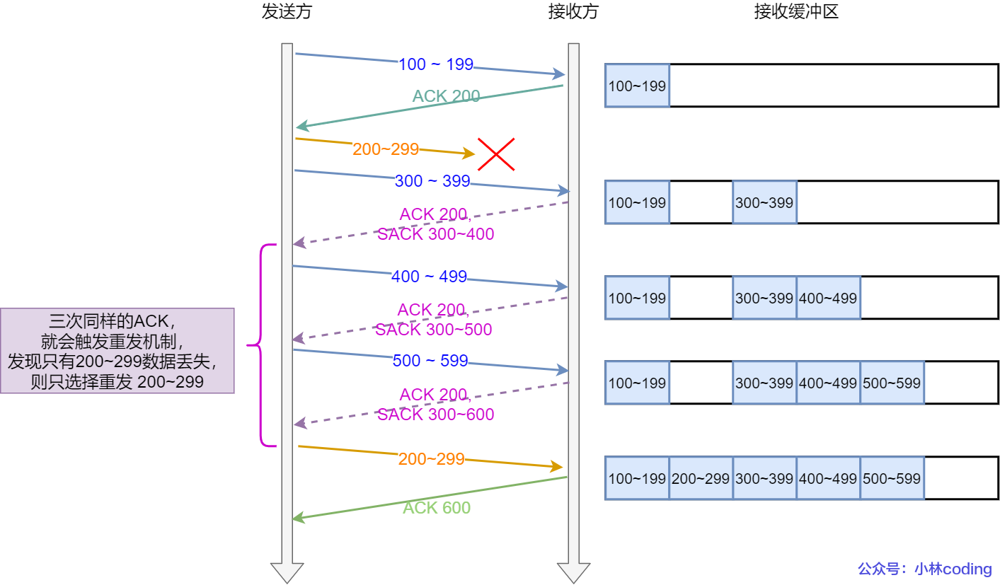

重传机制很好，但是重传的数据是需要一个地方保存的，并且，如果真的一个包就必须对应一个确认，那么效率太低了，因此TCP引入了窗口这个概念，它一次性会发送一个窗口的数据，同时窗口大小会根据网络情况变化，这就是滑动窗口

窗口的大小就是指的无需等待确认的情况下，可以继续发送数据最多还有多少

实际上TCP的时候是有俩窗口：接收窗口和发送窗口，窗口大小会根据接收方的窗口大小确认

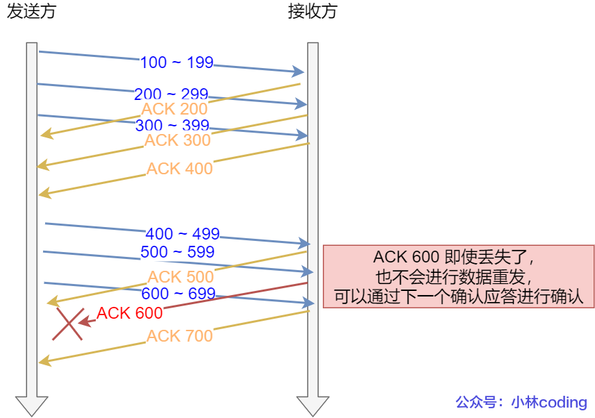


## <span style="color:#FFB266;">可靠UDP和KCP</span>

TCP是考虑流量的，而KCP是考虑流速的

https://zhuanlan.zhihu.com/p/112442341

https://zhuanlan.zhihu.com/p/1885632470940112435

https://www.bilibili.com/video/BV1cN4y1S7pK/?spm_id_from=333.337.search-card.all.click&vd_source=5d4070cc138983fa1babce80b5a31622

可靠UDP就是靠KCP

TCP 的可靠性核心 = 序列号 (Seq) + 自动重传 (ARQ) + 确认

> **序列号 (Seq)**：保证了数据**“有序、不重”**。
>
> **重传 (Retransmission)**：保证了数据**“不丢”**。
>
> **滑动窗口**：是为了在保证可靠的前提下，**别太慢**。
>
> **拥塞控制**：是为了大家都有路走，**别堵死**。

KCP的可靠原理差不多，但是在重传策略和确认策略上它激进的多，

1. ### 1. RTO 翻倍策略 (RTO Backoff)

   - **TCP 的做法（保守）：** 超时一次，RTO $\times 2$。如果连续超时，等待时间指数级增长（1s $\to$ 2s $\to$ 4s）。TCP 默认认为“超时=网络严重拥堵”，所以必须避让。
   - **KCP 的做法（激进）：** KCP 认为“超时=偶尔丢包”，不应该惩罚那么重。你可以配置它不翻倍，或者只 $\times 1.5$。这让它在网络抖动（Jitter）厉害的时候，恢复速度远快于 TCP。

   ### 2. 快速重传 (Fast Retransmit)

   - **TCP：** 死板地要求 **3** 个重复 ACK (DupACKs) 才会触发快速重传。
   - **KCP：** 这个阈值是可配置的（参数 `resend`）。
     - 正如你所说，设置为 **1** 或 **2**。
     - 这意味着：发送方只要发现跳过 1 个包没收到 ACK，马上就重发那个包，不用傻等 3 个。这对高丢包率环境（如跨国公网）是降维打击。

   ### 3. 确认机制 (ACK Policy) —— 这里的细节很关键

   你提到的“延迟确认 + 单独确认”稍微有一点点概念上的混合，KCP 在这方面做了混合优化，它其实是 **UNA（累积确认） + ACK（选择确认）** 的结合：

   - 选择性确认 (Selective ARQ / ACK)：

     TCP 在早期是收到什么确认什么（或者累积），如果中间丢了一个，后面的包都要重传（Go-Back-N）。KCP 是 Selective Repeat，每个包头都有 sn。收到了 1, 3, 4，没收到 2。KCP 会告诉发送方：“收到 1, 3, 4”。发送方只重传 2。

   - UNA (Unacknowledged Sequence)：

     KCP 的每个包头里都带一个 una 字段。含义是：“此编号之前的所有包我都收到了”。

     - **妙处：** 假如回传的 ACK 包丢了，但是下一个数据包带的 `una` 更新了，发送方也能知道前面的包对方收到了。这大大减少了因为 ACK 丢失导致的误重传。

   - **非延迟 ACK (No Delay)：**

     - **TCP：** 为了省带宽，收到数据经常会等几十毫秒（Delayed ACK），看看有没有数据要回发，顺风车带回去。
     - **KCP (`nodelay` 模式)：** 只要有 ACK 就想发。虽然 KCP 也是基于 `update` 时钟周期（比如 10ms 一次 tick）来驱动发送的，但它不会为了“凑单”而刻意等待。

   ### 4. 还有一个杀手锏：关闭拥塞控制

   这是 KCP 最“流氓”（褒义）的一点。

   - **TCP：** 丢包了 $\to$ 降低拥塞窗口 (`cwnd`) $\to$ 发送减慢。
   - **KCP (`nocwnd` 模式)：** 丢包了 $\to$ **完全不理会**。发送窗口只受限于接收方的接收能力 (`rwnd`) 和发送方的发送缓冲区大小，而无视网络的拥堵情况。

> TCP也是累计确认吧
>
> 是的，**完全正确。**
>
> 标准 TCP 的**核心**确认机制就是**累积确认 (Cumulative Acknowledgment)**。
>
> ### 1. 什么是 TCP 的累积确认？
>
> TCP 头部中的 `Acknowledgment Number` (ACK) 字段的含义是：
>
> > **“我期望收到的下一个字节的序号。”**
>
> 这意味着，如果 TCP 发送 `ACK = N`，它实际上是在宣告：**“序号 N 以前的所有字节（N-1, N-2...）我都已经完整、连续地收到了，请从 N 开始发。”**
>
> #### 场景举例
>
> 假设发送方发了 4 个包（每个包 100 字节）：
>
> 1. **Seq 100** (收到 ✅)
> 2. **Seq 200** (收到 ✅) → 回复 **ACK 300** (代表 300 之前都收到了)
> 3. **Seq 300** (丢失 ❌)
> 4. **Seq 400** (收到 ✅) → **关键点来了！**
>
> 此时，虽然接收方收到了 400，但因为它**没收到 300**，数据流出现了“空洞”。根据累积确认原则，它**不能**回复 ACK 500。 它只能再次回复：**ACK 300**（告诉发送方：我还是只收到有序的 299 为止，快给我 300）。
>
> ### 2. 累积确认的致命弱点：Head-of-Line Blocking
>
> 在没有扩展功能的经典 TCP 中，累积确认会导致**回退 N (Go-Back-N)** 的低效行为。 在上面的例子中，发送方收到重复的 `ACK 300`，它不知道：“你是只丢了 300？还是 300 之后的全丢了？” 为了保险，经典 TCP 可能会把 300, 400 全部重传一遍。这浪费了带宽（因为 400 其实已经到了）。
>
> ### 3. 现代 TCP 的补丁：SACK (选择性确认)
>
> 为了解决这个问题，现代操作系统的 TCP 协议栈（Linux, Windows）几乎都开启了 **SACK (Selective Acknowledgment)** 选项。
>
> 虽然 TCP 头部里的 ACK 字段依然是 **累积确认**（为了兼容性），但在 TCP 的 **Options（选项）** 字段里，接收方可以加一句备注：
>
> > **TCP Header:** `ACK = 300` (官方说法：我卡在300了) **TCP Options (SACK):** `Left Edge = 400, Right Edge = 500` (备注：但是我先把 400-500 这一段暂存了，你别重传这段)
>
> ### 4. TCP 与 KCP 的映射对比
>
> 既然你懂 KCP，我们可以做一个非常清晰的映射，这样你就彻底懂了：
>
> | 概念         | TCP 字段/机制            | KCP 字段/机制       | 作用                                                         |
> | ------------ | ------------------------ | ------------------- | ------------------------------------------------------------ |
> | **累积确认** | Header 里的 `ACK Number` | KCP 里的 `una` 字段 | 告诉对方：此编号前的都收到了，用来推动滑动窗口的左边界。     |
> | **选择确认** | Options 里的 `SACK` 块   | KCP 里的 `ack list` | 告诉对方：虽然前面断了，但后面零散收到了哪些，避免无脑重传。 |
>
> **总结：** TCP 是 **“强累积确认 + 弱选择确认(SACK是可选项)”**。 KCP 是 **“强选择确认(显式列表) + 强累积确认(una)”** 混合打法，KCP 甚至更进一步，为了极致的速度，KCP 在收到乱序包时，虽然不能提交给应用层（要等前面的包补齐），但它会立即发 ACK 告诉对方“这个包我收到了”，尽量减少对方的重传焦虑。

### KCP实现

KCP 需要在 UDP 的 payload 最前面加上自己的 header

```c++
struct IKCPSEG {
    uint32_t conv;   // 会话ID：区分这是哪两个人的连接（防止UDP包串线）
    uint8_t cmd;     // 指令：IKCP_CMD_PUSH (数据), IKCP_CMD_ACK (确认), IKCP_CMD_WASK (问窗口)
    uint8_t frg;     // 分片：数据太长拆成几段？这是倒数第几段？
    uint16_t wnd;    // 窗口大小：接收方告诉发送方“我还能吃多少数据”
    uint32_t ts;     // 时间戳：发包时刻，用于计算 RTT
    uint32_t sn;     // 序列号 (Sequence Number)：这是第几个包？（解决乱序的核心）
    uint32_t una;    // 确认号 (Unacknowledged)：你期待的下一个包是多少？
    uint32_t len;    // 数据长度
    // ... 后面紧跟数据
};
```

KCP会给每个包编号，也就是sn字段接收方收到 `sn=1, sn=3`，就知道 `sn=2` 丢了

una字段也就是累计确认，接收方发回 `una=100`，代表 **“100 以前的所有包我都收到了，你可以把它们从发送缓存里删了”**。这保证了发送方知道何时可以释放内存

数据结构方面，KCP的每个客户端都会维护两个队列：

**`snd_buf` (发送缓存)**：

- 所有调用 `kcp_send` 的数据，先扔进这里。
- **逻辑：** 只有收到对方的 ACK，才能把数据从这里移除。**只要没收到 ACK，数据就死死地留在这里，随时准备重传。**这就是“可靠”的物理基础。

**`rcv_buf` (接收缓存)**：

- 收到的数据先扔进这里。因为 UDP 是乱序的，你可能先收到 5，再收到 4。
- **逻辑：** `rcv_buf` 负责把乱序的包（4, 2, 5, 1, 3）根据 `sn` 重新排序成 (1, 2, 3, 4, 5)，然后才扔给应用层读取。


KCP 的核心驱动是一个叫 `ikcp_update` 的函数，通常每 10ms 或 1ms 调用一次。它会在内部遍历 `snd_buf`

这里有两个算法保证可靠：超时重传和快速重传

RTO 计算（超时重传）—— 兜底策略

所有可靠协议都必须有这一步。

- **逻辑：** 发送时记录当前时间 `current`。如果 `now > current + RTO`，说明超时了，必须重传。
- **TCP 做法：** $RTO = RTT \times 4$（非常保守）。如果重传再失败，RTO 直接翻倍（1s -> 2s -> 4s）。
- **KCP 做法：** $RTO = RTT \times 1.5$（比较激进）。如果重传失败，KCP **不翻倍**（或者翻倍幅度很小）。
  - *为什么可靠？* 只要还没收到 ACK，就会无限次重试（直到连接断开），保证数据最终一定能到。

快速重传 (Fast Retransmit) —— KCP 的杀手锏

这解决了 TCP “傻等超时”的问题。

- **场景：** 发送方发了 1, 2, 3, 4。
- **接收方反馈：** 收到了 ACK(1), ACK(3), ACK(4)。注意，没有 ACK(2)。
- **TCP 逻辑：** 看到 3 和 4 的 ACK，TCP 可能会想“2 还没到，可能只是在路上走得慢，我再等等超时吧”。
- **KCP 逻辑：**
  1. KCP 维护一个计数器 `fastack`。
  2. 当收到 ACK(3) 时，发现跳过了 2，于是给 2 号包的 `fastack + 1`。
  3. 当收到 ACK(4) 时，又跳过了 2，于是给 2 号包的 `fastack + 1`。
  4. **判定：** 一旦某一个包的 `fastack >= resend` (默认是 2)，**不管有没有超时，立刻重传 2 号包！**


## Protobuff

### ProtoBuff压缩原理

Tag + Varint + ZigZag

ProtoBuff存储上限

64 / 7 向下取余数，就是大于2的八次方的就会


# 数据结构

## 进程和线程

进程是操作系统资源分配的基本单位 线程是处理器调度与执行的基本单位

## 协程

https://www.reddit.com/r/unity/comments/175vfbs/should_i_avoid_coroutines/?tl=zh-hans

https://zhuanlan.zhihu.com/p/279383752

协程的本质就是一个让用户态可以自己管理的一个可分步骤执行的方法，它是**非抢占式（Collaborative）** 的用户态线程

它本质上是用户态分配自己的时间片模拟的一种多线程

> **抢占式 (Preemptive) - 操作系统线程：**
>
> - **谁来管？** 操作系统内核（Kernel）。
> - **行为：** 操作系统是“霸道”的。它给每个线程分配一个极短的时间片（比如 10ms）。时间一到，不管你代码跑完没，直接暂停你（中断），把 CPU 抢过来给别人用。
> - **后果：** 你无法预知代码会在哪一行停下，所以多线程操作共享数据时必须加锁（Lock），否则会出 Bug。
>
> **非抢占式 / 协作式 (Cooperative) - 协程：**
>
> - **谁来管？** 程序自己（用户态代码/虚拟机）。
> - **行为：** 协程是“礼貌”的。除非协程自己主动说“我跑累了，让出 CPU”（调用 `yield`），否则它会一直霸占 CPU，谁也抢不走。
> - **后果：** 你完全知道代码在哪里暂停。在两个 `yield` 之间，你的代码是**原子执行**的，不需要加锁。

主要分两种：无栈协程和有栈协程

有些语言的协程会维护一个自己的函数调用栈，在唤醒的时候会把整个函数调用栈给替换，这类协程被称为**有栈协程**，而像C#中这样直接在当前函数调用栈中压入栈帧的协程我们称之为**无栈协程**

### 无栈协程的典型就是C#的协程，它并不保存调用栈

**没有独立的栈**：协程和主线程共用栈。

**编译器魔法（状态机）**：

- 挂起时，并没有保存“栈”，而是编译器把你的函数重写成了一个 **类（Class/Struct）**。
- **局部变量** 变成了这个类的 **成员变量**（存在堆上）。
- **执行位置** 变成了一个整型的 `state` 变量。

**只能在顶层挂起**：因为没有保存栈，你不能在深层函数里 `yield`。

- 如果 D 想挂起，C 必须也是协程并 `await D`，B 也要 `await C`...
- 这就是所谓的 **“传染性” (Viral / Function Coloring)**。

```c#
// 如果 C 想 yield，B 和 A 必须全部改成协程（IEnumerator）
IEnumerator A() {
    yield return B(); // 必须显式传递
}

IEnumerator B() {
    yield return C(); // 必须显式传递
}

IEnumerator C() {
    yield return new WaitForSeconds(1); // 终于挂起了
}
```

**优点**：

- **极致轻量**：一个协程就是一个小对象（几十字节），内存占用极低。
- **创建极快**：没有栈分配开销。

**缺点**：

- **传染性**：一旦底层函数变成异步，整条调用链都要改。
- **无法在普通函数中 Yield**：比如你不能在 `List.ForEach((x)=>{ ... yield ... })` 里的匿名函数里 yield，因为那个匿名函数不是迭代器。


### 有栈协程的典型就是Lua的协程

**独立的栈**：每个协程都有自己独立的内存栈空间（类似线程，通常是几 KB 到几 MB）。

**保存内容**：挂起时，保存寄存器状态和**整个调用栈（Call Stack）**。

**任意位置挂起（Deep Yield）**：这是它最强大的地方。你可以在函数 A 调 B，B 调 C，C 调 D，然后在 D 里面 `yield`。

- A、B、C **不需要**知道 D 会挂起，也不需要修改代码。
- 恢复时，直接回到 D，之前的 C、B、A 的栈帧都在。

```lua
function A()
    B() -- A 当作普通函数调用 B，A 不知道里面会有协程暂停
end

function B()
    C()
end

function C()
    coroutine.yield() -- 【深层挂起】直接在这里暂停
end

local co = coroutine.create(A)
coroutine.resume(co) -- 启动，一直运行到 C 暂停
```

**优点**：

- **开发体验极佳**：完全同步的代码写法，不需要传染（Function Coloring）。
- **适合复杂逻辑**：比如 AI 行为树、复杂的红点计算 DFS，想停就停。

**缺点**：

- **内存开销大**：每个协程都要占一块栈内存（哪怕你只用了一点点）。
- **切换稍慢**：涉及栈的切换（虽然比线程快，但比无栈慢）。


> 因为没有保存栈，你不能在深层函数里 yield 这是为啥
>
> 这是一个直击灵魂的底层机制问题。要理解这一点，我们必须破除“协程是魔法”的幻象，回归到**“函数调用栈（Call Stack）”**的本质上来。
>
> 简单一句话答案：**因为在无栈协程（如 C#）里，`yield` 本质上是一个 `return`。**
>
> 如果你在深层函数里 `return` 了，中间层的函数如果没有特殊处理（接力），它们就会继续往下跑，把中间层的**栈帧（Stack Frame）**给销毁（Pop）掉。等你下次想“恢复”时，中间层已经没了。
>
> 我们通过一个具体的例子来“人肉编译”一下，你就明白了。
>
> ------
>
> ### 场景假设
>
> 假设调用链是：`Main` -> `普通函数B` -> `协程函数C`。
>
> ```C#
> void Main() {
>     B(); 
> }
> 
> void B() { // 普通函数（中间层）
>     var enumerator = C(); // 调用 C
>     // B 以为 C 只是个返回迭代器的普通函数
>     // B 继续执行...
>     // B 执行完毕，返回。
> }
> 
> IEnumerator C() { // 协程函数（深层）
>     int x = 10;
>     yield return null; // 【关键点】这里想挂起
>     Console.WriteLine(x); // 恢复后想打印 x
> }
> ```
>
> ------
>
> ### 1. 为什么“有栈协程”（Lua）能做到？
>
> Lua 的虚拟机为协程分配了一个**独立的栈**。
>
> 1. `Main` 调 `B`，`B` 调 `C`。此时协程栈里有三层帧：`[Main -> B -> C]`。
> 2. `C` 执行 `yield`。
> 3. Lua 虚拟机**冻结**这个栈。`Main`、`B`、`C` 的所有局部变量、执行进度（PC指针）全都被保存在内存里不动。
> 4. 切回主线程。
> 5. 下次 `resume` 时，Lua 虚拟机解冻这个栈，**指针指回 C 的 yield 后面**。
> 6. `C` 跑完了，返回给 `B`。`B` 还在那里等着呢（因为它也被冻结了）。
>
> **结论**：因为栈还在，中间层 `B` 依然活着。
>
> ------
>
> ### 2. 为什么“无栈协程”（C#）做不到？
>
> C# 的 `yield` 是**编译器魔法**。编译器会把 `C` 重写成一个**类（状态机）**。
>
> #### 第一步：编译器重写 C
>
> 编译器把 `C` 变成了一个对象 `new C_StateMachine()`。 `yield return` 变成了 **“保存当前状态，然后 `return` 这个对象”**。
>
> #### 第二步：运行时的悲剧
>
> 我们来看 `Main -> B -> C` 是怎么跑的：
>
> 1. **Main 调用 B**。系统栈压入 `B` 的栈帧。
> 2. **B 调用 C**。
>    - 注意：这里并不是真正的函数调用，而是**创建了一个状态机对象**。
>    - `C` 函数（也就是状态机初始化）瞬间执行完，**返回（Return）**了这个对象给 `B`。
> 3. **B 拿到返回值**。
>    - `B` 是个普通函数，它看着手里的 `IEnumerator` 对象，心想：“哦，C 给我返回了个对象”。
>    - **关键点来了**：`B` 不知道 `C` 还没跑完（逻辑上）。`B` 继续往下执行它自己的代码。
> 4. **B 执行完毕，返回**。
>    - 系统栈**弹出（Pop）** `B` 的栈帧。`B` 的局部变量全部销毁。
> 5. **Main 继续执行**。
>
> #### 第三步：试图“恢复”时的尴尬
>
> 现在，Unity 的主循环（或者你自己）想去驱动那个状态机（恢复 C 的执行）：
>
> 1. 调用 `enumerator.MoveNext()`。
> 2. `C` 的状态机内部代码开始跑。
> 3. `C` 打印了 `x`。
> 4. `C` 跑完了。它本能地想：**“我跑完了，该返回给调用我的人（B）了。”**
> 5. **但是 `B` 早就死了！**
>    - `B` 的栈帧在第 4 步就已经销毁了。
>    - `B` 当时的执行位置（PC 指针）也丢了。
>    - 根本回不去了。
>
> 这就是为什么无栈协程不能在普通函数里 Yield。
>
> ------
>
> ### 3. 唯一的解决办法：病毒式传播（传染性）
>
> 为了让 `C` 能挂起，`B` 必须做出牺牲：**`B` 也必须变成一个状态机**。
>
> 这样流程就变成了：
>
> 1. `C` `yield` 时，保存状态，**返回** 给 `B`。
> 2. `B` 收到 `C` 的暂停信号，`B` 也保存状态，**返回** 给 `Main`。
> 3. `Main`（或者引擎）拿着 `B` 的状态机对象。
>
> 下次恢复时：
>
> 1. 引擎调 `B.MoveNext()`。
> 2. `B` 恢复，发现上次卡在 `C` 那里，于是调 `C.MoveNext()`。
> 3. `C` 恢复。
>
> 这就是为什么在 C# 中，一旦底层用了 `yield` (IEnumerator) 或者 `await` (Task)，整条调用链上的所有父函数都必须加上 `IEnumerator` 或 `async/await`，一直传到顶层。
>
> ### 总结
>
> - **有栈（Lua）**：挂起 = **冻结整个世界**（调用栈）。无论多深，中间层都被冻住了，等你回来。
> - **无栈（C#）**：挂起 = **我先撤了（Return）**。如果你不让中间层也配合着“撤退”，中间层就会误以为你干完了，继续跑路并销毁现场，导致你回来时发现“家没了”。
>
> ### 
>
> - **有栈协程 (Lua)**： `Main` 调 `A`，`A` 调 `B`。`B` yield 时，`Main` 和 `A` **都被冻结在栈上**，等着 `B` 回来。这叫**同步思维写异步**。
> - **无栈协程 (Unity C#)**： `Main` 调 `StartCoroutine(A)`。`Main` 说：“我把 A 托管给系统了，**我先撤了**。” `Main` 的栈帧直接消失。`A` 在系统的列表里下一帧才开始跑。这叫**异步启动**。

### C++20的是无栈协程


# 场景

## 战争迷雾优化顶点树

## UntiyUI很复杂，如何优化？

分两个层面：

CPU：减少ReBuild，

GPU：减少DrawCall（Rebatch），

### CPU减少Rebuild

Rebuild这里可以考虑的是，

1. 动静分离，使用canvas做好分离，这里的目的是为了防止Rebuild扩散。
2. 谨慎的使用Layout Groups，`VerticalLayoutGroup`、`GridLayoutGroup` 等组件极其消耗性能。因为只要一个子节点变化，Layout 就会重新计算所有子节点的位置，标记为 Dirty，引发 Rebuild。而且这个触发过程是递归的。
3. 池化UI，尤其是比如那种商店界面，很多的cellWidget，这种要谨慎的Destory，有三个思路，
   1. 一个是SetActive(false)，
   2. 频繁闪烁/显隐`CanvasGroup.alpha = 0` 并设置 `Interactable = false`，
   3. 移出屏幕外（有个缺陷是Mono组件还在活跃，我吃过一个亏就是RT，加载一个mp4到RT上，然后两个）

### GPU减少ReBatch

1. 静态的图集

2. 对于那种运行时加载的图片，可以考虑动态图集

   > 如果我有一个商店界面，这些商品是一个一个的Cell
   >
   > 这些商品们的父节点有一个Canvas，商品的Icon加载是动态的（显然应该如此），这时候我用动态图集可以打在一次DrawCall，做合批
   >
   > ```markdown
   > ## 最大的坑：层级穿插 (Interleaving)
   > 这是你提到“商店界面”场景下最容易翻车的地方。
   > 
   > 假设你的 Cell 结构如下（层级从下到上）：
   > > 底板 (Image): 引用静态图集 A
   > > 商品图标 (RawImage): 引用动态图集 B
   > > 品质边框 (Image): 引用静态图集 A
   > 
   > 如果你在 GridLayoutGroup 里排列了 10 个这样的 Cell，UGUI 的渲染顺序（默认 Hierarchy 顺序）是这样的：
   > 
   > >Cell 1 底板 (图集A)
   > Cell 1 图标 (图集B) -> 打断合批！
   > Cell 1 边框 (图集A) -> 打断合批！
   > Cell 2 底板 (图集A) -> 打断合批！
   > Cell 2 图标 (图集B)
   > ...
   > 
   > 结果： 这种“三明治”结构（A-B-A-B...）会导致严重的 DrawCall 乒乓（Ping-pong） 现象。即使你用了动态图集，DrawCall 依然是 Cell数量 * 3。
   > 
   > ## 如何解决层级穿插？
   > 如果你的界面结构必须是这样，动态图集的效果会大打折扣。优化的手段通常是打破 Hierarchy 的渲染顺序或视觉欺骗：
   > 
   > ### 方案 1：UI 结构拆分 (最彻底) 如果可能，将容器拆分成三层 Layout，同步滚动（较难维护，但性能最好）：
   > 
   > >Layout 1: 只放所有的底板 (1 个 DC)
   > Layout 2: 只放所有的图标 (1 个 DC，因为用了动态图集)
   > Layout 3: 只放所有的边框 (1 个 DC)
   > 总计：3 个 DrawCall。
   > 
   > ### 方案 2：利用深度排序 (Canvas.overrideSorting)
   > 
   > 给 Cell 内部的组件加上 Canvas 并开启 overrideSorting（但这会带来额外的 Canvas 消耗，通常不建议对大量列表项使用）。
   > 
   > ### 方案 3：全都放进动态图集 (视情况而定)
   > 
   > 如果底板和边框也是动态变化的，或者为了极致的 DC，有人会把通用的底板和边框也 Copy 进那张动态大图里。这样所有元素都来自图集 B。
   > 代价： 动态图集空间宝贵，且会失去九宫格（Sliced）能力（RawImage 不支持九宫格）。
   > 
   > ### 方案 4：视觉妥协
   > 
   > 如果图标是不透明的，且盖住了底板。能不能去掉底板？
   > 
   > 如果边框只是一个简单的描边，能不能做到图标的 Shader 里？
   > 
   > ## 动态图集的管理策略
   > 写这个系统时，你需要考虑以下逻辑：
   > 
   > ### 分配算法 (Packing):
   > 
   > 需要一个类似“最大矩形算法 (MaxRects)”的逻辑，来计算新来的图片应该塞在图集的哪个空白位置。
   > 
   > ### 空间回收:
   > 
   > 当商品界面关闭或滚出视野很远时，需要释放空间。
   > 动态图集通常只增不减（很难像内存碎片整理那样移动图片，因为 CPU 移动像素太慢）。
   > 策略： 当图集满了，或者脏块太多，直接重建整个图集，或者采用 LRU（最近最少使用）策略覆盖旧位置。
   > 
   > ### MipMap:
   > 
   > 动态图集通常关闭 MipMap。因为 CopyTexture 更新 MipMap 开销很大，而且 UI 通常不需要 MipMap。
   > ```
   >
   > 

3. 减少OverDraw和合批的失败：这俩问题一半一起出现，都是因为UI层层叠加

   1. OverDraw指的是，一个像素被多次画，出现在背景+按钮底图+图标啥的都叠在一起，一个像素画好多次
   2. 断批主要是要看合批的规则，那个深度值会因为叠在一起导致增加

4. Mask的选择

   1. **Mask 组件：** 使用 Stencil Buffer（模板缓冲），会增加额外的 DrawCall（通常是增加 2 个，开始遮罩和结束遮罩），且打断合批，边缘有锯齿但由于是像素剔除，GPU 压力小。

      **RectMask2D 组件：** 通过计算矩形区域在 Shader 中剔除像素。**不产生额外 DrawCall**，但如果子物体极其多，CPU 计算裁剪区域的开销会变大。

### 其他

1. UI不需要MipMap，可以节省1/3的内存


## 大量血条如何处理？

一般：用WorldSpace，进阶：用一个UIFollow，让血条在Overlap上。最高：GPUInstance

如果是WorldSpace，每一个血条都是单独的一个Canvas，那么绘制的时候他们就一定要分不同的DrawCall。而在DrawCall的时候，要设置渲染状态，切换之类的，如果这个过程中插入了别的渲染，那整个的切换开销就很大。

但是如果是屏幕空间，就算经常重新合批，rebuild，但是Rebuild完了之后合批完了，只需要设置一次渲染状态就可以了

### 1. WorldSpace 模式的致命伤：不仅仅是 DrawCall，还有“打断”

正如你所说，如果每个血条是一个独立的 Canvas：

- **独立的绘制命令：** 100 个血条 = 100 个 Canvas = **100 次 DrawCall**。
- **状态切换（State Switching）与 驱动层开销（Driver Overhead）：** 即便这 100 个血条用的是同一个材质（Material），理论上 GPU 不需要频繁切换 Shader 或 Texture（这就是所谓的 SetPass Call 可能只有 1 次）。 **但是！** CPU 依然需要向 GPU 发送 100 次 *"Draw This Mesh"* 的命令。 每一次命令，CPU 都要做参数校验、写入 Command Buffer、检查渲染状态……这些“行政手续”的开销在数量大时是非常惊人的。
- **你提到的“插入了别的渲染”：** 这点非常关键！WorldSpace 的 UI 是作为 **透明物体（Transparent Queue）** 渲染的。 它们会参与到整个 3D 场景的深度排序中。 **场景：** 血条A -> 粒子特效 -> 血条B -> 半透明的水面 -> 血条C。 这种穿插会导致 GPU 无法连续处理同一种工作，导致缓存命中率下降，且让 Render State 的复用变得非常困难。

### 2. Screen Space (Overlay) 的核心优势：一次付出，批量回报

- **Rebuild 的本质（CPU）：** 你说得对，Overlay 模式下，血条动了就要 Rebuild。 Rebuild 做的事情是：C# 遍历血条 -> 计算屏幕坐标 -> 填充顶点数组（Vertices, UVs, Colors）。 **真相是：** 现代 CPU（即使是手机）做这种简单的加减乘除和数组填充，**速度极快**。计算几百个矩形的坐标，对 CPU 来说就是“洒洒水”。
- **Rendering 的本质（GPU）：** 当 Rebatch 完成后，Canvas 生成了一个包含所有血条的大网格（Big Mesh）。 **关键时刻：** CPU 对 GPU 说：“兄弟，这里有一堆三角形，材质我都设置好了，给你 **一次 DrawCall**，全画出来！” GPU 回复：“收到，立刻执行。” **只需要设置一次渲染状态，不需要中间打断，不需要反复通信。**


<span style="color:#99FFCC;">相当于是，WorldSpace模式下，它付出的是Drawcall和设置切换渲染状态的代价。</span>

<span style="color:#99FFCC;">Overlay模式下，她付出的代价是频繁的Rebuild和Rebatch的代价。但是前者代价更高</span>
