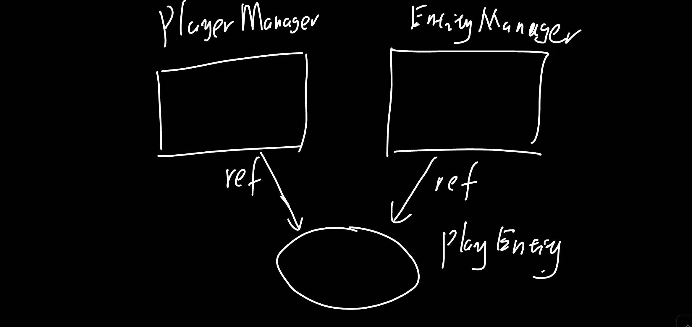
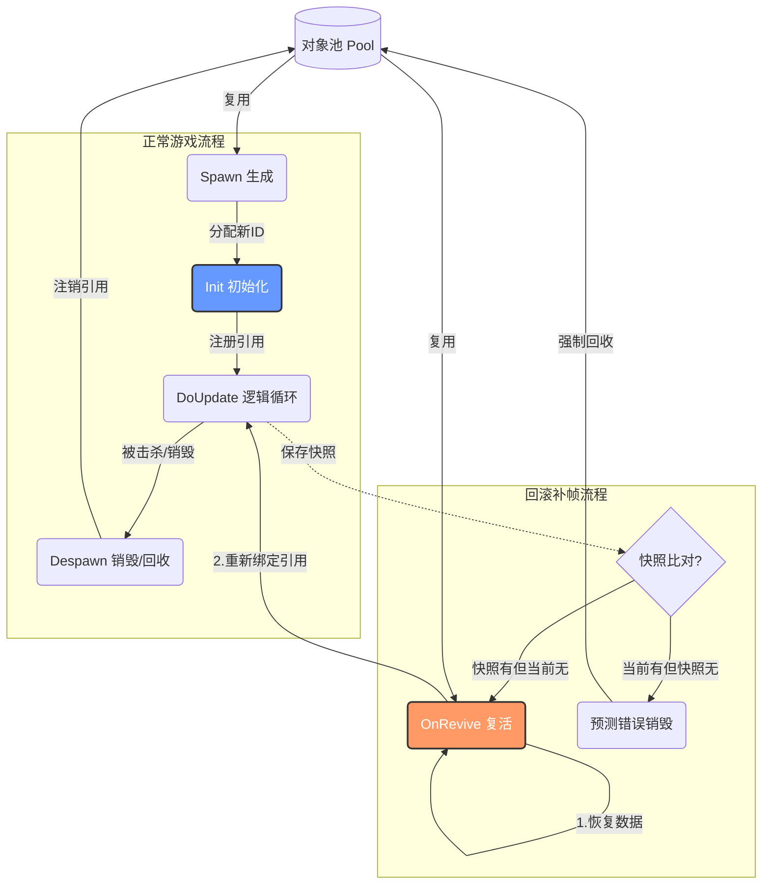
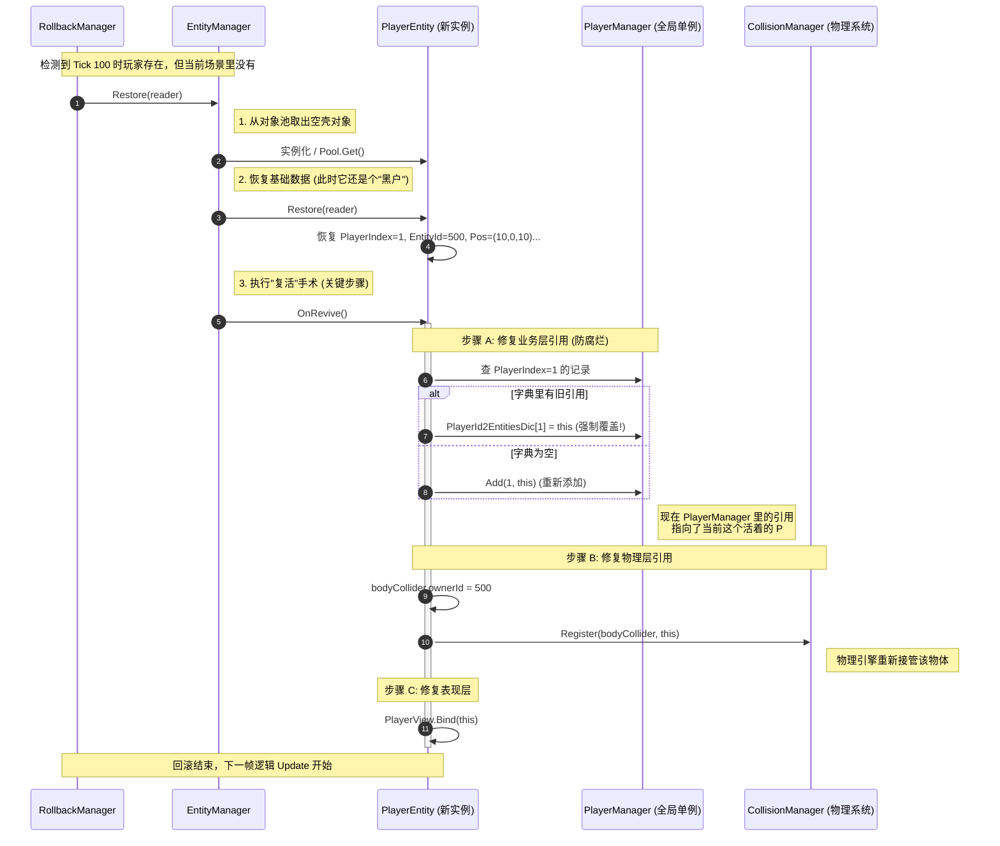

# 回滚

## 类内的对象

直接覆盖

## 类之间的引用

比如这个例子，PlayerEntity同时在PlayerManager和EntityManager里被管理

如果正常的回滚，就没问题

但是如果假设PlayerEntity在一帧中被摧毁了，结果过了几帧发现搞错了，那么回滚后要重新Init一个Player对象出来，然后执行重新绑定业务层引用的逻辑

这里重新绑定引用指的是：PlayerEntity内部要去重新绑定所有持有它引用的外部对象，对于它的引用。根据什么来查找引用呢？还是根据统一的ID系统。

因此我们回滚设计五个接口：

OnSpawn，Restore，BackUp和OnRevive，OnDespawn

其中，OnSpawn负责创建物体时候的一些绑定操作，Restore和BackUp负责内部数据的序列化和回滚驱动

OnRevive负责回滚销毁物体的重建，OnDespawn负责清理（比如业务层的引用，还有物理层的反注册）

> 为什么要拆分OnSpawn和OnRevive，保留它们的**分离**，但提取**公共逻辑**比较好，
>
> 以及为什么要拆分OnSpawn和Restore？因为不需要一直重新注册，正常的回滚如果不涉及到回滚前后物体销毁的问题其实时不需要重新注册的，但是i回滚本身是经常发生的，合在一起会有性能问题

